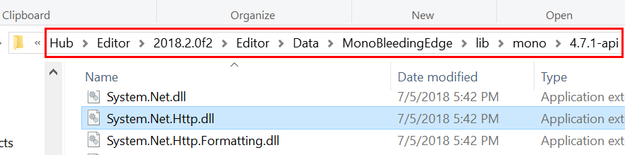
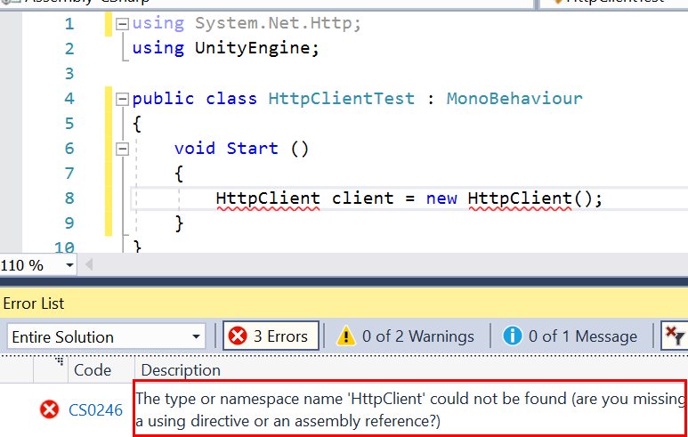

# unity默认的#defind宏变量

| **Property:**                | **Function:**                                                                                                                                                                    |
| ---------------------------- | -------------------------------------------------------------------------------------------------------------------------------------------------------------------------------- |
| **UNITY\_EDITOR**            | #define directive for calling Unity Editor scripts from your game code.                                                                                                          |
| **UNITY\_EDITOR\_WIN**       | #define directive for Editor code on Windows.                                                                                                                                    |
| **UNITY\_EDITOR\_OSX**       | #define directive for Editor code on Mac OS X.                                                                                                                                   |
| **UNITY\_STANDALONE\_OSX**   | #define directive for compiling/executing code specifically for Mac OS X (including Universal, PPC and Intel architectures).                                                     |
| **UNITY\_STANDALONE\_WIN**   | #define directive for compiling/executing code specifically for Windows standalone applications.                                                                                 |
| **UNITY\_STANDALONE\_LINUX** | #define directive for compiling/executing code specifically for Linux standalone applications.                                                                                   |
| **UNITY\_STANDALONE**        | #define directive for compiling/executing code for any standalone platform (Mac OS X, Windows or Linux).                                                                         |
| **UNITY\_WII**               | #define directive for compiling/executing code for the Wii console.                                                                                                              |
| **UNITY\_IOS**               | #define directive for compiling/executing code for the iOS platform.                                                                                                             |
| **UNITY\_IPHONE**            | Deprecated. Use **UNITY\_IOS** instead.                                                                                                                                          |
| **UNITY\_ANDROID**           | #define directive for the Android platform.                                                                                                                                      |
| **UNITY\_PS4**               | #define directive for running **PlayStation 4**  code.                                                                                                                           |
| **UNITY\_XBOXONE**           | #define directive for executing **Xbox One**  code.                                                                                                                              |
| **UNITY\_TIZEN**             | #define directive for the Tizen platform.                                                                                                                                        |
| **UNITY\_TVOS**              | #define directive for the Apple TV platform.                                                                                                                                     |
| **UNITY\_WSA**               | #define directive for **Universal Windows Platform** . Additionally, **NETFX\_CORE** is defined when compiling C# files against .NET Core and using .NET **scripting backend** . |
| **UNITY\_WSA\_10\_0**        | #define directive for Universal Windows Platform. Additionally **WINDOWS\_UWP** is defined when compiling C# files against .NET Core.                                            |
| **UNITY\_WINRT**             | Same as **UNITY\_WSA**.                                                                                                                                                          |
| **UNITY\_WINRT\_10\_0**      | Equivalent to **UNITY\_WSA\_10\_0**                                                                                                                                              |
| **UNITY\_WEBGL**             | #define directive for **WebGL** .                                                                                                                                                |
| **UNITY\_FACEBOOK**          | #define directive for the Facebook platform (WebGL or Windows standalone).                                                                                                       |
| **UNITY\_ADS**               | #define directive for calling Unity Ads methods from your game code. Version 5.2 and above.                                                                                      |
| **UNITY\_ANALYTICS**         | #define directive for calling Unity **Analytics**  methods from your game code. Version 5.2 and above.                                                                           |
| **UNITY\_ASSERTIONS**        | #define directive for assertions control process.                                                                                                                                |

## 在 .NET 4.x 和 .NET Standard 2.0 配置文件之间进行选择

一旦切换到 .NET 4.x 等效脚本运行时，可使用 PlayerSettings 中的下拉菜单指定“Api Compatibility Level”（“Edit > Project Settings > Player”）。 有两种选项：

-   **.NET Standard 2.0**。 此配置文件与 .NET Foundation 发布的 [.NET Standard 2.0 配置文件](https://github.com/dotnet/standard/blob/master/docs/versions/netstandard2.0.md)匹配。 Unity 建议新项目使用 .NET Standard 2.0。 它比 .NET 4.x 小，有利于尺寸受限的平台。 此外，Unity 承诺在 Unity 支持的所有平台上支持此配置文件。

-   **.NET 4.x**。 此配置文件提供对最新 .NET 4 API 的访问权限。 它包括 .NET Framework 类库中提供的所有代码，并且支持 .NET Standard 2.0 配置文件。 如果 .NET Standard 2.0 配置文件中未包含项目所需的部分 API，请使用 .NET 4.x 配置文件。 但此 API 的某些部分并非在所有 Unity 平台上均受支持。

可在 Unity 的[博客文章](https://blogs.unity3d.com/2018/03/28/updated-scripting-runtime-in-unity-2018-1-what-does-the-future-hold/)中阅读有关这些选项的更多信息。

### 使用 .NET 4.x API 兼容级别时添加程序集引用

在“API 兼容级别”下拉列表中使用 .NET Standard 2.0 设置时，将引用和使用 API 配置文件中的所有程序集。 但是，在使用较大的 .NET 4.x 配置文件时，默认情况下不会引用 Unity 附带的某些程序集。 若要使用这些 API，必须手动添加程序集引用。 可在 Unity 编辑器安装的 MonoBleedingEdge/lib/mono 目录中查看 Unity 附带的程序集：

例如，如果使用的是 .NET 4.x 配置文件且希望使用 `HttpClient`，则必须为 System.Net.Http.dll 添加程序集引用。 如果没有它，编译器将报错，指示缺少程序集引用：

每次打开 Unity 项目时 Visual Studio 都会为其重新生成 .csproj 和 .sln 文件。 因此，无法直接在 Visual Studio 中添加程序集引用，因为它们将在重新打开项目时丢失。 相反，必须使用名为 mcs.rsp 的特殊文本文件：

1.  在 Unity 项目的根Assets目录中创建名为 mcs.rsp 的新文本文件。

2.  在空文本文件的第一行，输入：`-r:System.Net.Http.dll`，然后保存文件。 可将“System.Net.Http.dll”替换为可能缺少引用的任何包含的程序集。

3.  重启 Unity 编辑器。

## 相关链接

-   <https://docs.microsoft.com/zh-cn/visualstudio/cross-platform/unity-scripting-upgrade?view=vs-2019>

-   <https://docs.unity3d.com/Manual/PlatformDependentCompilation.html>
