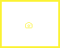
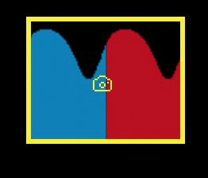
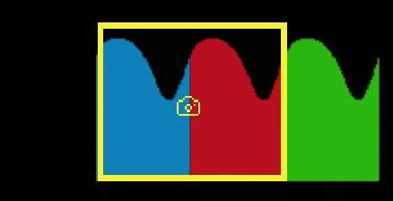
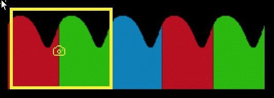
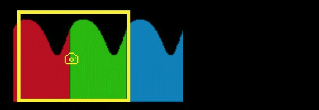
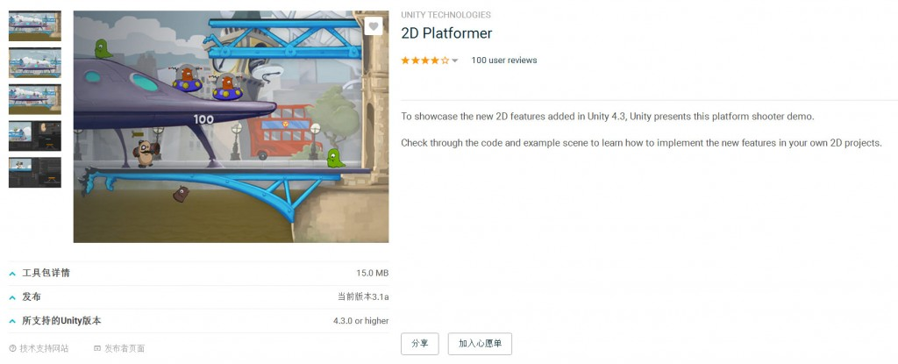
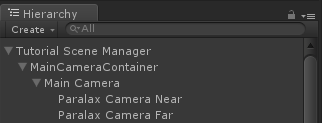
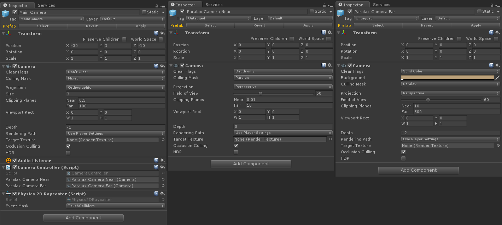
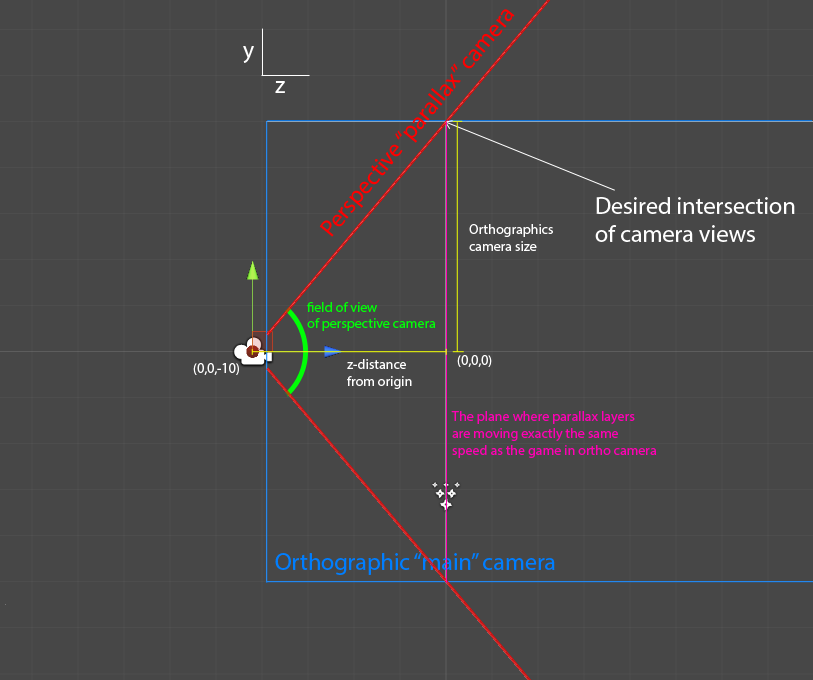
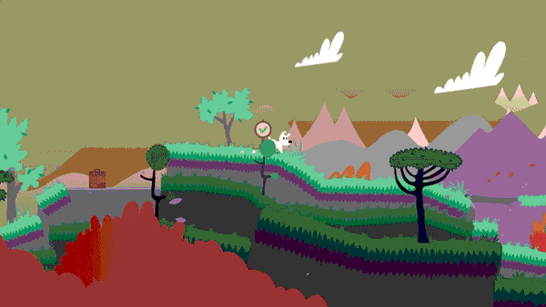

#### 什么是视差背景？

视差效果，原本是一个天文学术语，当我们观察星空时，离我们远的星星移动速度较慢，离我们近的星星移动速度则较快。当我们坐在车上向车窗外看时，也会有这样的感觉，远处的群山似乎没有在动，而近处的稻田却在飞速掠过。

简单地说，视差背景其实就是通过多层次的背景来模拟透视视差效果：就是当发生移动时，离照相机越近的背景移动越快；反之越慢。这样，我们的背景就会形成类似于透视视差的效果。

那么，既然需要透视效果，为何不直接使用透视投影来做呢？这个原因是如果使用透视投影来产生视差的话，我们的远景必须真的是一个非常大的背景，你如果想模拟出一百倍于近景的远景，那么可能就需要相应尺寸的背景贴图。这种做法显然是做不到的。当然，如果是3D 背景的话有其他方式，不过对于2D 游戏而言，最直接有效的还是多层次背景模拟出视差效果。我们这里也主要聊聊如果通过多层次背景滚动的方式实现视差效果。

在整个视差背景实现过程中，需要完成两个主要工作：

1. 实现单层背景的滚动；

2. 复合多层背景的滚动，实现视差效果；

#### 实现单层背景的滚动

背景滚动是实现视差效果的核心也是最重要的问题。背景滚动存在横向和纵向两种。所有使用视差背景的游戏都会有横向滚动的情况，而纵向滚动则未必都会有。我们这里以横向滚动来介绍背景滚动。我们有四种常规方式可以实现背景的滚动：

1. 通过移动一个四边形顶点的 UV 移动形成滚动，之后就称之为 UV 滚动方式；

2. 通过滚动移动多个连续的背景精灵形成滚动，之后就称之为精灵滚动方式；

3. 添加背景层照相机，移动照相机形成滚动，之后就称之为照相机移动方式；

4. 精灵滚动方式和照相机移动方式混合使用，之后就称之为混合滚动方式；

为了更好地解释这几种实现方式，需要几张图片用于介绍：

我们使用一个黄框精灵代表屏幕取景区域：



接下来是三张可拼接的背景精灵：


##### UV 滚动方式：

使用 UV 坐标移动形成滚动的效果看起来是这样的：



在 UV 坐标移动的方法中，我们只是用一个和照相机取景区域一样大的精灵作为背景渲染区域。然后通过调整它的 UV 坐标和采样方式实现平铺背景以及背景滚动。具体实现步骤：

1. 准备一个覆盖整个屏幕的四边形顶点，并使用它显示背景贴图；

2. 调整 UV 坐标和纹理之间的采样方式，以实现纹理连续显示；

3. 移动时，修改四个顶点的 UV 坐标形成滚动；

因为我们只使用一张精灵，我们区域采样的方式就是通过 UV 坐标。因此此方式下 UV 坐标存在两个作用：

1. UV 坐标的整数部分标记了当前采样位置使用哪一张背景贴图；

2. UV 坐标小数部分为选中背景贴图的采样 UV 坐标；

因此，此精灵的 UV 坐标必定会大于\[0,1\]区间。

如果背景使用的背景贴图只有一张的话，这个问题很容易解决。我们只要设置图形 API（OpenGL 或 DirectX，这里以 OpenGL 为例）的纹理包装类型（即所谓的 wrapping 类型）即可。所谓的包装类型即指定了当 UV 坐标值在\[ 0,1 \]区间之外时，如何获取纹理。那么这里，我们需要让一张纹理重复出现。在 OpenGL 中，我们需要调用此函数来完成包装类型的设置：glTexParameteri( GL_TEXTURE_2D, GL_TEXTURE_WRAP_S, GL_REPEAT );稍微解释一下此函数：glTexParameteri 函数会对指定的纹理的参数进行设置。我们这里针对2D 纹理（第一参数 GL_TEXTURE_2D）的 x 方向即横向（第二参数 GL_TEXTURE_WRAP_S）的包装模式设置为重复出现的方式（第三参数 GL_REPEAT）。

不过如果背景是多张不同的纹理连续出现的话，就不能使用上面的方法解决了。这个时候我们需要编写一个简单的 shader 在 shader 中完成 UV 坐标映射。这里截取出演示 demo 中，获取纹理相关的 shader 代码（GLSL 代码）提供大家参考：

```
//我们有三张背景贴图，对 UV 坐标对3取模，得到使用哪一种背景贴图。             
int _index = int( mod( v_TexCoord.x, 3.0 ));
//使用此贴图并使用 UV 坐标的小数部分进行像素采样。            
gl_FragData[0] = texture( u_BackgroundTextures[_index], fract(v_TexCoord));  
```

UV 方式有着非常良好的性能，但是缺点就是只能处理简单的平铺背景，对于有着复杂结构或是效果的滚动背景没有办法使用。

##### 精灵滚动方式：

使用精灵滚动形成滚动的效果看起来是这样的：



这种方式应该是比较直接的。我们首先使用背景精灵拼接出背景取景区域覆盖到的背景区域。然后在发生背景移动时，我们依然不需要移动背景取景区域，而是通过滚动移动所有的背景精灵来实现背景移动的效果。

这种方式实现简单直接，但缺点是发生背景移动时，需要对所有的背景精灵进行移动。对于结构复杂元素较多的背景需要占用更多的性能。

##### 照相机移动方式：

使用照相机移动形成滚动的效果看起来是这样的：



这种方式与精灵滚动方式正好相反。在这种方式下，我们需要使用背景精灵拼接出完整的背景。同时在背景移动时，不移动背景精灵转而移动背景取景区域来实现背景移动效果。

这种方式在移动过程中由于只需要移动背景照相机，所以有种很好的移动性能。但是为了使用此方法。我们需要预先将整个背景全部拼接。这样导致同时存在过多的背景精灵在场景中。如果使用的游戏引擎没有场景管理器或是场景管理器性能不佳的情况下，此方式反而会带来额外的性能消耗。

##### 混合滚动方式：

使用混合滚动方式形成的滚动效果看起来是这样的：



顾名思义，混合移动混合了精灵移动和照相机移动两种方式。我们在移动背景取景区域的同时，适时地滚动背景精灵。使得背景取景区域内的背景正确。

这种方式结合了精灵滚动方式和照相机移动方式。避免了精灵滚动方式移动过程中，因为需要移动所有背景精灵带来的额外性能开销；也避免了照相机移动方式中，需要预先构建完整的背景而导致场景中存在过多的背景精灵带来的额外性能开销。当然，和照相机移动方式一样，避免不了每一层背景都需要有一个独立的背景照相机。同时在代码实现良好的情况下，性能比前两者都要好。

#### 四种方式的优劣

##### 平均性能：

UV 滚动方式只使用了一个四边形并且移动时也只是单纯改变了 UV 采样方式。它的性能是最好的；其次是混合滚动方式；照相机移动方式有更多的空间开销，同时此开销对性能的影响与游戏引擎的场景管理模块密切关联；精灵方式则有最大的移动性能消耗。

##### 对复杂背景的支持：

即四种方式所实现的背景可以有多复杂。UV 滚动方式碍于实现只能做简单的平铺背景的滚动效果；精灵滚动方式和混合滚动方式可以实现更为复杂一点的背景，可以在简单的平铺背景之上加入一些其他背景精灵元素；而照相机移动方式对背景的构建没有要求，它可以支持非常复杂的背景。

##### 是否可以无限延伸：

理论上四种方式都可以实现无限延伸。但是对于照相机移动方式来说，实现起来会比较麻烦。而另外三种方式都是循环利用同一个背景，所以天然支持无限延伸的背景。

##### 复合多层背景的滚动，实现视差效果：

有了上面的工作，这一步也是顺其自然就可以完成：

我们首先要构建多层背景，多层背景可以同时只是用一种滚动方式；也可以不同层背景使用不同的滚动方式。比如最远的背景由于基本上都是简单的平铺可以使用 UV 滚动方式构建；而再近一点细节较多的背景层可以考虑后几种滚动方式构建背景。

之后是移动，我们需要根据每一层背景的距离决定其在移动过程中的移动速度。速度如何决定并没有统一的方法或是模式。总之，这一点听听美术们的意见是比较合适的。

### Unity混合模式1

```
using System.Collections;
using System.Collections.Generic;
using UnityEngine;
/// <summary>
/// Weiva Parallax
/// 2D 视差效果
/// 本组件背景视差效果是根据背景对象的世界坐标z值来计算。默认参数中的背景数组第一个元素为最远平面，
/// 既与摄像机同步的平面，该对象之间的背景根据z值进行视差计算。也可以单独设置参数 synZ 强制设置最
/// 远平面。大于最远平面的 z 值将会反超摄像机移动。
/// weivain@qq.com
/// www.weiva.com
/// </summary>
public class WVParallax : MonoBehaviour {
 
    [Header("背景图片对象，Element 0 为与摄像机同步的背景层")]
    public Transform[] backgrounds;
 
    // 主摄像机
    private Transform cam;
    // 上一帧摄像机的位置
    private Vector3 previousCamPos;
    // 摄像机同步背景层的 z 值
    [Header("摄像机同步背景层Z值，若0为背景层0")]
    public float synZ=0f;
    [Header("偏移x系数")]
    public float parallaxScaleX=1f;
    [Header("偏移y系数")]
    public float parallaxScaleY=1f;
 
 
    // 初始化
    void Start ()
    {
        cam = Camera.main.transform;
        // 上一帧摄像机的位置
        previousCamPos = cam.position;
        if(synZ == 0 && null != backgrounds[0])
        {
            synZ = backgrounds[0].position.z;
        }
        if(synZ == 0)
        {
            synZ = 100f;
        }
         
    }
     
    // 每一帧执行
    void Update ()
    {
        // 获得摄像机和上一帧的偏移值
        float parallax = previousCamPos.x - cam.position.x;
 
        //摄像机偏移矢量
        Vector3 camMove = cam.position - previousCamPos;
        camMove.x *= parallaxScaleX;
        camMove.y *= parallaxScaleY;
 
        //同步背景
        for (int i = 0; i < backgrounds.Length; i++)
        {
            if (null == backgrounds[i]) continue;
 
            Vector3 targetToMove = backgrounds[i].position + camMove * (backgrounds[i].position.z/synZ);
            backgrounds[i].position = targetToMove;
 
        }
 
        // 更新上一帧摄像机的位置
        previousCamPos = cam.position;
    }
}
```

### Unity混合模式2

在Unity官方2D游戏Demo中已使用到了视差滚动技术，笔者对此 Demo 中的视差滚动技术进行了研究，Demo 中使用 BackgroundParallax 脚本实现了视差功能，笔者编写此脚本代码说明。



官方 demo [链接](https://assetstore.unity.com/packages/essentials/tutorial-projects/2d-platformer-11228)

BackgroundParallax脚本代码说明：

```
using UnityEngine;
using System.Collections;

public class BackgroundParallax : MonoBehaviour
{
	public Transform[] backgrounds;				// Array of all the backgrounds to be parallaxed.
	public float parallaxScale;					// The proportion of the camera's movement to move the backgrounds by.
	public float parallaxReductionFactor;		// How much less each successive layer should parallax.
	public float smoothing;						// How smooth the parallax effect should be.


	private Transform cam;						// Shorter reference to the main camera's transform.
	private Vector3 previousCamPos;				// The postion of the camera in the previous frame.


	void Awake ()
	{
		// Setting up the reference shortcut.
		cam = Camera.main.transform;
	}


	void Start ()
	{
		// The 'previous frame' had the current frame's camera position.
		previousCamPos = cam.position;
	}


	void Update ()
	{
		// The parallax is the opposite of the camera movement since the previous frame multiplied by the scale.
		float parallax = (previousCamPos.x - cam.position.x) * parallaxScale;

		// For each successive background...
		for(int i = 0; i < backgrounds.Length; i++)
		{
			// ... set a target x position which is their current position plus the parallax multiplied by the reduction.
			float backgroundTargetPosX = backgrounds[i].position.x + parallax * (i * parallaxReductionFactor + 1);

			// Create a target position which is the background's current position but with it's target x position.
			Vector3 backgroundTargetPos = new Vector3(backgroundTargetPosX, backgrounds[i].position.y, backgrounds[i].position.z);

			// Lerp the background's position between itself and it's target position.
			backgrounds[i].position = Vector3.Lerp(backgrounds[i].position, backgroundTargetPos, smoothing * Time.deltaTime);
		}

		// Set the previousCamPos to the camera's position at the end of this frame.
		previousCamPos = cam.position;
	}
}
```

## 结合透视和正交相机在Unity2D游戏中制作视差效果

在开发MimpiDreams时，我们知道我们想用背景和前景做丰富的视差层。在Steam版本中，有几个图层来管理。所以我们想出了一个可能并不是独一无二的方法，不过在这里还是想概括一下。

在unity中有好多使用一个正交相机并用脚本移动图层来设置视差层级的教程。还有一些建议用透视相机和对象的Z轴深度。如果这么做了，设置合适的精灵排序就会变的困难，并且还不能使用优化技术和其他想在MimpiDreams中使用的透视相机的特性。经典的 Mimpi 只用了透视相机来创建，对此我们还有一些[问题](http://www.manew.com/forum-ask-1.html)。为了节省填充率我们使用了不透明的对象，不过不得不用Z轴偏移来放置它们以免Z方向有冲突。然而，由于对它们应用了透视视角，它们就以不同的速度移动了。

最好的方法是获得两者的优势。设置透视相机来渲染视差层，用正交相机来渲染有角色，平台，拼图等的主平面。

当为视差使用透视相机时，就很容易设置它们了。在正交视差中，需要基于相机的距离来缩放每一个对象并放在适当的位置。Toby: The SecretMine的作者Lukáš Navrátil告诉我他差不多会花掉一半的工作时间来设置正交视差层。随着我们技术的结合，他可以做的更快。

我和我的同事Jaroslav Stehlík一起开发了这种技术。现在让我们看一下如何设置。

**Camera and Scene Setup** **相机和场景设置**
层级视图很简单。将视差相机放在主相机的下边，这样它们会一起移动。



**Main Camera**

**主相机**

Clear Flags: Don’tclear

Culling Mask except parallax layer

Projection

Depth: -1

**Parallax Camera Near**

**近距离视差相机**

Clear Flags: Depthonly

Culling Mask

Projection

Clipping Planes

Near: 0.01

Far: 10

Depth: 0

**Parallax Camera Far**

**远距离视差相机**

Clear Flags: SolidColor (or whatever else you want to use as a background)

Culling Mask

Projection

Clipping Planes

Near: 10

Far: 500

Depth: -2



主相机会渲染除正交模式中视差层级之外的所有东西。这需要熟练使用“CullingMask”。“Clipping Planes”解决基于Z轴方向哪个视差对象被哪个视差相机渲染的问题，因此前景在正交平面之前，背景则在它的后边。相机放在Z轴-10的位置，所以在Z < 0的视差中的所有东西都会被近处的相机渲染，在Z > 0位置的对象就会被远处的相机渲染。“Depth”决定相机被渲染的正确顺序。

现在在编辑器中需要把所有的视差对象放入视差层中，并将其他所有对象移出该层。



你需要考虑正交相机的尺寸和视角设置的透视区域。尤其想在游戏中使用变焦的时候，需要基于主相机的正交尺寸来设置视差的相机视角区域。关键是通常有一个特殊的平面（这个案例中为Z = 0），即视差层会和正交透视有同样的移动速度。这点很重要，因为稍后可以移动和缩放相机并且它会表现的很自然。在Mimpi Dreams开发初期，我们没有意识到那些并在视差设置中出现一些错误。我们不可以稍后更改它，因为它会复位所有的视差层。最后，由于我们没有过多的使用缩放，所以并没有产生多大影响。在下一个工程中，我们肯定会用这个设置。

这里有一段可以设置缩放的代码。

```
public float GetFieldOfView(float orthoSize, float distanceFromOrigin)
{
    // orthoSize
    float a = orthoSize;
    // distanceFromOrigin
    float b = Mathf.Abs(distanceFromOrigin);
 
    float fieldOfView = Mathf.Atan(a / b)  * Mathf.Rad2Deg * 2f;
    return fieldOfView;
}
```

如果想在Z轴移动相机，则需要更新视差相机的裁剪平面。

```
// distanceFromOrigin
float b = Mathf.Abs(mainCamera.transform.position.z);
 
//change clipping planes based on main camera z-position
farCamera.nearClipPlane = b;
farCamera.farClipPlane = mainCamera.farClipPlane;
nearCamera.farClipPlane = b;
nearCamera.nearClipPlane = mainCamera.nearClipPlane;
```

如何变焦相机有两个选择。

可以在Z轴移动主相机（并重新计算裁剪平面），或者可以改变主相机的正交尺寸（并重新计算视差相机的视角区域）。两个选择给出不同的效果，改变正交尺寸是更自然的选择。或者，可以结合这两种技术，看下边的视频。

**unity 实例**

Jaroslav准备并给出了你们可以尝试并学习的unity工程。感谢unity提供精选案例的免费资源！

可以从Github下载案例工程。

工程是用Unity 5.3.3f1制作的。

还要看一下展示案例的视频。

[](https://www.youtube.com/watch?v=ptdweDDyB8o&feature=youtu.be)

**编辑工作流程**
在视差层设置对象最好的方法是在编辑模式下去播放游戏。可以移动角色（和相机）让玩家看到它并调整对象至实际视口。唯一的问题是播放模式下在unity中做出的更改不会保存。然而可以在播放模式下拷贝编辑过的对象并粘贴到编辑器中然后保存。我们创建一个有子集的“content”。这个content是在播放模式下编辑和复制过的。退出播放模式后，这个原始的content会被删除，新的content从剪切板粘贴过来，然后预制件就可以使用了。


还有，不要忘记将新的对象放到视差层中。还可以编写或者使用一些编辑器工具来帮助你保存和自动完成对象层级设置。

上边的案例实在编辑模式下执行的，所以可以在编辑器中用它来设置。不过我们在MimpiDreams中使用了这个工作流程，因为这对于美术设计在场景中移动很容易，并且他可以自己调整层级。

**Summary** **总结**



**Some advantages of this solution** **这种解决方案的优势：**

本地基本设置（脚本仅仅为了变焦）

案例中更好的表现

静态批处理，因为层级不会移动

简单的编辑工作流程

**Disadvantages** **劣势:**

会产生更多的draw calls

我们介绍了和Mimpi Dreams中制作视差效果不同的制作方法。你可能需要自定义一些东西。例如，我们显示所有摄像机的渲染纹理，不过在这边文章中，我想介绍最简单的设置。

```
using UnityEngine;
using System.Collections;

[ExecuteInEditMode]
public class CameraParallax : MonoBehaviour {

  public Camera mainCamera;
  public Camera farCamera;
  public Camera nearCamera;

  void OnEnable()
  {
      InitCameras();
  }

  void LateUpdate()
  {
      UpdateCameras();
  }

  public void InitCameras()
  {
      if(farCamera != null)
      {
          farCamera.transform.localPosition = Vector3.zero;
          farCamera.transform.rotation = Quaternion.identity;
          farCamera.transform.localScale = Vector3.one;
          farCamera.orthographic = false;
          farCamera.clearFlags = CameraClearFlags.SolidColor;
          farCamera.depth = -2;
          farCamera.transparencySortMode = TransparencySortMode.Orthographic;
      }

      if(mainCamera != null)
      {
          mainCamera.orthographic = true;
          mainCamera.clearFlags = CameraClearFlags.Nothing;
          mainCamera.depth = -1;
      }

      if(nearCamera != null)
      {
          nearCamera.transform.localPosition = Vector3.zero;
          nearCamera.transform.rotation = Quaternion.identity;
          nearCamera.transform.localScale = Vector3.one;
          nearCamera.orthographic = false;
          nearCamera.clearFlags = CameraClearFlags.Depth;
          nearCamera.depth = 0;
          nearCamera.transparencySortMode = TransparencySortMode.Orthographic;
      }
  }

  public void UpdateCameras()
  {
      if(mainCamera == null || farCamera == null || nearCamera == null) return;

      // orthoSize
      float a = mainCamera.orthographicSize;
      // distanceFromOrigin
      float b = Mathf.Abs(mainCamera.transform.position.z);

      //change clipping planes based on main camera z-position
      farCamera.nearClipPlane = b;
      farCamera.farClipPlane = mainCamera.farClipPlane;
      nearCamera.farClipPlane = b;
      nearCamera.nearClipPlane = mainCamera.nearClipPlane;

      //update field fo view for parallax cameras
      float fieldOfView = Mathf.Atan(a / b)  * Mathf.Rad2Deg * 2f;
      nearCamera.fieldOfView = farCamera.fieldOfView = fieldOfView;
  }

}
```

原文链接：

- <http://www.gamasutra.com/blogs/MichalBerlinger/20160323/268657/Combining_Perspective_and_Orthographic_Camera_for_Parallax_Effect_in_2D_Game.php>

- <https://github.com/MichalBerlinger/ParallaxDemo>