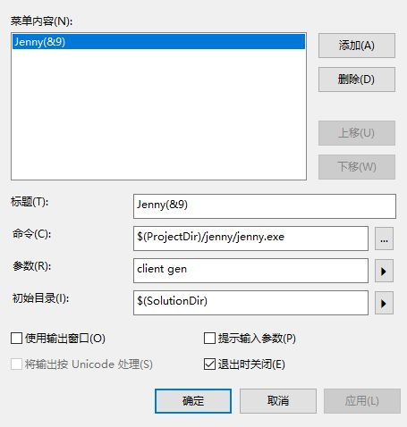

# Entitas執行流程


​      也就是说整个ECS系统的内部数据维护(Group、Collector、EntityIndex)复杂度主要放在Entity的修改上了。
​      在给一个Entity添加一个Component时，不仅仅是对Entity进行了修改，还会通过事件将这个添加传递给Context，Context遍历所有Group，找到满足这次修改条件的Group，对所有受到影响的Group进行修改。然后再通过Group将这次修改事件分发到Collector或其他监听该Group的模块中去。
  这种方式带来的好处十分明显，那就是获取一种类型的Entity（也就是一个Group），只有第一次会遍历所有的Entity生成这个Group，之后再获取该类型Entity的复杂度就只有O(1)。
  但是也有一定的隐患，当Group和Collector比较少时，这不是一个高消耗操作，但是Group、Collector很多，且在每一帧对Entity进行频繁修改的时候。这可能会成为一个高消耗操作。

# Tips

1\. 在销毁一个Entity时，会移除Entity身上所有的Component，然后再进行回收。在移除Component时可能会通过Group把这个移除事件发送到监听Remove行为的Collector中，Collector会持有这个被销毁的Entity。所以在filter、或execute时不能直接依赖Collector的收集条件，还需要对Entity的Component做独立的判断。
  其实任何时候filter都需要对Entity的Component做判断，因为Collector收集的Entity很可能在其他地方被改变。

2\. Entity不应该被ECS系统外的模块持有，因为系统外对Entity的持有不会被自动引用计数（可以自己添加）。可能会导致一个Entity被销毁然后又从池子中重新取出来， 外部模块对这个Entity的引用没有改变，但已经可能不是自己持有的那个Entity了。
  需要避免在外界持有Entity或通过持有uuid间接从context中持有这个Entity。

3\. 在replaceComponent时，发送了Remove、Add、Update三个事件，而不是只发送了Update事件。

4\. 在代码生成时，对单Componet的Matcher进行了缓存，如游戏中常用的Postion和Name等Component，但是对组合Component的Matcher没有进行缓存。所在在两个不同的ReactiveSystem中使用Matcher相同的Collector时，如：

```
//1,2代表Postion和Name的Index
//在使用代码生成时会生成类似Matcher.Position、Matcher.Name的静态函数，方便开发者使用
context.CreateCollector(Matcher.AllOf(1,2));
```

这样会生成两个Matcher相同的Group实例。
如果在意这一点的话可以自己对Matcher进行缓存。

1. 在Entitas-CSharp中，我们不会真的删除或者添加一个Component。生成出来的代码会先向用户请求新的值，触发移除component的事件，设置一个新的值给这个component，然后触发一次增加component的事件。用这个方法，我们就避免了内存的分配以及模拟了一个在使用`不可修改`（immutable）component的感觉。

# Group

在Context中可以对Entity进行快速过滤，它能不断的更新以保持当前的组中的Entity是最新的。假设Context有上千个Entities，但只有两个Entities拥有PositionComponent，那只要向Context询问特定的组就能立刻获取到所有符合的Entity。

```text
gameContext.GetGroup(GameMatcher.Position).GetEntities();
```

Group和Group所过滤到的entities会被缓存下来，所以即使多次调用GetGroup方法，也是非常高效的。

```text
gameContext.GetEntities(GameMatcher.Movable)
```

内部也是通过Groups的方式来实现。Groups 拥有以下事件OnEntityAdded, OnEntityRemoved 和 OnEntityUpdated来直接响应Entity的变化。

# Collector

Collector是Group的一个观察者类,Collector提供了一种简单的方法来处理Group中Entity变化的反应。假设你需要收集和处理所有entities，他们的PositionComponent被添加或替换：

```text
var group = gameContext.GetGroup(GameMatcher.Position);
var collector = group.CreateCollector(GroupEvent.Added);
```

之后：

```text
foreach (var e in collector.collectedEntities) {
    // do something with all the entities
    // that have been collected to this point of time
}
collector.ClearCollectedEntities();
```

我们还可以注销这个Collector

collector.Deactivate();

# ReactiveSystem

- 响应式的系统就像执行式系统一样，会每隔一段时间或是在每一个`Update`中被触发

- 响应式系统的`Execute(List entities)` 方法只会在收集器距离上一次`Execute`收集到新的Entity才会被执行。

- gettrigger使用Collector根据event建立一个group的entity列表

```
        protected override ICollector<GameEntity> GetTrigger(IContext<GameEntity> context) {
        	return context.CreateCollector(GameMatcher.Destroyed);
        }

        protected override bool Filter(GameEntity entity) {
        	return entity.isDestroyed;
        }
       
        public void Execute() {
            if (_collector.count != 0) {
                foreach (var e in _collector.collectedEntities) {
                    if (Filter(e)) {
                        e.Retain(this);
                        _buffer.Add(e);
                    }
                }

                _collector.ClearCollectedEntities();

                if (_buffer.Count != 0) {
                    try {
                        Execute(_buffer);
                    } finally {
                        for (int i = 0; i < _buffer.Count; i++) {
                            _buffer[i].Release(this);
                        }
                        _buffer.Clear();
                    }
                }
            }
        }
```

如上代码:

我们在`GetTrigger`方法中返回了一个监测了`Destroyed`Entity的Collector。在`context.CreateCollector(GameMatcher.Destroyed)` 中，我们不需要指定当一个Entity何时应当被收集的事件，因为默认就是会收集在`Added`情况下被通知到的Entity。所以当我们增加一个`Destroyed`组件到一个Entity上时，这个Entity会`添加`到`Destroyed`的group里面，并因此被对应的collector收集到对应的reactive system里面。

如下面的代码,AddDebugMessage就会被DebugMessageSystem收集了...

执行RemoveDebugMessage()但是DebugMessageSystem仍然收集着呢,但是该实体已经没有了组件DebugMessage.所以需要过滤下Filter(GameEntity entity)否则收集的数据会报错

```
using Entitas;

public class HelloWorldSystem : IInitializeSystem
{
    // always handy to keep a reference to the context 
    // we're going to be interacting with it
    readonly GameContext _context;

    public HelloWorldSystem(Contexts contexts)
    {
        // get the context from the constructor
        _context = contexts.game;
    }

    public void Initialize()
    {
        // create an entity and give it a DebugMessageComponent with
        // the text "Hello World!" as its data

        var e = _context.CreateEntity();
        e.AddDebugMessage("Hello World!");
        e.RemoveDebugMessage(); 
    }
}

```

```
using System.Collections.Generic;
using Entitas;
using UnityEngine;

public class DebugMessageSystem : ReactiveSystem<GameEntity>
{
    public DebugMessageSystem(Contexts contexts) : base(contexts.game)
    {
    }

    protected override ICollector<GameEntity> GetTrigger(IContext<GameEntity> context)
    {
        // we only care about entities with DebugMessageComponent 
        return context.CreateCollector(GameMatcher.DebugMessage);
    }

    protected override bool Filter(GameEntity entity)
    {
        // good practice to perform a final check in case 
        // the entity has been altered in a different system.
        return entity.hasDebugMessage;
    }

    protected override void Execute(List<GameEntity> entities)
    {
        // this is the list of entities that meet our conditions
        foreach (var e in entities)
        {
            // we can safely access their DebugMessage component
            // then grab the string data and print it
            Debug.Log(e.debugMessage.message);
        }
    }
}
```

# 事件

### 关于replace都干了什么

Group具有事件 `OnEntityAdded`, `OnEntityRemoved` and `OnEntityUpdated` 可以直接对组的更改做出反应。

看源码

```
 public void UpdateEntity(TEntity entity, int index, IComponent previousComponent, IComponent newComponent) {
            if (_entities.Contains(entity)) {
                if (OnEntityRemoved != null) {
                    OnEntityRemoved(this, entity, index, previousComponent);
                }
                if (OnEntityAdded != null) {
                    OnEntityAdded(this, entity, index, newComponent);
                }
                if (OnEntityUpdated != null) {
                    OnEntityUpdated(
                        this, entity, index, previousComponent, newComponent
                    );
                }
            }
        }
```

在Entitas-CSharp中，我们不会真的删除或者添加一个Component。生成出来的代码会先向用户请求新的值，触发移除component的事件，设置一个新的值给这个component，然后触发一次增加component的事件。用这个方法，我们就避免了内存的分配以及模拟了一个在使用`不可修改`（immutable）component的感觉。

### group和collect,还有event应该在什么地方添加.

- 在系统中的构造函数中

- 在entitan的system初始化Initialize前

因为初始化系统大多会有add,remove等动作.为了保持你的group,还有collect,还有event能够监听到.

所以最好在Initialize前

# Jenny

jenny使用了roslyn, DataProviders需要更改下,否则会报错..

```
Jenny.SearchPaths = Assets\Plugins\DesperateDevs\Editor\Plugins, \
                    Assets\Plugins\Entitas\Editor\Plugins, \
                    Jenny\Plugins\Entitas.Roslyn

Jenny.Plugins = DesperateDevs.CodeGeneration.Plugins, \
                DesperateDevs.CodeGeneration.Unity.Plugins, \
                Entitas.CodeGeneration.Plugins, \
                Entitas.Roslyn.CodeGeneration.Plugins, \
                Entitas.VisualDebugging.CodeGeneration.Plugins

Jenny.PreProcessors = DesperateDevs.CodeGeneration.Plugins.ValidateProjectPathPreProcessor, \
                      DesperateDevs.CodeGeneration.Plugins.TargetFrameworkProfilePreProcessor

Jenny.DataProviders = Entitas.CodeGeneration.Plugins.ContextDataProvider, \
                      Entitas.Roslyn.CodeGeneration.Plugins.CleanupDataProvider, \
                      Entitas.Roslyn.CodeGeneration.Plugins.ComponentDataProvider, \
                      Entitas.Roslyn.CodeGeneration.Plugins.EntityIndexDataProvider

Jenny.CodeGenerators = Entitas.CodeGeneration.Plugins.ComponentContextApiGenerator, \
                       Entitas.CodeGeneration.Plugins.ComponentEntityApiGenerator, \
                       Entitas.CodeGeneration.Plugins.ComponentEntityApiInterfaceGenerator, \
                       Entitas.CodeGeneration.Plugins.ComponentGenerator, \
                       Entitas.CodeGeneration.Plugins.ComponentLookupGenerator, \
                       Entitas.CodeGeneration.Plugins.ComponentMatcherApiGenerator, \
                       Entitas.CodeGeneration.Plugins.ContextAttributeGenerator, \
                       Entitas.CodeGeneration.Plugins.ContextGenerator, \
                       Entitas.CodeGeneration.Plugins.ContextMatcherGenerator, \
                       Entitas.CodeGeneration.Plugins.ContextsGenerator, \
                       Entitas.CodeGeneration.Plugins.EntityGenerator, \
                       Entitas.CodeGeneration.Plugins.EntityIndexGenerator, \
                       Entitas.CodeGeneration.Plugins.EventEntityApiGenerator, \
                       Entitas.CodeGeneration.Plugins.EventListenerComponentGenerator, \
                       Entitas.CodeGeneration.Plugins.EventListenertInterfaceGenerator, \
                       Entitas.CodeGeneration.Plugins.EventSystemGenerator, \
                       Entitas.CodeGeneration.Plugins.EventSystemsGenerator, \
                       Entitas.Roslyn.CodeGeneration.Plugins.CleanupSystemGenerator, \
                       Entitas.Roslyn.CodeGeneration.Plugins.CleanupSystemsGenerator, \
                       Entitas.VisualDebugging.CodeGeneration.Plugins.ContextObserverGenerator, \
                       Entitas.VisualDebugging.CodeGeneration.Plugins.FeatureClassGenerator

Jenny.PostProcessors = DesperateDevs.CodeGeneration.Plugins.AddFileHeaderPostProcessor, \
                       DesperateDevs.CodeGeneration.Plugins.CleanTargetDirectoryPostProcessor, \
                       DesperateDevs.CodeGeneration.Plugins.MergeFilesPostProcessor, \
                       DesperateDevs.CodeGeneration.Plugins.NewLinePostProcessor, \
                       DesperateDevs.CodeGeneration.Plugins.UpdateCSProjPostProcessor, \
                       DesperateDevs.CodeGeneration.Plugins.WriteToDiskPostProcessor, \
                       DesperateDevs.CodeGeneration.Plugins.ConsoleWriteLinePostProcessor

Jenny.Server.Port = 3333
Jenny.Client.Host = localhost
DesperateDevs.CodeGeneration.Plugins.ProjectPath = Assembly-CSharp.csproj
Entitas.CodeGeneration.Plugins.Assemblies = Library/ScriptAssemblies/Assembly-CSharp.dll
Entitas.CodeGeneration.Plugins.Contexts = Game, \
                                          Unit, \
                                          Combat, \
                                          Config, \
                                          Input

Entitas.CodeGeneration.Plugins.IgnoreNamespaces = true
DesperateDevs.CodeGeneration.Plugins.TargetDirectory = Assets/Scripts/World

```

一般来说.先运行Jenny-Auto-Import.bat.再运行Jenny-Server.bat就可以了

查看所有命令:

```
.\Jenny\Jenny.exe help 
```

以VStudio为例，创建一个外部工具：



再之后，想要生成代码只需要保持运行`Jenny Server` 然后在VS中运行`工具/Jenny` 就可以了，这个方法可以让你专注于VS而无需切换回Unity。

`jenny.exe client gen`需要服务器才能使用

`jenny gen` 不开服务器直接可以使用

## 相关链接

- <https://www.jianshu.com/c/e8e4c3f4280c>

- <https://github.com/OneYoungMean/Entitas-CSharp-OYM/wiki>

- <https://github.com/sschmid/Entitas-CSharp>