“碰乜鬼嘢啊，碰走晒我滴靓牌”。想到“碰”就自然联想到了“麻将”这一伟大发明。当然除了“碰”，洗牌的时候也充满了各种『碰撞』。

好了，不废话。直入主题——碰撞检测。

在 2D 环境下，常见的碰撞检测方法如下：

- 外接图形判别法

  - 轴对称包围盒（Axis-Aligned Bounding Box），即无旋转矩形。

  - 圆形碰撞

  - 圆形与矩形（无旋转）

  - 圆形与旋转矩形（以矩形中心点为旋转轴）

- 光线投射法

- 分离轴定理

- 其他

  - 地图格子划分

  - 像素检测

下文将由易到难的顺序介绍上述各种碰撞检测方法：外接图形判别法 > 其他 > 光线投射法 > 分离轴定理。

另外，有一些场景只要我们约定好限定条件，也能实现我们想要的碰撞，如下面的碰壁反弹：

当球碰到边框就反弹(如`x/y轴方向速度取反`)。

```
if(ball.left < 0 || ball.right  > rect.width)  ball.velocityX = -ball.velocityX
if(ball.top  < 0 || ball.bottom > rect.height) ball.velocityY = -ball.velocityY
```

再例如当一个人走到 `100px` 位置时不进行跳跃，就会碰到石头等等。

因此，某些场景只需通过设定到适当的参数即可实现碰撞检测。

## 外接图形判别法

### 轴对称包围盒（Axis-Aligned Bounding Box）

概念：判断任意两个（无旋转）矩形的任意一边是否无间距，从而判断是否碰撞。

算法：

```
rect1.x < rect2.x + rect2.width &&
rect1.x + rect1.width > rect2.x &&
rect1.y < rect2.y + rect2.height &&
rect1.height + rect1.y > rect2.y
```

两矩形间碰撞的各种情况：
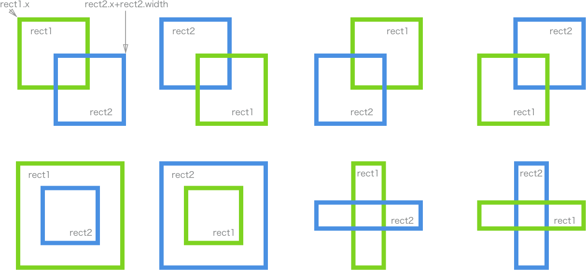

在线运行示例（先点击运行示例以获取焦点，下同）：

缺点：

- 相对局限：两物体必须是矩形，且均不允许旋转（即关于水平和垂直方向上对称）。

- 对于包含着图案（非填满整个矩形）的矩形进行碰撞检测，可能存在精度不足的问题。

- 物体运动速度过快时，可能会在相邻两动画帧之间快速穿越，导致忽略了本应碰撞的事件发生。

适用案例：

- （类）矩形物体间的碰撞。

### 圆形碰撞（Circle Collision）

概念：通过判断任意两个圆形的圆心距离是否小于两圆半径之和，若小于则为碰撞。

两点之间的距离由以下公式可得：


判断两圆心距离是否小于两半径之和：

```
Math.sqrt(Math.pow(circleA.x - circleB.x, 2) +
          Math.pow(circleA.y - circleB.y, 2)) 
    < circleA.radius + circleB.radius
```

图例：
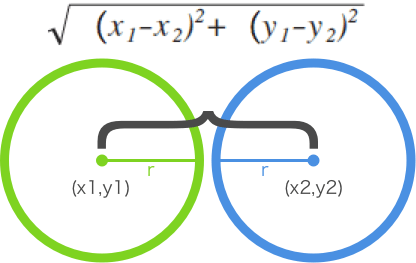

在线运行示例：

缺点：

- 与『轴对称包围盒』类似

适用案例：

- （类）圆形的物体，如各种球类碰撞。

### 圆形与矩形（无旋转）

概念：通过找出矩形上离圆心最近的点，然后通过判断该点与圆心的距离是否小于圆的半径，若小于则为碰撞。

那如何找出矩形上离圆心最近的点呢？下面我们从 x 轴、y 轴两个方向分别进行寻找。为了方便描述，我们先约定以下变量：

```
矩形上离圆心最近的点为变量：closestPoint = {x, y};
矩形 rect = {x, y, w, h}; // 左上角与宽高
圆形 circle = {x, y, r}; // 圆心与半径
```

首先是 x 轴：

如果圆心在矩形的左侧（`if(circle.x < rect.x)`），那么 `closestPoint.x = rect.x`。
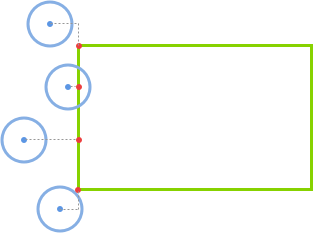

如果圆心在矩形的右侧（`else if(circle.x > rect.x + rect.w)`），那么 `closestPoint.x = rect.x + rect.w`。
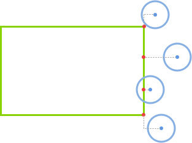

如果圆心在矩形的正上下方（`else`），那么 `closestPoint.x = circle.x`。
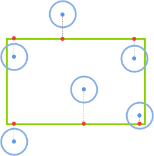

同理，对于 y 轴（此处不列举图例）：

如果圆心在矩形的上方（`if(circle.y < rect.y)`），那么 `closestPoint.y = rect.y`。

如果圆心在矩形的下方（`else if(circle.y > rect.y + rect.h)`），那么 `closestPoint.y = rect.y + rect.h`。

如果圆心在矩形的正左右两侧（`else`），那么 `closestPoint.y = circle.y`。

因此，通过上述方法即可找出矩形上离圆心最近的点了，然后通过『两点之间的距离公式』得出『最近点』与『圆心』的距离，最后将其与圆的半径相比，即可判断是否发生碰撞。

```
var distance = Math.sqrt(Math.pow(closestPoint.x - circle.x, 2) + Math.pow(closestPoint.y - circle.y, 2))

if(distance < circle.r) return true // 发生碰撞
else return false // 未发生碰撞
```

在线运行示例：

缺点：

- 矩形需是轴对称的，即不能旋转。

### 圆形与旋转矩形（以矩形中心为旋转轴）

概念：即使矩形以其中心为旋转轴进行了旋转，但是判断它与圆形是否发生碰撞的本质还是找出矩形上离圆心的最近点。

对于旋转后的矩形，要找出其离圆心最近的点，视乎有些困难。其实，我们可以将我们思想的范围进行扩大：将矩形的旋转看作是整个画布的旋转。那么我们将画布（即 Canvas）反向旋转『矩形旋转的角度』后，所看到的结果就是上一个方法“圆形与矩形（无旋转）”的情形。因此，我们只需求出画布旋转后的圆心位置，即可使用『圆形与矩形（无旋转）』的判断方法了。

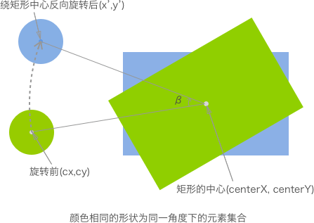

先给出可直接套用的公式，从而得出旋转后的圆心坐标：

```
x’ = cos(β) * (cx – centerX) – sin(β) * (cy – centerY) + centerX
y’ = sin(β) * (cx – centerX) + cos(β) * (cy – centerY) + centerY
```

下面给出该公式的推导过程：

根据下图，计算某个点绕另外一个点旋转一定角度后的坐标。我们设 A(x,y) 绕 B(a,b) 旋转 β 度后的位置为 C(c,d)。

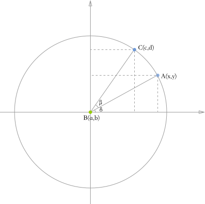

1. 设 A 点旋转前的角度为 δ，则旋转（逆时针）到 C 点后的角度为(δ+β)

2. 由于 |AB| 与 |CB| 相等（即长度），且

   1. |AB| = y/sin(δ) = x / cos(δ)

   2. |CB| = d/sin(δ + β) = c / cos(δ + β)

3. 半径 r = x / cos(δ) = y / sin(δ) = d / sin(δ + β) = c / cos(δ + β)

4. 由以下三角函数两角和差公式：

   - sin(δ + β) = sin(δ)cos(β) + cos(δ)sin(β)

   - cos(δ + β) = cos(δ)cos(β) - sin(δ)sin(β)

5. 可得出旋转后的坐标：

   - c = r \* cos(δ + β) = r \* cos(δ)cos(β) - r \* sin(δ)sin(β) = x \* cos(β) - y \* sin(β)

   - d = r \* sin(δ + β) = r \* sin(δ)cos(β) + r \* cos(δ)sin(β) = y \* cos(β) + x \* sin(β)

由上述公式推导后可得：旋转后的坐标 (c,d) 只与旋转前的坐标 (x,y) 及旋转的角度 β 有关。

当然，(c,d) 是旋转一定角度后『相对于旋转点（轴）的坐标』。因此，前面提到的『可直接套用的公式』中加上了矩形的中心点的坐标值。

从图中也可以得出以下结论：A 点旋转后的 C 点总是在圆周（半径为 |AB|）上运动，利用这点可让物体绕旋转点（轴）做圆周运动。

得到旋转后的圆心坐标值后，即可使用『圆形与矩形（无旋转）』方法进行碰撞检测了。

在线运行案例：

优点：

- 相对于圆形与矩形（未旋转）的方法，适用范围更广。

## 其他

### 地图格子划分

概念：将地图（场景）划分为一个个格子。地图中参与检测的对象都存储着自身所在格子的坐标，那么你即可以认为两个物体在相邻格子时为碰撞，又或者两个物体在同一格才为碰撞。另外，采用此方式的前提是：地图中所有可能参与碰撞的物体都要是格子单元的大小或者是其整数倍。

`蓝色X` 为障碍物：


实现方法：

```
// 通过特定标识指定（非）可行区域
map = [
  [0, 0, 1, 1, 1, 0, 0, 0, 0],
  [0, 1, 1, 0, 0, 1, 0, 0, 0],
  [0, 1, 0, 0, 0, 0, 1, 0, 0],
  [0, 1, 0, 0, 0, 0, 1, 0, 0],
  [0, 1, 1, 1, 1, 1, 1, 0, 0]
],
// 设定角色的初始位置
player = {left: 2, top: 2}

// 移动前（后）判断角色的下一步的动作（如不能前行）
...
```

在线运行示例：

缺点：

- 适用场景局限。

适用案例：

- 推箱子、踩地雷等

### 像素检测

概念：以像素级别检测物体之间是否存在重叠，从而判断是否碰撞。

实现方法有多种，下面列举在 Canvas 中的两种实现方式：

1. 如下述的案例中，通过将两个物体在 offscreen canvas 中判断同一位置（坐标）下是否同时存在非透明的像素。

2. 利用 canvas 的 `globalCompositeOperation = 'destination-in'` 属性。该属性会让两者的重叠部分会被保留，其余区域都变成透明。因此，若存在非透明像素，则为碰撞。

注意，当待检测碰撞物体为两个时，第一种方法需要两个 offscreen canvas，而第二种只需一个。

> offscreen canvas：与之相关的是 offscreen rendering。正如其名，它会在某个地方进行渲染，但不是屏幕。“某个地方”其实是**内存**。渲染到内存比渲染到屏幕更快。—— [Offscreen Rendering](http://devbutze.blogspot.com/2014/02/html5-canvas-offscreen-rendering.html)

当然，我们这里并不是利用 `offscreen render` 的性能优势，而是利用 `offscreen canvas` 保存独立物体的像素。换句话说：**onscreen canvas 只是起展示作用，碰撞检测是在 offscreen canvas 中进行**。

另外，由于需要逐像素检测，若对整个 Canvas 内所有像素都进行此操作，无疑会浪费很多资源。因此，我们可以先通过运算得到两者**相交区域**，然后只对该区域内的像素进行检测即可。

图例：
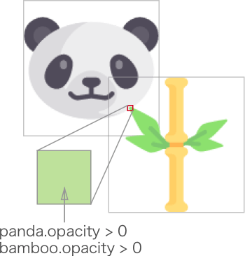

下面示例展示了第一种实现方式：

缺点：

- 因为需要检查每一像素来判定是否碰撞，性能要求比较高。

适用案例：

- 需要以像素级别检测物体是否碰撞。

## 光线投射法（Ray Casting）

概念：通过检测两个物体的速度矢量是否存在交点，且该交点满足一定条件。

对于下述抛小球入桶的案例：画一条与物体的速度向量相重合的线(`#1`)，然后再从另一个待检测物体出发，连线到前一个物体，绘制第二条线(`#2`)，根据两条线的交点位置来判定是否发生碰撞。

抛球进桶图例：
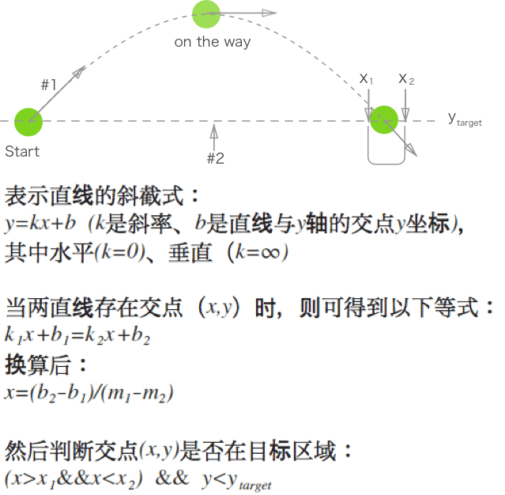

在小球飞行的过程中，需要不断计算两直线的交点。

当满足以下两个条件时，那么应用程序就可以判定小球已落入桶中：

- 两直线交点在桶口的左右边沿间

- 小球位于第二条线（`#2`）下方

在线运行示例：

优点：

- 适合运动速度快的物体

缺点：

- 适用范围相对局限。

适用案例：

- 抛球运动进桶。

## 分离轴定理（Separating Axis Theorem）

概念：通过判断任意两个 `凸多边形` 在任意角度下的投影是否均存在重叠，来判断是否发生碰撞。若在某一角度光源下，两物体的投影存在间隙，则为不碰撞，否则为发生碰撞。

图例：


在程序中，遍历所有角度是不现实的。那如何确定 `投影轴` 呢？其实**投影轴的数量与多边形的边数相等即可。**

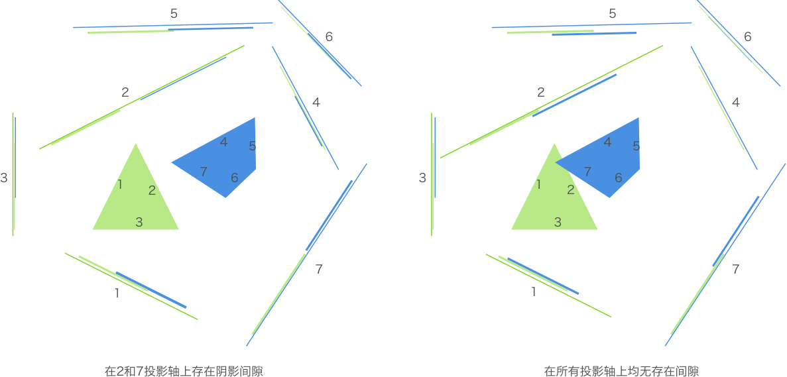

以较高抽象层次判断两个凸多边形是否碰撞：

```
function polygonsCollide(polygon1, polygon2) {
    var axes, projection1, projection2
    
    // 根据多边形获取所有投影轴
    axes = polygon1.getAxes()
    axes.push(polygon2.getAxes())
    
    // 遍历所有投影轴，获取多边形在每条投影轴上的投影
    for(each axis in axes) {
        projection1 = polygon1.project(axis)
        projection2 = polygon2.project(axis)
        
        // 判断投影轴上的投影是否存在重叠，若检测到存在间隙则立刻退出判断，消除不必要的运算。
        if(!projection1.overlaps(projection2))
            return false
    }
    return true
}
```

上述代码有几个需要解决的地方：

- 如何确定多边形的各个投影轴

- 如何将多边形投射到某条投影轴上

- 如何检测两段投影是否发生重叠

#### 投影轴

如下图所示，我们使用一条从 p1 指向 p2 的向量来表示多边形的某条边，我们称之为**边缘向量**。在分离轴定理中，还需要确定一条垂直于边缘向量的法向量，我们称之为“**边缘法向量**”。

**投影轴**平行于边缘法向量。投影轴的位置不限，因为其长度是无限的，故而多边形在该轴上的投影是一样的。该轴的方向才是关键的。

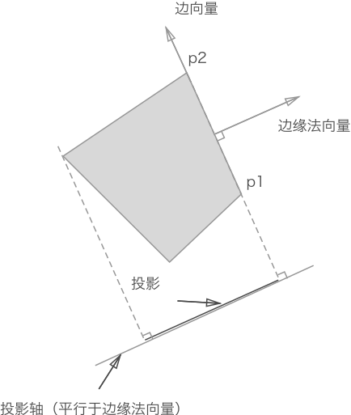

```
// 以原点(0,0)为始，顶点为末。最后通过向量减法得到 边缘向量。
var v1 = new Vector(p1.x, p1.y)
    v2 = new Vector(p2.x, p2.y)

// 首先得到边缘向量，然后再通过边缘向量获得相应边缘法向量（单位向量）。
// 两向量相减得到边缘向量 p2p1（注：上面应该有个右箭头，以表示向量）。
// 设向量 p2p1 为(A,B)，那么其法向量通过 x1x2+y1y2 = 0 可得：(-B,A) 或 (B,-A)。
    axis = v1.edge(v2).normal()
```

以下是向量对象的部分实现，具体可看源码。

```
var Vector = function(x, y) {
    this.x = x
    this.y = y
}

Vector.prototype = {
    // 获取向量大小（即向量的模），即两点间距离
    getMagnitude: function() {
        return Math.sqrt(Math.pow(this.x, 2),
                         Math.pow(this.y, 2))
    },
    // 点积的几何意义之一是：一个向量在平行于另一个向量方向上的投影的数值乘积。
    // 后续将会用其计算出投影的长度
    dotProduct: function(vector) {
        return this.x * vector.x + this.y + vector.y
    },
    // 向量相减 得到边
    subtarct: function(vector) {
        var v = new Vector()
        v.x = this.x - vector.x
        v.y = this.y - vector.y
        return v
    },
    edge: function(vector) {
        return this.substract(vector)
    },
    // 获取当前向量的法向量（垂直）
    perpendicular: function() {
        var v = new Vector()
        v.x = this.y
        v.y = 0 - this.x
        return v
    },
    // 获取单位向量（即向量大小为1，用于表示向量方向），一个非零向量除以它的模即可得到单位向量
    normalize: function() {
        var v = new Vector(0, 0)
            m = this.getMagnitude()
        if(m !== 0) {
            v.x = this.x / m
            v.y = this.y /m
        }
        return v
    },
    // 获取边缘法向量的单位向量，即投影轴
    normal: function() {
        var p = this.perpendicular()
        return p .normalize()
    }
}
```

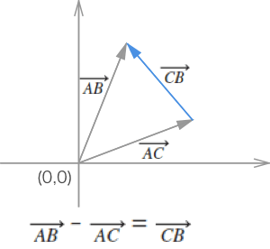
向量相减

更多关于向量的知识可通过其它渠道学习。

#### 投影

投影的大小：通过将一个多边形上的每个顶点与原点(0,0)组成的向量，投影在某一投影轴上，然后保留该多边形在该投影轴上所有投影中的最大值和最小值，这样即可表示一个多边形在某投影轴上的投影了。

判断两多边形的投影是否重合：`projection1.max > projection2.min && project2.max > projection.min`

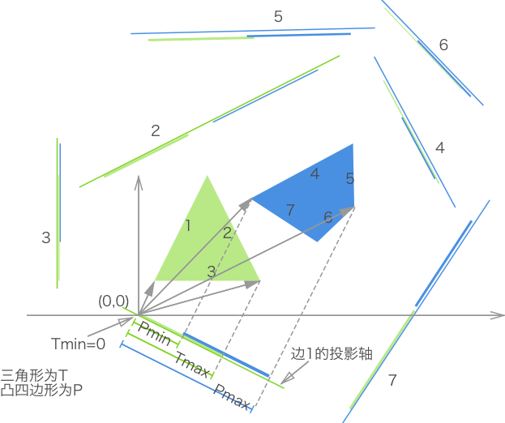
为了易于理解，示例图将坐标轴`原点(0,0)`放置于三角形`边1`投影轴的适当位置。

由上述可得投影对象：

```
// 用最大和最小值表示某一凸多边形在某一投影轴上的投影位置
var Projection = function (min, max) {
    this.min
    this.max
}

projection.prototype = {
    // 判断两投影是否重叠
    overlaps: function(projection) {
        return this.max > projection.min && projection.max > this.min
    }
}
```

如何得到向量在投影轴上的长度？
向量的点积的其中一个几何含义是：一个向量在平行于另一个向量方向上的投影的数值乘积。
由于**投影轴**是单位向量（长度为`1`），投影的长度为 `x1 * x2 + y1 * y2`

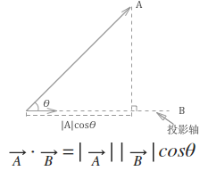

```
// 根据多边形的每个定点，得到投影的最大和最小值，以表示投影。
function project = function (axis) {
    var scalars = [], v = new Vector()
    
    this.points.forEach(function (point) {
        v.x = point.x
        v.y = point.y
        scalars.push(v.dotProduct(axis))
    })
    return new Projection(Math.min.apply(Math, scalars),
                          Math.max,apply(Math, scalars))
}
```

#### 圆形与多边形之间的碰撞检测

由于圆形可近似地看成一个有无数条边的正多边形，而我们不可能按照这些边一一进行投影与测试。我们只需将圆形投射到一条投影轴上即可，这条轴就是圆心与多边形顶点中最近的一点的连线，如图所示：

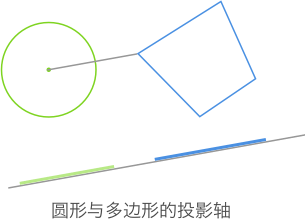

因此，该投影轴和多边形自身的投影轴就组成了一组待检测的投影轴了。

而对于圆形与圆形之间的碰撞检测依然是最初的两圆心距离是否小于两半径之和。

分离轴定理的整体代码实现，可查看以下案例：

优点：

- 精确

缺点：

- 不适用于凹多边形

适用案例：

- 任意凸多边形和圆形。

更多关于分离轴定理的资料：

- [Separating Axis Theorem (SAT) explanation](http://www.sevenson.com.au/actionscript/sat/)

- [Collision detection and response](http://www.metanetsoftware.com/technique/tutorialA.html)

- [Collision detection Using the Separating Axis Theorem](http://gamedevelopment.tutsplus.com/tutorials/collision-detection-using-the-separating-axis-theorem--gamedev-169)

- [SAT (Separating Axis Theorem)](http://www.codezealot.org/archives/55)

- [Separation of Axis Theorem (SAT) for Collision Detection](http://rocketmandevelopment.com/blog/separation-of-axis-theorem-for-collision-detection/)

#### 延伸：最小平移向量（MIT）

通常来说，如果碰撞之后，相撞的双方依然存在，那么就需要将两者分开。分开之后，可以使原来相撞的两物体彼此弹开，也可以让他们黏在一起，还可以根据具体需要来实现其他行为。不过首先要做的是，还是将两者分开，这就需要用到最小平移向量（Minimum Translation Vector, MIT）。


### 碰撞性能优化

若每个周期都需要对全部物体进行两两判断，会造成浪费（因为有些物体分布在不同区域，根本不会发生碰撞）。所以，大部分游戏都会将碰撞分为两个阶段：粗略和精细（broad/narrow）。

#### 粗略阶段（Broad Phase）

Broad phase 能为你提供有可能碰撞的实体列表。这可通过一些特殊的数据结构实现，它们能为你提供这些信息：实体存在哪里和哪些实体在其周围。这些数据结构可以是：四叉树（Quad Trees）、R树（R-Trees）或空间哈希映射（Spatial Hashmap）等。

读者若感兴趣，可以自行查阅相关信息。

#### 精细阶段（Narrow Phase）

当你有了较小的实体列表，你可以利用精细阶段的算法（如上述讲述的碰撞算法）得到一个确切的答案（是否发生碰撞）。

### 最后

碰撞检测有多种，选择合适最重要。

完！

### 参考资料

- [MDN：2D collision detection](https://developer.mozilla.org/en-US/docs/Games/Techniques/2D_collision_detection)

- [《HTML5 Canvas 核心技术：图形、动画与游戏开发》](https://item.jd.com/11231175.html?dist=jd)

- [Circular Collision Detection](http://lazyfoo.net/SDL_tutorials/lesson19/index.php)

- [Circle and Rotated Rectangle Collision Detection](http://www.migapro.com/circle-and-rotated-rectangle-collision-detection/)

- [推导坐标旋转公式](http://www.cnblogs.com/ywxgod/archive/2010/08/06/1793609.html)

感谢您的阅读，本文由 [凹凸实验室](https://aotu.io/) 版权所有。如若转载，请注明出处：凹凸实验室（[https://aotu.io/notes/2017/02/16/2d-collision-detection/）](https://aotu.io/notes/2017/02/16/2d-collision-detection/%EF%BC%89)