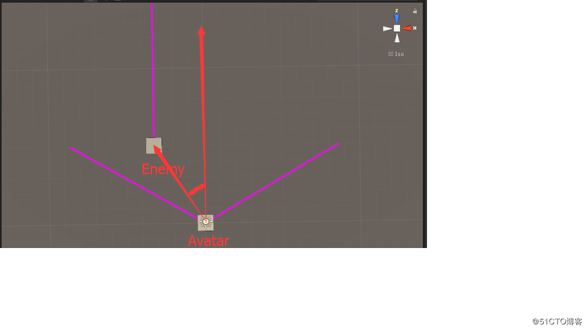
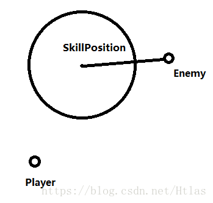
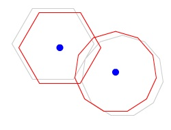
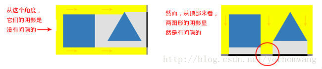
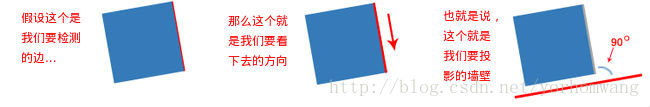
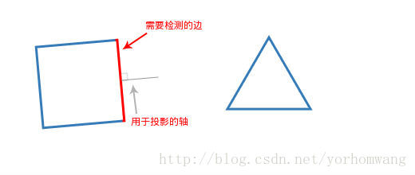
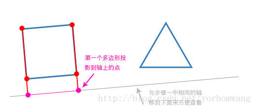
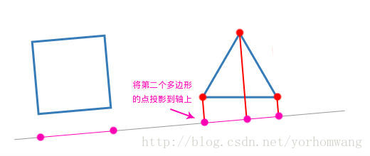
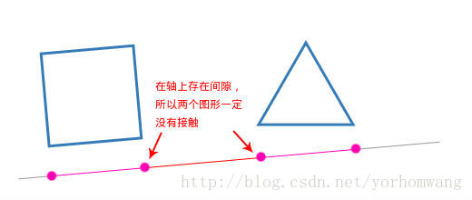
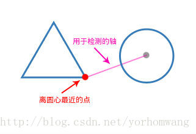

# 扇形攻击

其实这个分为两部分，

- 是在扇形距离范围内（也就是不考虑角度，其实是圆形范围内）Vector3.Distance(a, b);计算距离

- 是扇形角度范围内

计算怪物是否在你的视野范围内其实可以这么看


Avatar的正方向向量与Avatar到Enemy之间向量的夹角大小是否小于于视线大小的一半。

这样就能判断是否在视线范围内。

所以现在的问题就是这么计算这个夹角

计算的方式是，

1. 获取Avatar正方向的一个点与Avatar世界坐标相减，获取正方向向量

2. Enemy的世界坐标与Avatar世界坐标相减，获取Enemy到Avatar的方向向量

3. 调用Vector3.Angle(a, b)计算夹角

```
    public GameObject avatar;
    public GameObject enemy;
    
	//扇形距离 攻击距离  扇形的半径 
    float minDistance = 10f;
    //扇形的角度 也就是攻击的角度
    float minAngle = 120f;

    // Update is called once per frame
    void Update ()
    {
        Vector3 avatarPos = avatar.transform.position;
        Vector3 enemyPos = enemy.transform.position;
        
        //与敌人的距离
        float distance = Vector3.Distance(avatarPos, enemyPos);

        //主角相对于目标的向量
        Vector3 srcLocalVect = enemyPos - avatarPos;
        srcLocalVect.y = 0;

        //获取主角正前方的一个点
        Vector3 forwardLocalPos = avatar.transform.forward * 1 + avatarPos;

        //获取正方向向量
        Vector3 forwardLocalVect = forwardLocalPos - avatarPos;
        forwardLocalVect.y = 0;

        //计算角度
        float angle = Vector3.Angle(srcLocalVect, forwardLocalVect);

        if(distance < minDistance && angle < minAngle/2)
        {
            Debug.Log("In EyeSight");
        }
    }
```

# 长方形范围攻击检测

```
using UnityEngine;
using System.Collections;


public class AttackCHeck : MonoBehaviour
{
    //要攻击的目标
    public Transform Target;

    private void Update()
    {
        //计算玩家与敌人的距离
        float distance = Vector3.Distance(transform.position, Target.position);
        //玩家与敌人的方向向量
        Vector3 temVec = Target.position - transform.position;
        //与玩家正前方做点积
        float forwardDistance = Vector3.Dot(temVec, transform.forward.normalized);
        if (forwardDistance > 0 && forwardDistance <= 10)
        {
            float rightDistance = Vector3.Dot(temVec, transform.right.normalized);

            if (Mathf.Abs(rightDistance) <= 3)
            {
                Debug.Log("进入攻击范围");
            }
        }

    }
}
```

# 判断目标点是否在指定的矩形内（两个随机点确定的矩形）

```

public class Rectangle01
{
    /// Min为当前坐标系中矩形的最小点
    /// Max为当前坐标系中矩形的最大点
    public Vector2 Min;
    public Vector2 Max;
 
    public bool Contains( Vector2 point)
    {
        if (point.x < this.Min.x)
        {
            return false;
        }
        if (point.x > this.Max.x)
        {
            return false;
        }
        if (point.y < this.Min.y)
        {
            return false;
        }
        if (point.y > this.Max.y)
        {
            return false;
        }
        return true;
    }
 
    public void CalcVertices(out Vector2 vertex0, out Vector2 vertex1, out Vector2 vertex2, out Vector2 vertex3)
    {
        vertex0 = this.Min;
        vertex1 = new Vector2(this.Max.x, this.Min.y);
        vertex2 = this.Max;
        vertex3 = new Vector2(this.Min.x, this.Max.y);
    }
}
```

测试   脚本

```
public class TestRt01 : MonoBehaviour {
 
    public Transform Point;
    public Transform RtPoint0, RtPoint1;
    public Rectangle01 rtBox;
 
    private const float _pointRadius = 0.1f;
  
    private void OnDrawGizmos()
    {
        if (rtBox != null)
        {
            DrawRt(rtBox);
            Gizmos.DrawSphere(Point.position, _pointRadius);
        }
    }
    private void Update()
    {
        if (Input.GetKeyDown(KeyCode.Q))
        {
            rtBox = CreateFromTwoPoints(RtPoint0.position, RtPoint1.position);
            bool cont = rtBox.Contains(Point.position);
            if (cont)
            {
                Debug.Log("目标点在矩形范围内");
            }
            else
            {
                Debug.Log("目标点不在矩形范围内");
            }
        }
    }
    public Rectangle01 CreateFromTwoPoints(Vector2 point0, Vector2 point1)
    {
        Rectangle01 rt = new Rectangle01();
        if (point0.x < point1.x)
        {
            rt.Min.x = point0.x;
            rt.Max.x = point1.x;
        }
        else
        {
            rt.Min.x = point1.x;
            rt.Max.x = point0.x;
        }
        if (point0.y < point1.y)
        {
            rt.Min.y = point0.y;
            rt.Max.y = point1.y;
        }
        else
        {
            rt.Min.y = point1.y;
            rt.Max.y = point0.y;
        }
        return rt;
    }
 
    protected void DrawRt( Rectangle01 box)
    {
        Vector2 v0, v1, v2, v3;
        box.CalcVertices(out v0, out v1, out v2, out v3);
        Gizmos.color = Color.blue;
        Gizmos.DrawLine(v0, v1);
        Gizmos.DrawLine(v1, v2);
        Gizmos.DrawLine(v2, v3);
        Gizmos.DrawLine(v3, v0);
    }
}
```

# 判断目标点是否在某一矩形区域（以任一点为中心的矩形区域）

```
public class Box {
 
    public Vector2 Center;
    public Vector2 Axis0;
    public Vector2 Axis1;
    public Vector2 Extents;
 
    public Box(Vector2 center, Vector2 axis0, Vector2 axis1, Vector2 extents)
    {
        this.Center = center;
        this.Axis0 = axis0;
        this.Axis1 = axis1;
        this.Extents = extents;
    }
    public bool Contains(Vector2 point)
    {
        Vector2 vector;
        vector.x = point.x - this.Center.x;
        vector.y = point.y - this.Center.y;
        float num = vector.Dot(ref this.Axis0);
        if (num < -this.Extents.x)
        {
            return false;
        }
        if (num > this.Extents.x)
        {
            return false;
        }
        num = vector.Dot(ref this.Axis1);
        if (num < -this.Extents.y)
        {
            return false;
        }
        if (num > this.Extents.y)
        {
            return false;
        }
        return true;
    }
 
    public void CalcVertices(out Vector2 vertex0, out Vector2 vertex1, out Vector2 vertex2, out Vector2 vertex3)
    {
        Vector2 vector = (Vector2)(this.Axis0 * this.Extents.x);
        Vector2 vector2 = (Vector2)(this.Axis1 * this.Extents.y);
        vertex0 = (this.Center - vector) - vector2;
        vertex1 = (this.Center + vector) - vector2;
        vertex2 = (this.Center + vector) + vector2;
        vertex3 = (this.Center - vector) + vector2;
    }
 
}
 
public static class Vector2ex
{
    public static float Dot(this Vector2 vector, ref Vector2 value)
    {
        return ((vector.x * value.x) + (vector.y * value.y));
    }
}
```

测试脚本

```

public class TestBox : MonoBehaviour {
 
    public Transform Point;
    public Transform rtBox;
    Box box;
    private const float _pointRadius = .11f;
    private void OnDrawGizmos()
    {
        if (box!=null)
        {
            Gizmos.DrawSphere(Point.position, _pointRadius);
            DrawBox(ref box);
        }
    }
    private void Update()
    {
        if (Input.GetKeyDown(KeyCode.Q))
        {
            box = new Box(rtBox.position, rtBox.right, rtBox.up, rtBox.localScale); ;
            bool cont = box.Contains(Point.position);
            if (cont)
            {
                Debug.Log("目标点在矩形范围内");
            }
            else
            {
                Debug.Log("目标点不在矩形范围内");
            }
        }
    }
 
    protected void DrawBox(ref Box box)
    {
        Vector2 v0, v1, v2, v3;
 
        box.CalcVertices(out v0, out v1, out v2, out v3);
        Gizmos.color = Color.blue;
        Gizmos.DrawLine(v0, v1);
        Gizmos.DrawLine(v1, v2);
        Gizmos.DrawLine(v2, v3);
        Gizmos.DrawLine(v3, v0);
    }
}
```

# 半圆形攻击范围检测

```
using UnityEngine;
using System.Collections;


public class AttackCHeck : MonoBehaviour
{
    //要攻击的目标
    public Transform Target;
    private void Update()
    {
        //计算玩家与敌人的距离
        float distance = Vector3.Distance(transform.position, Target.position);
        //玩家与敌人的方向向量
        Vector3 temVec = Target.position - transform.position;
        //与玩家正前方做点积
        float forwardDistance = Vector3.Dot(temVec, transform.forward.normalized);
        if (forwardDistance > 0 && forwardDistance <= 10)
        {
            if (distance <= 5)
            {
                Debug.Log("进入攻击范围");
            }
        }
    }
}
```

# 圆形攻击范围

圆形攻击范围有两种，以玩着荣耀的王昭君大招为例子，

第一种是制定位置施法：新版本的王昭君的大招是指定位置施法的，也就是说在玩家固定施法半径以内可随意放一个圆形的技能。在半径之内的敌人受伤。

第二种是固定位置施法：老版本的王昭君大招是在自身一定半径以内，敌人在这个范围内受伤。

其实两种判断都很简单，只需要判断敌人和SkillPosition之间的距离是否小于半径即可。



```
/// <summary>
    /// 不定点式圆形攻击
    /// </summary>
    /// <param name="attacked">被攻击方</param>
    /// <param name="skillPosition">技能释放位置</param>
    /// <param name="radius">半径</param>
    /// <returns></returns>
    public bool CircleAttack(Transform attacked,Transform skillPosition, float radius)
    {
        float distance = Vector3.Distance(attacked.position, skillPosition.position);
        if (distance < radius)
        {
            return true;
        }
        return false;
	}
```

方法2

```
public class Circle {
 
    public Vector2 Center;
    public float Radius;
 
    public Circle(Vector2 center, float radius)
    {
        this.Center = center;
        this.Radius = radius;
    }
 
    public bool Contains( Vector2 point)
    {
        Vector2 vector = point - this.Center;
        return (vector.SqrMagnitude() <= (this.Radius * this.Radius));
    }
 
    public Vector2 Eval(float t)
    {
        return new Vector2(this.Center.x + (this.Radius * Mathf.Cos(t)), this.Center.y + (this.Radius * Mathf.Sin(t)));
    }
 }
```

# 判断一个点是否在三角形里面

```
public static  bool InTrigon(Vector3 _target,Vector3 _center,Vector3 _left,Vector3 _right){  
        Vector3 Ctl=_left-_center;  
        Vector3 Ctr=_right -_center;  
        Vector3 Ctt=_target-_center;  
        Vector3 Ltr=_right-_left;  
        Vector3 Ltc=_right-_center;  
        Vector3 Ltt=_left-_target;  
        Vector3 Rtl=_left-_right;  
        Vector3 Rtc=_center-_right;  
        Vector3 Rtt=_target-_right;  
        if(   
           Vector3.Dot(Vector3.Cross(Ctl,Ctr).normalized,Vector3.Cross(Ctl,Ctt).normalized)==1&&  
           Vector3.Dot(Vector3.Cross(Ltr,Ltc).normalized,Vector3.Cross(Ltr,Ltt).normalized)==1&&  
           Vector3.Dot(Vector3.Cross(Rtc,Rtl).normalized,Vector3.Cross(Rtc,Rtt).normalized)==1  
           )  
            return true;  
        else  
            return false;  
    }
```

原理：通过向量之间的对比，利用点乘和差乘实现判断一个点是否在三角形里面。

叉乘： 叉乘结果用右手判断法则。

### 方法二

```
public class Triangle 
{
    public enum Orientations
    {
        CW,//三个点顺时针
        CCW,//三个点逆时针
        None//不清楚点的顺序
    }
 
    public Vector2 V0;
    public Vector2 V1;
    public Vector2 V2;
    public Triangle(Vector2 v0, Vector2 v1, Vector2 v2)
    {
        this.V0 = v0;
        this.V1 = v1;
        this.V2 = v2;
    }
    public static Triangle CreateTriangle2(Transform v0, Transform v1, Transform v2)
    {
        return new Triangle(v0.position, v1.position, v2.position);
    }
 
    public Orientations CalcOrientation(float threshold = 1E-05f)
    {
        float num = this.CalcDeterminant();
        if (num > threshold)
        {
            return Orientations.CCW;
        }
        if (num < -threshold)
        {
            return Orientations.CW;
        }
        return Orientations.None;
    }
 
    public float CalcDeterminant()
    {
        return ((((((this.V1.x * this.V2.y) + (this.V0.x * this.V1.y)) + (this.V2.x * this.V0.y)) - (this.V1.x * this.V0.y)) - (this.V2.x * this.V1.y)) - (this.V0.x * this.V2.y));
    }
 
    public bool Contains(Vector2 point)
    {
        bool flag = (((point.x - this.V1.x) * (this.V0.y - this.V1.y)) - ((point.y - this.V1.y) * (this.V0.x - this.V1.x))) < 0f;
        bool flag2 = (((point.x - this.V2.x) * (this.V1.y - this.V2.y)) - ((point.y - this.V2.y) * (this.V1.x - this.V2.x))) < 0f;
        if (flag != flag2)
        {
            return false;
        }
        bool flag3 = (((point.x - this.V0.x) * (this.V2.y - this.V0.y)) - ((point.y - this.V0.y) * (this.V2.x - this.V0.x))) < 0f;
        return (flag2 == flag3);
    }
 
    /// <summary>
    /// 当已经知道 三个顶点的顺序是逆时针方向的时候使用
    /// </summary>
    /// <param name="point"></param>
    /// <returns></returns>
    public bool ContainsCCW(Vector2 point)
    {
        if ((((point.x - this.V0.x) * (this.V1.y - this.V0.y)) - ((point.y - this.V0.y) * (this.V1.x - this.V0.x))) > 0f)
        {
            return false;
        }
        if ((((point.x - this.V1.x) * (this.V2.y - this.V1.y)) - ((point.y - this.V1.y) * (this.V2.x - this.V1.x))) > 0f)
        {
            return false;
        }
        if ((((point.x - this.V2.x) * (this.V0.y - this.V2.y)) - ((point.y - this.V2.y) * (this.V0.x - this.V2.x))) > 0f)
        {
            return false;
        }
        return true;
    }
 
    /// <summary>
    /// 当已经知道 三个顶点的顺序是顺时针方向的时候使用
    /// </summary>
    /// <param name="point"></param>
    /// <returns></returns>
    public bool ContainsCW(Vector2 point)
    {
        if ((((point.x - this.V0.x) * (this.V1.y - this.V0.y)) - ((point.y - this.V0.y) * (this.V1.x - this.V0.x))) < 0f)
        {
            return false;
        }
        if ((((point.x - this.V1.x) * (this.V2.y - this.V1.y)) - ((point.y - this.V1.y) * (this.V2.x - this.V1.x))) < 0f)
        {
            return false;
        }
        if ((((point.x - this.V2.x) * (this.V0.y - this.V2.y)) - ((point.y - this.V2.y) * (this.V0.x - this.V2.x))) < 0f)
        {
            return false;
        }
        return true;
    }

}
```

测试脚本

```

public class TriangleTest : MonoBehaviour {
    public Transform Point;
    public Transform V0, V1, V2;
    Triangle triangle;
    private void Update()
    {
        if (Input.GetKeyDown(KeyCode.Q))
        {
            triangle = Triangle.CreateTriangle2(V0, V1, V2);
            Triangle.Orientations orientation = triangle.CalcOrientation();
 
            bool cont = false;
            if (orientation == Triangle.Orientations.CCW)
            {
                 cont = triangle.Contains(Point.position);
                 //cont1 = triangle.ContainsCCW(Point.position); // 如果你知道三角形方向(顶点顺序方向)，就用这个
            }
            else if (orientation == Triangle.Orientations.CW)
            {
                 cont = triangle.Contains(Point.position);
                 //cont1 = triangle.ContainsCW(Point.position); // 如果你知道三角形方向(顶点顺序方向)，就用这个
            }
            else // Degenerate
            {
                Debug.LogError("Triangle is degenerate");
            }
            if (cont)
            {
                Debug.Log("目标点在矩形范围内");
            }
            else
            {
                Debug.Log("目标点不在矩形范围内");
            }
        }
    }
    private void OnDrawGizmos()
    {
        if (triangle!=null)
        {
            DrawTriangle( triangle);
        }
    }
 
 
    void DrawTriangle( Triangle triangle)
    {
        Gizmos.color = Color.blue;
        Gizmos.DrawLine(triangle.V0, triangle.V1);
        Gizmos.DrawLine(triangle.V1, triangle.V2);
        Gizmos.DrawLine(triangle.V2, triangle.V0);
    }

}
```

# 向量

其实这些小算法基本上用的全是向量的计算,向量的计算有两种

### 向量的点乘

–>A . B = |A| \* |B| \* cos θ
–>点乘应用

1. 如果 让 A 等于单位向量 |A| ==1 c点积 等于 B 在 A 上的投影

2. 如果 让 A B等于单位向量 arccos(a.b) == 夹角

### 向量的叉乘

–>A\* B = C C就是A和B的法向量
–>叉乘应用

1. c 是有方向 。 通过 左手 定则 可以知道 C 的方向

2. 所以叉乘一般是用来计算方向的

3. A 和 B 都是单位向量 arcsin(|A\*B|) 等于 夹角

# 凸多边形碰撞(分离轴定理算法)

\***正文如下：\***



分离轴定理（英文简称SAT）是一项用于检测凸多边形碰撞的技术。

我绝不是这个方面的专家，但当检测碰撞的需求出现在我面前之后，我做了大量的阅读并最终在ActionScript 3中实现了它。

我想，我应该把我所学到的分享给大家，希望大家不会在这方面被坑得很惨：）

当我发现我需要在flash中检测多边形碰撞时，我碰巧地遇到了一个叫“分离轴定理”的方法。但唯一的问题是，为了真正地掌握它，我可费了不少功夫。

在阅读了大量有关碰撞检测的资料，并参看了一些代码示例后，这个方法总算被我领悟了。

为了帮助其他那些不精通数学的开发者，我想我应该写下这一篇能快速阐明这个算法工作原理的简短介绍。我还在下文引入了一个使用分离轴定理实现的demo，以及供大家下载并使用的ActionScript 3源代码。**（译者：demo和源代码请到原文中查看和下载）**

注意：分离轴定理需要一点数学向量的知识，所以在深究这个算法前，你最好复习一下这方面的内容。

# 算法简述

从根本上来讲，分离轴定理（以及其他碰撞算法）的用途就是去检测并判断两个图形之间是否有间隙。分离轴定理中用到的方法使算法本身显得十分独特。

我所听到过分离轴定理的最好类比方式是这样的：

假想你拿一个电筒从不同的角度照射到两个图形上，那么会有怎样的一系列的阴影投射到它们之后的墙壁上呢？



如果你用这个方式从每一个角度上对这两个图形进行处理，并都找不到任何的间隙，那么这两个图形就一定接触。如果你找到了一个间隙，那么这两个图形就显而易见地没有接触。

从编程的角度来讲，从每个可能的角度上去检测会使处理变得十分密集。不过幸运的是，由于多边形的性质，你只需要检测其中几个关键的角度。

你需要检测的角度数量就正是这个多边形的边数。也就是说，你所需检测的角度最大数量就是你要检测碰撞的两个多边形边数之和。举个例子，两个五边形就需要检测10个角度。



# 如何在代码中实现

这是一个简易但比较啰嗦的方法，以下是基本的步骤：

\*\*步骤一：\*\*从需要检测的多边形中取出一条边，并找出它的法向量（垂直于它的向量），这个向量将会是我们的一个“投影轴”。



\*\*步骤二：\*\*循环获取第一个多边形的每个点，并将它们投影到这个轴上。（记录这个多边形投影到轴上的最高和最低点）



\*\*步骤三：\*\*对第二个多边形做同样的处理。



\*\*步骤四：\*\*分别得到这两个多边形的投影，并检测这两段投影是否重叠。



如果你发现了这两个投影到轴上的“阴影”有间隙，那么这两个图形一定没有相交。但如果没有间隙，那么它们则可能接触，你需要继续检测直到把两个多边形的每条边都检测完。如果你检测完每条边后，都没有发现任何间隙，那么它们是相互碰撞的。

这个算法基本就是如此的。

顺带提一下，如果你记录了哪个轴上的投影重叠值最小（以及重叠了多少），那么你就能用这个值来分开这两个图形。

## 那么如何处理圆呢？

在分离轴定理中，检测圆与检测多边形相比，会有点点奇异，但仍然是可以实现的。

最值得注意的是，圆是没有任何的边，所以是没有明显的用于投影的轴。但它有一条“不是很明显的”的投影轴。这条轴就是途经圆心和多边形上离圆心最近的顶点的直线。



在这以后就是按套路遍历另一个多边形的每条投影轴，并检测是否有投影重叠。

噢，对了，万一你想知道如何把圆投影到轴上，那你只用简单地把圆心投影上去，然后加上和减去半径就能得到投影长度了。

# 优点与不足

和其他的碰撞检测技术一样，分离轴定理算法有它自己的优点和不足。以下是其一些优点和不足的简要概述：

## 优点

（译者：原来老外也喜欢先谈优点啊～>～）

- 分离轴定理算法十分得快——它完美地使用了基本的数学向量知识。只要间隙一旦被检测出来，那么你就能马上得出结果，消除不必要的运算。

- 分离轴定理算法十分得准——至少据我所知是这样的。（译者：突然感觉作者好不靠谱啊，囧……）

## 不足

- 分离轴定理算法只适用于凸多边形——复杂的图形（译者：指的是凹多边形，比如五角星）无法使用此方法，除非你把它们分成一些小的凸多边形，然后依次检验这些小的多边形。

- 分离轴定理算法无法告诉你是那条边发生的碰撞——仅仅是告诉你重叠了多少和分开它们所需的最短距离。

可能这个算法会有更多优点和不足之处，但是我想这应该是最主要的几个了。

# 总结

我希望这篇文章能帮助你了解到分离轴定理算法。我已经尽可能地不提供过多的信息并讲解得十分简明了。（我绝不是数学方面的专家，所以如果我遗漏了什么，我深表歉意）

以下是一些帮助我理解分离轴定理算法的页面：

- [harverycartel.org](http://www.harveycartel.org/metanet/tutorials/tutorialA.html)——有更多详细的表述以及很多很酷的示例。我在这个页面上学到了很多。

- [GPWiki.org](http://gpwiki.org/index.php/VB:Tutorials:Building_A_Physics_Engine:Basic_Intersection_Detection)——有不错的讲解和代码示例，我用这些代码作为编写自己代码的基础。

- [Tony Pa](http://www.tonypa.pri.ee/vectors/index.html)——向量教程，学习向量的不错资源。

- [GameDev.net forum](http://www.gamedev.net/community/forums/topic.asp?topic_id=251638)——一个论坛成员写的分离轴定理碰撞检测系统，带给了我一些计算方面的想法。

**本文翻译自**[**@sevenson**](http://www.sevenson.com.au/)**的文章**[**Separating Axis Theorem (SAT) Explanation**](http://www.sevenson.com.au/actionscript/sat/)\*\* 。\*\*

```
using System.Collections;
using System.Collections.Generic;
using UnityEngine;

public class XRect{
    private Vector2 _point0 = new Vector2();
    private Vector2 _point1 = new Vector2();
    private Vector2 _point2 = new Vector2();
    private Vector2 _point3 = new Vector2();

    public List<Vector2> _pointList = new List<Vector2>();

    private float _min = 0;
    private float _max = 0;


    public void UpdatePoint(RectTransform RT)
    {
        float x = RT.localPosition.x;
        float y = RT.localPosition.y;
        float width = RT.sizeDelta.x;
        float height = RT.sizeDelta.y;
        float angle = RT.localRotation.eulerAngles.z;

        Vector2 centerV = new Vector2(RT.localPosition.x, RT.localPosition.y);

        _point0 = new Vector2(x - width / 2, y + height / 2);
        _point0 = _Transform(_point0,angle,centerV);

        _point1 = new Vector2(x + width / 2, y + height / 2);
        _point1 = _Transform(_point1, angle, centerV);

        _point2 = new Vector2(x + width / 2, y - height / 2);
        _point2 = _Transform(_point2, angle, centerV);

        _point3 = new Vector2(x - width / 2, y - height / 2);
        _point3 = _Transform(_point3, angle, centerV);

        _pointList.Clear();
        _pointList.Add(_point0);
        _pointList.Add(_point1);
        _pointList.Add(_point2);
        _pointList.Add(_point3);

        Vector3[] temp = new Vector3[4];
        RT.GetLocalCorners(temp);
       
    }

    //获取投影轴
    public Vector2 GetAxis(int index)
    {
        Vector2 v = _GetEdge(index);

        Vector2 result = new Vector2();

        result.x = v.y;
        result.y = 0 - v.x;

        return result;
    }

    public void ResetProjection(Vector2 axis)
    {
        if (axis.x == 0 && axis.y == 0)
        {
            Debug.LogError("投影轴数据错误！");
            return;
        }
        float projectionX;
        Vector2 v;
        for (int i = 0; i < _pointList.Count; ++i)
        {
            v = _pointList[i];
            if (axis.x == 0)
            {
                projectionX = v.y;
            }
            else if (axis.y == 0)
            {
                projectionX = v.x;
            }
            else
            {
                projectionX = (v.x - axis.x / axis.y * v.y) / (1 + Mathf.Pow(axis.x / axis.y, 2));
            }


            if (i == 0)
            {
                _min = projectionX;
                _max = projectionX;
            }
            else
            {
                if (projectionX > _max)
                {
                    _max = projectionX;
                }
                if (projectionX < _min)
                {
                    _min = projectionX;
                }
            }

        } 
    }

    public float GetMin()
    {
        return _min;
    }

    public float GetMax()
    {
        return _max;
    }


    //获取边向量
    private Vector2 _GetEdge(int index)
    {
        Vector2 result = new Vector2();
        switch (index)
        {
            case 0:
                result = _point1 - _point0;
                break;
            case 1:
                result = _point2 - _point1;
                break;
            case 2:
                result = _point3 - _point2;
                break;
            case 3:
                result = _point0 - _point3;
                break;
        }

        return result;
    }

    private Vector2 _Transform(Vector2 v,float angle,Vector2 centerV)
    {
        Vector2 result = new Vector2();

        float initX = v.x;
        float initY = v.y;

        //将顶点移动到原点四周
        float centerPointX = initX - centerV.x;
        float centerPointY = initY - centerV.y;

        float r = angle * Mathf.Deg2Rad;

        float a = Mathf.Cos(r);
        float b = Mathf.Sin(r);

        result.x = centerPointX * a + centerPointY * (-b) + centerV.x;
        result.y = centerPointX * b + centerPointY * a + centerV.y;

        return result;
    }
```

```
using System.Collections;
using System.Collections.Generic;
using UnityEngine;

public class XCollisionHelper {

    private static XCollisionHelper _instance;

    public static XCollisionHelper GetInstance()
    {
        if (_instance  == null)
        {
            _instance = new XCollisionHelper();
        }

        return _instance;
    }

    public bool Check(XRect xRect1,XRect xRect2)
    {
        for (int i = 0; i <4;++i)
        {
            Vector2 axis = xRect1.GetAxis(i);

            //获取两个矩形在投影轴上的范围
            xRect1.ResetProjection(axis);
            xRect2.ResetProjection(axis);

            if (xRect1.GetMin() > xRect2.GetMax() || xRect1.GetMax() < xRect2.GetMin())
            {
                return false;
            }
        }

        for (int i = 0; i < 4; ++i)
        {
            Vector2 axis = xRect2.GetAxis(i);

            xRect1.ResetProjection(axis);
            xRect2.ResetProjection(axis);

            if (xRect1.GetMin() > xRect2.GetMax() || xRect1.GetMax() < xRect2.GetMin())
            {
                return false;
            }
        }

        return true;
    }
    

}
```

```
using System;
using System.Collections;
using System.Collections.Generic;
using UnityEngine;
using UnityEngine.EventSystems;
using UnityEngine.UI;

public class XRectItemCtrl : MonoBehaviour, IDragHandler
{

    public Image imgRect;
    private XRect _xRect = new XRect();

    public XRect GetXRect()
    {
        RectTransform RT = transform.GetComponent<RectTransform>();
        _xRect.UpdatePoint(RT);

        if (transform.gameObject.name == "Image0")
        {
        }

        return _xRect;
    }

    public void OnDrag(PointerEventData eventData)
    {
        RectTransform RT = transform.GetComponent<RectTransform>();
        RT.localPosition = new Vector2(RT.localPosition.x + eventData.delta.x, RT.localPosition.y + eventData.delta.y);
    }
}
```

# 其他的一些参考

- 

- 

- 

- 