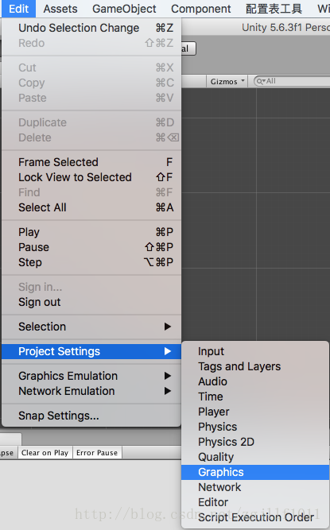
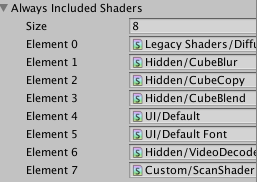

自己写了个shader，并且是从代码里面来进行加载，编辑器中并没有引用。在编辑器中运行项目没有问题，但是当我发布到iso和android平台之后发现游戏中并不能找到我自己的shader，猜想是unity在打包过程中进行了一些优化，没有用到的shader不会被打到游戏包内。

我找到了2个解决办法

1\.随意创建一个物体并添加使用了此shader的材质。并不推荐此方法，正确的方法应该是第二种。

2\.在GraphicsSettings中添加上此shader：

选择Edit->ProjectSettings->Graphics （不同的unity版本可能有所不同，我的版本是5.6）

将shader拖入到Always Included Shaders数组中：

这样我们重新打包之后，就可以正常找到shader了。