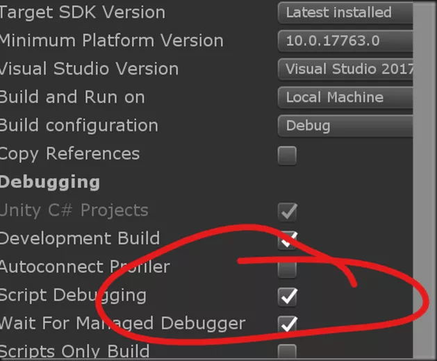

# vs2019 调试unity失效

s怎么启动调试都无法关联到unity，后来发现自己应该是不小心把attach editor勾选掉了，

注意这里要重启unity才会生效。勾选上之后就可以调试了。

# Unity3D 编辑器调试无响应问题

使用 VS 在 Unity 编辑器中调试代码，点击 VS 的 `附加到 Unity`，Unity 编辑器按下 `Play` 之后，就会一直等待并且无其他响应，只能结束 Unity 进程。

## 原因分析

经过分析与测试，发现去掉代码中一个单例类的析构方法中的断点即可调试了，具体原因未知。

再测试了一下，在那个单例类的构造、析构方法中分别打断点，如下表：

| 测试 | 构造 | 析构 | 结果  |
| -- | -- | -- | --- |
| 1  |    |    | 可调试 |
| 2  | \* |    | 可调试 |
| 3  |    | \* | 无响应 |
| 4  | \* | \* | 无响应 |

> 表中 `*` 代表打断点

可发现只要在那个单例类的析构中打断点就会造成 Unity 无响应。

## 解决办法

删除析构方法中的断点，或者所有断点，再调试。

# 关于如何进行unity远程debugger

-   首先打开unity的debug模式

-   开启visual sudio中找到attach unity debugger

