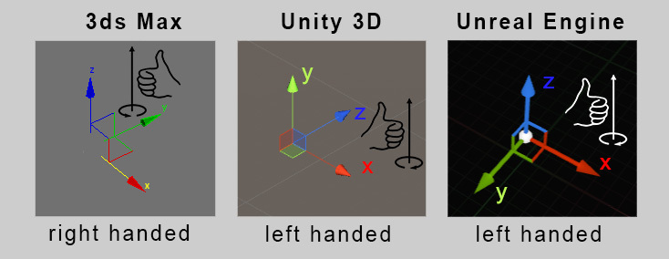
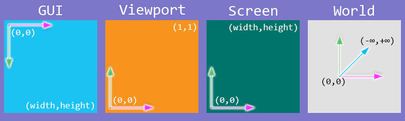
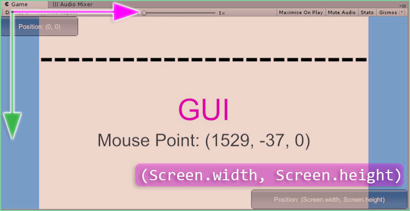
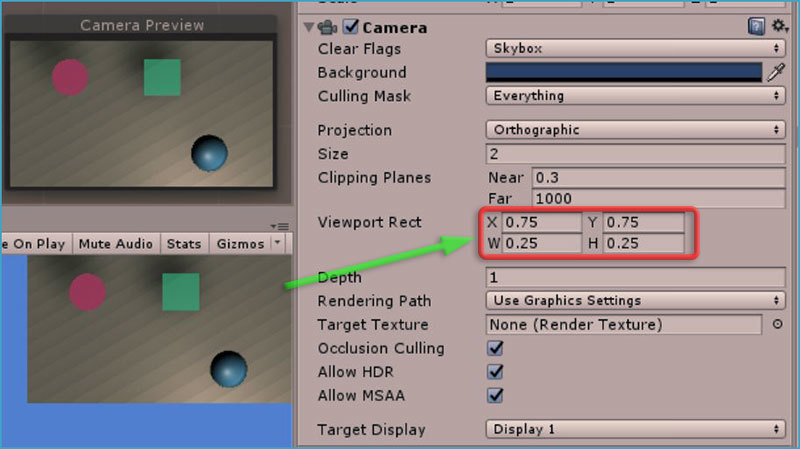
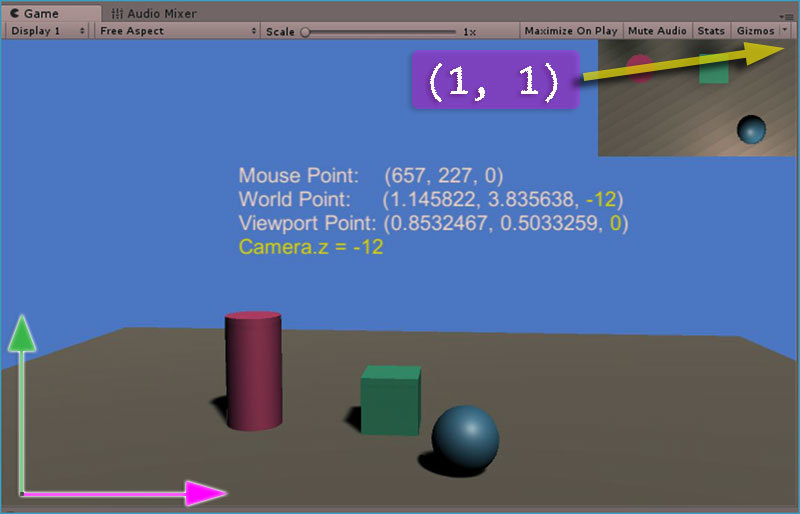
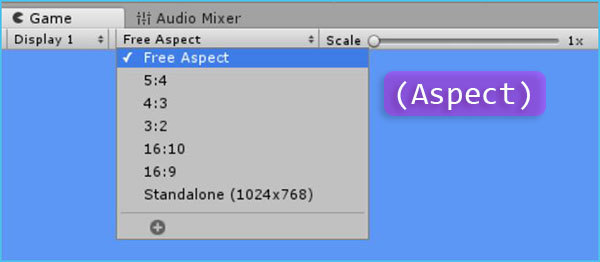
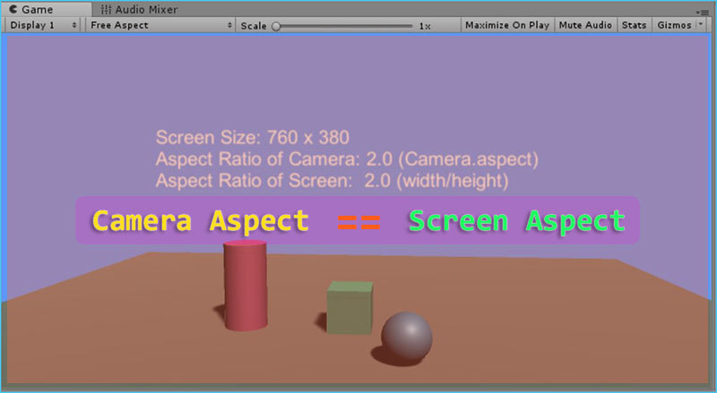
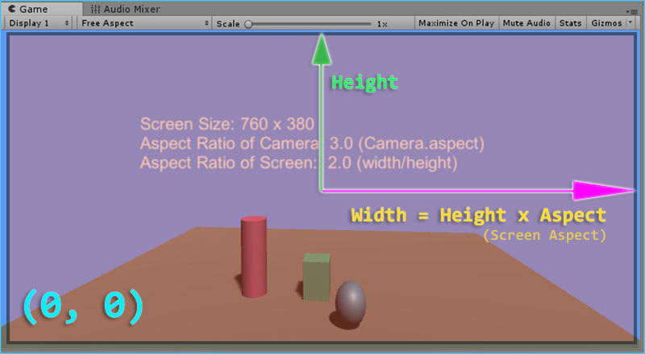
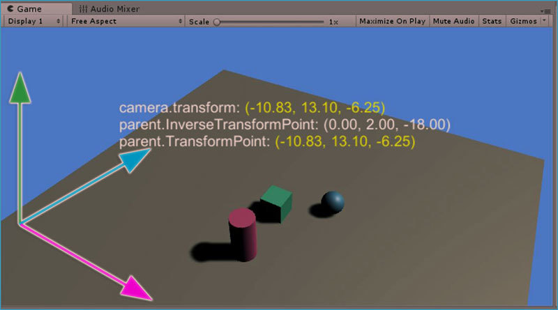

## 一、前言

刚开始接触 Unity3D 的时候，经常会被 Unity 中各种坐标系搞得昏头转向不知所措，毕竟是一个 3D 兼 2D 游戏开发殷勤，还要把 3D 作品最终发布到 2D 的桌面或者手机系统中，所以熟悉掌握 Unity3D 中的坐标系是非产重要的。

其实如果仅仅只有 3D 坐标系还是很简单的，就目前来说我们所见过的三维建模软件或者游戏开发软件所用的坐标系分两种：左手坐标系和右手坐标系。怎么区别呢？大家看下图就知道了：



区分坐标系可以按上图方法，这里我也有个简单的判断方法：用手握住 z 轴，大拇指朝向 z 轴正方向，然后用手的四指从 x 轴正方向握拳头，如果是左手 90 度就能把四指握到 y 轴就是左手坐标系，如果是右手 90 度握紧后到了 y 轴就是右手坐标系。

除了 3D 世界中的坐标系，还有其他的几个坐标系也非常常用，比如我们经常要把世界三维坐标系转换成我们最终屏幕中的二维坐标系，或者把手机屏幕的二维坐标系转化成游戏世界中的三维坐标系等，各个坐标系各有特别，不能混用，为了更好的学习 Unity 游戏开发，自己在此总结一下 Unity 当中的坐标系和相关用法，以作备忘和学习。

## 二、坐标体系

Unity3D 当中基本的坐标体系主要有下面这四种：

1. 世界坐标系 (World Space)

2. 屏幕坐标系 (Screen Space)

3. 视口坐标系 (Viewport Space)

4. GUI界面坐标系 (GUI System)



这四种坐标系可以说没有一个是完全相同的，各个坐标系所代表的意思也可以从字面含义中理解出来，它们之间都是可以相互转换的，不过 GUI 坐标体系除外，它比较特殊，也相对来说是最简单的，那么我们就从最简单的说起吧。

**1\. 绘制 GUI 界面的坐标体系**

我们在做 Unity 游戏开发的时候，经常会使用内置的 GUI 来做一些测试，比如显示一个按钮控制游戏，画一个文本显示相关信息等。它的代码全部控制在 `OnGUI()` 函数中：

```javascript
private void OnGUI()
{
    if (GUI.Button(new Rect(0f, 0f, 160f, 40f), "Click Me"))
    {
        //button clicked and do something here...
    }
}
```

这个按钮 `Button` 所在的坐标系就是 GUI 绘制坐标系。大家稍微测试一下就知道了，它的原点 `(0, 0)` 在最左上角，因为屏幕宽度是 `Screen.width` ，高度是 `Screen.height` ，所以 GUI 体系右下角的坐标为： `(Screen.width, Screen.height)` , 这是一个二维的坐标体系，坐标 `z` 的值都为 0 。大家可以看下图加深理解：



**2\. 视口 Viewport 坐标体系**

当我们使用多个相机，在同一个场景中显示多个视口的时候，我们就需要用上视口坐标系了。

视口坐标系对于场景的显示非常重要，对于新手来说我们经常使用一个相机就够了，但是当需要使用到多个视口的时候，我们就必须关注视口坐标体系了，大家可以在相机 `Camera` 的属性中看到 `Viewport Rect` 就是视口坐标系的设置：



一个相机对应一个视口，视口预览（ Camera Preview ）展示了相机所看到的所有物体，很显然，它默认大小是 `(width = 1, height = 1)` ，位置也是从 0 到 1 ，这个位置就是我们所讨论的坐标系：左下角为 `(0, 0)` ，右上角是 `(1, 1)` ，一般视口坐标系主要用在相机显示中，我们简单的进行 `Viewport Rect` 的设置就可以了。

另外，新手朋友们可以记住这么一个快捷键： `Ctrl + Shift + F` ，可以快速设置相机视口到当前场景窗口的视口位置。下图是视口坐标系和鼠标在屏幕上的坐标系的转换结果：



**3\. 屏幕 Screen 坐标体系**

嗯，非常重要！不管怎样，最终我们所有的成果都会发布到各个平台（屏幕）上，所以，任何坐标系的坐标和屏幕坐标系的转换都是非常重要的。比如我们经常需要处理鼠标的相关事件（鼠标位置、单击、双击事件等），或者手机上的触摸反馈，这些原始数据都是屏幕坐标系相关的。

虽然重要，其实屏幕坐标系处理起来很简单直接， `Input.mousePosition` 获取的就是鼠标在屏幕中的位置坐标。大家可以测试一下，屏幕坐标系中原点 `(0, 0)` 位于左下角，那么右上角必然就是 `(Screen.width, Screen.height)` ，对了，还有一个 `z` 呢？都为 0 吗？答案是肯定的，既然是二维坐标系那么 `z` 肯定是 0 了，和 GUI 坐标系一样，但是话又说回来，屏幕坐标系转换成世界坐标系 `z` 还是 0 吗？其实不然，屏幕坐标转换成世界坐标后物体的 `z` 值是取决于相机的，因此： `gameObject.z = camera.z` ，其实在上面视口坐标系介绍中的图中我已经把 `Mouse Point` 鼠标位置转换成世界坐标（ `World Point` ）了，大家应该注意到了吧。

那么，除了坐标系的转换，还有什么值得注意的呢？这里我要告诉大家的是，我们在控制相机的时候，因为屏幕显示的就是相机所看到的内容，而**屏幕的宽高比直接影响了相机的显示**，也就是 `Aspect Ratio` 的值，大家可以在 Game 面板中轻松地设置 `Aspect` 宽高比，查看对游戏画面的影响：



如下图，相机的宽高比和屏幕宽高比一致，显示结果也一致：



如果相机的宽高比设置的和屏幕宽高比不一样的话，显示结果就有点不同了：



所以，在游戏开发中，\*\*我们要重视相机的宽高比 \*\*`Camera.aspect` 的值，一般我们会保持相机宽高比不变，然后通过改变相机的视口尺寸 `Camera.orthographicSize` 来显示场景中需要显示的物体，关于这个主题我会在我的下一篇文章中提到，大家可以关注我的博客。如何通过宽高比获取摄像机视口尺寸呢？首先可以从上图中知道宽高比的计算方法： `aspect = width / height` ，当你同时获取到 `width` 和 `height` 的时候，你通过 `Mathf.Max(height, width / aspect)` 来得出最终的尺寸大小（*注意这个结果是 2 倍视口尺寸哦*）。这个在游戏场景中应用的还是比较多的，比如你有这么个需求：两个玩家移动对战，你的相机要把两个移动的玩家随时放置在屏幕显示中。

**4\. 世界 World 三维坐标系**

最后，世界坐标系！世界坐标系不是最简单的，但却是我们最常用的坐标系。记住一点，任何情况下： `transform.position` 都是返回物体的世界坐标值，及时你所使用的是子物体！另外，从上面所讲的屏幕坐标系转换成世界坐标系也是非常简单的，它以当前相机为参考：

```javascript
var position = Input.mousePosition;
var worldPoint = Camera.main.ScreenToWorldPoint(position);
```

另一方面，我们在游戏开发过程中，经常要处理**子物体**的相对 `transform` 值，这个时候我们就需要稍微动点脑子了，当然如何转变 Unity 已经帮我们预制好相应的函数方法了，你只要**把父物体当做世界，子物体当做世界中的物体**，使用这些函数，换一下坐标就和处理绝对坐标一样了，不知道大家理解没有。我举个例子，我们在游戏开发中会遇到这种情况，你的相机如果直接放到世界中那么必然会需要调整它的旋转角度才能达到满意的视口位置，如何不让相机产生任何旋转就能把世界中的游戏物体放到合适的视口位置呢？

办法就是：我们**把相机放到一个产生了合适旋转角度的父物体当中！这样做的效果就是：相机就相当于子物体，父物体旋转了，子物体就不需要额外旋转了，这时候相机的**局部旋转就为 0 。这在有些场景中使用起来很方便，相机已经是父物体世界中的子物体了。



怎么计算相对坐标呢？在 Unity 中都有相应的函数，使用比较简单：

```javascript
//获取的是世界坐标
var childPosition = childObject.transform.position;
//转化为父物体下的相对坐标，相当于位于父物体世界中
var relativePosition = parentObject.transform.InverseTransformPoint(childPosition);
//转化为世界坐标，注意：这里不能传入 childPosition ，因为 childPosition 就是世界坐标
var worldPosition = parentObject.transform.TransformPoint(relativePosition);

//所以，下面结果是相等的！
print(childPosition == worldPosition);
```

## 三、总结

当然，在使用坐标系过程中我们还要关注其他方方面面，比如欧拉角的旋转，万向锁，平滑过渡视野等等，这些我想我会在后面的文章总结中写道吧。这次就总结介绍了这几个坐标系，看上去有点复杂，总体来说还是挺很好理解的，有什么不对的或者可以加强的请给我留言，谢谢！