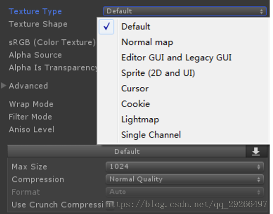
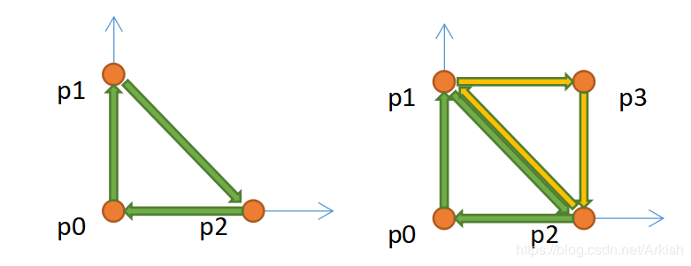
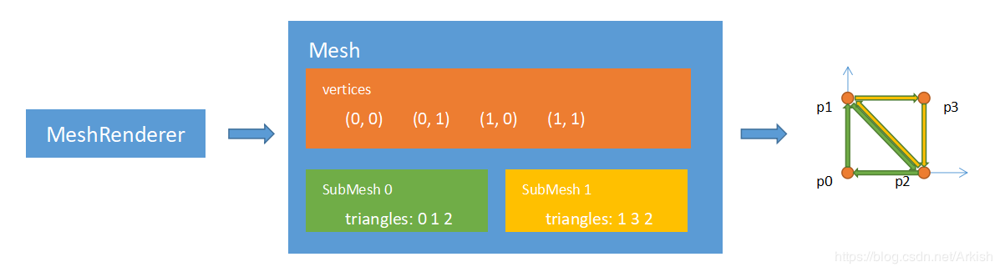
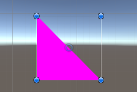
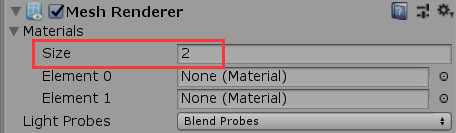
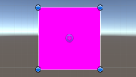
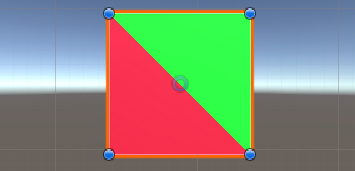

***

## title : "Mesh renderer 和 Mesh 和 Mesh Filter"

# 基本概念

- **Meshes** 是Unity的主要图形基元。 它们定义对象的形状。

- **Materials** 通过包含对所用纹理的引用、平铺信息、颜色色调等来定义表面应使用的渲染方式。材质的可用选项取决于材质使用的着色器。

- **Shaders** 是一些包含数学计算和算法的小脚本，根据光照输入和材质配置来计算每个像素渲染的颜色。

- **Textures** 是位图图像。材质可包含对纹理的引用，因此材质的着色器可在计算游戏对象的表面颜色时使用纹理。除了游戏对象表面的基本颜色（反照率）之外，纹理还可表示材质表面的许多其他方面，例如其反射率或粗糙度。

## Texture



- [Default](https://docs.unity3d.com/Manual/TextureTypes.html#Default)

- [Normal Map](https://docs.unity3d.com/Manual/TextureTypes.html#NormalMap) 法线贴图就是在原物体的凹凸表面的每个点上均作法线，通过RGB颜色通道来标记法线的方向，你可以把它理解成与原凹凸表面平行的另一个不同的表面，但实际上它又只是一个光滑的平面

- [Editor GUI and Legacy](https://docs.unity3d.com/Manual/TextureTypes.html#Editor)

- [Sprite (2D and UI)](https://docs.unity3d.com/Manual/TextureTypes.html#Sprite)

- [Cursor](https://docs.unity3d.com/Manual/TextureTypes.html#Cursor)  光标文件

- [Cookie](https://docs.unity3d.com/Manual/TextureTypes.html#Cookie) 聚光灯贴图

- [Lightmap](https://docs.unity3d.com/Manual/TextureTypes.html#Lightmap)  光照贴图

- [Single Channel](https://docs.unity3d.com/Manual/TextureTypes.html#SingleChannel)

# Mesh

- 顶点坐标（vertex） 顶点坐标数组存放Mesh的每个顶点的空间坐标，假设某mesh有n个顶点，则vertex的size为n

- 三角形序列（triangle） 每个mesh都由若干个三角形组成，而三角形的三个点就是顶点坐标里的点，三角形的数组的size = 三角形个数 \* 3.

- 法线（normal） 法线数组存放mesh每个顶点的法线，大小与顶点坐标对应，normal\[i\]对应顶点vertex\[i\]的法线.它不仅说明了`面片的朝向，还可用于计算光照模型`。

- 次法线 (subnormal)

- 纹理坐标（uv） 它定义了图片上每个点的位置的信息. 这些点与3D模型是相互联系的, 以决定表面纹理贴图的位置. UV就是将[图像](http://baike.baidu.com/view/42116.htm)上每一个点精确对应到模型物体的表面. uv\[i\]对应vertex\[i\]

- 切线 (tangent) 切线是垂直于法线的一条向量，由于垂直于法线的向量有无数条，所以切线最终规定为由UV坐标来决定朝向。

例如：左图利用三个点绘制了一个三角形，而右图则通过两个三角形得到了一个四边形：



注：这里需要注意的是，很明显从左图中给定的三个点，有两种方式可以得到三角图元，即

- 顺时针旋转（也称左手螺旋）：p0->p1->p2

- 逆时针旋转（右手螺旋）：p0->p2->p1

它们的区别在哪里呢？类似于物理中左右手判断法则，拇指指示了三角图元的法线方向。法线其中一个作用是指明了三角图元的方向，如果从反方向看的话，这个图元是不可见的。而unity3d是左手坐标系在渲染时默认只渲染正面，背面是看不见的。

那么要绘制上图中的三角形，即问题在于表达三个点的坐标，也就可以表示为下面的代码：

```
Vector2[] vertices = new Vector2[]{ 
	new Vector2( 0, 0 ),							// p0
	new Vector2( 0, 1 ),							// p1
	new Vector2( 1, 0 ),							// p2
 };
```

而如果要绘制四边形，也就需要六个点的坐标，如下面所示：

```
Vector2[] vertices = new Vector2[]{ 
	// 三角图元 0
	new Vector2( 0, 0 ),							// p0
	new Vector2( 0, 1 ),							// p1
	new Vector2( 1, 0 ),							// p2
	// 三角图元 1
	new Vector2( 0, 1 ),							// p1
	new Vector2( 1, 1 ),							// p3
	new Vector2( 1, 0 ),							// p2
 };
```

如果单纯使用顶点来表示（绘制）图形，是非常直观的——因为我们知道每一个顶点的位置信息，并且知道每三个点构成一个三角图元。然而从上面绘制四边形的数据中可以发现，三角图元1中有两个顶点的位置信息（p1和p3）和三角图元0是一样的。这也就增加了一些开销。

总而言之，这个额外的存储开销是完全可以去除的，方法就是使用索引（Indices）。

```
Vector2[] vertices = new Vector2[]{ 
	new Vector2( 0, 0 ),							// p0
	new Vector2( 0, 1 ),							// p1
	new Vector2( 1, 0 ),							// p2
 };
 int[] indices = new indices[]{
 	0, 1, 2											// 表示 0->1->2 构成一个三角图元
 };
```

没错，indices就是这么一回事，原来是vertices数组中，每三个顶点表示一个三角图元，现在是indices数组中，每三个整型表示一个图元。这些整形不存储真正的数据，`只有用到时才从vertices中取出，也就是所谓的索引了`。

# SubMesh

面提到过，MeshRenderer负责对MeshFilter中的Mesh进行绘制，而绘制依赖于着色器，或者说着色器生成的材质（Material）。简单来说，材质具体描述了Mesh中的数据如何进行绘制。
Material只负责一个Mesh的一次绘制，但是现在有一个要求是，Mesh的不同部分，要求使用不同的材质。例如上面所绘制的四边形，两个三角面片要求绘制出不同的颜色。这个时候就需要使用SubMesh了。
从名字也能看出，SubMesh类似于Mesh，并且Mesh包含SubMesh。但是和Mesh不一样的是，SubMesh只有triangles信息，也就是说SubMesh使用自身的 triangles信息，索引找到 Mesh上的顶点信息（如vertices、 uv、normal等）后进行三角面片的绘制。它们的关系如下图所示：



这个设置的过程依赖于Mesh中的API是 SetTriangles，其函数原型为：

```
/*
 @parm triangles: 			SubMesh的triangles
 @parm submesh: 			属于Mesh中的第几个submesh
 @parm calculateBounds：	是否计算包围盒，默认为true。设置为false会使用当前存在的包围盒以减少CPU开销
 @parm baseVertex：			triangles中每一个元素的偏移值，默认为0；
*/
public void SetTriangles(int[] triangles, int submesh, bool calculateBounds = true, int baseVertex = 0);
```

用法如下：

```
Vector3[] vertices = new Vector3[]{
	     new Vector3( 0, 0, 0 ),
	     new Vector3( 0, 1, 0 ),
	     new Vector3( 1, 0, 0 ),
	     new Vector3( 1, 1, 0 ),
	};
	int[] subTriangles_0 = new int[]{
		0, 1, 2
	};
	int[] subTriangles_1 = new int[]{
		1, 3, 2
	};
	Mesh mesh = new Mesh();
	mesh.vertices = vertices;
	// 告诉 Mesh它将会有两个SubMesh
	mesh.subMeshCount = 2;
	mesh.SetTriangles( subTriangles_0 , 0 );
	mesh.SetTriangles( subTriangles_1 , 1 );
	// 重新计算normal信息，不然后面的 material会不起作用
	mesh.RecaculateNormals();
	// MeshFilter
	MeshFilter meshFilter = GetComponent<MeshFilter>();
	if( meshFilter == null ) meshFilter = gameObject.AddComponent<MeshFilter>();
	meshFilter.mesh = mesh;
	// MeshRenderer
	MeshRenderer meshRenderer = GetComponent<MeshRenderer>();
	if( meshRenderer == null ) gameObject.AddComponent<MeshRenderer>();
```

将上述代码挂载到一个空节点上运行，可以得到以下结果：



嗯？！难不成笔者在骗人，这里明明只有一个三角面片。莫慌，之前不是说过，要求两个三角面片使用不同的材质吗？如果运行时，将MeshRenderer的Material的Size设为2的话，你会发现另外一个三角图元也出现了：





也就是说，有多少个SubMesh，就需要有多少个Material，并且它们的绘制关系是一一对应的。即第一个SubMesh使用第一个
Material绘制，第二个SubMesh使用第二个Material绘制，以此类推。为了验证这个，接下来创建两个默认的Material，将它们的Albedo分别设置为红色和绿色，接着运行时将这两个 Material赋给MeshRenderer，将会得到如下图所示的运行结果：



另外，如果双击 MeshFilter的 Mesh属性，从下面的预览窗口，也能看到这个Mesh有两个SubMesh：


> 如何在unity显示线框图
> 选择场景视图在其工具栏左侧的显示模式。前三个选项是阴影线框和阴影线框。

# MeshCombine

MeshCombine，就是合并网格。

为什么好好的模型要进行网格的合并呢？

如果从应用的角度来看的话，通过网格合并可以实现游戏中的换装，你可能会说，更换的服装例如帽子好好的，为什么要合并到人物模型上？

问题在于，如果游戏中不是所有人物模型都是标准的人型呢？例如魔兽世界中，不同种族的头部模型大小是不一致的，很容易出现穿模。当然可以同一顶帽子制作适配于不同种族的模型，反正这个工作是美术做的（溜）。但是从整体出发的话，这样做无疑增加了游戏容量的大小，也会减慢游戏开发的进度，同时一定程度上影响代码的简洁性。

但是通过网格合并，将帽子的网格合并到人物模型上，并且蒙皮至人物头部的骨骼上。这样以后，由于骨骼的大小、旋转、位移信息会影响顶点，因此一旦这个帽子戴到别的人物模型身上时，由于它们头部骨骼的大小不一样，那么帽子也会自动变大。也就达到了同一个模型，适用于多个人物模型的目的。
（关于骨骼、蒙皮、骨骼蒙皮动画，可以参考下面的扩展资料）

关于网格合并，同样Unity在 Mesh提供了相关的API：

```
/*
 @parm combine: 			要进行合并的CombineInstance实例
 @parm mergeSubMeshes: 		是否将SubMesh进行合并，true为将SubMesh进行合并，false表示以SubMesh的形式存在
 @parm useMatrices: 		是否应用定义在CombineInstance中的transform信息
 @hashLightmapData: 		如果为true，则应用CombineInstance中的lightmapScaleOffset对mesh中的lightmapUV进行偏移
*/
public void CombineMeshes(CombineInstance[] combine, bool mergeSubMeshes = true, bool useMatrices = true, bool hasLightmapData = false);
```

要使用它也很简单，如下面的代码所示：

```
 // 收集要合并的物体的所有Mesh信息
        MeshFilter[] childMeshFilters = GetComponentsInChildren<MeshFilter>();

        CombineInstance[] destCombineInstances = new CombineInstance[childMeshFilters.Length];
        for ( int i = 0; i < childMeshFilters.Length; i++)
        {
            destCombineInstances[i] = new CombineInstance();
            destCombineInstances[i].mesh = childMeshFilters[i].mesh;
            destCombineInstances[i].transform = childMeshFilters[i].transform.localToWorldMatrix;

            // 隐藏子物体，或者Destory
            childMeshFilters[i].gameObject.SetActive(false);
        }
        Mesh destMesh = new Mesh();
        // 进行合并
        destMesh.CombineMeshes(destCombineInstances, true);
        destMesh.RecalculateNormals();

        // 将合并后的mesh赋给当前的MeshFilter
        MeshFilter meshFilter = GetComponent<MeshFilter>();
        if (meshFilter == null) meshFilter = gameObject.AddComponent<MeshFilter>();
        meshFilter.mesh = destMesh;

        MeshRenderer meshRenderer = GetComponent<MeshRenderer>();
        if( meshRenderer == null)
        {
            meshRenderer = gameObject.AddComponent<MeshRenderer>();
            // 设置MeshRenderer的material
            Material material = new Material(Shader.Find("Standard"));
            meshRenderer.material = material;
        }
```

## mesh合并的优缺点

- 静态批处理后，对内存的增加是非常大的，动则就是几十兆的内存

- 动态批处理，对于合批要求挺多的，同时可能存在，动态合批消耗过大，得不偿失

- 自己在逻辑代码里面进行动态合批，对于mesh的readwrite属性是要求开启的，这无疑也增大了内存的占用，复杂的合批处理可能会消耗更多的cpu时间

- GPU Instancing可以一次渲染(render)相同网格的多个副本，仅使用少量[DrawCalls](https://link.zhihu.com/?target=https%3A//docs.unity3d.com/Manual/DrawCallBatching.html)。在渲染诸如建筑、树木、草等在场景中重复出现的事物时，GPU Instancing很有用。将这些静态的物件如植被等全部从场景中剔除，而保存其位置、缩放、uv偏移、*lightmapindex*等相关信息，在需要渲染的时候，根据其保存的信息，通过***Instance***来渲染，这能够减少那些因为内存原因而不能合批的大批量相同物件的渲染时间

# 相关链接

- <https://zhuanlan.zhihu.com/p/96084686>

- <https://docs.unity.cn/cn/2018.4/Manual/class-Mesh.html>

- <https://docs.unity.cn/cn/2020.1/Manual/Shaders.html>

- <https://learnopengl-cn.github.io/>

- <https://blog.csdn.net/Arkish/article/details/98482430>

- <https://blog.csdn.net/tw_345/article/details/79771454>

- <https://zhuanlan.zhihu.com/p/96084686>

- <https://blog.csdn.net/ecidevilin/category_9266800.html>