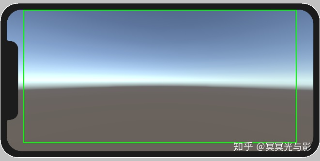
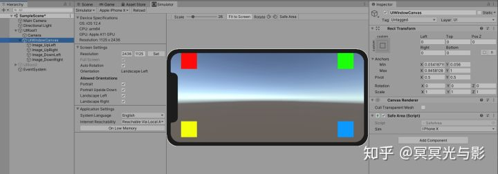
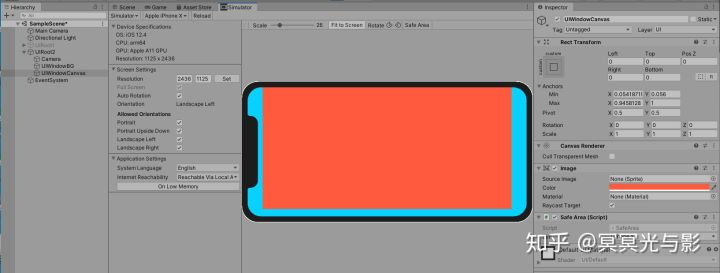
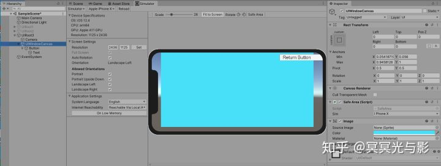
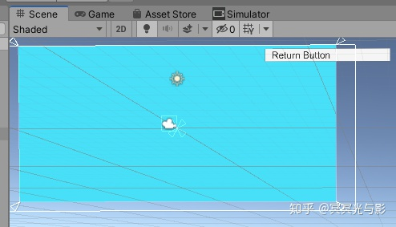

Screen.safeArea会返回移动平台安全区的Rect。例如，iPhoneX（2436x1125px）横屏时，Screen.safeArea返回的值为Rect（132，63，2172，1062）。如图：



适配思路：以界面为单位，打开界面时，获取当前设备的safeArea，调整界面的锚点，进行适配。以下利用SafeArea.cs脚本，对当前window进行适配。主要考虑三种情况：

情况1：UI中没有全屏背景



解决思路：直接调整当前window的锚点，进行适配。

情况2：UI中有全屏背景



解决思路：把背景分离到window之外，只对当前window进行适配，对背景不做处理。为了方便适配，我们可以把背景单独做成window，在UI框架中对window和背景进行分开管理。上图中，蓝色为背景图片，红色为适配的window。

情况3：适配需要靠边的UI(例如侧边的聊天弹窗等)





解决思路：把需要靠边的按钮拉伸到屏幕之外，达到适配效果。

[jirowang0409/Garena: Projects in Garena (github.com)](https://github.com/jirowang0409/Garena)

# notch solution

首先分为两个component.

- [SafePadding](https://exceed7.com/notch-solution/components/ui-behaviour/safe-padding.html)Works with `RectTransform` tree of the uGUI component system.

- [SafeAdaptation](https://exceed7.com/notch-solution/components/adaptation/safe-adaptation.html)They are based on using [Playables API](https://docs.unity3d.com/ScriptReference/Playables.Playable.html) to control `GameObject` with animation playables, therefore utilizing `Animator` and `AnimationClip` instead of `RectTransform`.

## 原理

```
        protected Rect SafeAreaRelative
            => NotchSolutionUtility.ShouldUseNotchSimulatorValue ? storedSimulatedSafeAreaRelative : NotchSolutionUtility.ScreenSafeAreaRelative;
```

我们看这句,如果是使用了模拟器,则使用simulatedSafeAreaRelative

```
        void INotchSimulatorTarget.SimulatorUpdate(Rect simulatedSafeAreaRelative, Rect[] simulatedCutoutsRelative)
        {
            this.storedSimulatedSafeAreaRelative = simulatedSafeAreaRelative;
            this.storedSimulatedCutoutsRelative = simulatedCutoutsRelative;
            UpdateRectBase();
        }
```

在Editor代码中如果改变了模拟器的环境.则会更改该值

而生产环境中则会使用NotchSolutionUtility.ScreenSafeAreaRelative,他也是通过Screen.safeArea进行判断的

```
        internal static Rect ScreenSafeAreaRelative
        {
            get
            {
                Rect absolutePaddings = Screen.safeArea;
                cachedScreenSafeAreaRelative = ToScreenRelativeRect(absolutePaddings);
                cachedScreenSafeArea = absolutePaddings;
                safeAreaRelativeCached = true;
                return cachedScreenSafeAreaRelative;
            }
        }
```

## safepadding