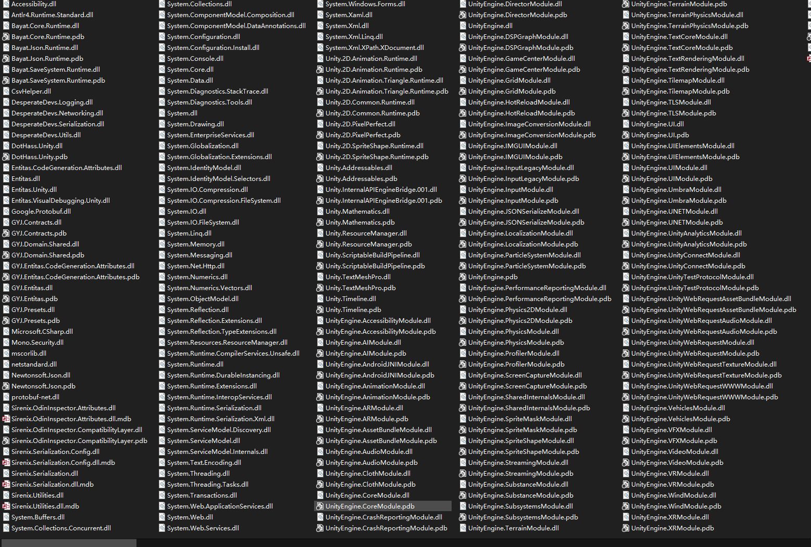
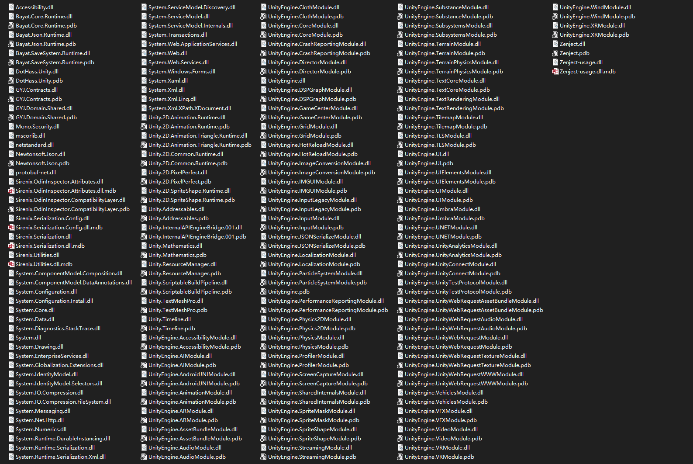
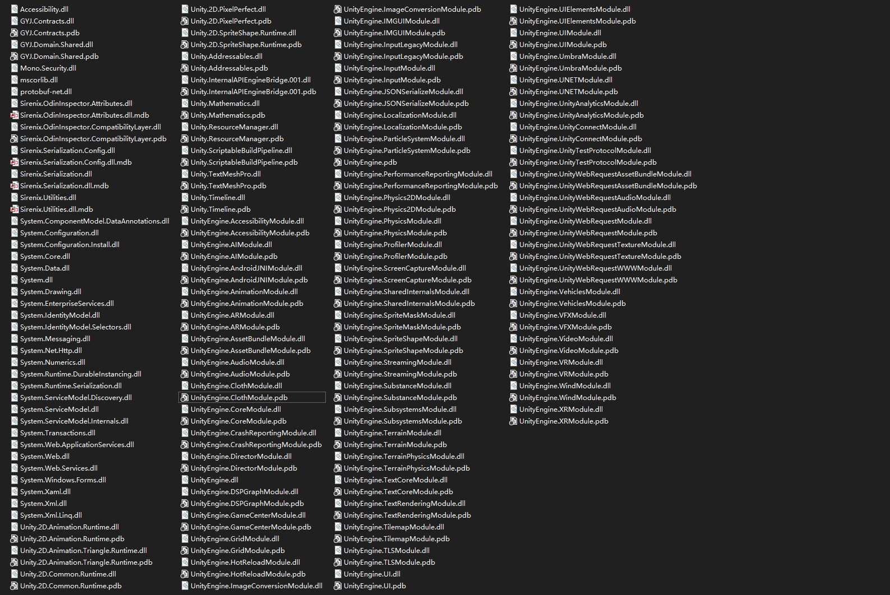
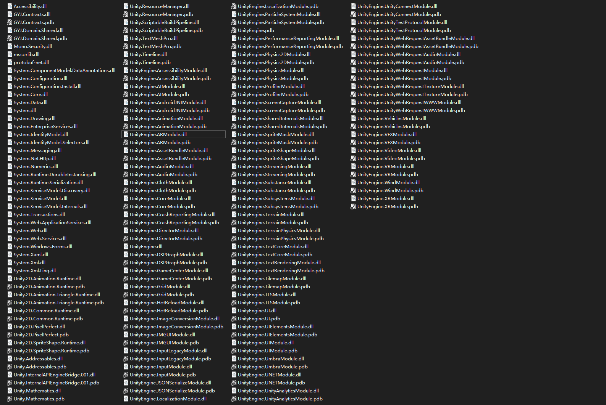
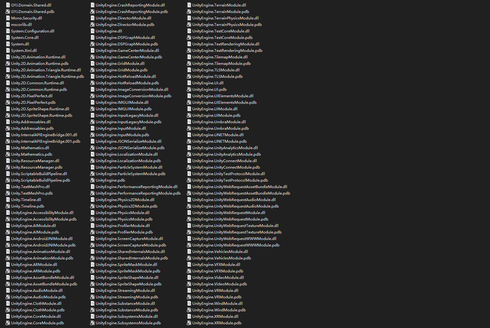
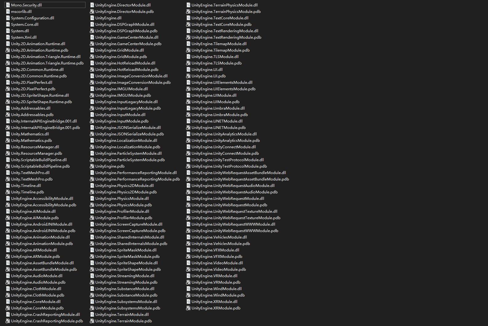

全部的

shared模块+contract模块+Odin模块+Json模块+dothassunity模块

shared模块+contract模块+Odin模块+Json模块

shared模块+contract模块+Odin模块

shared模块+contract模块

只有shared模块

空项目

我们看到包含了form等模块

[c# - Can I remove System.Windows.Forms.dll referenced by protobuf-net - Stack Overflow (stackoverflow.com)](https://stackoverflow.com/questions/39161798/can-i-remove-system-windows-forms-dll-referenced-by-protobuf-net)

不过不用担心,使用il2cpp都会被切割
