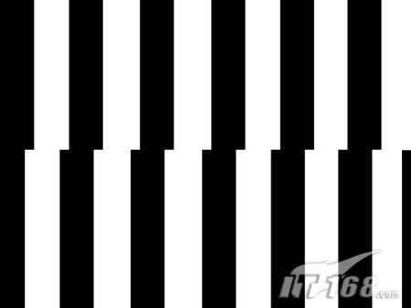
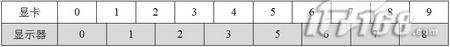

# 垂直同步

在显示一帧画面时，显卡先从显示缓冲取数据刷新到显示器存储器上，然后，显示器从左上到右下，逐行显示到屏幕上。

显示器每画完一行发出一个水平同步信号，画完所有行发出一个垂直同步信号。

若显示器刷新率是75，那么发出一个垂直同步信号后会等待1/75秒，然后重新执行上述步骤。

游戏中的开启垂直同步，意思是指显卡等待到一个垂直同步信号后才开始工作，向显示缓冲绘制数据。

如果我们选择等待垂直同步信号（也就是我们平时所说的垂直同步打开），那么在游戏中或许强劲的显卡迅速的绘制完一屏的图像，但是没有垂直同步信号的到达，显卡无法绘制下一屏，只有等75单位的信号到达，才可以绘制。这样FPS自然要受到操作系统刷新率运行值的制约。

而如果我们选择不等待垂直同步信号（也就是我们平时所说的关闭垂直同步），那么游戏中作完一屏画面，显卡和显示器无需等待垂直同步信号就可以开始下一屏图像的绘制，自然可以完全发挥显卡的实力。但是不要忘记，正是因为垂直同步的存在，才能使得游戏进程和显示器刷新率同步，使得画面更加平滑和稳定。取消了垂直同步信号，固然可以换来更快的速度，但是在图像的连续性上势必打折扣。这也正是很多朋友抱怨关闭垂直后发现画面不连续的理论原因。

开启垂直同步时

若游戏的实际显示帧速大于60，显卡就可以在显示器等待的1/60内完成绘制，显示一个无撕裂的画面。此时，游戏的帧速被限制为60。

若游戏的实际显示帧速小于60，显卡无法在在显示器等待的1/60内完成绘制，假如游戏帧速50，那么显卡每2个显示器帧才向显示器刷新一次数据，此时，游戏帧速掉为30。

关闭垂直同步时

若游戏的实际显示帧速大于60，显卡刷新显示缓冲的速度比显示器快，出现跳帧以及撕裂。

（1）画面撕裂

假设游戏中有一面黑白相间的栅栏墙高速向左运动，显示器设定的刷新率是100Hz，游戏运行速度为200FPS，则显示器扫描第1帧图像至屏幕垂直方向中点时，显卡已经将第2帧图像送了过来，由于栅栏墙高速向左运动，第2帧图像已经左移了一段距离，最终显示的图像如图（图01）。

||
|-|
|图1|

CS 1.5、Quake等大多数PC游戏在关闭垂直同步后都会有这种现象产生。如果你的电脑上装有CS 1.5游戏，不妨自己证实一下：关闭垂直同步后进入游戏，按下键盘上的左箭头"←"让视角匀速转动，是不是看到了"画面撕裂"的现象？打开垂直同步后做相同的测试，画面是不是清爽了许多？

（2）跳帧

假如显示器设定的刷新率是80Hz，显卡以100FPS循环显示0-9数字，那么，在开始的0.1秒内，显卡显示了10个数字而显示器只刷新了8次，最终你看到的图像很可能是这样的：（表格如图02）
可见，由于显示器刷新率跟不上游戏的FPS，只能舍弃一部分画面，这种现象表现在游戏里就是跳帧。鬼武者3等一些移植到PC上的游戏在关闭垂直同步时通常会出现这种问题。

||
|-|
|图2|

通过以上的了解，我们认识到，要想在游戏中获得更好的画质，垂直同步一定要开！正是由于垂直同步的存在，游戏才会有完整、稳速、不跳帧的画面。套用一句广告语来说："自从开了垂直同步后，画不破了，帧不跳了，头也不眩晕了。"

# 省电发热优化

如果你的游戏跑到60帧,手机很热..这个时候首先想到的是降低帧率,

安卓上:

```
1. [QualitySettings](https://docs.unity3d.com/2020.2/Documentation/ScriptReference/QualitySettings.html).vSyncCount = 0 关闭垂直同步..手动设置帧率..    Application.targetFrameRate = 30;  注意这样可能出现跳帧
2. [QualitySettings](https://docs.unity3d.com/2020.2/Documentation/ScriptReference/QualitySettings.html).vSyncCount = 1 这个时候 Application.targetFrameRate无效...每帧等待垂直同步
3. [QualitySettings](https://docs.unity3d.com/2020.2/Documentation/ScriptReference/QualitySettings.html).vSyncCount = 2 这个时候 Application.targetFrameRate无效...每一秒内等待垂直同步??不好翻译..大概意思是如果平台的默认渲染速率是每秒60帧，而vSyncCount设置为2，则游戏将以每秒30帧为目标。
```

iOS:

iOS忽略[QualitySettings](https://docs.unity3d.com/2020.2/Documentation/ScriptReference/QualitySettings.html).vSyncCount,ios是根据vblank(垂直同步)显示帧(如果有的话)..他的意思就是如果ios的垂直同步是每秒60帧...在刷新垂直同步的时候,如果存在显卡的帧的时候则会显示帧..不存在.则不显示...所以 Application.targetFrameRate是起作用的

以上仅参考文档推测...未进行验证....如有意外概不负责

- [Unity - Scripting API: Application.targetFrameRate (unity3d.com)](https://docs.unity3d.com/2020.2/Documentation/ScriptReference/Application-targetFrameRate.html)

- [Unity - Scripting API: QualitySettings.vSyncCount (unity3d.com)](https://docs.unity3d.com/2020.2/Documentation/ScriptReference/QualitySettings-vSyncCount.html)

- 