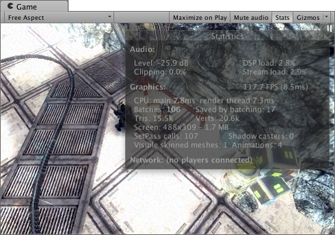
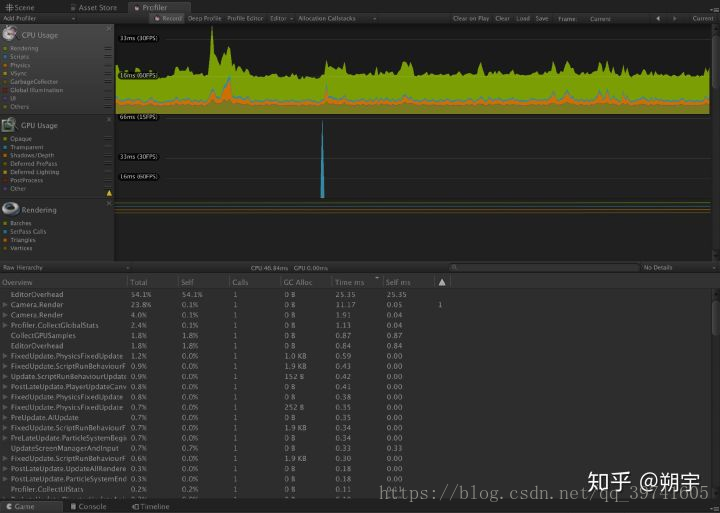

# 资源检查

首先第一部分.我们要注意在平时工作中需要注意哪些地方养成一套流程规范.避免出现已经被总结出来的问题

## 代码

Unity 的垃圾收集（使用 [Boehm GC 算法](https://en.wikipedia.org/wiki/Boehm_garbage_collector)）是非分代的，也是非压缩的。“非分代”意味着 GC 在执行每遍收集时必须扫描整个堆，因此随着堆的扩展，其性能会下降。“非压缩”意味着不会为内存中的对象重新分配内存地址来消除对象之间的间隙。


上图为内存碎片化示例。释放对象时，将释放其内存。但是，释放的空间**不会**整合成为整个“可用内存”池的一部分。位于释放的对象两侧的对象可能仍在使用中。因此，释放的空间成为其他内存段之间的“间隙”（该间隙由上图中的红色圆圈指示）。因此，新释放的空间仅可用于存储与释放相同大小或更小的对象的数据。

分配对象时，请注意对象在内存空间中的分配地址必须始终为连续空间块。

这导致了内存碎片化这个核心问题：虽然堆中的可用空间总量可能很大，但是可能其中的部分或全部的可分配空间对象之间存在小的“间隙”。这种情况下，即使可用空间总量高于要分配的空间量，托管堆可能也找不到足够大的连续内存块来满足该分配需求。

### CPU

1.  Unity 不使用字符串名称对 Animator、Material 和 Shader 属性进行内部寻址。为了加快速度，所有属性名称都经过哈希处理为属性 ID，实际上正是这些 ID 用于寻址属性。[Animator.StringToHash](https://docs.unity3d.com/cn/2020.2/ScriptReference/Animator.StringToHash.html) 是用于 Animator 属性名称的对应 API，[Shader.PropertyToID](https://docs.unity3d.com/cn/2020.2/ScriptReference/Shader.PropertyToID.html) 是用于 Material 和 Shader 属性名称的对应 API。

2.  将 [RaycastAll](https://docs.unity3d.com/cn/2020.2/ScriptReference/Physics.RaycastAll.html) 调用替换为 [RaycastNonAlloc](https://docs.unity3d.com/cn/2020.2/ScriptReference/Physics.RaycastNonAlloc.html)，将 [SphereCastAll](https://docs.unity3d.com/cn/2020.2/ScriptReference/Physics.SphereCastAll.html) 调用替换为 [SphereCastNonAlloc](https://docs.unity3d.com/cn/2020.2/ScriptReference/Physics.SphereCastNonAlloc.html)，以此类推。对于 2D 应用程序，也存在所有 Physics2D 查询 API 的非分配版本。

3.  请避免在紧凑循环中或每帧运行的代码中进行UnityEngine.Object 子类和 Null 比较。Il2cpp中此过程必须执行查找和验证以便将脚本引用转换为对原生代码的引用。

4.  整数数学比浮点数学更快，而浮点数学比矢量、矩阵或四元数运算更快。每当交换或关联算术允许时，请尝试最小化单个数学运算的成本

5.  最好完全避免在生产代码中使用 `Object.Find` 和 `Object.FindObjectOfType`。还有`Camera.main`也使用了`FindGameObjectsWithTag`,由于此类 API 要求 Unity 遍历内存中的所有游戏对象和组件，因此它们会随着项目规模的扩大而产生性能问题。(除了单例,因为有缓存)

6.  在紧凑循环中尽量少用`属性(get,set)`和`方法`,调用的每个方法都必须在内存中找到该方法的地址，并将另一个帧推入栈。所有这些操作都是有成本的，但在大多数代码中，它们都小到可以忽略不计.但是，在紧凑循环中运行较小的方法时，因引入额外方法调用而增加的开销可能会变得非常显著，甚至占主导地位。.例如

    ```
    int Accum { get; set; }
    Accum = 0;

    for(int i = 0;
           i < myList.Count;    // myList.Count 调用 Count 属性上的 get 方法
           i++) {
        Accum       // 通过 set 将加法运算的结果分配给 Accum
    +=      // 通过 get 检索 Accum 的当前值，以便将其传递给加法运算
    myList[i];  // [] 运算符调用列表的 get_Value 方法来检索列表特定索引位置的项值。
    ```

7.  移除空的MonoBehaviour方法start update awake..理由同上

8.  不要在运行时使用AddComponent将组件添加到GameObjects可能是一项非常昂贵的操作。因为他会先看组件有没有DisallowMultipleComponent的设置,然后又重复上述的检查一次最后还需要调用所有被加入的monobehaviour的awake方法,这些所有步骤都发生在堆内存上

9.  不要使用Texture2D.SetPixels() ,使用Texture2D.SetPixels32() 或者 GetRawTextureData()/Apply() 代替

10. 尽量避免调用Object.Instantiate再经常更新的代码。这里可以使用poolmanager代替

### GPU

1.  meshreander->lighting -> cast shadows关闭阴影投射

2.  尽可能少的light,然后只对特定曾有用

3.  过高的分辨率会造成手机发热..可以使用Screen.SetResolution(width,height,false)

4.  启用GPU实例化,[GPU 实例化 - Unity 手册 (unity3d.com)](https://docs.unity3d.com/cn/2020.2/Manual/GPUInstancing.html)

### UI

1.  将对象隐藏起来,而不是移动到屏幕外边..因为摄像机依然能看到这些对象,依然会被渲染

2.  如果UI元素改变数值或是位置,会影响批次处理,造成对Gpu发送更多drawcall,所以将更新频率不同的ui分再不同的画布上

3.  同张画布中的ui元素要有一样的z值

4.  ui元素必须拥有一样的材质和纹理

5.  对象拥有一样的clipping rect(矩形裁剪范围)

6.  去掉不需要的Graphic Raycaster,每次当用户点击触发事件时,系统就会遍历所有可能接收输入事件的ui元素,这会造成多次"点落再矩形中"检查,来判断对象是否该做出反应

7.  如果打开了全屏ui,把渲染3d场景的摄像机关掉

8.  如果打开了全屏ui,隐藏其他被遮蔽的ui,如果可以,建议你关闭canvas组件,而不是游戏对象本身,这样能减少画布再次出现的时间.禁用canvase组件会阻止画布向Gpu发起绘图调用,所以该画布不再可见,然后,此时该画布不会丢弃它的顶点缓冲区,它会保留所有网格和顶点,当重新启用时,不会触发重构过程,它只会重新绘制画布内容.此外禁用canvas组件不会触发canvas层级上性能消耗较大的ondisable/onenable回调,禁用子组件时要小心,注意它是否运行性能消耗较大的每帧代码.

9.  尽可能的降低帧率,如果有个静态的ui,就没有必要设置帧率到60

10. 如果texture是中心镂空且切图为九宫格时，可以去除fill center，以减少over draw。

11. 使用Empty4Raycast代替空的image

12. 不要使用ugui的outline和shadow,他时把原来的顶点copy多份进行实现的..可以使用shader进行实现

13. mask会增加一个drawcall,并且mask里面的图片不会和外面的图片合批,

14. Scroll Rect 组件对应的Content填加 Canvas 组件 ，因为对应的Mask 子元素依然参与全局的Depth排序，避免因拖动打乱原有的Depth排序，造成合批失败

15. 尽量不要使用layout,因为会从变动节点递归向上调用GetComponents

#### 图集整理

为什么使用图集?

1.  图片尺寸为2的次幂时，GPU处理起来会快很多，小图自己是做不到每张图都是2的次幂的，但打成一张大图就可以（浪费一点也无所谓）；

2.  CPU在传送资源信息给GPU时，只需要传一张大图就可以了，因为GPU可以在这张图中的不同区域进行采样，然后拼出对应的界面。注意，这就是为什么需要用同一个Source Image图集的原因，是Batch的关键，因为一个Drawcall就把所有原材料传过去了，GPU你画去吧

但是显然把所有图片打成一张图集是不合理的，因为这张图可能非常大，所以就要按照一定规则将图片进行分类。在分类思路上，我们希望做到Drawcall尽可能少，同时资源量也尽可能少（多些重用），但这两者某种程度上是互斥的，所以折衷一下，可以遵循以下思路：

-   设计UI时要考虑重用性，如一些边框、按钮等，这些作为共享资源，放在1\~3张大图集中，称为**重用图集**；

-   其它非重用UI按照功能模块进行划分，每个模块使用1\~2张图集，为**功能图集**；

-   对于一些UI，如果同时用到**功能图集**与**重用图集**，但是其**功能图集**剩下的“空位”较多，则可以考虑将用到的**重用图集**中的元素单独拎出来，合入**功能图集**中，从而做到让UI只依赖于**功能图集**。也就是通过一定的冗余，来达到性能的提升。

#### UGUI层级合并规则与批次生成规则

UGUI的层叠顺序是按照Hierarchy中的顺序从上往下进行的，也就是越靠上的组件，就会被画在越底部。

所以UI就是这样一层一层地叠上去画出来的。当然这样一个一个地画效率肯定是不能接受的，所以要合并，要Batch，Unity自身就提供了一个算法去决定哪些层应该合并到一起，并以什么样的顺序进行绘制。**所有相邻层的可Batch的UI元素将会在一个Drawcall完成**。接下来就来讨论一下Unity的层级合并与计算算法。

Unity的UI渲染顺序的确定有2个步骤，第一步计算每个UI元素的**层级号**；第二步合并相同**层级号**中可以Batch的元素作为一个**批次**，并对**批次**进行排序；

先从直观的角度来解释**计算层级号的算法**：

-   如果有一个UI元素，它所占的屏幕范围内（通常是矩形），

-   如果没有任何UI在它的底下，那么它的**层级号**就是0（最底下）；

-   如果有一个UI在其底下且该UI可以和它Batch，那它的**层级号**与底下的UI层级一样；

-   如果有一个UI在其底下但是无法与它Batch，那它的**层级号**为底下的UI的层级+1；

-   如果有多个UI都在其下面，那么按前两种方式遍历计算所有的**层级号**，其中最大的那个作为自己的**层级号**。

这里也给一下伪代码，假设所有UI元素（抛弃层级关系）都按从上往下的顺序被装在一个list中，那么每个UI元素对应的**层级号**计算可以参考以下：

```csharp
function CalLayer(List UIEleLst)
  if(UIEleLst.Count == 0 ) return;
  //Initial the first UI Element as layer 0
  UIEleLst[0].layer = 0;
  for(i = 1 ~ UIEleLst.Count){
    var IsCollideWithElements = false; 
    //Compare with all elements beneath
    for(j = i-1 ~ 0){
      //If Element-i collide with Element-j
      if(UIEleLst[i].Rect.CollideWith(UIEleLst[j].Rect)){
        IsCollideWithElements = true;
        //If Element-i can be batched with Element-j, same layer as Element-j
        if(UIEleLst[i].QualifyToBatchWith(UIEleLst[j])){
          UIEleLst[i].layer = UIEleLst[j].layer;
        }
        else{
          //Or else the layer is larger 
          UIEleLst[i].layer = UIEleLst[j].layer + 1;
        }
      }
    }
    //If not collide with any elements beneath, set layer to 0
    if(!IsCollideWithElements)
    {
      UIEleLst[i].layer = 0;
    }
  }

 
```

有了层级号之后，就要**合并批次**了，

此时，Unity会将每一层的所有元素进行一个排序（按照材质、纹理等信息），合并掉可以Batch的元素成为一个**批次**，

**目前已知的排序规则是，Text组件会排在Image组件之前渲染**，而同一类组件的情况下排序规则未知（好像并没什么规则）。

**经过以上排序，就可以得到一个有序的批次序列了**。这时，**Unity会再做一个优化，即如果相邻间的两个批次正好可以Batch的话就会进行Batch**。

举个栗子，一个层级为0的ImageA，一个层级为1的ImageB（2个Image可Batch）和一个层级为0的TextC，

Unity排序后的批次为TextC->ImageA->ImageB，后两个批次可以合并，所以是2个Drawcall。

再举个栗子，一个层级为0的TextD，一个层级为1的TextE（2个Text可Batch）和一个层级为0的ImageF，

Unity排序后的批次为TextD->ImageF->TextE，这时就需要3个Drawcall了！（是不是有点晕，再回顾下黑体字）

以下的伪代码有些偷懒，实在懒得写排序、合并之类的，一长串也不好读，几个步骤列一下，其它诸位看上面那段文字脑补下吧...

```csharp
function MergeBatch(List UIEleLst)
{
  //Order the UI Elements by their layers and batch-keys, 
  //batch-key is a combination of its component type, 
  //texture and material info
  UIEleLst.OrderBy(
   (uiElement)=>{return this.layer > uiElement.layer
   || this.BatchKey() > uiElement.BatchKey()} 
  );

  //Merge the UI Elements with same layer and batch-key as a batch
  var BatchLst = UIEleLst.MergeSameElementsAsBatch();

  //Make adjacent batches with same batch-key merged
  BatchLst.MergeAdjacentBatches();

  return BatchLst;
}
```

根据以上规则，就可以得出一些“摆UI”的技巧：

-   有相同材质和纹理的UI元素是可以Batch的，可以Batch的UI上下叠在一块不会影响性能，但是如果不能Batch的UI元素叠在一块，就会增加Drawcall开销。

-   要注意UI元素间的层叠关系，建议用“T”工具查看其矩形大小，因为有些图片透明，但是却叠在其它UI上面了，然后又无法Batch的话，就会无故多许多Drawcall；

-   UI中出现最多的就是Image与Text组件，当Text叠在Image上面（如Button)，然后Text上又叠了一个图片时，就会至少多2个Drawcall，可以考虑将字体直接印在下面的图片上；

-   有些情况可以考虑人为增加层级从而减少Drawcall，比如一个Text的层级为0，另一个可Batch的Text叠在一个图片A上，层级为1，那此时2个Text因为层级不同会安排2个Drawcall，但如果在第一个Text下放一个透明的图片（与图片A可Batch），那两个Text的层级就一致了，Drawcall就可以减少一个。

#### UI优化参考

-   [Unity GUI(uGUI)使用心得与性能总结 - 简书 (jianshu.com)](https://www.jianshu.com/p/061e67308e5f)

-   [Some of the best optimization tips for Unity UI - Unity (unity3d.com)](https://unity3d.com/how-to/unity-ui-optimization-tips?_ga=2.147783095.1436155110.1558584716-746267689.1557026511)

### 内存

1.  不要再update中重复实例化对象,使用了ecs同样注意,因为他也是执行在update中

2.  不要使用闭包和匿名方法,因为闭包和匿名方法都会都是引用类型(c#将生成一个匿名类)会在堆上进行分配

3.  避免装箱..虽然 Unity 的分配器实际会使用不同的内存池进行小型和大型分配，但 Unity 的垃圾回收器“不是”分代的，因此无法有效清除由装箱生成的小型、频繁的临时分配。

4.  不要用foreach, Unity 的 C# 编译器生成的 IL 会构造一个通用值类型的枚举器来遍历值集合,而且通过枚举器遍历集合的方法调用成本更高，通常比通过 `for` 或 `while` 循环进行的手动迭代慢得多。

5.  unityapi.. mesh.vertices和 Input.touches,每次访问 `.touches` 这些属性时都会发生分配。所以不要在循环和update中使用

6.  避免使用`GetComponentsInChildren()`,`GetComponentsInParent()`,而是使用GetComponentsInChildren(bool includeInactive, List result);前者会分配托管内存,后者可以传入一个你保存的数组避免重新分配

7.  不要使用linq因为会分配大量的托管内存

8.  不要使用Texture2D.GetPixels() ,使用`Texture2D.GetRawTextureData()`代替此方法返回像素数据的NativeArray,前者会有大量的托管内存

参考 :

-   [了解托管堆 - Unity 手册 (unity3d.com)](https://docs.unity3d.com/cn/2020.2/Manual/BestPracticeUnderstandingPerformanceInUnity4-1.html)

-   [了解自动内存管理 - Unity 手册 (unity3d.com)](https://docs.unity3d.com/cn/2020.2/Manual/UnderstandingAutomaticMemoryManagement.html)

-   [一般优化 - Unity 手册 (unity3d.com)](https://docs.unity3d.com/cn/2020.2/Manual/BestPracticeUnderstandingPerformanceInUnity7.html)

-   [Unite Now - （中文字幕）性能优化技巧（上）\_哔哩哔哩 (゜-゜)つロ 干杯\~-bilibili](https://www.bilibili.com/video/BV1Tt4y1X7f6)

## 资源

### Animation

1.  动画曲线精度过高会增加动画占用内存; 此规则仅面向以文本格式序列化的\*.anim文件中的浮点精度Custom Parameters: precision : 5

    用文本编辑器打开.anim动画文件，修改m\_EditorCurves::curve::m\_Curve下的float值的精度。建议用脚本直接将此文件中所有float精度都调小。

2.  场景中Animator组件的cullingMode是AlwaysAnimate会增加CPU使用率。

### Audio

-   如果不需要立体声,将音频文件设置为 Force To Mono,这样能省下一半的磁盘和内存

-   降低文件比特率

-   ios下使用adpcm和mp3格式

-   安卓下使用vorbis格式

-   如果小型文件<200kb,load type设置成Decompress on Load,

-   如果中型文件>=200kb,load type 设置成Compressed in Memory

-   大型文件,如背景音乐,load type设置成streaming

-   如果时静音模式则销毁audiosourceComponent组件,如果设置成0的话,其实还是会造成不必要的内存与cpu占用

### EditorSetting

1.  禁用 Accelerometer Frequency 陀螺仪

2.  尝试开启graphicJobs并测试 检查Editor -> Project Settings -> PlayerSettings -> Graphic Jobs(Experimental)\*的设置

3.  如果在项目中启用了physics, 可以考虑开启Prebake Collision Meshes选项 检查Editor -> Project Settings -> PlayerSettings -> PreBake Collision Meshes的设置,这项设置可以减少加载/初始化的时间, 虽然会增加一些构建时间和包体积

4.  在Physics设置中LayerCollisionMatrix中的格子不应该都勾选上,这会增加CPU的负担, 应该取消勾选那些没有必要的格子 检查Editor -> Project Settings -> Physics -> Layer Collision Matrix的设置

5.  在Physics2D设置中LayerCollisionMatrix中的格子不应该都勾选上 同上

6.  检查Graphics中StandardShaderQuality设置,这会增加编译时间和包体积, 除非你想要支持很多性能跨度很大的设备,检查Editor -> Project Settings -> Graphics -> Tiers -> Standard Shader Quality的设置,StandardShaderQuality选项在所有Graphics Tier中应相同

7.  检查Android的ManagedStrippingLevel设置 检查Editor -> Project Settings -> PlayerSettings -> Managed Stripping Level的设置,Android设置中的ManagedStrippingLevel选项应为Medium或者High

### Mesh

-   开启mesh compression,来减少磁盘容量

-   尽量关闭read/write enabled 选项,如果开启unity会存储两份mesh

-   如果没有使用动画,关闭Rigs,如石头或者房子

-   如果没有用到Blendshapes,ye关闭

-   Normals and Tangents..法向量和切线信息,如果材质没用到.也关闭

### Prefab

### Scene

### Texture

导入大小需要设置maxsize和compression,否则将导致文件过大.打包的时候会占体积

-   max size 尽可能的设置到最小

-   pot(大小为2的幂次方) or atlas

-   移除背景纹理和其他不透明纹理的alpha通道

-   关闭read/write,以减少内存使用

-   如果16bit color足够用了就不要使用 32bit

-   如果不需要使用mipmaps 则禁用,例如 ui和sprites,或者相对于z值不会又任何变化的元素

### Resources文件夹

尽量不要使用resources文件夹.它会打包到包体中.且在启动时会全部加载..

## AssetBundle

资源包冗余检测

# 工具检测

## DrawCall

**一、什么是DrawCall？**

​    在unity中，每次CPU准备数据并通知GPU的过程就称之为一个DrawCall。

​    具体过程就是：设置颜色-->绘图方式-->顶点坐标-->绘制-->结束，所以在绘制过程中，如果能在一次DrawCall完成所有绘制就会大大提高运行效率，进而达到优化的目的。

**二、DrawCall为什么会影响游戏运行效率？**

说道为什么会影响效率，就首先要了解一下他的工作原理：为了CPU和GPU可以进行并行工作，就需要一个命令缓冲区，就是由CPU向其中添加命令，然后又GPU从中读取命令，这样就实现了通过CPU准备数据，通知GPU进行渲染。

在每次调用DrawCall之前，CPU需要向GPU发送很多内容，主要是包括数据，渲染状态（就是设置对象需要的材质纹理等），命令等。CPU进行的操作具体就是：

-   准备渲染对象，然后将渲染对象从硬盘加载到内存，然后从内存加载到显存，进而方便GPU高速处理

-   设置每个对象的渲染状态，也就是设置对象的材质、纹理、着色器等

-   输出渲染图元，然后向GPU发送DrawCall命令，并将渲染图元传递给GPU

所以如果DrawCall数量过多就会导致CPU进行大量计算，进而导致CPU的过载，影响游戏运行效率。

**三、批处理**

1.  批处理的目的就是为了减少DrawCall。DrawCall即CPU命令GPU去绘制。

2.  如果我们需要渲染一千个三角形，那么把它们按一千个单独的网格进行渲染所花费的时间要远大于直接渲染一个包含了一千个三角形的网格。

3.  要想使用批处理，需要物体有相同的材质。这是因为，对于使用同一个材质的物体，它们的不同仅仅在于顶点数据的差别，我们可以把这些顶点数据合并在一起，再一起发送给GPU，就可以完成一次批处理。

4.  在unity中，有两种批处理：一是动态批处理，二是静态批处理。

对于动态批处理，unity会自动完成，不需要我们进行操作，而且物体是可以移动的，但是动态批处理有许多限制条件。
对于静态批处理，物体不可移动，但是限制条件很少。

**四、动态批处理**

原理：每一帧把可以进行批处理的模型网格进行合并，再把合并后模型数据传递给GPU，然后使用同一个材质对其渲染。

限制：

1.  顶点属性要小于900。例如，如果shader中需要使用顶点位置、法线和纹理坐标这三个顶点属性，那么要想让模型能够被动态批处理，它的顶点数目不能超过300。因此，优化策略就是shader的优化，少使用顶点属性，或者模型顶点数要尽可能少。

2.  多Pass的shader会中断批处理。

3.  在unity5中，动态批处理对于模型缩放的限制已经不存在了。

4.  使用光照纹理的物体需要小心处理。为了让这些物体可以被动态批处理，需要保证它们指向光照纹理中的同一位置。

**五、静态批处理**

原理：只在运行开始阶段，把需要进行静态批处理的模型合并到一个新的网格中，这意味着这些模型数据不可以在运行时刻被移动。

优点：因为它只需要进行一次合并操作，因此比动态批处理更加高效。

缺点：需要占用更多的内存来存储合并后的几何结构。

操作：将Inspector面板右上角的Static勾选(实际上只需要勾选Batching Static即可)

参考链接:

-   [动态合批原理及如何成功合批 - Unity Connect](https://connect.unity.com/p/dong-tai-he-pi-yuan-li-ji-ru-he-cheng-gong-he-pi?app=true)

## 渲染统计窗口



Batches：相当于DrawCall

Saved by batching：通过批处理节省的DrawCall

SetPass calls：跟Shader中Pass的数量有关，Pass越多这个越大...它大致代表的是摄像机照射范围内，所有GameObject所包含的Material种类数量。（不完全准确，但是这样说易于理解）。假如有30种material，那这个SetpassCall的数值也会离这个30比较接近。这个值越大，肯定会使draw call 越来越大。

影响DrawCall的因素：

1.  Pass越多DrawCall越大。可以通过FrameDebugger来查看DrawCall，当然也可以用Profiler，但后者不能查看DrawCall的具体情况。

2.  不同材质的物体，无法通过静态批处理减少DC。但是静态批处理可以通过合并网格来提高性能。

## **Unity Profiler**



在面板的下半部分显示了我们选中的profilers当前帧的详细内容，我们可以通过选择列标题，通过这一列的信息值来排序。
在CPU usage profiler中的列表题分别为：
Total:当前任务的时间消耗占当前帧cpu消耗的时间比例。
Self:任务自身时间消耗占当前帧cpu消耗的时间比例。
Calls:当前任务在当前帧内被调用的次数。
GC Alloc:当前任务在当前帧内进行过内存回收和分配的次数。   **注意每帧都具有20B以上内存分配的选项 。**
Time ms:当前任务在当前帧内的耗时总时间。   **注意占用5ms以上的选项**
Self ms:当前任务自身(不包含内部的子任务)时间消耗。

在 Unity 的 CPU 性能分析器中，Overview 表有一个“GC Alloc”列。此列显示了在特定帧中的托管堆上分配的字节数(4)（\_\_注意：\_\_这与给定帧期间临时分配的字节数不同。性能分析器会显示特定帧中分配的字节数，不考虑在后续帧中是否重用了部分/全部已分配的内存）。启用“Deep Profiling”选项后，可以跟踪执行这些分配的方法。

\*\*Unity Profiler 不会跟踪在主线程之外发生的分配。\*\*因此，“GC Alloc”列不能用于统计用户创建的线程中发生的托管分配。请将代码执行从单独线程切换到主线程以进行调试，或使用 [BeginThreadProfiling](https://docs.unity3d.com/cn/2020.2/ScriptReference/Profiling.Profiler.BeginThreadProfiling.html) API 在时间轴性能分析器 (Timeline Profiler) 中显示例程。
