## 堆与栈：有什么不同？

**栈**，或多或少负责跟踪正在程序中运行的代码。

**堆**，或多或少负责跟踪程序对象或数据。

栈，把它想像成叠在一起的盒子(像搭积木一样)。每一次调用一个方法就会在最上面叠一个盒子，用来跟踪程序运行情况。我们只能使用栈中叠在最上面的盒子里的东西。当某一最上面的盒子里的代码执行完毕（如方法执行完成），就把它扔掉并继续去使用下一个盒子。

堆，与栈类似，只是它是用来保存信息而不是跟踪执行。所以，堆里的任何信息都可以在任何时间被访问。有了堆，访问信息没有约束，而不像栈只能访问最上面的盒子。

堆的情况就像你把一堆刚洗完的衣服放在床上还没有时间来的及收走，你可以迅速拿到你想要拿的衣服。栈的情况就像你叠在一起的鞋盒子，你需要拿走最上面的盒子才能拿到下一个盒子。

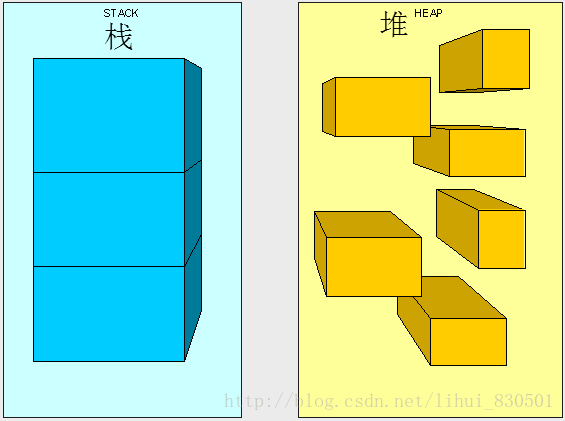

上图并不上真正的内存运行情况，只是为了让大家区分堆和栈。

栈，会自我管理，它有自己的内存管理机制。当最上面的盒子不再使用时，会自动被扔掉。

堆，相反，我们要控制它的垃圾回收(GC)。我们要去管理堆是否干净，就像管理床上的脏衣服。你不手动扔掉它，就会在床上变臭。

## 什么在堆和栈里

当程序执行时，我们主要有4种类型的东西放进堆和栈里：值类型，引用类型，指针，指令。

### **值类型:**

-   bool

-   byte

-   char

-   decimal

-   double

-   enum

-   float

-   int

-   long

-   sbyte

-   short

-   struct

-   uint

-   ulong

-   ushort

它们都衍生于System.ValueType。

### **引用类型:**

-   class

-   interface

-   delegate

-   object

-   string

它们都衍生于System.Object。当然object就是System.Object。

### **指针:**

第三种被放于内存管理体制中的是类型的引用。这个引用通常被叫作指针。我们并不具体的使用指针，它们由CLR管理。一个指针（引用）是不同于引用类型的。我们定义它是一个引用类型，意味着我们可以通过指针访问它。一个指针占有一小块内存，这块内存指向另一块内存。指针占用在内存中的存储和其它的相同，只是存放的值既不是内存地址也不是空null。

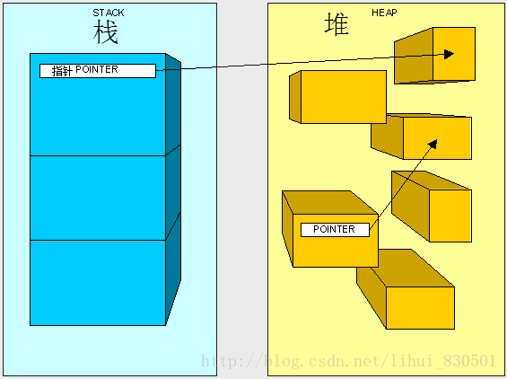

## 两个黄金规则

1.  引用类型永远存储在堆里。

2.  `值类型`和`指针`永远存储在它们声明时所在的`堆`或`栈`里。

## 栈工作原理

栈，如第一节所说，在代码运行时负责跟踪每一个线程的所在(什么被调用了)。你可以把它想像成一个线程“状态”，而每一个线程都有它自己的栈。当我们的代码执行一次方法调用，线程开始执行寄存在方法(Method)表里的JIT编译过的指令，并且把该方法的参数存放到当前线程栈里。然后，随着代码的执行每遇见方法中的变量，该变量都会被放到栈的最上面，如此重复把所有变量都放到栈上(当然引用类型只存放指针)。

为了方便理解，让我们看代码与图例。

执行下面的方法：

```csharp
public int AddFive(int pValue)
{
	int result;
    result = pValue + 5;
    return result;
}
```

下面是栈里发生的情况.  有必要提醒的是，我们现在假设当前代码产生的栈存储会放到所有既有项(栈里已经存储的数据)之上。一旦我们开始执行该方法，方法参数pValue会被放到栈上（以后的文章里会介绍参数传递）。

注意：方法并不存在栈里，图只是为了阐述原理而放的引用。

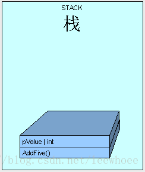

下一步，控制(线程执行方法)被传递到寄存在方法类型表里的AddFive()方法对应的指令集中。如果方法是第一次被触发，会执行JIT编译。

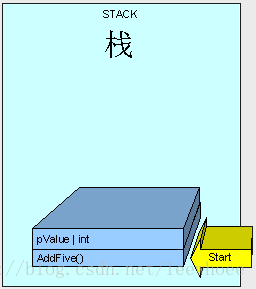

随着方法的执行，栈会分配一块内存给变量result存放。

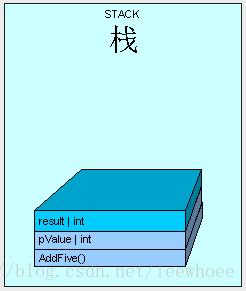

方法执行完成，返回result。

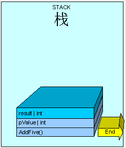

该次任务在栈里所占的所有内存将被清理，仅一个指针被移动到AddFive()开始时所在的可用内存地址上。接着会执行栈里AddFive()下面一个方法（图里看不到）。

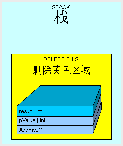

在这个例子当中，变量result被放到了栈里。事实上，方法体内每次定义的值类型变量都会被放到栈里。

## 值类型会存储在堆里？

是的，值类型有时候就是会存储在堆里。上一节中介绍的**黄金规则2:值类型和指针永远存储在它们声明时所在的堆或栈里**。如果一个值类型不是在方法中定义的，而是在一个引用类型里，那么此值类型将会被放在这个引用类型里并存储在堆上。

## 代码图例

我们定义一个引用类型：

```csharp
public class MyInt
{          
    public int MyValue;
}
```

里面包含一个值类型MyValue。

执行下面的方法：

```csharp
public MyInt AddFive(int pValue)
{
    MyInt result = new MyInt();
    result.MyValue = pValue + 5;
    return result;
}
```

就像上一节介绍的一样，线程开始执行此方法，参数pValue将会被放到当前线程栈上。

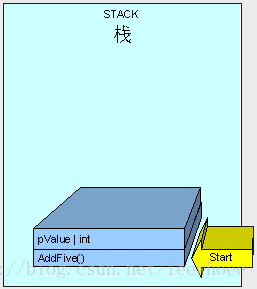

接下来不同于上一节所介绍的是MyInt是一个引用类型，它将被放到堆上并在栈上放一个指针指向它在堆里的存储。

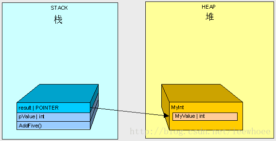

当AddFive()执行完成后，如上一节所讲栈开始清理。

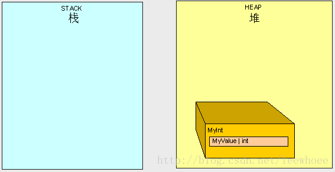

现在是需要C#垃圾回收GC的时候了。当我们的程序所占内存到达临界值时(即将溢出)，我们会需要更多的堆空间，GC就会开始运行。GC停止所有当前运行线程(整体停止)，找到堆里所有主程序不会访问到的对象并删除它们。然后，GC会识别所有堆里剩下的对象并分配内存空间给它们，同时调整堆和栈里指向它们的指针。你可以想像这是非常耗资源的，这会影响到程序的性能。这就是为什么我们需要理解和注意堆栈的使用，进而写出高性能代码。

## 堆栈原理对代码的影响

当我们使用引用类型时，我们在和指向引用类型的指针打交道，而不是引用类型本身。

当我们使用值类型时，我们就是在和值类型本身打交道。

### 代码图例

假设执行方法：

```csharp
public int ReturnValue()
{
    int x = new int();
    x = 3;
    int y = new int();
    y = x;      
    y = 4;         
    return x;
}
```

我们会得到值 **3**。

使用引用类型：

```csharp
public class MyInt
{
    public int MyValue;
}
```

如果执行方法：

```csharp
public int ReturnValue2()
{
    MyInt x = new MyInt();
    x.MyValue = 3;
    MyInt y = new MyInt();
    y = x;        
    y.MyValue = 4;         
    return x.MyValue;
}
```

我们得到的值是４而不是３！（译外话：这是很简单，但相信还是有很多人不知道原理的）

第一个示例中：

```csharp
public int ReturnValue()
{
    int x = 3;
    int y = x;    
    y = 4;
    return x;
}
```

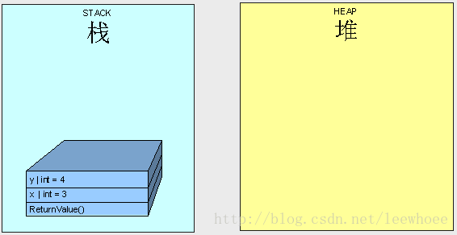

x就是3，y就是4。操作两个不同对象。

第二个示例：

```csharp
public int ReturnValue2()
{
    MyInt x;
    x.MyValue = 3;
    MyInt y;
    y = x;              
    y.MyValue = 4;
    return x.MyValue;
}
```

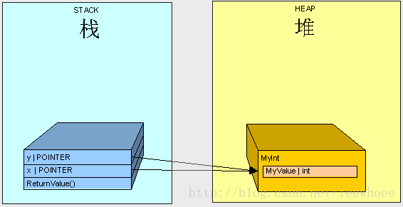

得到的值是4不是3是因为我们操作栈里两个指针并且它们指向堆里同一个对象。

## 参数，大画面

下面是当代码运行时会产生的一个详细过程。上几节已经介绍过当一个方法被调用时会产生的基本情况，让我们来看一下更加详细的内容。

当我们调用一个方法时会发生以下情形：

1.  栈会分配一块内存空间给程序执行所需要的信息(我们叫它栈结构Stack Frame)。一个栈结构包含方法调用地址(指针)，它以一个GOTO指令的形式存在栈里。因此，当程序执行完方法(method)时，它会知道怎么样返回进而曳继续执行代码。

2.  方法的所有参数将被复制到栈里，这是我们将要更加详细介绍的部分。

3.  控制被传递到JIT编译过的方法里，同时线程开始执行代码。此时，我们将有另一个方法呈现在栈结构的“回调栈”里。

```csharp
public int AddFive(int pValue)
{
    int result;
    result = pValue + 5;
    return result;
}
```

栈像下图所示：

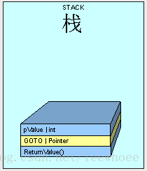

注意：ReturnValue方法不会存在栈上，图中把ReturnValue作为此栈结构的开始只是为了解释栈原理。

像前几节介绍的，值类型和引用类型在栈里的存储是不同的。栈为任何值类型创建副本，栈也为任何引用类型的指针创建副本。

## **值类型传递**

下面是值类型传递在栈里的内幕。

首先，当我们传递一个值类型变量时，栈会为它分配一块内存空间并把值类型变量的值存储进去。看下面的代码：

```csharp
class Class1  
{  
     public void Go()  
     {  
         int x = 5;  
         AddFive(x);  
         Console.WriteLine(x.ToString());  
     }  
     public int AddFive(int pValue)  
     {  
         pValue += 5;  
         return pValue;  
     }  
} 
```

当代码执行时，栈为x分配一块内存空间并存储值5

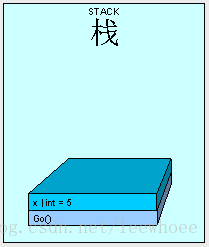

然后，AddFive()被放到栈上，同时栈分配内存空间给参数pValue并复制x的值给它。

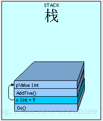

当AddFive()执行完成，线程被传递回Go()。同时因为AddFive()执行完，它的参数pValue也实质上被移除。

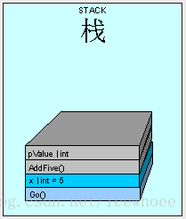

所以结果是5是合理的。关键点是任何被传递的值类型参数仅是一个碳复制，因为我们希望保护原始变量的值。

有一点要记住的是，如果我们有一个非常庞大的值类型(如，庞大的struct类型)传递到栈里，当处理器循环复制它并循环占有栈空间时将会非常耗资源。栈没有无限的空间去使用，就像用水杯不断的接水早晚会溢出一样。Struct类型可以变得非常庞大，我们要小心并清醒的使用它。

下面是一个比较大的struct结构类型：

```csharp
public struct MyStruct  
{  
    long a, b, c, d, e, f, g, h, i, j, k, l, m;  
}  
```

让我们看看执行下面代码Go()方法时再到DoSomething()方法会发生的情况：

```csharp
 public void Go()  
{  
   MyStruct x = new MyStruct();  
   DoSomething(x);  
}  
public void DoSomething(MyStruct pValue)  
{  
   // DO SOMETHING HERE....  
} 
```


这可能会非常低效。想像一下如果我们传递MyStruct几千次，它会怎么样让程序死掉。

那么，我们怎么才能回避这样的问题呢？那就是仅传递原始值类型的引用。

```
public void Go()  
{  
   MyStruct x = new MyStruct();  
   DoSomething(ref x);  
}  
 public struct MyStruct  
 {  
     long a, b, c, d, e, f, g, h, i, j, k, l, m;  
 }  
 public void DoSomething(ref MyStruct pValue)  
 {  
          // DO SOMETHING HERE....  
 } 
```

这样就能节省内存并提升内存使用效率

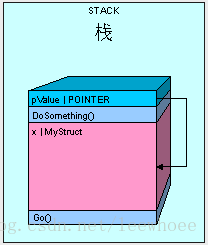

唯一需要注意的是传递引用时我们在访问原始变量x的值，任可对pValue的改变都会影响到x。

下面的代码会将x改变成"12345"，因为pValue.a实际上指向原始x声明时所在的内存地址。

```csharp
public void Go()  
{  
   MyStruct x = new MyStruct();  
   x.a = 5;  
   DoSomething(ref x);  
   Console.WriteLine(x.a.ToString());  
}  
public void DoSomething(ref MyStruct pValue)  
{  
         pValue.a = 12345;  
}  
```

## **引用类型传递**

传递引用类型跟上一节所示例中用引用的方式传递值类型相似。

如果使用引用类型（原文可能笔误，写的是值类型）：

```csharp
public class MyInt  
{  
    public int MyValue;  
}  
```

然后调用Go()方法，MyInt会被放到堆里因为它是一个引用类型。

```csharp
public void Go()  
{  
   MyInt x = new MyInt();  
}
```

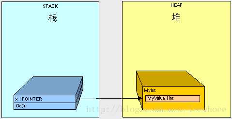

如果执行下面代码中的Go()：

```csharp
public void Go()  
{  
   MyInt x = new MyInt();  
   x.MyValue = 2;  
   DoSomething(x);  
   Console.WriteLine(x.MyValue.ToString());  
}  
 public void DoSomething(MyInt pValue)  
 {  
     pValue.MyValue = 12345;  
 } 
```

会发生这种情况：

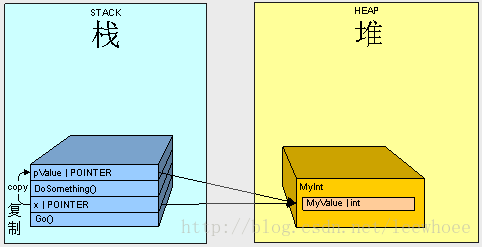

1.  开始调用Go()，栈分配一块内存空间给x。

2.  执行行到DoSomething()，栈分配一块内在空间给pValue。

3.  x的值是堆中MyInt对应在栈里的内存地址，复制x给pValue。

因此，我们用pValue改变MyInt的MyValue的值时，x最终也会获得这个改变的值"12345“。

如果我们用引用的方式传递一个引用类型变量呢？

## 用引用的方式传递引用类型

我们有一个类Thing, 类Animal和Vegetables衍生于Thing：

```csharp
public class Thing  
{  
}  
public class Animal:Thing  
{  
    public int Weight;  
}  
public class Vegetable:Thing  
{  
    public int Length;  
}  
```

执行下面的Go()方法：

```csharp
public void Go()  
{  
   Thing x = new Animal();  
   Switcharoo(ref x);  
    Console.WriteLine(  
      "x is Animal    :   "  
      + (x is Animal).ToString());  
    Console.WriteLine(  
        "x is Vegetable :   "  
        + (x is Vegetable).ToString());  
}  
 public void Switcharoo(ref Thing pValue)  
 {  
     pValue = new Vegetable();  
 }  
```

x最终变成Vegetable。

打印结果：

```yaml
x is Animal    :   False
x is Vegetable :   True
```

让我们看看堆栈里到底发生了什么情况

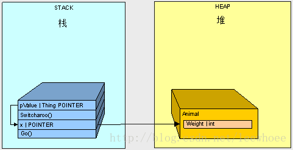

1.  调用Go()方法，栈分配一块内存空间给x。

2.  堆分配一块内存空间给Animal。

3.  开始执行Switcharoo()方法，栈分配一块内存空间给pValue并指向x。

4.  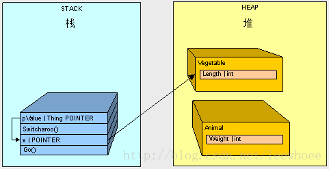

5.  栈分配一块内存空间给Vegetable。

6.  pValue改变了x的值使其指向Vegetable的内在地址。

如果我们不是用ref传递的，打印结果正相反。

## 复制不仅仅是复制

为了更清晰的阐述这个问题，让我们测试一下在堆中存储值类型变量和引用类型变量时会产生的不同情况。

### 值类型测试

首先，我们看一下值类型。下面是一个类和一个结构类型(值类型)，Dude类包含一个Name元素和两个Shoe元素。我们有一个CopyDude()方法用来复制生成新Dude。

```csharp
public struct Shoe{
    public string Color;
}
public class Dude
{
    public string Name;
    public Shoe RightShoe;
    public Shoe LeftShoe;
    public Dude CopyDude()
    {
        Dude newPerson = new Dude();
        newPerson.Name = Name;
        newPerson.LeftShoe = LeftShoe;
        newPerson.RightShoe = RightShoe;
        return newPerson;
    }
    public override string ToString()
    {
        return (Name + " : Dude!, I have a " + RightShoe.Color + " shoe on my right foot, and a " + LeftShoe.Color + " on my left foot.");
    }
}
```

Dude类是一个复杂类型，因为值 类型结构Shoe是它的成员， 它们都将存储在堆中。

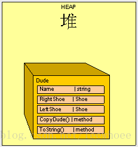

当我们执行下面的方法时：

```csharp
public static void Main()
{
    Class1 pgm = new Class1();
    Dude Bill = new Dude();
    Bill.Name = "Bill";
    Bill.LeftShoe = new Shoe();
    Bill.RightShoe = new Shoe();
    Bill.LeftShoe.Color = Bill.RightShoe.Color = "Blue";
    Dude Ted = Bill.CopyDude();
    Ted.Name = "Ted";
    Ted.LeftShoe.Color = Ted.RightShoe.Color = "Red";
    Console.WriteLine(Bill.ToString());
    Console.WriteLine(Ted.ToString());
}
```

我们得到了期望的结果：

```vbscript
Bill : Dude!, I have a Blue shoe on my right foot, and a Blue on my left foot.
Ted : Dude!, I have a Red shoe on my right foot, and a Red on my left foot.
```

如果我们把Shoe换成引用类型呢？

### 引用类型测试

当我们把Shoe改成引用类型时，问题就产生了。

```csharp
public class Shoe{
    public string Color;
}
```

执行同样上面的Main()方法，结果改变了，如下：

```vbscript
Bill : Dude!, I have a Red shoe on my right foot, and a Red on my left foot
Ted : Dude!, I have a Red shoe on my right foot, and a Red on my left foot
```

这并不是我们期望的结果。很明显，出错了！看下面的图解：

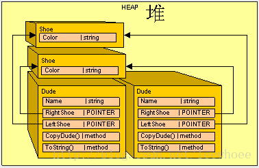

因为现在Shoe是引用类型而不是值类型，当我们进行复制时仅是复制了指针，我们并没有复制指针真正对应的对象。这就需要我们做一些额外的工作使引用类型Shoe像值类型一样工作。

很幸运，我们有一个接口可以帮我们实现：ICloneable。当Dude类实现它时，我们会声明一个Clone()方法用来产生新的Dude复制类。（译外话：复制类及其成员跟原始类不产生任何重叠，即我们所说的深复制)  看下面代码：
ICloneable consists of one method: Clone()

```csharp
public object Clone()
{
}
```

Here's how we'll implement it in the Shoe class:

```
public class Shoe : ICloneable
{
    public string Color;
    #region ICloneable Members
    public object Clone()
    {
        Shoe newShoe = new Shoe();
        newShoe.Color = Color.Clone() as string;
        return newShoe;
    }
    #endregion
}
```

在Clone()方法里，我们创建了一个新的Shoe，克隆所有引用类型变量，复制所有值类型变量，最后返回新的对象Shoe。有些既有类已经实现了ICloneable，我们直接使用即可，如String。因此，我们直接使用Color.Clone()。因为Clone()返回object对象，我们需要进行一下类型转换。

下一步，我们在CopyDude()方法里，用克隆Clone()代替复制：

```csharp
public Dude CopyDude()
{
    Dude newPerson = new Dude();
    newPerson.Name = Name;
    newPerson.LeftShoe = LeftShoe.Clone() as Shoe;
    newPerson.RightShoe = RightShoe.Clone() as Shoe;
    return newPerson;
}
```

再次执行主方法Main()：

```csharp
public static void Main()
{
    Class1 pgm = new Class1();
    Dude Bill = new Dude();
    Bill.Name = "Bill";
    Bill.LeftShoe = new Shoe();
    Bill.RightShoe = new Shoe();
    Bill.LeftShoe.Color = Bill.RightShoe.Color = "Blue";
    Dude Ted = Bill.CopyDude();
    Ted.Name = "Ted";
    Ted.LeftShoe.Color = Ted.RightShoe.Color = "Red";
    Console.WriteLine(Bill.ToString());
    Console.WriteLine(Ted.ToString());
}
```

我们得到了期望的结果：

```vbscript
Bill : Dude!, I have a Blue shoe on my right foot, and a Blue on my left foot
Ted : Dude!, I have a Red shoe on my right foot, and a Red on my left foot
```

下面是图解：

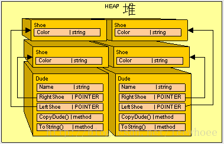

### 整理我们的代码

在实践中，我们是希望克隆引用类型并复制值类型的。这会让你回避很多不易察觉的错误，就像上面演示的一样。这种错误有时不易被调试出来，会让你很头疼。

因此，为了减轻头疼，让我们更进一步清理上面的代码。我们让Dude类实现IConeable代替使用CopyDude()方法：

```csharp
public class Dude: ICloneable
{
    public string Name;
    public Shoe RightShoe;
    public Shoe LeftShoe;
    public override string ToString()
    {
        return (Name + " : Dude!, I have a " + RightShoe.Color + " shoe on my right foot, and a " + LeftShoe.Color + " on my left foot.");
    }
    #region ICloneable Members
    public object Clone()
    {
        Dude newPerson = new Dude();
        newPerson.Name = Name.Clone() as string;
        newPerson.LeftShoe = LeftShoe.Clone() as Shoe;
        newPerson.RightShoe = RightShoe.Clone() as Shoe;
        return newPerson;
    }
    #endregion
}
```

在主方法Main()使用Dude.Clone()：

```csharp
public static void Main()
{
    Class1 pgm = new Class1();
    Dude Bill = new Dude();
    Bill.Name = "Bill";
    Bill.LeftShoe = new Shoe();
    Bill.RightShoe = new Shoe();
    Bill.LeftShoe.Color = Bill.RightShoe.Color = "Blue";
    Dude Ted = Bill.Clone() as Dude;
    Ted.Name = "Ted";
    Ted.LeftShoe.Color = Ted.RightShoe.Color = "Red";
    Console.WriteLine(Bill.ToString());
    Console.WriteLine(Ted.ToString());
}
```

最后得到期望的结果：

```vbscript
Bill : Dude!, I have a Blue shoe on my right foot, and a Blue on my left foot.
Ted : Dude!, I have a Red shoe on my right foot, and a Red on my left foot.
```

### 特殊引用类型String

在C#中有趣的是，当System.String 使用操作符“=”时，实际上是进行了克隆(深复制)。你不必担心你只是在操作一个指针，它会在内存中创建一个新的对象。但是，你一定要注意内存的占用问题(**译外话：比如为什么在一定情况下我们使用StringBuilder代替String+String+String+String...前者速度稍慢初始化耗多点内存但在大字符串操作上节省内存，后者速度稍快初始化简单但在大字符串操作上耗内存**)。如果我们回头去看上面的图解中，你会发现Stirng类型在图中并不是一个针指向另一个内存对象，而是为了尽可能的简单，把它当成值类型来演示了。

**绘图Graphing**

让我们站在GC的角度研究一下。如果我们负责“扔垃圾”，我们需要制定一个有效的“扔垃圾”计划。显然，我们需要判断哪些是垃圾，哪些不是。

为了决定哪些需要保留，我们假设任何没有正在被使用的东西都是垃圾（如角落里堆积的破旧纸张，阁楼里一箱箱没有用的过时产品,柜子里不用的衣服）。想像一下我们跟两个好朋友生活在一起：JIT 和CLR。**JIT和CLR**不断的跟踪他们正在使用的东西，并给我们一个他们需要保留的东西列表。这个初始列表我们叫它“根(root)”列表。因为我们用它做起点。我们将保持一个主列表去绘制一张图，图中分布着所有我们在房子中需要保留东西。任何与主列表中有关联的东西也被画入图中。如，我们保留电视就不要扔掉电视遥控器，所以电视遥控器也会被画入图中。我们保留电脑就不能扔掉显示器键盘鼠标，同样也把它们画入图中。

这就是GC怎么决定去保留对象的。**GC会保留从JIT和CLR那收到的一个根(root)对象引用列表，然后递归搜索对象引用并决定什么需要保留。**

这个根的构成如下：

-   全局/静态 指针。通过以静态变量的方式保持对象的引用，来确保对象不会被GC回收。

-   栈里的指针。为了程序的执行，我们不想扔掉那些程序线程始终需要的对象。

-   CPU寄存器指针。托管堆里任何被CPU内存地址指向的对象都需要被保留。

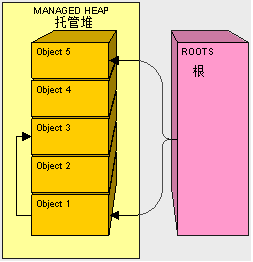
在上面的图中，托管堆中的对象1，5被根Roots引用，3被1引用。对象1，5是被直接引用，3是通过递归查询找到。如果关联到我们之前的假设，对象1是我们的电视，对象3则是电视遥控器。当所有对象画完后，我们开始进行下一阶段：垃圾清理。

**GC垃圾清理Compacting**

现在我们有了一张需要保留对象的关系图，接下来进行GC的清理。
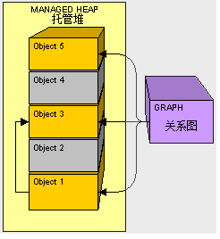
图中对象2和4被认定为垃圾将被清理。清理对象2，复制（memcpy ）对象3到2的位置。
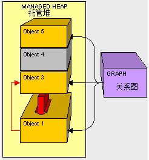
由于对象3的地址变了，GC需要修复指针（红色箭头）。然后清理对象4，复制（memcpy ）对象5到原来3的位置（译外话：GC原则：堆中对象之间是没有间隙的，以后会有文章专门介绍GC原理）。
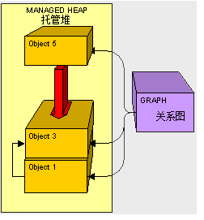
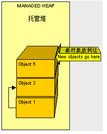
最后清理完毕，新对象将被放到对象5的上面(译外话：GC对一直管理一个指针指向新对象将被放置的地址，如黄色箭头，以后会有文章专门介绍)。

了解GC原理可以帮助我们理解GC清理(复制memcpy ，指针修复等)是怎么消耗掉很多资源的。很明显，减少托管堆里对象的移动（复制memcpy ）可以提高GC清理的效率。

**托管堆之外的终止化队列Finalization Queue和终止化-可达队列Freachable Queue**

有些情况下，GC需要执行特定代码去清理非托管资源，如文件操作，数据库连接，网络连接等。一种可行性方案是使用析构函数（终结器）：
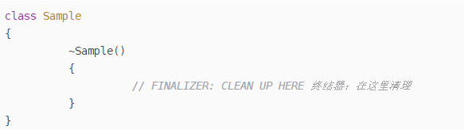
译外话：析构函数会被内部转换成终结器override Finializer()

有终结器的对象在创建时，同时在Finalization Queue里创建指向它们的指针（更正原文说的把对象放到Finalization Queue里）：

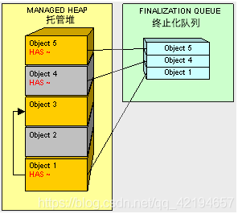
上图对象1,4,5实现了终结器，因此在Finalization Queue里创建指向它们的指针。让我们看一下，当对象2和4没有被程序引用要被GC清理时会发生什么情况。
对象2会被以常规模式清理掉(见文章开始部分)。GC发现对象4有终结器，则会把Finalization Queue里指向它的指针移到Freachable Queue中，如下图：
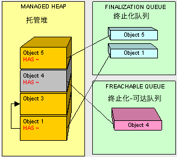
但是对象4并不被清理掉。有一个专门处理Freachable Queue的线程，当它处理完对象4在Freachable Queue里的指针后，会把它移除。

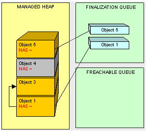
这时对象4可以被清理了。当下次GC清理时会把它移除掉。换句话说，至少执行两次GC清理才能把对象4清理掉，显然会影响程序性能。

创建终结器，意味着创建了更多的工作给GC，也就会消耗更多资源影响程序性能。因此，当你使用终结器时一定要确保你确实需要使用它。
更好的方法是使用IDisposable接口。

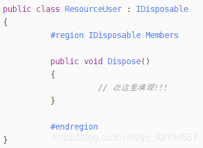
实现IDisposable接口的对象可以使用using关键字：
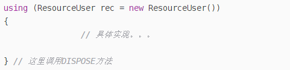
变量rec的作用域是大括号内，大括号外不可访问。

**静态变量**

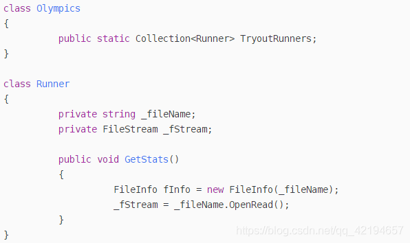

如果你初始化了TryoutRunners，那么它将永远不会被GC清理，因为有静态指针一直指向初始化的对象。一旦调用了Runner里GetStats()方法，因为GetStats()里面没有文件关闭操作，它将永远被打开也不会被GC清理。我们可以看到程序的崩溃即将来临。

# 参考

-   [C# Heap(ing) Vs Stack(ing) In .NET - Part One (c-sharpcorner.com)](https://www.c-sharpcorner.com/article/C-Sharp-heaping-vs-stacking-in-net-part-i/)

-   [C# Heap(ing) Vs Stack(ing) In .NET - Part Two (c-sharpcorner.com)](https://www.c-sharpcorner.com/article/C-Sharp-heaping-vs-stacking-in-net-part-ii/)

-   [C# Heap(ing) Vs Stack(ing) In .NET - Part Three (c-sharpcorner.com)](https://www.c-sharpcorner.com/article/C-Sharp-heaping-vs-stacking-in-net-part-iii/)

-   [C# Heap(ing) Vs Stack(ing) In .NET - Part Four (c-sharpcorner.com)](https://www.c-sharpcorner.com/article/C-Sharp-heaping-vs-stacking-in-net-part-iv/)

-   [Unite Now - （中文字幕）性能优化技巧（上）\_哔哩哔哩 (゜-゜)つロ 干杯\~-bilibili](https://www.bilibili.com/video/BV1Tt4y1X7f6)
