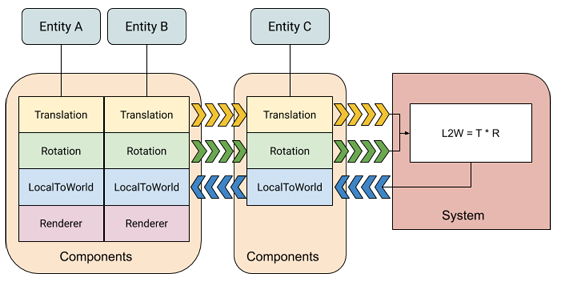

DOTS面向数据栈编程

-   ecs   在OOP方法中，数据不会被组织起来，而是会分散再整个内存中，这是因为使用了自动内存管理功能。

-   job system 传统只使用了单线程,配合ecs提供了多线程解决方案

-   brust compiler 将c#直接转换为汇编

# ECS核心概念



这个图中，System读取了多个实体的`Translation`和`Rotation`组件，然后经过计算处理，将结果更新到`LocalToWorld`组件中。

从图中你可以看到，实体A和B还有Renderer组件，但是C并没有。不过这并不会影响System的计算逻辑，因为这个系统不关心`Renderer`组件。

## 原型 Archetypes

多个组件的组合叫做一个原型。

比如一个3D物体可能会包含用于transform的组件，包括移动、旋转、渲染，每个3D物体对应一个实体，但是他们都有同样的组件，所以ECS会把他们分类成是一类原型。


在上图中，实体A和B的原型都是M，实体C的原型是N。

你也可以通过在运行时添加或者移除component来改变一个实体的原型。例如：如果将实体B的Renderer组件移除，实体B的原型就会变成N。

一个实体的原型是什么，决定了ECS会将实体的components也就是数据存在什么地方。**ECS按块分配内存，每块用一个**`ArchetypeChunk`对象表示。

一个块只包含一种原型，可以包含的多个实体的数据。如果一个块的内存满了，ECS会分配一个新的块来存储新的实体的components。

如果你修改了实体的组件，那就相当于修改了实体的原型，这时候ECS会将实体的组件数据移到另外一个块中。


原型和内存块的关系是一对多的关系。这就意味着，如果想查询给定的一组component类型的所有实体，只需要在这些原型中搜索即可。这样会比在所有的实体中查找效率高很多。

ECS在存储实体到内存块中没有特殊的排序，当创建一个实体或者实体的原型发生变化时，ECS会将它放到对应原型的第一个还有空间的内存块中。内存块中的数据会紧密排列。如果一个实体要被移出当前原型的内存块，这时候会有个空位，ECS会把这个内存块最后的实体数据移动到这个空位中。

**注意**：原型中的**共享组件**（后面会具体说这是个什么东东）的数据也会影响实体会被存在哪个内存块。同一个内存块中的所有实体的共享组件中的数据值都是相同的。如果你修改了共享组件中的数据，这个实体会被移到另外一个块中，有点类似修改了实体的原型。

将共享组件的实体分到一个内存块中会提高处理他们的速度。比如Hybird Renderer（混合渲染）定义了RenderMesh组件来达成这个目的。

## 实体 Entity

在代码层面，你就可以了解到，实体非常非常的简单。它的核心部分：

```
public struct Entity
{
  public int Index;
  public int Version; 
}
```

Index表示这个实体的ID，和身份证一样用于实体与实体之间区分。Version用于描述这个实体的生命周期，由于实体是可以重用的，那么就需要用Version来区分这个Entity是新生实体，还是即将销毁的实体。

ECS中有一个`EntityManager`类来管理一个World中的所有实体。`EntityManager`使用列表维护所有实体以及和实体关联的数据，以便达到最优的性能。

虽然entity没有类型，但是可以根据entity关联的component将他们分组，也就是上一节讲的实体原型（EntityArchetype），EntityManager会持续跟踪这些实体原型。你可以使用已有的`EntityArchetype`来创建entity，也可以提前创建`EntityArchetype`，以便后面的使用。

### 创建Entity

通过以下方法可以一次创建一个Entity：

-   使用ComponentType的数组来创建一个entity

```
EntityManager.CreateEntity(ComponentType[])
```

-   使用EntityArchetype来创建一个entity

```
EntityManager.CreateEntity(EntityArchetype)
```

-   通过`EntityManager.Instantiate`复制一个已有的entity，包括它里面的数据

```
EntityManager.Instantiate(Entity srcEntity);
EntityManager.Instantiate(NativeArray<Entity> srcEntities, NativeArray<Entity> outputEntities)
```

-   也可以创建一个空的Entity，在需要的时候在加上components。(您可以立即添加组件，也可以根据需要添加其他组件。)

```
var entity = EntityManager.CreateEntity();
EntityManager.AddComponent(Entity entity, ComponentType componentType)
```

你也可以通过下面的方法一次创建多个Entity：

-   使用`CreateEntity`方法一次性填充多个新的Entity到一个NativeArry中，这些entity用同样的原型

```
EntityManager.CreateEntity(EntityArchetype archetype, NativeArray<Entity> entities)
```

-   使用`Instantiate`方法一次性复制多个entity，包含数据

```
EntityManager.Instantiate(NativeArray<Entity> srcEntities, NativeArray<Entity> outputEntities)
```

-   显式创建使用指定数量的实体填充的块，并使用CreateChunk创建给定原型

```
EntityManager.CreateChunk(EntityArchetype, NativeArray<ArchetypeChunk>, Int32)
```

### 添加/删除 component

创建完Entity后，你可以添加或者移除component。注意添加或移除component时，entity的原型会发生变化，这时候EntityManager需要将entity移到其他内存块，并将当前内存块的空位补上。

对实体的更改导致结构性更改-会造成Entity原型变化的操作不能在Job里面执行，比如添加移除component、修改`SharedComponentData`中的值、销毁entity。你可以将前面说的这几种操作放进`EntityCommandBuffer`中，在job执行完成后执行这个command buffer。后面还会具体讲解CommandBuffer。

```
struct Lifetime : IComponentData
{
    public byte Value;
}

class LifetimeSystem : SystemBase
{
    EndSimulationEntityCommandBufferSystem m_EndSimulationEcbSystem;
    protected override void OnCreate()
    {
        base.OnCreate();
        // 从World中获取ECS系统并且存起来
        m_EndSimulationEcbSystem = World
            .GetOrCreateSystem<EndSimulationEntityCommandBufferSystem>();
    }

    protected override void OnUpdate()
    {
        // 请求一个ECB并且转换成可并行的
        var ecb = m_EndSimulationEcbSystem.CreateCommandBuffer().AsParallelWriter();
        Entities
            .ForEach((Entity entity, int entityInQueryIndex, ref Lifetime lifetime) =>
        {
            // 检测entity的lifetime，如果为0则销毁它
            if (lifetime.Value == 0)
            {
                // 将entityInQueryIndex传给操作，这样ECS回放时能保证正确的顺序
                ecb.DestroyEntity(entityInQueryIndex, entity);
            }
            else
            {
                lifetime.Value -= 1;
            }
        }).ScheduleParallel();

        // 保证ECB system依赖当前这个Job
        m_EndSimulationEcbSystem.AddJobHandleForProducer(this.Dependency);
    }
}
```

EntityManager也提供了方法用来添加、移除单个entity中的组件，也可以移除一个entity的NativeArray中的组件。后面组件部分会详细说明。

```
EntityManager.AddComponent(Entity entity, ComponentType componentType)
```

### 访问实体数据

遍历实体和组件最有效的方式时在一个并行化的Job中按顺序处理组件 . 这利用了CPU的多核性能，并避免CPU的缓存丢失

ECS API提供了多种遍历的方式，每个都有自己的性能影响和限制. 下面是方法:

#### [SystemBase.Entities.ForEach](https://docs.unity3d.com/Packages/com.unity.entities@0.14/api/Unity.Entities.SystemBase.html#Unity_Entities_SystemBase_Entities)

使用一个job结构来有效的遍历实体.

```
       Entities
           .WithName("Update_Position") // Shown in error messages and profiler
           .WithAll<LocalToWorld>() // Require the LocalToWorld component
           .ForEach(
               // Write to Displacement (ref), read Velocity (in)
               (ref Position position, in Velocity velocity) =>
               {
                   //Execute for each selected entity
                   position = new Position()
                   {
                       // dT is a captured variable
                       Value = position.Value + velocity.Value * dT
                   };
               }
           )
           .ScheduleParallel(); // Schedule as a parallel job
           
```

**实体查询**

-   `WithAll<T>` — 一个实体必须具有所有这些组件类型 (除了在lambda参数列表中找到所有组件类型之外)

-   `WithAny<T,U>` — 一个实体必须有一个或多个这样的组件类型.注意，允许使用WithAny指定单个组件类型;但是，由于实体必须有一个或多个这样的“可选”组件类型供查询选择，因此使用带有单个类型的WithAny等同于将该类型放在WithAll语句中。

-   `WithNone<T>` — 实体不能具有任何这些组件类型

-   `WithChangeFilter<T>` — 只选择子上次 [JobComponentSystem](https://docs.unity3d.com/Packages/com.unity.entities@0.6/api/Unity.Entities.JobComponentSystem.html) 更新以来，特性组件发生变化的实体

-   `WithSharedComponentFilter` — 只选择拥有特定值的share component的块

-   `WithStoreEntityQueryInField` — 把Entities.ForEach生成的 [EntityQuery](https://docs.unity3d.com/Packages/com.unity.entities@0.6/api/Unity.Entities.EntityQuery.html) 对象存储在一个 EntityQuery 字段里. 您可以使用这个EntityQuery对象用于获取符合条件的实体的数量.注意，这个函数在创建JobComponentSystem时将EntityQuery实例分配给您的字段. 这意味着您可以在第一次执行lambda函数之前使用查询。

不要使用WithAny\<T、U>或WithNone向查询添加参数列表中的组件。所有添加到lambda函数参数列表中的组件都会自动添加到实体查询的WithAll列表中;向WithAll列表和WithAny或WithNone列表添加组件会创建一个不合逻辑的查询。

```
 Entities.WithAll<LocalToWorld>()
    .WithAny<Rotation, Translation, Scale>()
    .WithNone<LocalToParent>()
    .ForEach((ref Destination outputData, in Source inputData) =>
    {
        /* do some work */
    })
    .Schedule(inputDeps);
    
Entities
    .WithChangeFilter<Source>()
    .ForEach((ref Destination outputData,
    in Source inputData) =>
    {
    /* Do work */
    })
    .Schedule(inputDeps);

```

#### [IJobChunk](https://docs.unity3d.com/Packages/com.unity.entities@0.14/manual/chunk_iteration_job.html)

遍历所有符合条件的内存块(called a *Chunk*)，其中包含的是符合条件的实体 . Job Execute() 方法可以用for循环遍历所有的块中的元素，你可以使用 IJobChunk 来执行比 IJobForEach更复杂的操作,同时保持最高效率.

```
[BurstCompile]
struct UpdateJob : IJobChunk
{
    public ComponentTypeHandle<InputA> InputATypeHandle;
    public ComponentTypeHandle<InputB> InputBTypeHandle;
    [ReadOnly] public ComponentTypeHandle<Output> OutputTypeHandle;
    public uint LastSystemVersion;

    public void Execute(ArchetypeChunk chunk, int chunkIndex, int firstEntityIndex)
    {
        var inputAChanged = chunk.DidChange(InputATypeHandle, LastSystemVersion);
        var inputBChanged = chunk.DidChange(InputBTypeHandle, LastSystemVersion);

        // If neither component changed, skip the current chunk
        if (!(inputAChanged || inputBChanged))
            return;

        var inputAs = chunk.GetNativeArray(InputATypeHandle);
        var inputBs = chunk.GetNativeArray(InputBTypeHandle);
        var outputs = chunk.GetNativeArray(OutputTypeHandle);

        for (var i = 0; i < outputs.Length; i++)
        {
            outputs[i] = new Output { Value = inputAs[i].Value + inputBs[i].Value };
        }
    }
}

```

#### [Manual iteration](https://docs.unity3d.com/Packages/com.unity.entities@0.1/manual/manual_iteration.html)

如果以前的方法不足, 您可以手动遍历实体或块.例如，您可以获得一个包含实体的`NativeArray`，或者您想要处理的实体的块，使用Job(比如`IJobParallelFor`)对它们进行遍历。

[EntityQuery](https://docs.unity3d.com/Packages/com.unity.entities@0.1/manual/ecs_entity_query.html) 类提供了一个构造一个你数据的视图方法，这个视图仅仅包含你算法或者程序中需要的特定的数据. 上面列表中的许多遍历方法都使用EntityQuery，无论是显式的还是内部的。就是可以通过 [EntityQuery](https://docs.unity3d.com/Packages/com.unity.entities@0.1/manual/ecs_entity_query.html) 来只遍历符合条件的实体或组件

## 系统 System

### DisableAutoCreation

-   如果只是单纯的createsystem,不会执行`OnStartRunning`,`OnStopRunning`,`OnUpdate`..但是会执行`OnCreate`,`OnDestroy`

-   `AddSystemToUpdateList` 且 Entities.ForEach中的query有结果才会执行`OnStartRunning`,`OnStopRunning`,`OnUpdate`

所以可以使用`DisableAutoCreation`,但不`AddSystemToUpdateList`添加到循环列表中,把一个system当作工具类使用

### 实体查询

一个System根据什么来决定处理哪些实体呢？这时候会用到一个叫实体查询(Entity Query)的东西。实体查询首先需要一些组件类型，然后根据你传入的组件类型的组合，在包含这些组件的原型中查询符合要求的实体。查询时可以指定下面三种类型：

-   **All** 必须包含All中所有的组件类型

-   **Any** 必须包含Any中至少一个组件类型

-   **None** 不能包含None中任意一个组件类型

一次实体查询的结果会返回所有符合查询要求的内存块，你可以使用`IJobChunk`来迭代遍历所有的组件

### Jobs 作业

之前说过，ECS配合Job使用才能发挥多线程的威力。ECS提供了`SystemBase`类，其中包含`Entities.ForEach`方法，还包含了`IJobChunk`的`Schedule()`和`ScheduleParallel()`方法，可以在子线程中处理数据。`Entities.ForEach`是最简单的方法，只需要几行代码就能实现。`IJobChunk`可以用来处理比较复杂的情况。

ECS会在主线程调度Job，根据System的顺序。当job调度后，ECS会追踪哪些job在读写哪些组件。需要读权限的job需要等待前面写权限的job执行完，反之亦然。Job调度器会使用job依赖来决定哪些job可以并行，哪些必须串行。

### System的组织

ECS通过`World`和`group`来组织system。默认情况下，ECS会创建一个默认的World，包含一些预定义的group组。它会找到工程中所有的System，实例化他们，并添加到预定义的group中。

你可以指定同一个group中system的Update的执行顺序。Group也是一种system，所以你可以将一个group添加到另外一个group中。如果你没有指定顺序，system的执行顺序会不太确定，并不会按照它们创建的顺序。不过，同一个group中的所有system都会比下一个group中的system先执行。

System的Update是在主线程中执行的，不过可以使用Job将工作分配到子线程中。

## 组件 Component

# 相关链接

-   [Entity Component System 官方文档](https://docs.unity3d.com/Packages/com.unity.entities@0.14/manual/index.html)

-   [DOTS从原理到应用](https://www.bilibili.com/video/BV1sD4y1Q7an)

-   [Unity DOTS技术详解](https://www.bilibili.com/video/BV18J411t7G8)

-   [Unity ECS简单示例](https://connect.unity.com/u/enthervarope/column)

-   [Unity中的ECS编程](https://blog.csdn.net/andrewfan/category_8967683.html)

-   [Unity ECS\_翻译](https://blog.csdn.net/lrh3025/category_9668656.html)
