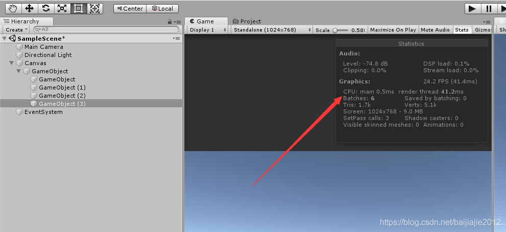
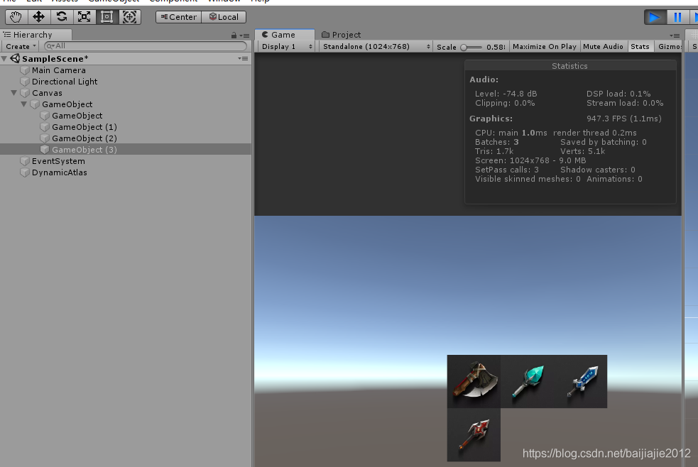
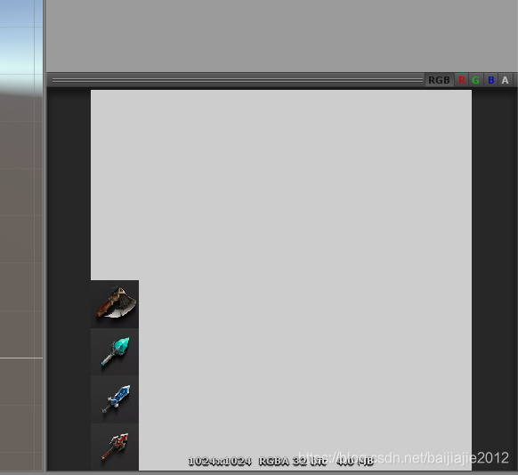
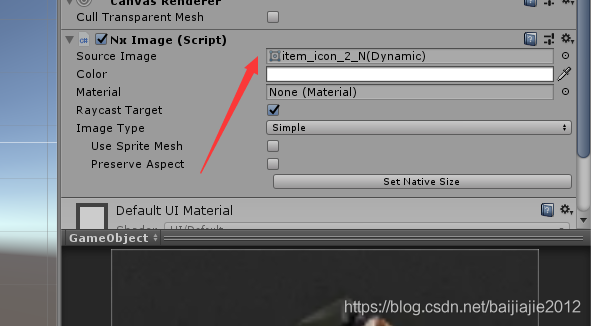

不管NGUI还是UGUI，图集都是在制作期间就生成了的，运行时是一张大图，这样做的好处在于我们可以在一定程度上去合并批次，但是图集通常在制作过程中，会分成commonatlas和系统atlas两类，一个界面prefab至少会用到两张图集，就会出现ABA的图集穿插打断合批的情况。还有一种游戏内容多了以后，各种图片也相应的变多，类似图标、commonatlas这种图集，一张2048x2048可能就放不下了，这时候如果用到两张2048x2048，就又出现了之前说的ABA的情况，而且内存上也上去了。这时候就出现了新的解决方案：动态图集。

动态图集其实就是我们在打包的时候，图片是零散的，但是最后运行时，自动生成一张空白大图片，然后将界面上用到的零散的图片绘制在这个大图上，只将这个大图传入到gpu里头，达到合批的效果。由于手机界面制作过程中，标准分辨率往往是低于2048的，所以一张2048的动态图集就能完全解决一个界面的绘制工作了，但是动态图集也是有缺点的，动态图集因为将图集的生成过程延迟到了游戏运行时，所以必然会比静态图集多了图集生成的成本，当然这也是可以优化的。并且在目前的动态图集生成方案中，还没有出现公开的支持压缩的动态图集解决方案，所以动态图集目前看来只能是RGBA32的格式。还有一点，静态图集由于图片在生成过程中是确定的，可以将分配算法做得很好，图集的利用率也能做到很高。动态图集由于图片是动态生成的，在游戏运行过程中也会动态的增减图片，类似操作系统的内存分配算法，图集必然会出现碎片，图集的利用率也不可能做得很高。

说了那么多 就做个demo来看看动态图集的威力吧。

这个demo只是简单的演示一下动态图集的主要思路，图片分配算法也只是将大图片分成128x128的一个一个分区，每个分区采用引用计数开控制是否在使用图片，用于维护整个UI系统的话，这种算法并不适用，但是如果只是用于icon图标的话，由于icon图标是固定尺寸的，所以这套算法就很合适了。下面上源码：

```

using System.Collections;
using System.Collections.Generic;
using UnityEngine;
 
public class NxSpriteInfo
{
    private int _x;
    private int _y;
    private Sprite _sprite;
    private int _referenceCount;
 
    private int _width;
    private int _height;
 
    public int x { get { return _x; } }
    public int y { get { return _y; } }
 
    public Sprite sprite
    {
        get { return _sprite; }
    }
 
    public NxSpriteInfo(int x, int y, Texture2D mainTexture, int startX, int startY, int width, int height)
    {
        _x = x;
        _y = y;
        _referenceCount = 0;
 
        _width = width;
        _height = height;
 
        _sprite = Sprite.Create(mainTexture, new Rect(startX, startY, width, height), Vector2.one / 2f);
    }
 
    public bool IsEmpty()
    {
        return _referenceCount == 0;
    }
 
    public void AddReference()
    {
        ++_referenceCount;
        Debug.Log(string.Format("[AddReference]Sprite:[{0},{1}] ref:{2}", x, y, _referenceCount));
    }
 
    public void RemoveReference()
    {
        if (_referenceCount == 0) return;
        --_referenceCount;
 
        Debug.Log(string.Format("[RemoveReference]Sprite:[{0},{1}] ref:{2}", x, y, _referenceCount));
    }
}
 
public class DynamicAtlas : MonoBehaviour
{
    private const int MAX_DYNAMIC_ATLAS_SIZE = 1024;
    private const int DYNAMIC_ATLAS_CELL_SIZE = 128;
    private const int DYNAMIC_ATLAS_CELL_COUNT = MAX_DYNAMIC_ATLAS_SIZE / DYNAMIC_ATLAS_CELL_SIZE;
 
    [SerializeField]
    private Texture2D _dynamicAtlasTex;
 
    // 策略 分成格子
    private List<NxSpriteInfo> _spriteCacheList;
    private Dictionary<int, int> _spriteRedirectMap = new Dictionary<int, int>();
 
    private void Awake()
    {
        _dynamicAtlasTex = new Texture2D(MAX_DYNAMIC_ATLAS_SIZE, MAX_DYNAMIC_ATLAS_SIZE, TextureFormat.RGBA32, false);
        _initCacheSprite();
    }
 
    private void _initCacheSprite()
    {
        int cellCount = DYNAMIC_ATLAS_CELL_COUNT;
 
        _spriteCacheList = new List<NxSpriteInfo>();
        for (int i = 0; i < cellCount; ++i)
        {
            for (int j = 0; j < cellCount; ++j)
            {
                _spriteCacheList.Add(new NxSpriteInfo(i, j, 
                    _dynamicAtlasTex,
                    i * DYNAMIC_ATLAS_CELL_SIZE, j * DYNAMIC_ATLAS_CELL_SIZE,
                    DYNAMIC_ATLAS_CELL_SIZE, DYNAMIC_ATLAS_CELL_SIZE));
            }
        }
    }
 
    public Sprite GetOrLoadSprite(Sprite sprite)
    {
        // 拿缓存
        var spriteInstanceID = sprite.GetInstanceID();
        //Debug.Log(string.Format(" name: {0} instanceid: {1}", sprite.name, spriteInstanceID));
        int index = -1;
        if (_spriteRedirectMap.TryGetValue(spriteInstanceID, out index))
        {
            var newSprite = _spriteCacheList[index];
            newSprite.AddReference();
            return newSprite.sprite;
        }
 
        // 检查是不是本身就是动态生成的 如果是的话 什么都不用做
        for (int i = 0; i < _spriteCacheList.Count; ++i)
        {
            var sp = _spriteCacheList[i];
            if (sp.sprite == sprite)
            {
                return sprite;
            }
        }
 
        // 拿不到缓存就找个空格子新增
        var emptySprite = GetEmptySprite();
        if (emptySprite != null)
        {
            // GPU上直接操作 速度快 兼容性差
            Graphics.CopyTexture(sprite.texture, 0, 0, (int)sprite.rect.x, (int)sprite.rect.y, (int)sprite.rect.width, (int)sprite.rect.height,
                                _dynamicAtlasTex, 0, 0, (int)emptySprite.sprite.rect.x, (int)emptySprite.sprite.rect.y);
 
            // 这里要先删除上一个的
            index = GetIndex(emptySprite);
            foreach (var redirect in _spriteRedirectMap)
            {
                if (redirect.Value == index)
                {
                    _spriteRedirectMap.Remove(redirect.Key);
                    break;
                }
            }
            _spriteRedirectMap.Add(spriteInstanceID, GetIndex(emptySprite));
            emptySprite.AddReference();
            emptySprite.sprite.name = sprite.name + "(Dynamic)";
            return emptySprite.sprite;
        }
 
        // 找不到空格子就直接返回sprite
        return sprite;
    }
 
    public void ReleaseSprite(Sprite sprite)
    {
        for (int i = 0; i < _spriteCacheList.Count; ++i)
        {
            var sp = _spriteCacheList[i];
            if (sp.sprite == sprite)
            {
                sp.RemoveReference();
                break;
            }
        }
    }
 
    private NxSpriteInfo GetEmptySprite()
    {
        for (int i = 0; i < _spriteCacheList.Count; ++i)
        {
            var sp = _spriteCacheList[i];
            if (sp.IsEmpty())
                return sp;
        }
        return null;
    }
 
    private int GetIndex(NxSpriteInfo sprite)
    {
        return sprite.x * DYNAMIC_ATLAS_CELL_COUNT + sprite.y;
    }
 
}
```

关键代码都在GetOrLoadSprite这个函数里面了，其中最重要的一句就是Graphics.CopyTexture，这个是直接在GPU上操作图片，速度非常快，但是缺点是兼容性不是很好，也用备用方案，直接上内存copy再传到gpu上，会慢一些，demo这里就不做演示了，需要的自行查相关资料，我记得雨松似乎做过类似分享，当时应该是用于角色的贴图合并。

另外配合这个DynamicAtlas，我也做了一个NxImage来配合它，简单继承了一下ugui的image，在awake和ondestory做了引用计数的加减，只是用于功能演示，真正用到项目中，应该会更加注重细节。

```

using System;
using System.Collections.Generic;
using System.Linq;
using System.Text;
using System.Threading.Tasks;
using UnityEngine;
using UnityEngine.UI;
 
public class NxImage : Image
{
    protected override void Start()
    {
        base.Start();
 
        if (Application.isPlaying && this.sprite != null)
        {
            var dynamicAtlasGo = GameObject.Find("DynamicAtlas");
            if (dynamicAtlasGo == null)
            {
                GameObject go = new GameObject();
                go.name = "DynamicAtlas";
                go.AddComponent<DynamicAtlas>();
                dynamicAtlasGo = go;
            }
 
            if (dynamicAtlasGo != null)
            {
                var dynamicAtlas = dynamicAtlasGo.GetComponent<DynamicAtlas>();
                if (dynamicAtlas != null)
                {
                    this.sprite = dynamicAtlas.GetOrLoadSprite(this.sprite);
                }
            }
        }
    }
 
    public void SetNewSprite(Sprite sp)
    {
        var dynamicAtlasGo = GameObject.Find("DynamicAtlas");
        if (dynamicAtlasGo != null)
        {
            var dynamicAtlas = dynamicAtlasGo.GetComponent<DynamicAtlas>();
            if (dynamicAtlas != null)
            {
                if (this.sprite != null)
                    dynamicAtlas.ReleaseSprite(this.sprite);
                this.sprite = dynamicAtlas.GetOrLoadSprite(sp);
            }
        }
    }
 
    protected override void OnDestroy()
    {
        base.OnDestroy();
 
        if (this.sprite != null)
        {
            var dynamicAtlasGo = GameObject.Find("DynamicAtlas");
            if (dynamicAtlasGo != null)
            {
                var dynamicAtlas = dynamicAtlasGo.GetComponent<DynamicAtlas>();
                if (dynamicAtlas != null)
                {
                    dynamicAtlas.ReleaseSprite(this.sprite);
                }
            }
        }
 
    }
}
```

简单挂了几个图片上去测试，效果如下：



运行后：



可以看到drawcall明显降低了，我们再看看合并后真正用到的图片：





以上就是动态生成图集的简单思路 仅供参考

- [DaVikingCode/UnityRuntimeSpriteSheetsGenerator: Unity – generate SpriteSheets at runtime! (github.com)](https://github.com/DaVikingCode/UnityRuntimeSpriteSheetsGenerator)

- [jintiao/RuntimeTextureAtlas: runtime texture atlas (github.com)](https://github.com/jintiao/RuntimeTextureAtlas)