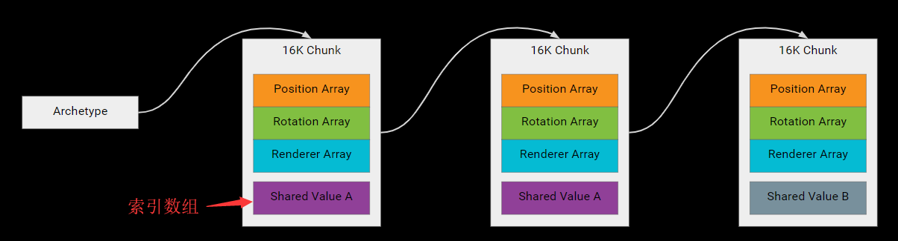
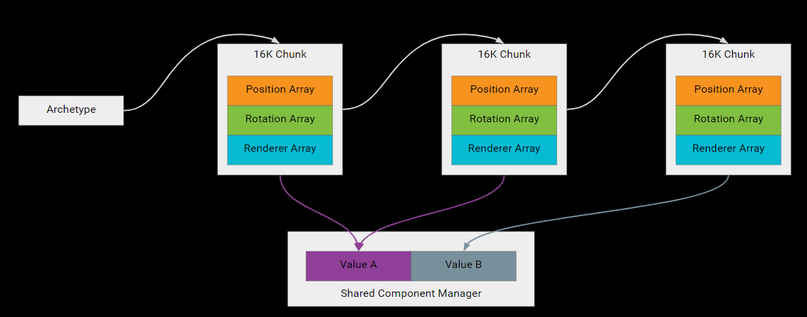

-   General Purpose Component

-   Shared component data    不存储在chunk中,而是存储在sharedComponentManager,而chunk中存的是索引.. 若ForEach中包含了Share Component，那么必须调用WithoutBurst方法和使用Run来执行

-   Chunk component data    相当于单例...更改后,会更改所有相关实体

-   System State Components  类似一个标记..但是实体销毁时,并不会回收entity,只有当所有satecomponent移除后

-   Dynamic buffer components    可以理解为一个数组component

## General Purpose Component（普通用途组件）

这里指的是最普通的组件，可以通过实现 `IComponentData` 接口来创建。

`IComponentData` 不存储行为，只储存数据。`IComponentData` 还是一个结构体（Struct）而不是一个类（Class），这意味着被复制时默认是通过值而不是通过引用。

通常我们会用下面的**模式**来修改组件数据：

```
var transform = group.transform[index]; // Read
    
transform.heading = playerInput.move; // Modify
transform.position += deltaTime * playerInput.move * settings.playerMoveSpeed;

group.transform[index] = transform; // Write
```

`IComponentData` 结构不包含托管对象（managed objects）的引用，所有`IComponentData` 被存在无垃圾回收的[块内存（chunk memory）](https://docs.unity3d.com/Packages/com.unity.entities@0.0/manual/chunk_iteration.html)中。

你可能还听过一种组件是不包含数据、只用来标记的“Tag”组件（Tag component），其用途也很广，例如我们可以轻易地给实体加标记来区分玩家和敌人，这样系统中能更容易通过组件的类型来筛选我们想要的实体。如果我们给一个内存块（Chunk）中的所有实体都添加"Tag“组件的话，只有内存块中对应的原型会修改，不添加数据，因此官方也推荐利用好”Tag“组件。

See file: /Packages/com.unity.entities/Unity.Entities/IComponentData.cs.

## Shared components（共享组件）

Shared components 是一种特殊的组件，你可以把某些特殊的需要共享的值放到 shared component 中，从而在实体中与其他组件划分开。例如有时候我们的实体需要共享一套材质，我们可以为需要共享的材质创建 `Rendering.RenderMesh`，再放到 shared components 中。原型中也可以定义 shared components，这一点和其他组件是一样的。

```
[System.Serializable]
public struct RenderMesh : ISharedComponentData
{
    public Mesh                 mesh;
    public Material             material;

    public ShadowCastingMode    castShadows;
    public bool                 receiveShadows;
}
```

当你为一个实体添加一个 shared components 时， `EntityManager` 会把所有带有同样 shared components 的实体放到一个同样的内存块中（Chunks）。shared components 允许我们的系统去一并处理相似的（有同样 shared components 的）实体。

### 内存结构



每个内存块（Chunk）会有一个存放 shared components 索引的数组。这句话包含了几个要点：

1.  对于实体来说，有同样 `SharedComponentData` 的实体会被一起放到同样的内存块（Chunk）中。

2.  如果我们有两个存储在同样的内存块中的两个实体，它们有同样的 `SharedComponentData` 类型和值。我们修改其中一个实体的 `SharedComponentData` 的值，这样会导致这个实体会被移动到一个新的内存块中，因为一个内存块共享同一个数组的 `SharedComponentData` 索引。事实上，从一个实体中增加或者移除一个组件，或者改变 shared components 的值都会导致这种操作的发生。

3.  其索引存储在内存块而非实体中，因此 `SharedComponentData` 对实体来说是低开销的。

4.  因为内存块只需要存其索引，`SharedComponentData` 的内存消耗几乎可以忽略不计。

因为上面的第二个要点，我们不能滥用 shared components。滥用 shared components 将让 Unity 不能利用好内存块（Chunk），因此我们要避免添加不必要的数据或修改数据到 shared components 中。我们可以通过 Entity Debugger 来监测内存块的利用。



拿上一段 RenderMesh 的例子来说，共享材质会更有效率，因为 shared components 有其自己的 `manager` 和哈希表。其中 `manager` 带有一个存储 shared components 数据的自由列表（[freelist](https://zh.wikipedia.org/wiki/自由表)），哈希表可以快速地找到相应的值。内存块里面存的是索引数组，需要找数据的时候就会从 Shared Component Manager 中找。

### 其他要点

-   `EntityQuery` 可以迭代所有拥有相同 `SharedComponentData` 的实体

-   我们可以用 `EntityQuery.SetFilter()` 来迭代所有拥有某个特定 `SharedComponentData` 的实体。这种操作开销十分低，因为 `SetFilter` 内部筛选的只是 int 的索引。前面说了每个内存块都有一个`SharedComponentData` 索引数组，因此对于每个内存块来说，筛选（filtering）的消耗都是可以忽略不计的。

-   怎么样获取 `SharedComponentData` 的值呢？`EntityManager.GetAllUniqueSharedComponentData<T>` 可以得到在存活的实体中（alive entities）的所有的泛型 T 类型的`SharedComponentData` 值，结果以参数中的列表返回，你也可以通过其重载的方法获得所有值的索引。其他获取值的方法可以参考 /Packages/com.unity.entities/Unity.Entities/EntityManagerAccessComponentData.cs。

-   `SharedComponentData` 是自动引用计数的，例如在没有任何内存块拥有某个`SharedComponentData` 索引的时候，引用计数会置零，从而知道要删除`SharedComponentData` 的数据 。这一点就能看出其在 ECS 的世界中是非常独特的存在，想要深入了解可以看这篇文章[《Everything about ISharedComponentData》](https://gametorrahod.com/everything-about-isharedcomponentdata/)。

-   `SharedComponentData` 应该尽量不去更改，因为更改 `SharedComponentData` 会导致实体的组件数据需要复制到其他的内存块中。

你也可以读读这篇更深入的文章[《Everything about ISharedComponentData》](https://gametorrahod.com/everything-about-isharedcomponentdata/)。

## System state components（系统状态组件）

`SystemStateComponentData` 允许你跟踪系统（System）的资源，并允许你合适地创建和删除某些资源，这些过程中不依赖独立的回调（individual callback）。

> 假设有一个网络同步 System State，其监控一个 Component A 的同步，则我只需要定义一个 SystemStateComponent SA。当 Entity \[有 A，无 SA] 时，表示 A 刚添加，此时添加 SA。等到 Entity \[无 A，有 SA] 时,表示 A 被删除（尝试销毁Entity 时也会删除 A）。
> [《浅入浅出Unity ECS》](https://zhuanlan.zhihu.com/p/51289405) BenzzZX

`SystemStateComponentData` 和 `SystemStateSharedComponentData` 这两个类型与 `ComponentData` 和 `SharedComponentData` 十分相似，不同的是前者两个类型都是系统级别的，不会在实体删除的时候被删除。

### Motivation（诱因）

System state components 有这样特殊的行为，是因为：

-   系统可能需要保持一个基于 `ComponentData` 的内部状态。例如已经被分配的资源。

-   系统需要通过值来管理这些状态，也需要管理其他系统所造成的的状态改变。例如在组件中的值改变的时候，或者在相关组件被添加或者被删除的时候。

-   “没有回调”是 ECS 设计规则的重要元素。

### Concept（概念）

`SystemStateComponentData` 普遍用法是镜像一个用户组件，并提供内部状态。

上面引用的网络同步的例子中，A 就是用户分配的 `ComponentData`，SA 就是系统分配的 `SystemComponentData`。

下面以 FooComponent （`ComponentData`）和 FooStateComponent（`SystemComponentData`）做主要用途的示例。前两个用途已经在前面的网络同步例子中呈现过。

#### 检测组件的添加

如果用户添加 FooComponent 时，FooStateComponent 还不存在。FooSystem 会在 update 中查询，如果实体只有 FooComponent 而没有 FooStateComponent,，则可以判断这个实体是新添加的。这时候 FooSystem 会加上 FooStateComponent 组件和其他需要的内部状态。

#### 检测组件的删除

如果用户删除 FooComponent 后，FooStateComponent 仍然存在。FooSystem 会在 update 中查询，如果实体没有 FooComponent 而有 FooStateComponent,，则可以判断 FooComponent 已经被删除了。这时候 FooSystem 会给删除 FooStateComponent 组件和修改其他需要的内部状态。

#### 监测实体的删除

通常 `DestroyEntity` 这个方法可以用来：

1.  找到所有由某个实体 ID 标记的所有组件

2.  删除那些组件

3.  回收实体 ID 以作重用

然而，`DestroyEntity` 无法删除 `SystemStateComponentData` 。

在你删除实体时，`EntityManager` **不会**移除任何 system state components，在它们没被删除的时候，`EntityManager` 也不会回收其实体的 ID 。这样允许系统（System）在一个实体被删除的时候，去整理内部的状态（internal state），也能清理关联着实体 ID 的相关的资源和状态。实体 ID 只会在所有 `SystemStateComponentData` 被删除的时候才被重用。

## Dynamic Buffers（动态缓冲）

`DynamicBuffer` 也是组件的一种类型，它能把一个变量内存空间大小的弹性的缓冲（variable-sized, “stretchy” buffer）和一个实体关联起来。它内部存储着一定数量的元素，但如果内部所占内存空间太大，会额外划分一个堆内存（heap memory）来存储。

动态缓冲的内存管理是全自动的。与 `DynamicBuffer` 关联的内存由 `EntityManager` 来管理，这样当`DynamicBuffer` 组件被删除的时候，所关联的堆内存空间也会自动释放掉。

上面的解释可能略显苍白，实际上 `DynamicBuffer` 可以看成一个有默认大小的数组，其行为和性能都和 `NativeArray`（在 ECS 中常用的无 GC 容器类型）差不多，但是存储数据超过默认大小也没关系，上文提到了会创建一个堆内存来存储多的数据。`DynamicBuffer` 可以通过 `ToNativeArray` 转成 `NativeArray` 类型，其中只是把指针重新指向缓冲，不会复制数据。

[【Unity】ECSで配列を格納する Dynamic Buffers](http://tsubakit1.hateblo.jp/entry/2018/11/07/234502) 这篇文章中，作者用`DynamicBuffer` 来储存临近的圆柱体实体，从而更方便地与这些实体交互。

### 定义缓冲

```
// 8 指的是缓冲中默认元素的数量，例如这例子中存的是 Integer 类型
// 那么 8 integers （32 bytes）就是缓冲的默认大小
// 64 位机器中则占 16 bytes
[InternalBufferCapacity(8)]
public struct MyBufferElement : IBufferElementData
{
    // 下面的隐式转换是可选的，这样可以少写些代码
    public static implicit operator int(MyBufferElement e) { return e.Value; }
    public static implicit operator MyBufferElement(int e) { return new MyBufferElement { Value = e }; }

    // 每个缓冲元素要存储的值
    public int Value;
}
```

可能有点奇怪，我们要定义缓冲中元素的结构而不是 `Buffer` 缓冲本身，其实这样在 ECS 中有两个好处：

1.  对于 `float3` 或者其他常见的值类型来说，这样能支持多种 `DynamicBuffer` 。我们可以重用已有的缓冲元素的结构，来定义其他的 `Buffers`。

2.  我们可以将 `Buffer` 的元素类型包含在 `EntityArchetypes` 中，这样它会表现得像拥有一个组件一样。例如用 `AddBuffer()` 方法，可以通过 `entityManager.AddBuffer<MyBufferElement>(entity);` 来添加缓冲。

## 关于prefab到entity

-   `IDeclareReferencedPrefabs` ： 将prefab引用添加到Conversion World。在`IConvertGameObjectToEntity`中可以通过GameObjectConversionSystem根据prefab获取entity

```cpp
public void DeclareReferencedPrefabs(List<GameObject> referencedPrefabs) => referencedPrefabs.Add(Prefab);
```

-   `IConvertGameObjectToEntity`：自动生成一个新的entity，然后自定义对entity的操作。

```cpp
public void Convert(Entity entity, EntityManager dstManager, GameObjectConversionSystem conversionSystem)
    {
        dstManager.AddComponentData(entity, new PeriodicSpawner
        {
            Prefab = conversionSystem.GetPrimaryEntity(Prefab),
            SecondsBetweenSpawns = 1 / SpawnsPerSecond
        });
    }
```

-   [Knightmore/MultiWorldBootstrap: Unity ICustomBootstrap extension for multiple custom world creation in ECS (github.com)](https://github.com/Knightmore/MultiWorldBootstrap)
