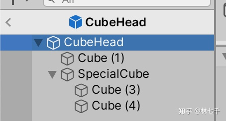
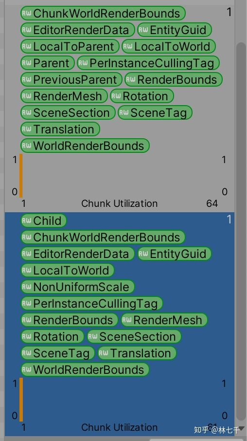

*(译前言: Unity DOTS提出了一套全新的开发技术栈, 但目前少有精讲如何结合现有工作流进行开发的资料, 外网 *[*这篇文章 (Game Object Conversion and SubScene)*](https://link.zhihu.com/?target=https%3A//gametorrahod.com/game-object-conversion-and-subscene/) 详细解构了基于 GameObject 和 Subscene 的工作流程和原理, 要求读者对 DOTS/ECS 有基本的了解, 虽然非常之长, 但值得一读)

***

游戏基本上就是关于玩家的输入如何改变(设计好的)数据, 并从渲染结果中得到乐趣的过程. 传统上, 这些数据是用 Unity 的所见即所得的编辑器来设计的. 但是基于 GameObject 的数据和 ECS 并不兼容. 如果在设计数据阶段能保留Unity的传统模式同时在 Runtime 阶段使用 ECS 高效处理数据, 那就能完美结合两者的优点.

## 以前是如何制作游戏的


如上图, 首先想想为什么方块能在每帧都被正确绘制到屏幕上? 在传统的 GameObject 里, 引擎会编译并排序整个 hierarchy 树, 同时按顺序调用绘制函数(draw call). 每次 Draw call 调用之间引擎需要初始化 material 和 mesh (也即 set pass call, 如果和前一次调用一样则无需初始化). 在内部 Unity 可能尝试合并 mesh 来减少 draw call (dynamic batching 和 static batching), 如果是 Dynamic 对象这步操作会增加一些 CPU 开销, 如果是 static 则会在build 时预先合并.

换句话说, 我们使用 Unity 构建的游戏保存在 YAML格式的 Scene文件中. 尽管游戏并非在 YAML 基础上运行, 在加载 Scene 并解析了方块 .prefab 文件后, 引起会准备一些 C++ 的内存用来存储 Transform, 相应代码则基于此来绘制.

在同一帧中这是同一块操作. 并取决于**数据**本身, 每个方块的`Transform`和 `MeshFilter` 告知了我们绘制什么. 不幸的是, 绘制都关注于什么样draw call 顺序能得到的正确的结果, 而所有这些绘制都来自于对于数据某些形式的迭代. (在C++中如果数据排布不佳依然不一定能高效迭代). 大家知道 ECS 擅长数据迭代. 而 Burst 加 ECS 则能帮助数据容易多线程处理, 这是我们为什么要用 ECS 来开发游戏的原因.

另一块操作则是逻辑. 在绘制之前, 比如方块可能有个 Bouncing 组件在持续地改变它的 `Transform` (好让你的游戏变得更有趣). 在改变用于绘制的数据这方面, ECS 依然能帮到你.

游戏基本上就这些了, 你有一些数据, 然后可能根据玩家的输入等因素来改变, 最后在每一帧中绘制出来.

结合改变数据和对数据的绘制, 玩家应该开始能感受到乐趣了! 事实上这一过程也常常使人放松(比如看着一个球在屏幕上下移动). 从纯数据的角度来审视游戏非常重要, 否则你无法接受基于 DOTS 来开发游戏的方式.

## 如何在 DOTS 的世界里做游戏

和`GameOjbect`不同, 数据在ECS里类似数据库, 设想一下, 因为我们可以使用Jobs或者 SIMD指令来更快地迭代数据, 所以不仅改变数据的逻辑非常高效而且绘制本身也是高效的.

接下来我们直接跳到最后. 我现在已经在使用ECS并且我有3个 transform 矩阵需要绘制(以`IcomponentData`形式, 所以迭代是线性且快速的) , 外加对应的 `Mesh` 和 `Material`.

使用 Unity 的 Graphics Api 我们可以直接绘制这些数据而无需 `GameObject` 这个数据容器! 参考 [Unity - Scripting API: Graphics](https://link.zhihu.com/?target=https%3A//docs.unity3d.com/ScriptReference/Graphics.html) 以及支持 `NativeArray` 的 `BatchRendererGroup`([https://docs.unity3d.com/2019.3/Documentation/ScriptReference/Rendering.BatchRendererGroup.html](https://link.zhihu.com/?target=https%3A//docs.unity3d.com/2019.3/Documentation/ScriptReference/Rendering.BatchRendererGroup.html)). 这时你已经可以直接从数据来绘制了. 只需要用 ECS 的`EntityQuery`等方法来获取数据并绘制它们.

参考这篇日文博客([https://virtualcast.jp/blog/2019/10/batchrenderergroup/](https://link.zhihu.com/?target=https%3A//virtualcast.jp/blog/2019/10/batchrenderergroup/)), 描述了 BatchRendererGroup 的优势. 尽管 "batches" 数量巨大, 性能依然优异. 要注意 batching 实际上是合并 mesh 的操作, 因此有一定的计算量. 绘制就是重复地调用没有改变的数据,只要你将 NativeArray 的内存留在 `BatchRendererGroup` 里面, 1000+的 "batches" 一点也不可怕.(较低的"set pass call"展示了在帧间绘制时并没有太多了 material 切换)

## Hybrid Renderer

Unity 开发了 Hybrid Renderer ([https://docs.unity3d.com/Packages/com.unity.rendering.hybrid@latest](https://link.zhihu.com/?target=https%3A//docs.unity3d.com/Packages/com.unity.rendering.hybrid%40latest)) 来完成上文提到的绘制工作. 如果你有一个关联 `LocalToworld` 组件(也即Transform矩阵)的 Entity , 且Entity 所在 Chunk 关联了是 `ISharedComponentData` 的 `RenderMesh` 组件 (`Mesh` 和 `Material` 不在 ECS 框架下), 那么它就会使用 `BatchRendererGroup` 来绘制数据.

整个 Chunk 基于 `LocalToWorld` 的数量来绘制的是同样数量的 mesh 和 material. 这已经类似于CPU版本的 GPU instancing 了, 只使用 draw call 是非常快的, 这种粗暴的绘制方式甚至可能比花费 CPU 来每帧合并 mesh 的方式还要快. 由于同一 chunk 使用同样的 `Mesh` 和 `Material` , 并非100%无需 set pass call. 如果你的 Material 开启了 GPU instancing, `BatchRendererGroup` 可以批量绘制可不是快速的重绘.

之所以这种方式称之为 Hybrid 是因为 `BatchRendererGroup` 是普通的 Unity API 而不是 ECS API. 但是这并不意味着这不是 Data-Oriented. 事实上 `BatchRendererGroup` 工作的方式非常地 Data-Oriented: 就是由 `MaterialPropertyBlock` 和 Transform 矩阵构成的 `NativeArray` 数据. 所以别害怕使用它(Hybrid Renderer) 除非你知道如何使用 Graphics API 或者使用 `BatchRendererGroup`构建你自己的渲染模式. (或许可以去掉非必须的步骤比如 culling).

## 让我们用纯数据来做个游戏吧

既然已经接受了游戏就是改变数据和展示数据, 使用 Hybrid Renderer 我们就可以来做游戏了. 我们假设这就是关于一个上下弹跳的方块的游戏, 按住空格的时候让它跳的更疯狂, 这可能对于小孩子来讲非常有趣.

首先要解决的问题, 如何获取到我们需要的 `Mesh` 和 `Material`. 我想我会使用 `Rensources.Load`来加载一个引用了相关 asset 的 prefab:

```csharp
using UnityEngine;

public class AssetHolder : MonoBehaviour
{
    public Mesh myMesh;
    public Material myMaterial;
}
```


下面的 System 用来创建Hybrid Renderer 要使用的数据.

```csharp
using Unity.Entities;
using Unity.Jobs;
using Unity.Mathematics;
using Unity.Rendering;
using Unity.Transforms;
using UnityEngine;

[UpdateInGroup(typeof(SimulationSystemGroup))]
public class CubeGameSystem : JobComponentSystem
{
    protected override void OnCreate()
    {
        base.OnCreate();
        var myCube = EntityManager.CreateEntity(
            ComponentType.ReadOnly<LocalToWorld>(),
            ComponentType.ReadOnly<RenderMesh>()
        );
        EntityManager.SetComponentData(myCube, new LocalToWorld
        {
            Value = new float4x4(rotation: quaternion.identity, translation:new float3(1,2,3))
        });
        var ah = Resources.Load<GameObject>("AssetHolder").GetComponent<AssetHolder>();
        EntityManager.SetSharedComponentData(myCube, new RenderMesh
        {
            mesh = ah.myMesh,
            material = ah.myMaterial
        });
    }

    protected override JobHandle OnUpdate(JobHandle inputDeps)
    {
        return default;
    }
}
```

瞧, 我的 data-oriented 方块坐标位于 (1, 2, 3)!


可以看到 Hierarchy 窗口里什么都没有, 但是方块却出现了. 编辑器窗口里也无法选中它, 它仅仅是被绘制了而已. 事实上编辑器里之所以可以选中是因为 `GameObject` 容器连接了绘制的内容和其他编辑的内容.

如果现在检查 Entity Debugger, 你会注意到 Hybrid Renderer 又添加了一些别的东西. 它会在提交数据到 `BatchRendererGroup` 之前剔除掉无法被看到的东西.


以上意味着: "你拥有 1 个chunk, 该 chunk 能容纳 128 个 Entity ( 1 个 Entity占用 125 字节, 1 个 chunk 16kb), 你已经使用了该 chunk 其中 1 个位置, 你还能添加 127 个方块. Hybrid Renderer 把方块 `LocalToWorld` 数据喂给 `BatchRendererGroup` 时, 这些数据在内存中都是连续排列的.

## Transform systems

现在你有一个数据并且绘制了, 接下来我们加点玩法.

如果人肉单纯修改 LocalToWorld 这个 4x4 Transform 矩阵将会无比痛苦, 所以 Unity 帮我们实现了一堆有用的系统来修改它:


使用`Translation`,`Rotation`,`Scale`/`NonUniformScale`组件将会极大简化我们的操作, 上图这些系统 会将这些组件的改动反应到 LocalToWorld 中.你甚至可以使用 Parent 来实现层级结构. 比如一个 Entity 的 Transform 为 0, 但同时有一个 `Parent` 组件指向了父 Entity, 那么最终该 Entity 的 `LocalToWorld` 值将会和父 Entity的 LocalToWorld 一样.

接下来我们添加 Translation 给方块. 玩法系统现在就可以通过修改 Translation 而不是 LocalToWorld了. 我同时添加了 Cube 组件作为 Tag, 这样子代码会更加清晰:

```csharp
var myCube = EntityManager.CreateEntity(
    ComponentType.ReadOnly<Translation>(),
    ComponentType.ReadOnly<Cube>(), //Tag
    ComponentType.ReadOnly<LocalToWorld>(),
    ComponentType.ReadOnly<RenderMesh>()
);
```

接下来实现弹跳. 我们使用 `Time .ElapsedTime` 作为余弦函数的输入, 会返回一个从 0 到 1来回的值.

注意, ECS 妙的一点在于你可以不断地添加新系统来实现代码的"横向地"以构建更多玩法. 模式则是从 ECS 快速的数据库里查询数据, 然后修改, 再存回去. 你可能对这种每次都查询-修改都要增加新 System 的模式觉得有些不安, 但这种模式提升了代码的扩展性. 而 Unity ECS 则确保了重复的数据查询是高效的, 因此在代码中有大量逻辑简单的 System 是完全可行的.

我们的弹跳系统先在主线程检查空格是否按下, 并声明相关变量, 最后在 Lambda jobs 中捕获这些变量, 并根据此并行修改查询到的 Cube 的 `Translation` 值, 其中每一个线程会运行时会使用 1 个 chunk 的 Cube 和 `Translation` 数据. `Time` 是由 ECS 库维护的一个属性, 它每帧都会从传统的 `UnityEngine.Time` 获取相应的数据

```csharp
using Unity.Entities;
using Unity.Jobs;
using Unity.Mathematics;
using Unity.Transforms;
using UnityEngine;

[UpdateInGroup(typeof(SimulationSystemGroup))]
[UpdateBefore(typeof(TransformSystemGroup))]
public class CubeBouncingSystem : JobComponentSystem
{
    protected override JobHandle OnUpdate(JobHandle inputDeps)
    {
        int multiplier = Input.GetKey(KeyCode.Space) ? 100 : 20;
        var elapsedTime = Time.ElapsedTime;
        
        JobHandle jh = Entities.WithAll<Cube>().ForEach((ref Translation t) =>
        {
            float3 value = t.Value;
            value.y = math.cos((float) elapsedTime * multiplier);
            t.Value = value;
        }).Schedule(inputDeps);
        return jh;
    }
}
```


Worker 线程现在已经在工作了. 当你用这种方式构建游戏, 最终几乎每个 Worker 线程都会来回使用以避免闲置:


## 可是这样构建游戏实在是太痛苦了

你应该已经注意到, 正儿八经的游戏要改成 data-oriented 并不容易. (除了上文的弹跳球这样的简单场景). 甚至现在你都没法使用所见即所得的编辑器了. 整个游戏如果按照这种方式获取 LTW + Mesh + Material 将会是噩梦般的开发旅程. 虽然整个游戏按照这样的方式构建非常恐怖, 但性能确实是会非常好. 有点倒退回 Cocos2D 时代的感觉. 自然你是想要在编辑器中快速地迭代玩法/美术相关内容.

但记住这个方块绘制效率极高, 如果你添加更多的方块, 它们都会打包喂给`BatchRendererGroup` 因为在同一个 chunk 内存里 `LocalToWorld` 已经被连续排列好了. 而复制一个方块也不再是复制`GameObject`这样昂贵的操作, 只需要添加更多 Entity 以及相应的组件.

同样的, 一个 Entity 将数据转存回 `GameObject` 也不是什么好主意 (`GameObjectEntity` 就做了这样的事儿), 我们想要运行时的 pure ECS , 而不是桥接回 `MonoBehaviour` 的 ECS.

简言之, 你想要 ECS 的高性能, 但不想要按这样的方式来开发游戏.

## Conversion workflow

所以 Unity 团队采用了常规的 GameObject 来仅实现**编辑操作(authoring),** 而在运行时, 则将这些 GameObject \*\*转换(convert)\*\*为纯粹的 ECS data.

我之所以之前介绍 renderer 和 transform, 是因为转换过程实际上是将编辑时方便的 GameObject 对象转换为高性能 transform 和 renderring 系统支持的 entity.

**Component object**

在进阶之前, 我假设你已经知道了 component objects. 这不仅是可以添加到 Entity 上的 `IComponentData` 组件, 你甚至可以使用 `MonoBehaviour` 类型.

只不过你无法在 jobs 使用这些类型, 很多有 `IComponentData` 约束的泛型 API 也无法被使用. 但是这种类型的组件确实是关联到 Entity 上的, 也有相关的 API 可以使用. 以下是一些支持 component objects API 例子:

- `EntityManager`:`AddComponentObject`,`GetComponentObject`. 如果添加不存在的组件, 你在获取时会得到一个 null.

- `ComponentType`: 你可以创建 `<T>` (如`MonoBehaviour`)类型的 `ComponentType`

- `system.GetEntityQuery`,`em.CreateArchetype`: 因此你可以使用`MonoBehaviour`类型的 `ComponentType` 来创建组件的查询.

- `EntityQuery`:`ToComponentArray`会返回 `T[]`. 这会返回以托管数组方式存储托管组件的结果, 而不是`ToComponentDataArray`那样返回 `NativeArray<T>`

## Conversion world, destination world, primary entity

在内部, 转换过程是创建特定目的的 World, 并在其中运行特定的 **conversion systems** (这样你会得到一个新的 `EntityManager`, 以及存储entities 的数据库). 这被称为 **conversion world**. conversion world 同时也知晓用于存储转换结果的 **destination world.**

因为conversion world is一个 ECS World, 我们可以从 Entity 出发来而不是仅仅是 Hierarchy 中的 `GameObject`. 由于前文所提到的 component object 的存在, 从`Gamebject` **importing** 的过程也非常容易, 所以你也可以得到一堆完整复刻 `Gameobject`原有层级关系和组件的 Entity (使用 class 类型组件). 也就是说, 让每个 entity 也拥有 Unity 传统的 `Transform`, `RectTransform`, `MeshFilter` 或者 `LineRenderer` 组件.

这些拥有component object 的 entity 并不优秀, 我们更希望得到更优的基于 `IComponentData` 的组件.

通过**单次调用** conversion world 的 `update` 方法, 其中的特定 system 也会 update 单次, 这会导入 component object entity 并将结果存入 destination world. 至少, 这会为每一个conversion world 中找到的 `Transform` 组件创建一个空的 Entity.


上图中, destination world 的 Entity A 被成为 `GameObject A `的 "primary entity". 之所以没有被称为 "resulting entity", 是因为这转换过程并非是一对一的过程. 比如 A 可能在 destination world 中构建出 A1 和 A2 两个 entity, 这种情况, 其中一个将成为 primary entity.

另一个**在 conversion world 工作时**的特点是你可以通过原始的 `GameObject` 获取 primary entity(当然也可以传入任一 `MonoBehaviour` 来获取, 内部将会调用`MonoBehaviour`的 `.gameObject`来替代). 比如上图 A 的`Transform` 也可以用于获取 primary entity, 这在更复杂的转换过程中可能有用.

最后, 包含那些并不高效的 Entity 的 conversion world 将会被 **destroy** 掉.

## GameObjectConversionSystem

被标记了如下 attribute 的 system 将在 conversion world 中被调用:

```csharp
[WorldSystemFilter(WorldSystemFilterFlags.GameObjectConversion)]
```

这个 attribute 是可继承的, 因此更推荐的方法是直接继承ECS库里已提供的`GameObjectConversionSystem`.

拿 `TransformConversion` system 为例. 它会在 conversion world 里面寻找 `Transform` 组件, 依此来构建 destination world 中 entity 的`LocalToWorld`和`Translate`/`Rotation`/`NonUniformScale`组件, 它甚至知道在`Transform`的 scale 为`(1,1,1)`时不添加`NonUniformScale`!


另一个值得看的例子是 `MeshRendererConversion`. 这是`MeshFilter`和`MeshRenderer`转换为`RenderMesh` 加 `Mesh` 和 `Material` 的地方


## Conversion 的顺序

conversion systems 都是被扫描以及归集到一起的, 因此顺序并没有被清晰地定义. 假设你想要转换过程中 "get primary entity" 并获取到 `LocalToWorld` 组件, 执行顺序就变得很重要了, 因为你要确保你的 conversion system 在 Unity 的 `TransformConversion`之后执行.

`UpdateInGroup`依然排得上用场. 在 conversion world, 有如下一些 groups:

```csharp
public class GameObjectDeclareReferencedObjectsGroup : ComponentSystemGroup { }

public class GameObjectBeforeConversionGroup : ComponentSystemGroup { }
public class GameObjectConversionGroup : ComponentSystemGroup { }
public class GameObjectAfterConversionGroup : ComponentSystemGroup { }

public class GameObjectExportGroup : ComponentSystemGroup { }
```

如非特别指定, 你的 system 将运行在 `GameObjectConversionGroup`中. 因此如果你想要在Unity内置的 conversion system 之后做事情, 你得确保你的 system 运行在其后. 要注意的是你不能使用`[UpdateAfter(typeof(TransformConversion))]`因为`TransformConversion`不是`public`的. 从前文截图你可以看到它运行在 before group 中, 因此你的默认运行在`GameObjectConversionGroup` 中的 system 是可以获取到 `LocalToWorld`等组件的. `MeshRendererConversion` 则运行在 `GameObjectConversionGroup` 中, 因此如果你想要获取到 RenderMesh, 则需要将你的 system 放在其后.

declare 和 export Group 很特殊, 因为它们运行在特定的过程的前后, 而中间三个 Group则是一紧挨着运行, 因此, 你如果要放在这两个 Group 内运行, 一定得明白它们前后都做了些什么事儿(后文会讲).

```csharp
???
GameObjectDeclareReferencedObjectsGroup.Update()
???
GameObjectBeforeConversionGroup.Update()
GameObjectConversionGroup.Update()
GameObjectAfterConversionGroup.Update()
???
GameObjectExportGroup.Update()
```

## GameObjectConversionMappingSystem

conversion world 还有一个非常特别的系统附加在所有可用的 `GameObjectConversionSystem` 里, 就是`GameObjectConversionMappingSystem`. (下文称之为 mapping system). 该系统是所有 conversion world 的 boss, 奇迹发生之地.

首先这是一个纯粹的 "tooling system", 意思是它只有一个空的 `OnUpdate` 函数, 完全是用来被其他系统获取, 并在它们的`OnUpdate`中使用的工具.(这种设计也适用于你自己的游戏.)

这里你可以执行`GetPrimaryEntity` 来与 destination world 沟通, 或者创建更多的 entity. 当你想执行 conversion, 你需要显式地指定 destination world. 这个 world 用来当作 mapping system 的 constructor.

在你的 conversion system 里面, 你可以 `GetOrCreateSystem` 来获取 mapping system, 但如果你继承了`GameObjectConversionSystem`, 则可以直接通过相应的`protected` 方法获取到.

## 让我们使用 ConvertToEntity 来convert吧

现在已经有足够的知识来执行转换过程了. 目前我们仅仅使用 Unity 内置的 conversion system. 也即`TransformConversion`和`MeshRendererConversion` , 因此确保你的输入拥有`Transform`,`MeshFilter`和`MeshRenderer` 来得到结果.

要在scene里面选择 game objects导入 conversion world, 我们可以使用`ConvertToEntity`组件. 在 `Awake` 里面, 它会基于一些标准来选择导入什么. 所以若如下图附加到`GameObject`上, 那么在 conversion world里, 我会得到这些ECS的 **component objects:** `Transform`,`Hello`.


当进入 play mode 时, `Awake` 被调用的瞬间后你得到:


当前状态当然还没准备好绘制, 因为还没有 `RenderMesh`, 但是你可以看到`TransformConversion`发现了`Transform`component object 然后就在conversion world 被销毁之前, 在 Primary entity 上构建了 LTW/TR .

如果我修改一下 scale:


转换的结果:


因为 `TransformConversion` conversion system 的代码发现了 `Transform`有非 1 的 scale, 于是决定加上额外的组件到 primary entity 上.

接下来看看`MeshRendererConversion`在我们添加了 `MeshFilter`和`MeshRenderer` 后做些什么:


我得到了一个正确转换且拥有纯粹ECS数据后的方块! 另外 conversion world 也可以分配 entity name, 因为 conversion world 知晓 `Transform` 的存在, 所以可以在 conversion world 被销毁前通过`.gameObject.name` 来追踪其名字.


`ConvertToEntity`组件里"and destroy" 选项并非 conversion world 流程里的内容, 由该MonoBehaviour 组件自行完成. 因为它并不觉得你想要复制出同样的结果, 如果我不销毁掉原对象, 那么我就会得到两个方块, 一个来自`MeshFilter`和`MeshRenderer` , 另一个来自Hybrid Renderer 渲染的`RenderMesh`和`LocalToWorld` .

如果你不想要默认的行为, 你可以使用`GameObjectConversionUtility.ConvertGameObjectHierarchy`手工转换. 后文会细讲.

## Hierarchy conversion

`ConvertToEntity` 实际上提交了所有子 `GameObject` 给 conversion world, 除非你在子对象中使用 `ConvertToEntity (Stop)`.


上图的结构中, conversion world 最后会得到: A B E F G H. 每一个元素的 component objects 都会和最初的类似. `Transform`component object 是关键点, 因为它有`.parent`属性, 这样 conversion world 才能基于此构建出整个层级树.

给 D 添加 `ConvertToEntity`是不会有效果的(在C处转换就停止了), 因此会抛出警告. 而添加`ConvertToEntity`给 B 则没有警告, 但也不会有额外的作用, 因为 A 处隐含了 B也将被纳入层级的事实.

ECS 里有一个`Parent`组件, 该组件仅有一个`Entity`字段用来表示 transform 的层级关系.`LocalToWorld`的计算总是基于`Parent`组件. 如果 `Translation`是 0, 那么 `LocalToWorld` 矩阵的结果并不是在行1 2 3 和 列4为0, 而是直接复制`Parent`所指示Entity的`LocalToWorld` 的值.

而负责计算`Parent`的正是 `TransformConversion`, 让我们看看结果:


我们先猜猜A B E F G H 会占用多少 chunk? (不管转换过程中有多少魔法, 我们永远得关注数据本身!) 先假设我们这些对象的 scale 都为1 (这样就不会产出`NonUniformScale`组件).


为何有 3 个chunk?

你可能会猜测所有 chunk 都会有 `Parent` 而对于根部的 A, 其`Parent`则可以是一个 `Entity.Null` , 但是 Unity 并没有选择这样做, 因为在复杂一些的游戏里, 查询时使用`ComponentType.Exclude` 会相对更加高效一点. (你可以想象成如果没有parent组件, transform systems 可以忽略掉一些矩阵运算.)

- 没有 Parent, 但有 child : A

- Parent 和 Child 都有: F

- 叶子节点, 仅有 Child: B E H G

你可以看到还有一些 component 被添加了: `LocalToParent`,`Child`,`PreviousParent`.目前还无需关心它们, 总之它们会最终参与`LocalToWorld`的计算.

注意到 conversion 过程中有多少个不同的 Archetype 产生有时候很有用. 比如当你有个巨大的 game objects 层级树, 且其中有些对象仅仅是用来组织结构的空对象, 有些则真正拥有`MeshFilter`and`MeshRenderer`, 这样你最终可能会至少得到 6 个 chunk. (3个前述chunk, 以及3个包含`RenderMesh` 的chunk). 因为`RenderMesh`是`ISharedComponentData`, 如果你有更多的 mesh 和 materials, 那么 chunk 的数量还会继续增加. 总之, 这类的思想也出现在dynamic/static batching, GPU instancing, 或 SRP batchers 之中, 而不是 ECS 独有. 使用Entity Debugger 可以清楚地看到 chunks 是如何被组织的.

"and destroy" 的行为在 stop 时也会有一些变化, 被 stop 的对象之下的层级会被单独摘出来并保留(因为 Unity 猜测既然那里你没有相应的 entity, 那么就为你保留 gameobject)


## Disabled 与 GameObject conversion

被 disabled 了的`GameObject`会被加上一个 ECS 中的`Disabled`component, 如下所示, Convert and destroying 顶部的 Cube, 你会得到 5 个 Entity, 其中 3 个关联 `Disabled`component:


当然你依然可以在层级任何位置添加 Convert To Entity (Stop), 其行为不会发生变化. 比如我在 Cube(1) 和 Cube(4) 上添加 stop, 那么我最终将得到 3 个 Entity: Cube(2) , 有`Disabled`的Cube(3), 没有`Disabled`Cube .

## Convert and inject 模式

假如:

- 你想保留原始的 game object

- 同时想在 conversion world 销毁之前导出 **component objects** 给 primary entity. (当然也包含转换过程中新增的 components)

如前文中提到的, 我有`Hello`和`LineRenderer`会被带进 conversion world , 但由于并没有conversion system会处理`Hello`和`LineRenderer`, 因此会在 conversion world 被销毁时也同时被销毁.


但在"Convert and inject"模式下, 这两者就可以被保留:


这样, 我像之前一样正常得到了`LocalToWorld` , 但同时我也得到了`Transform` `Hello`和`LineRenderer`, 这意味着你得到了一个可以追溯回原始 GameObject 的 Entity. 如果我们在别处 destroy 这个 GameObject, 那么 ECS 侧的`em.GetComponentObject<Transform/LineRenderer>` 也相应回返回 `null`.

现在你应该明白了, 销毁或者不销毁原始 Gameobject 两种模式都有各自的意义 (前者是为了避免重复, 后者为了访问 component objects).

这意味着如果我有一个关联`MeshRenderer`和`MeshFilter`的方块同时又选择了inject模式, 我会得到渲染在同一位置的两个方块. 如下图, 一个方块是 2 \* 6 \* 2 = 24个 tris(额外 2个 tris是蓝色的背景所占用的), 如果使用 convert and destroy, 我依然会得到 26 个 tris并被Hybrid Renderer所用, 在但 inject 模式下, 会变为 50 个 tris, 因为转换前后的对象都被保留了:


上面这个例子并不是 inject 模式的预期用法, 该模式是用于当你需要在 conversion 的结果上面回溯原有对象的情况下才有用, 而 Hybrid Renderer 显然无需回溯.

## 使用 ECS 的System 来管理传统的 MonoBehaviour

inject 模式最酷的在于, 从现在开始, 你就可以制作 hybrid ECS 游戏了. 你可以把 inject 模式视作将对象转化为 ECS system 可访问的对象, 甚至在你没有 conversion system 的时候. 仅仅是保留 component objects 以及是非常有用了. 你完全可以用 `MonoBehaviour`进行组件的开发, 然后用 system 来控制它们.

你可以在 `GameObject` 上就如同`IComponentData`一般添加 `MonoBehaviour`, "tag 用途的`MonoBehaviour`" 也是完全可行的. 不过过去常见的`MonoBehaviour`继承模式在ECS的世界里, 你可能需要考虑用组合模式来替代了, 一如 ECS 里常用的`struct` 并不能继承.

虽然并没有性能上的提升, 但是依托 ECS 的查询能力可以获得 system 设计上极佳的灵活性.

或许你过去常常使用一种"manager优化"手段, 就是你去掉移除对象的`Update` 方法, 然后让一个 Manager 来追踪该对象的`List`来统一地 `update`.

而用于操作 component object (monobehaviour) 的 system 正是和上述优化一模一样的玩意儿! 而且 ECS 在查询上更加灵活. 你可以不断添加查询不同种类 component object 的 system. 这样对于在团队中分割工作量更容易. 也可以通过 `UpdateBefore/After` 调整执行顺序, 而不是过去地狱般的 script execution order.

举一个 UGUI 按钮的例子. 我想要用 system 来添加一段逻辑: 改变`interactable`时按钮会在正常和禁用状态之间闪烁.


所有按钮都使用 convert and inject, 其中一个缺少`BlinkingButton`"tag"`GameObject`. 目前还没有任何实际代码, 不过我想要用这些类型来进行查询.

来看看 conversion 后的结果, 我们得到 2个 chunk, 其中一个有3个 entity (橙色的竖条往右边移动了一点, 意味着其包含 3/160 个 entity), 另一个则有一个 entity.


下面的 system 则能自动到 ECS 的数据库里面查询 scene 里面所有带有 blinking 组件的按钮. 这种"凭空"查询`GameObject`的能力让声明`GameObject[]`成为了过去时. 即便你对 ECS 毫无兴趣, 这种查询能力也让其成为非常便捷的 Unity 开发工具.

```csharp
using Unity.Entities;
using Unity.Jobs;
using UnityEngine.UI;

[UpdateInGroup(typeof(PresentationSystemGroup))]
public class BlinkingButtonSystem : JobComponentSystem
{
    EntityQuery blinkingButtonQuery;
    protected override void OnCreate()
    {
        base.OnCreate();
        blinkingButtonQuery = GetEntityQuery(
            ComponentType.ReadOnly<Button>(),
            ComponentType.ReadOnly<BlinkingButton>()
        );
    }

    //It is not a good idea to have data in system!
    float collectTime;
    bool on;
    
    protected override JobHandle OnUpdate(JobHandle inputDeps)
    {
        collectTime += Time.DeltaTime;
        if (collectTime > 0.2f)
        {
            collectTime -= 0.2f;
            on = !on;
        }

        Button[] buttons = blinkingButtonQuery.ToComponentArray<Button>();
        foreach (var b in buttons)
        {
            b.interactable = on;
        }
        return default;
    }
}
```


`Entities.ForEach`也可以使用 component objects, 只不过这时候不能使用`ref`或`in`关键字, 同时为了防止使用 Burst, 你需要用`Run`来替代`Schedule`.

```csharp
Entities.WithAll<BlinkingButton>()
  .ForEach((Button b) => { b.interactable = on; }).WithoutBurst().Run(); 
```

这样完全或者部分移植到 ECS 的游戏, 也可以自由使用 system 了, 只需要 inject 模式, 你便拥有了基于 Entity 的查询能力.

## Inject 模式的 conversion 规则

上文例子中将所有的`Button`转换到 ECS 了, 那`Button` 里的`Text`怎么办呢?

和会将所有子层级提交到 conversion world 的 destroy 模式**不同**, 这时所有的子层级将被忽略(即便你为它们添加了inject模式的`ConvertToEntity`组件). 仅有顶层对象会正常convert and inject. 所以 ECS 不会为创建关联`Text`component object的`Entity`.

为了更清晰地说明这条规则, 我试着 convert 更上层的`Canvas`:


这下我的 Button 并没出现在 ECS 的世界里, 而只得到了 Canvas, 如果我把模式切回 destroy, 则得到一堆 pure 的 entity 而不带任何 component objects:


可以看到, 所有在conversion world 中的 component objects 最终都被销毁了.

## IConvertGameObjectToEntity

实现 conversion system(通过继承`GameObjectConversionSystem`)可以让你自由控制conversion 的过程. 但如果你想按照具体类型来转换呢? 每当转换执行时, 应当相应地执行一些代码.

Unity 内置了另一种名为`ConvertGameObjectToEntitySystem` 的 conversion system. 该 system 会迭代 conversion world 中所有的`GameObject`, 接着使用`GetComponents` 并判断是否实现`IConvertGameObjectToEntity` 接口, 然后再调用该接口的`.Convert` 方法. 你可以把任何逻辑都放在这里:

```csharp
using Unity.Entities;
using UnityEngine;

public class BlinkingButton : MonoBehaviour, IConvertGameObjectToEntity
{
    public void Convert(Entity entity, EntityManager dstManager, GameObjectConversionSystem conversionSystem)
    {
    }
}
```

`entity`参数是 `GameObject`产生的 primary entity. 回忆一下前文提到"primary entity"与`GameObject` 以及相应`MonoBehaviour` 关联. `dstManager`参数则是 destination world 里的 `EntityManager`. 在这里你可以做任何相关联的事儿, 比如为每个`BlinkingButton`添加 500 个屁用没有的 Entity?当然可以!

你可以利用这里的机会来使用`dstManager.Add / SetComponentData`来初始化更多数据. 要注意这里有一丝"遥控" destination world 的味道(因为实际上你工作在 conversion world 层面). 所以重视这个参数名字, 因为确实有另一个属于 conversion world 的 manager.

单独创建 conversion system 并使用`Entities.ForEach`来初始化数据也许会更高效一些(因为你在这里使用 Burst 和 jobs). 但是 Convert 方法运行你获取到`MonoBehaviour`中序列化的字段, 这样更加随心的修改每个 entity 关联的数据.

`conversionSystem`参数则是调用`Convert`方法的`ConvertGameObjectToEntitySystem`本体, 但是强制被转换成了`GameObjectConversionSystem` 类型(小心名称有点易混). 其目的是让你可以使用 mapping system 中的方法.

## LinkedEntityGroup

`LinkedEntityGroup`是一个 dynamic buffer , 通常它会影响:

- 调用`Instantiate`方法时, 会同时实例化所有 buffer 中的 entity, 同时也会创建相同的`LinkedEntityGroup`. 注意实例化并不一定和ECS中的`Prefab` component 直接关联.

- 调用`DestroyEntity`时也会同时销毁 `LinkedEntityGroup`中的所有 entity. 类似在编辑器中删除`GameObject`

- 调用 `entityManager.SetEnabled` 加上的 `Disabled`component 会告知 ECS 的查询系统忽略它们, 而 `LinkedEntityGroup` 中的 entity 也会受到同样的影响. 有点类似禁用`GameObject` 时同时会禁用整个层级树.

注意如果buffer 中的 entity 也有`LinkedEntityGroup`, 系统**不会递归地**执行instantiation/destroy/disabled 过程.

这些过程在具体执行当中也有一些细微不同.`Instantiate`和`SetEnabled`只要检测到 buffer 便在所有成员上一次性执行, 不会做其他更多事. 这意味着关联该 buffer 的 entity **必须要把自己包括在内**才能正常工作\*\*.\*\* 然而`DestroyEntity`则无所谓, 因为它会先销毁传入的entity, 然后再迭代 buffer 中的 entity 进行销毁.

要注意`LinkedEntityGroup` 和 `Parent`并不一样 (虽然它们经常同时出现). 后者是递归地工作, 循环依赖也是不允许的.

## 从非 prefab conversion 中获取LinkedEntityGroup

目前, 我们使用`ConvertToEntity`并不能得到 `LinkedEntityGroup`. 所以当销毁转换后的 entity时, 并不能连锁地销毁相关联的entity(比如Child/Parent), 不管你是否认同, 目前这是默认的行为. (`ConvertToEntity`却可以正常得到基于`Parent` 的层级结构).

如果你需要该 buffer 正常添加, 在 mapping sysytem 中有一个方法可以使用:

```csharp
 public void DeclareLinkedEntityGroup(GameObject gameObject)
```

调用后 primary entity 会得到该 buffer, 并包含所有子对象(递归地查询, 线性排列的结果).

```csharp
public class CubeConvert : MonoBehaviour, IConvertGameObjectToEntity
{
    public void Convert(Entity entity, EntityManager dstManager, GameObjectConversionSystem conversionSystem)
    {
        conversionSystem.DeclareLinkedEntityGroup(this.gameObject);
    }
}
```


从 debbuger 现在可以看到已经正常添加了`LinkedEntityGroup`, 目前它已经支持`Instantiate`和`SetEnable` 的正常工作了:


Unity 也在其他一些地方执行这一过程, 比如在转换 prefab **asset** 的时候.(后文会讲)

## 尺寸警告!

你可能觉得每个 chunk 16KB 非常多了, 你最多可以放进去 2000个 entity. 一旦你开始转换层级结构, `LinkedEntityGroup`和它那些朋友们(比如 `Child` )会很快耗光这些预算, 每一个 buffer 里的元素都是一个 8 bytes 的 `Entity`.

下图中 12 个 chunks 中, 每个只能容纳 45 个 `Entity` , 哪怕只是非常简单的层级结构和非常少量的 component, 远达不到我们的千个级别.


在 entities-0.5.1版本里, `TypeManager.cs` 源码中可看到, 任何没有`[InternalBufferCapacity]` 的buffer 类型都会默认 `128/size` 的容量. `LinkedEntityGroup`里面装的是 entity, 因此其容量是 `128/8 = 16` .


这意味着:

- **每个 Entity** 关联的`LinkedEntityGroup`(或者其他未指定 capacity 的buffer) 将占据 128 bytes. 这是 chunk 容积变小的原因.

- 层级中超过16个子对象并不是什么好事, 一旦超过这个数量, 这些 linked entities 不得不从排列良好的 chunk 内存中挪到堆内存中. 可能 Unity 认为 16 是一个不太可能达到的值, 而 8 又太过于常见.

- 除非显式调用, `LinkedEntityGroup`仅仅在 prefab 的 conversion 过程中被自动创建, 因此你只需要注意你的 prefab 里面嵌套的 `GameObject` 数量

- 在运行时, 所有嵌套 prefab 和 prefab variant 工作流并不受影响, 系统内部只把它们看过一个单独的 prefab. 你无法把嵌套 prefab 从父 prefab 中拿出来, 并期望`LinkedEntityGroup`正常工作.

最后, 16kb 一个 chunk 意味着 1MB 大概包含 60 个 chunk. 如上例, 你能在 1MB 存储大约 2700 个转换后的GameObject , 这样看来或许45 的 chunk 容量也不用太担心了(当然具体情况具体分析).

## 创建额外的 entity

一个常见的情况是一个 GameObject 对应一个 Entity, 也即 "primary entity". 在 mapping system 里面, 调用 CreateAdditionalEntity(gameObject)来创建更多的Entity .这些 entity 现在属于这个 game object 的 "secondary entity".

设想我们的新设计是每当CubeMultiple 转换时将会创建额外的两个 entity:

```csharp
public class CubeMultiple : MonoBehaviour, IConvertGameObjectToEntity
{
    public void Convert(Entity entity, EntityManager dstManager, GameObjectConversionSystem conversionSystem)
    {
        Entity additional1 = conversionSystem.CreateAdditionalEntity(this.gameObject);
        dstManager.SetName(additional1, $"{this.name}_Add1");
        Entity additional2 = conversionSystem.CreateAdditionalEntity(this.gameObject);
        dstManager.SetName(additional2, $"{this.name}_Add2");
    }
}
```

注意Convert调用是递归的, ConvertToEntity 附加在顶部的 CubeHead 上.


要注意额外的entity都是新增的, 且没有为它们添加 components, 这不像那些被默认转换的component objects (如 Transform), 注意下方拥有 2008 容量的 chunk:


你可能意识的到使用 destination entity manager 的 dstManager.CreateEntity() 来做同样的事情, 下文你会看到这不只是处理方式的问题.

## 从单一源得到 entity

要这样做, 需要在 mapping system 里, 调用GetEntities(gameObject/component). 因为我们增加了额外的 entity, 让 conversion world 知道这些 entity 来自特定的东西, 这样让我们可以查询到它们. 比如, 如果我有一个GameObject CubeMultiple 的引用, 那么使用GetEntities 我就能得到 primary entity 和另外两个新增的 entity.

你无需担心它们是否已经被创建了或者担心Convert 顺序, 因为这类调用会例行调用Convert . (这一点同样适用于GetPrimaryEntity )

## 如何影响 linked entity group

回忆一下DeclareLinkedEntityGroup. 通过正确增加额外的 entity, conversion system 知道它们如何关联至 GameObject. 这些结果也会添加进 linked entity group.

前面 CubeHead 的例子在自己身上调用DeclareLinkedEntityGroup , 结果是已经把额外增加的 entity 包含进来了:


而只是单纯地通过dstManager 来创建 entity 则不会有这样的效果. 这样看起来转换CubeMultiple 更像是带着一些添加更多 Entity 到 destination world 的"副作用", 而不是它变成了多个 entity. 而这种模式也能配合 live link 的工作. (后文会解释)

## 声明 Asset

或许你也想通过 asset 而不仅仅是 scene 来生成 entity, 好消息是 primary entity 可以关联到 asset 上, 不只是GameObject (或MonoBehaviour), 如果你调用GetPrimaryEntity 时传入 asset, 最后会在 mapping system 里面注册, 并得到正确的 entity.

因为你无法将ConvertToEntity放置到 asset 文件上, 你需要在 conversion 后某种"声明"它们是 entity的方法.

**什么时候声明?**

答案是在 conversion 真实发生之前. 这被称之为 discovering 过程. 如果你在这个conversion过程之中试图添加, 声明的 API 就会报错. 在声明之后, 在 conversion 过程中, 你就可以使用 GetPrimaryEntity来传入 asset 的 primary entity了. 如果你不这样做, 那么查询它们将会有点困难.

**IDeclareReferencedPrefabs**

在 discovering 阶段, 首先, 实现了IDeclareReferencedPrefabs组件接口的GameObject会被扫描, 在这里你可以通过添加 prefab asset (目前只支持 prefab 文件) 到相应的 list 中来进行声明. 你可以在inspector里通过序列化的 GameObject 字段来引用它们.

**在conversion systems里面声明**

在扫描了接口之后, 回忆一下我们前面提到的GameObjectExportGroup. 所有运行在第一个 GameObjectDeclareReferencedObjectsGroup 中的 conversion system 会被 update. 在这里, 你有另一个声明 asset 的机会, 这里支持 prefab 和**其他任意类型的 assets.**

```csharp
public class GameObjectDeclareReferencedObjectsGroup : ComponentSystemGroup { }

public class GameObjectBeforeConversionGroup : ComponentSystemGroup { }
public class GameObjectConversionGroup : ComponentSystemGroup { }
public class GameObjectAfterConversionGroup : ComponentSystemGroup { }

public class GameObjectExportGroup : ComponentSystemGroup { }
```

使用 conversion system 意味着你手边可以使用 mapping system. 其中有几个方法可以用来声明 asset. 接下来你将如何在 system 代码中获取到这些 asset 引用呢? 你可以在conversion world 中查询任意可能链接了 asset 的 component object (比如通过在可以在 inspector 中添加的字段). 当然可能某个时间点你会意识到不如最开始就使用IDeclareReferencedPrefabs , 因为反正你都得实现某种"占位"机制. 所以, 如非必要, 尽可能使用 IDeclareReferencedPrefabs 吧.

接下来到了正常 conversion 的时候, 这时候你可以结合 IConvertGameObjectToEntity 来获取已经被转换好的 asset/prefab 的 Entity, 传入之前一样的引用即可:

```csharp
public class BlinkingButton : MonoBehaviour, IDeclareReferencedPrefabs, IConvertGameObjectToEntity
{
    public GameObject myPrefab;
    
    //This first
    public void DeclareReferencedPrefabs(List<GameObject> referencedPrefabs)
    {
        referencedPrefabs.Add(myPrefab);
    }
    
    // |
    // V
    
    //Then GameObjectDeclareReferencedObjectsGroup <- last chance to declare stuff
    
    //Then GameObjectBeforeConversionGroup
    //Then GameObjectConversionGroup, which contains ConvertGameObjectToEntitySystem that run the following Convert

    public void Convert(Entity entity, EntityManager dstManager, GameObjectConversionSystem conversionSystem)
    {
        //Get primary entity of the prefab asset, to assign to primary entity converted from this component.
        Entity prefabAssetEntity = conversionSystem.GetPrimaryEntity(myPrefab);
        //Remember it, etc.
    }
    
    // |
    // V
    
    //Then GameObjectAfterConversionGroup
}
```

要注意 IConvertToGameObjectToEntity 的 Convert 被调用时你依然有机会使用 mapping system. (添加额外 entity, 遍历其他 primary entity 等等) 但如果你这时候使用 mapping system 来声明更多东西就太晚了会报错.

以下就是完整的过程:

```csharp
// ??? <- IDeclareReferencedPrefabs 调用.
GameObjectDeclareReferencedObjectsGroup.Update()
// ??? <- discovery 阶段结束, 无法再声明更多 asset.
GameObjectBeforeConversionGroup.Update()
GameObjectConversionGroup.Update()
GameObjectAfterConversionGroup.Update()
// ???
GameObjectExportGroup.Update()
```

顺便一提声明截至仅仅针对 asset/prefab, 你依然可以在conversion 过程中调用DeclareLinkedEntityGroup.

**声明任意 asset**

在 mapping system 里 使用DeclareReferencedAsset , **在 conversion world 里**, 你会得到一个关联 Asset conponent , 外加一个你声明的 asset 类型的 component object 的 Entity (注意并非 destination world).

例如我可以通过DeclareReferencedAsset(mySpriteAtlas).来创建一个Entity+Asset+SpriteAtlas , 这时候 destination world 的 primary entity 依然是空的, 目前还不明白这个系统设计的目的, 也许是为了让你自己处理Asset的转换过程.

**声明 prefab asset**

添加进IDeclareReferencedPrefabs 里的 list 就行. 对于 GameObjectDeclareReferencedObjectsGroup 里的 system 来讲, 则是使用 mapping system 的DeclareReferencedPrefab 方法.

不过这一次和AssetandGameObject component object 不一样, 你会在 destination world 中得到一个真正的 **prefab engity** (而不是前面说到的空结果).

接下来简单解释下什么是 Entityprefab. 如果你添加一个 Prefab 组件到任何 Entity, 除非你显式指定, 那么它将在默认 query 中隐身, 和Disabled组件的行为很相似. 使用 Instantiate方法则会将实例化出的 entity 将该prefab组件删掉. (毕竟你不太可能想要实例化另一个 prefab 出来...)

不过该行为的目的又有所不同, 之所以在 query 中隐藏它们是并非主观上想要让它们处于 "inactive" 状态, 而是它们本就该是 "inactive". 它们只不过是用来快速创建新数据的蓝图. 因此, 在创建 query 时有两个不同的参数模式: "include disabled" 和 "include prefabs". 使用时注意语义上的区别 (如不要使用 Prefab 来隐藏 Entity).

结合前面提到的LinkedEntityGroup , 现在ECS的实例化已经和传统 Unity 的实例化感觉一样了!

通过声明 prefab asset, 你便同时添加了Prefab和LinkedEntityGroup 到目标primary entity上.

要注意ConvertToEntity只是转换对象为普通的 Entity, 因为 scene 里的层级结构并不是 **asset.** 无论它们是不是蓝色的(即在scene里被实例化的 prefab), 我们都无法得到Prefab或LinkedEntityGroup.

Prefab 本身则属于 asset 文件, 你无法在 Project panel 中粘贴ConvertToEntity运行. ECS 库通过查看它是不是位于 scene 中来决定它是不是一个 prefab, 显然可以粘贴ConvertToEntity 则意味着对象在 scene 中.

## Prefab asset conversion 过程

上面的声明过程实际上会调用 convert 过程. 接下来我说说和转换 scene 中GameObject在细节上有哪些不同. 只要在 scene 层级中, 是否从 prefab 实例化就无关紧要, 只有在从 Project panel 处声明的 asset 被实例化时才会有区别:

**为实例化准备的自动 LinkedEntityGroup**

如下所示的 prefab asset 设置:




要意识到 CubeHead 是一个 asset, 而不是 scene 对象.

```csharp
[GenerateAuthoringComponent]
public struct PrefabConversion : IComponentData
{
    public Entity prefab;
}
```

我们会得到:


- 如果我们 convert 位于 scene 中的 CubeHead, 我们无法获取到LinkedEntityGroup. 该行为仅仅针对 prefab asset, 其目的显然是为了实例化. (链锁销毁行为也一样)

- LinkedEntityGroup 包含层级树下的所有对象以及自己, 包括 cube 3 和 cube 4. Conversion过程让 prefab "线性化"了, 实例化过程就无需递归调用了, 是需要遍历 LinkedEntityGroup即可.

- 前文提到过, 之所以LinkedEntityGroup包含它自己是因为 SetEnable 可以一次性完成工作, 而不是一个接一个的调用.

- 所有转换后的 entity 都会添加 Prefab组件, 但是我们只需要使用最顶层的那个 Entity 用于实例化. 事实上, 实例化过程没有Prefab 什么事儿, 主要是用LinkedEntityGroup 来完成工作. 实际上你可以实例化任何 entity.

**为禁用功能准备的自动LinkedEntityGroup**

前文解释过 prefab 的顶层对象会得到LinkedEntityGroup 是因为需要实例化.

额外地, 如果在 prefab 的任何位置发现了被禁用的GameObject,该位置的对象也会得到包含所有子级对象的LinkedEntityGroup .

该行为的目的是为了你可以在已经被实例化的 Entity 上使用SetEnable 时能高效地添加 Disabled组件. 当然Disabled的 conversion 过程依然遵循相同的规则: 当 convert 一个非 asset 的GameObject , 会自动添加LinkedEntityGroup.

**Can't stop won't stop**

你不能在 prefab 中使用 Convert To Entity (Stop), 没用.

**来点小测验吧.**

依照目前这些 conversion 的规则, 来检查一下你是否能推算出上面例子正确的结果吧: Parent(还记得这是为 transform systems准备的么),Prefab,Disabled,LinkedEntityGroup(以及里面的 entity).Child和相关组件会根据Parent组件在一轮 transform systems 的update 之后被添加.


```text
Cube : Prefab, LinkedEntityGroup (Cube,1,2,3,4)
1    : Prefab, Parent (Cube)
2    : Prefab, Parent (Cube)
3    : Prefab, Parent (2)
4    : Prefab, Parent (2)
```


```text
Cube : Prefab, Prefab, LinkedEntityGroup (Cube,1,2,3,4)
1    : Prefab, Parent (Cube)
2    : Prefab, Parent (Cube), Disabled, LinkedEntityGroup (2,3,4)
3    : Prefab, Parent (2), Disabled
4    : Prefab, Parent (2), Disabled
```

要记住LinkedEntityGroup 总是会包含它自己, 包括 disable 这种情况. 因此如果你在叶子对象上禁用了 GameObject , 你也会得到包含它自己的LinkedEntityGroup.(也许你觉得这无所谓, 但实际上这会让 chunks 的碎片变多).


```text
Cube : 
1    : Parent (Cube)
2    : Parent (Cube)
3    : Parent (2)
4    : Parent (2)
```


```text
Cube : 
1    : Parent (Cube)
2    : Parent (Cube)
3    : Parent (2)
4    : Parent (2)
```

是否蓝色名字(说明它连接这 prefab asset)无所谓, 它不是 asset, 不会遵循LinkedEntityGroup的conversion 规则.


```text
Cube : 
1    : Parent (Cube)
2    : Parent (Cube), Disabled
3    : Parent (2), Disabled
4    : Parent (2), Disabled
```

注意, 这时候你无法通过Cube (2) 连锁地禁用 Cube (3) 和 (4), 因为没有自动生成LinkedEntityGroup, 但你可以人工声明它.

**prefab 实例化时的 Remapping 过程**

当在拥有LinkedEntityGroup的entity上调用Instantiate时, 会发生 **entity remap** 过程. (这里阅读更多内容: [https://gametorrahod.com/entity-remapping/](https://link.zhihu.com/?target=https%3A//gametorrahod.com/entity-remapping/)) 目前你只需要知道 convert 一个 prefab **asset** 让LinkedEntityGroup 能工作, 就行了.

*(译注: entity id 在一个 world 当中是不可重复也不可被外部修改的, 当序列化存储 entity 时, 反序列化过程会因版本问题丢失掉 entity id 引用, 这一问题同样影响实例化过程, 而 entity remap 过程就为了解决这一问题而出现的)*

所以, "烘焙" Entity 值到 prefab entity 的 conversion 结果中是可行的, 当实例化时, 这些烘焙好的值又会"活了过来".

在前例的情况中, 如果我添加了一个 conversion script 到 SpecialCube, 它的Convert 方法会在 CubeHead 被转换时调用, 该代码意图在于记住 Cube(3) 的 Entity:


```csharp
public class SpecialCube : MonoBehaviour, IConvertGameObjectToEntity
{
    public GameObject itsChild;
    public void Convert(Entity entity, EntityManager dstManager, GameObjectConversionSystem conversionSystem)
    {
        dstManager.AddComponent<LinkedEntityGroup>(entity);
        var leg = dstManager.GetBuffer<LinkedEntityGroup>(entity);
        leg.Add(conversionSystem.GetPrimaryEntity(itsChild));
    }
}
```


这时我们检查一下conversion 的Prefab entity 的结果(烘焙对于单个 Entity 或者 Entity buffer 都有效), 我们期望我们人工添加的 LinkedEntityGroup 包含对于 Prefab 同级的引用.

!\[img\](data/svg+xml;utf8,)

当你调用Instantiate时, 一旦它发现可以被 Remap 的情况(如LinkedEntityGroup) Remapping 就会发生. 因此在 conversion 把它变成 Prefab 之前, "连接" Entity 引用是非常有用的, 这样一旦你Instantiate 它, 里面包含的 Entity 关系就已经可用了.

没有LinkedEntityGroup则 Remapping不会发生, 因为在那种情况下就没有同级对象需要 remapping Entity 的值了.

**GameObjectExportGroup 是什么?**

前面 4 个我们都介绍了它们的作用, 来看看最后这一个. 前面介绍的过程你也许会发现不仅仅可以将 conversion 结果用作运行时, 也可以用来**导出**. 通常 export group 是不包含在conversion 流程中的, 仅当我们显式要求时才导出.

如果你的 conversion system 运行在这里, 那么所有的 conversion 都已经完成, LinkedEntityGroup Prefab都已经准备就绪, 当然你不能在这时候继续 convert 了.

目前究竟什么是"导出(export)"依然是个谜, 或许得等 Unity 团队写点我能看懂的文档. 目前你可以认为这个 Group 在你日常的 conversion 中用不太上. 而且猜想它一定和 Assetentity有某些关系.

```csharp
// ??? <- IDeclareReferencedPrefabs 调用.
GameObjectDeclareReferencedObjectsGroup.Update()
// ??? <- discovery 阶段结束, 无法再声明更多 asset.
GameObjectBeforeConversionGroup.Update()
GameObjectConversionGroup.Update()
GameObjectAfterConversionGroup.Update()
// ??? <- LinkedEntityGroup + Prefab 都已就绪.
GameObjectExportGroup.Update()
```

**mapping system 上的 DeclareDependency 是啥**

我们还漏掉了一个"声明". 但是我不清楚这是什么, 它看起来像是 live link 会用到的东西. (后文会解释 live link).

## 声明和使用 prefab asset 的示例


如果我 convert and destroy 上面这些 cubes 的 MeshFilter和MeshRenderer, 我会得到两个 chunk:


现在我将把它变成 prefab asset, 并从 scene 中删掉, 接着我会把该 prefab 转换为隐藏的 Prefab entity 以用于后面的 Instantiate.

下面是我的计划: 做一个 SpawnHere 用于存储实例化位置 ("tag" 性质的MonoBehaviour).


不用担心上图中有3个GameObject声明了同一个 prefab, conversion system 知道如何处理重复情况, 下面是代码:

```text
using System.Collections.Generic;
using Unity.Entities;
using UnityEngine;

public class SpawnHere : MonoBehaviour, IConvertGameObjectToEntity, IDeclareReferencedPrefabs
{
    public GameObject forDeclare;
    
    public void DeclareReferencedPrefabs(List<GameObject> referencedPrefabs)
    {
        referencedPrefabs.Add(forDeclare);
    }
    
    public void Convert(Entity entity, EntityManager dstManager, GameObjectConversionSystem conversionSystem)
    {
    }
}
```

在 discovery 阶段 asset 的 primary entity 已经被创建了且包含了Prefab和LinkedEntityGroup, 能够正常用于实例化. (由于 Prefab 的存在, 虽然拥有 RenderMesh和LocalToWorld组件, 但 Cube entity 是对于查询隐藏的, 因此也没有在画面中显示)


conversion 之后, 我就可以获取Prefab在 SpawnHere 所在的位置进行实例化了, 因为LocalToWorld或Translation很多 entity 都包含, 被销毁的SpawnHere 是无法被区分的.


因此我们添加 SpawnHereEcs 当作 Tag 来使用:

```csharp
using System.Collections.Generic;
using Unity.Entities;
using UnityEngine;

public struct SpawnHereEcs : IComponentData
{
}

public class SpawnHere : MonoBehaviour, IConvertGameObjectToEntity, IDeclareReferencedPrefabs
{
    public GameObject forDeclare;
    
    public void DeclareReferencedPrefabs(List<GameObject> referencedPrefabs)
    {
        referencedPrefabs.Add(forDeclare);
    }
    
    public void Convert(Entity entity, EntityManager dstManager, GameObjectConversionSystem conversionSystem)
    {
        dstManager.AddComponent<SpawnHereEcs>(entity);
    }
}
```

另外, 我们可以直接在 SpawnHereEcs 里面加上 prefab entity 的引用, 而获取该 entity 的方式就是前文提到的声明过程:

```csharp
using System.Collections.Generic;
using Unity.Entities;
using Unity.Jobs;
using Unity.Transforms;
using UnityEngine;

public struct SpawnHereEcs : IComponentData
{
    public Entity thatPrefabEntity;
}

public class SpawnHere : MonoBehaviour, IConvertGameObjectToEntity, IDeclareReferencedPrefabs
{
    public GameObject forDeclare;

    public void DeclareReferencedPrefabs(List<GameObject> referencedPrefabs)
    {
        referencedPrefabs.Add(forDeclare);
    }

    public void Convert(Entity entity, EntityManager dstManager, GameObjectConversionSystem conversionSystem)
    {
        Entity prefabEntity = conversionSystem.GetPrimaryEntity(forDeclare);
        dstManager.AddComponentData<SpawnHereEcs>(entity, new SpawnHereEcs {thatPrefabEntity = prefabEntity});
    }
}
```

然后我们的 system 将查询SpawnHereEcsentity 并在这些位置执行实例化, 之后再销毁SpawnHereEcs以避免重复实例化.

```csharp
 [UpdateInGroup(typeof(SimulationSystemGroup))]
public class SpawnSystem : JobComponentSystem
{
    protected override JobHandle OnUpdate(JobHandle inputDeps)
    {
        Entities.ForEach(
                (Entity e, in Translation t, in SpawnHereEcs she) =>
                {
                    Entity instantiated = EntityManager.Instantiate(she.thatPrefabEntity);
                    //Set to the same translation.
                    EntityManager.SetComponentData(instantiated, t);
                    EntityManager.RemoveComponent<SpawnHereEcs>(e);
                })
            .WithStructuralChanges().Run();
        return default;
    }
}
```

你可以按照 chunk 来批量RemoveComponent , 使用WithStoreEntityQueryInField 来导出 lambda 定义的 EntityQuery, 然后在 ForEach 之后使用 EntityManager.RemoveComponent 传入该EntityQuery.

以下是我们的结果:


和Prefab 一样我们实例化的结果也拥有LinkedEntityGroup, 你还可以注意到 debugger 现在支持 select 按钮来选中 entity.

那么有没有可能在 conversion 阶段就能预先实例化呢? 这样我们就无需 SpawnHereEcstag 了, 因为我们知道TransformConversion完成的确切时间, 所以我们已经可以利用其 primary entity 来获取位置. 然后利用 dstManager来完成实例化. 看起来就像是SpawnHere MonoBehaviour**直接转化**成了 prefab 实例, 而不是在运行时分开来完成这一切.

你可以思考一下为什么这种方法无法正确工作然后再继续往下看

```csharp
using System.Collections.Generic;
using Unity.Entities;
using Unity.Transforms;
using UnityEngine;

public class SpawnHere : MonoBehaviour, IConvertGameObjectToEntity, IDeclareReferencedPrefabs
{
    public GameObject forDeclare;

    public void DeclareReferencedPrefabs(List<GameObject> referencedPrefabs)
    {
        referencedPrefabs.Add(forDeclare);
    }

    public void Convert(Entity entity, EntityManager dstManager, GameObjectConversionSystem conversionSystem)
    {
        Entity prefabEntity = conversionSystem.GetPrimaryEntity(forDeclare);
        
        var spawnPosition = dstManager.GetComponentData<Translation>(entity);

        Entity instantiated = dstManager.Instantiate(prefabEntity);
        dstManager.SetComponentData<Translation>(instantiated, spawnPosition);
    }
}
```


**几乎**能够工作, 但是结果是只有三个cubes. 从图中可以知道, GetPrimaryEntity显然是能够正常工作的, 因为已经度过了 discovery 阶段. GetComponentData 也能正常工作, 因为Transform会在 GameObjectBeforeConversionGroup 阶段转换完成.

但是回忆一下LinkedEntityGroup和Prefab 所涉及的声明过程:

```csharp
// ??? <- IDeclareReferencedPrefabs 调用.
GameObjectDeclareReferencedObjectsGroup.Update()
// ??? <- discovery 阶段结束, 无法再声明更多 asset.
GameObjectBeforeConversionGroup.Update()
GameObjectConversionGroup.Update() <-- 你的 Convert 方法在这时运行
GameObjectAfterConversionGroup.Update()
// ??? <- LinkedEntityGroup + Prefab 都已就绪.
GameObjectExportGroup.Update()
```

LinkedEntityGroup和Prefab 并未就绪! 缺乏LinkedEntityGroup导致我们最终的结果里仅仅实例化了最顶层的那个 cube. 因此在conversion过程中你无法这样使用刚刚声明的 Prefab. 如果你不清楚 conversion 流程, 很难知道为什么会有这样的结果.

## \[GenerateAuthoringComponent\]

SpawnHere->SpawnHereEcs 这种模式要求你有一个 MonoBehaviourcomponent 在 inspector 中暴露一些字段, 然后在 conversion 后转换为等价的数据. 我们把这个MonoBehaviour称为 **authoring component.**

我们当然可以创建GameObjectConversionSystem来完成相同的工作. 但是使用IConvertGameObjectToEntity无疑是更精简的方式.

```csharp
using Unity.Entities;
using UnityEngine;

//The real ECS
public struct MyData : IComponentData
{
    public float data1;
    public int data2;
    public bool data3;
}

//For authoring
public class MyDataOnScene : MonoBehaviour, IConvertGameObjectToEntity
{
    // Ugly duplicated code
    public float data1;
    public int data2;
    public bool data3;
    
    public void Convert(Entity entity, EntityManager dstManager, GameObjectConversionSystem conversionSystem)
    {
        dstManager.AddComponentData<MyData>(entity, new MyData
        {
            // Tedious work
            data1 = data1,
            data2 = data2,
            data3 = data3,
        });
    }
}
```


更棒的是, ECS 还有 IL 黑魔法来帮助你完成这个过程:

```csharp
using Unity.Entities;

[GenerateAuthoringComponent]
public struct MyData : IComponentData
{
    public float data1;
    public int data2;
    public bool data3;
}
```


注意我们这里并没有定义 MonoBehaviour, 我们自动获取到了名为"My Data Authoring" 的组件, 甚至 "My Data" 也可以作为相同结果来添加. 这部分生成代码会和我们手写有类似 Convert 过程, 由于你无法查看生成的代码是什么, 这基本相当于魔法.

目前要施放该魔法, ECS 字段必须定义为 public, 下面这样的代码并无法按你所设想的那样工作:

```csharp
using Unity.Entities;
using UnityEngine;

[GenerateAuthoringComponent]
public struct MyData : IComponentData
{
    [SerializeField] internal float data1;
    [SerializeField] public int data2;
    [SerializeField] public bool data3;
}
```


还有一个小技巧是可以生成 "声明 prefab asset" 模式功能的代码 (前面SpawnHereEcs的例子), **仅需定义一个 Entity字段即可.**

```csharp
using Unity.Entities;

[GenerateAuthoringComponent]
public struct MyData : IComponentData
{
    public Entity magic;
}
```


以上和以下代码是完全等同的

```csharp
using System.Collections.Generic;
using Unity.Entities;
using UnityEngine;

//[GenerateAuthoringComponent]
public struct MyData : IComponentData
{
    public Entity magic;
}

public class MyDataAuthoring : MonoBehaviour, IDeclareReferencedPrefabs, IConvertGameObjectToEntity
{
    public GameObject magic;
    
    public void DeclareReferencedPrefabs(List<GameObject> referencedPrefabs)
    {
        referencedPrefabs.Add(magic);
    }

    public void Convert(Entity entity, EntityManager dstManager, GameObjectConversionSystem conversionSystem)
    {
        Entity primaryEntityOfDeclaredPrefab = conversionSystem.GetPrimaryEntity(magic);
        dstManager.AddComponentData<MyData>(entity, new MyData
        {
            magic = primaryEntityOfDeclaredPrefab
        });
    }
}
```

当然, 你可以正常混搭Entity或float字段在一起.

## 混用ConvertToEntity的 destroy 和 inject 模式

inject 模式会产生太多的 component objectes, 而且也不能访问整个层级树. 同样的, destroy 模式也不能清晰完整地转换整个层级到 ECS 中去. 你可能会想要介于二者之间部分地"inject". "stop" 组件并没有满足需求 (因为你并不是要跳过转换).

举个例子, 如果我用Transform,MeshFilter, 和MeshRenderer建造一个飞船, ConvertToEntity 在 destroy 模式下会被转换成LocalToWorld+RenderMesh


之前我们的 bouncing system 对 Cube和 Translation有效, 如果添加Cube到飞船的根对象上, 应该也能工作. 当然我们可以继续使用魔法生成代码:

```csharp
 using Unity.Entities;

[GenerateAuthoringComponent]
public struct Cube : IComponentData
{
}
```


如果我们在排气孔位置增加一个粒子效果对象, 我想要的结果粒子随着飞船能上下弹跳:


destroy 模式下, 当 ParticleSystem 这个 component object 进入 conversion world 后, 最终是会被销毁的.

如果我添加 ConvertToEntity (Stop) 给它, 那么该对象会变成完全和 ECS 无关的东西.

那么如果在 destroy 模式里面的子对象上添加 inject 模式呢? 这样做我确实会得到一个包含 ParticleSystem的 Entity . 但它是否和 destroy模式转换的飞船能关联起来呢?


结果并不如我们所期望那样:


但从 Entity Debugger 中我们可以看到, 这个对象确实是有destroy 模式下转换后的Parent和LocalToParent , 同时也有inject 模式下添加的ParticleSystem这个 component object. 你现在已经实现混用两种模式了!


就我们目前所知, Parent会帮助我们计算最终的 LocalToWorld , 但是粒子没有上下弹跳是因为没有什么其他系统在使用它的LocalToWorld, 所以我们可以将它的值复制回原Transform 组件, 这可以通过copy transform to game object proxy 组件来实现, 这个组件同时也需要你添加 GameObjectEntity :


注意如果飞船以 prefab asset 形式被实例化, 那么结果将会像仅使用了 destroy 模式, 也即这里的 **particle system 会缺失**.

## Companion Game Object

前文所述的方案听起来像是 hack. Particle System 依然存在于 Hierachy 中, 像是它被"胶粘"在被转换后的 Entity 上进行移动.

Companion game object 是一种更加"干净"的混合转换方式, 它会创建一个新的 game object 来\*\*"伴随"(companion)**被转换的数据, 并用它来选择你想保留的组件. 这让它**看起来像\*\*是被完美 conversion 了.

我们使用 mapping system 来实现该模式. 如下代码所示, 我没有增加太多非 ECS 内容, 只不过修改了一下转换相关的代码:

```csharp
using Unity.Entities;
using UnityEngine;

public class Ship : MonoBehaviour, IConvertGameObjectToEntity
{
    public ParticleSystem particleCompanion;
    public ParticleSystemRenderer rendererCompanion;
    public void Convert(Entity entity, EntityManager dstManager, GameObjectConversionSystem conversionSystem)
    {
        conversionSystem.AddHybridComponent(particleCompanion);
        conversionSystem.AddHybridComponent(rendererCompanion);
    }
}
```

虽然这模式的名称叫 companion game object, 但你需要配置的其实是**components.** AddHybridComponent 调用不仅指定了哪个GameObject应该"伴随", 同时也指定哪些组件会被保留.(primary entity 是按照组件来识别的). 因此我定义了组件的 public 字段而不是 GameObject字段.

在下面这个 ParticleSystem 的例子里, 还隐含着一个 ParticleSystemRenderer, 如果缺失了 renderer, 那么最终的 companion game object 里就只有ParticleSystem 从而导致不会渲染结果. (但是 CPU 依然会运行粒子模拟)


可以看到, 之前那些 Hack 的内容现在全都不在了! (去掉了ConvertToEntity inject 模式, 去掉了 copy proxy, 去掉了 GameObjectEntity), 现在conversion 完全正常工作!


可以看到现在 Hierarchy 窗口里没有 Particle System 了, 但在 Game view 窗口却正常显示着, 所以它是哪里来的?

先来看看它对应的 primary entity 的 conversion 结果:


调用AddHybridComponent方法让 companion 相关的组件自动添加到了GameObject的 primary entity (也即 Particle System entity) 上, 同时也加上了指定的ParticleSystem和ParticleSystemRenderer.

其实这些 component object 仍然关联到 scene 中的对象, 只不过这些对象使用了HideFlags.HideInHierarchy 来隐藏自己. 而CompanionLink组件则指向了这个隐藏对象, 接下来 CompanionGameObjectUpdateTransformSystem 则负责将 transform 复制到 game object 当中.

和我们上面的 hack 几乎是一致的过程, 但是更加简洁和官方, 和 conversion system 的衔接也更加无缝.

**同时也兼容 prefab !**

Companion 的另一个好处是, 它完全支持 Prefab 转换流程, 并能**正常地实例化.**

这意味着每次实例化时, 从 MeshFilter和MeshRenderer 中得到RenderMesh会被高效地处理, 而遇到 CompanionLink指定的 component object 则创建有HideFlag的 game object. 并关联好相应的 Entity

基本上, 这感觉就和 EntityManager.Instantiate 一样, 完美地实现了 ECS 版本的ParticleSystem.

具体来说, 我们将飞船先变成一个 prefab asset. 然后在 Ship 组件正常引用子对象里的组件即可.


我继续使用前面说到的魔法:

```csharp
using Unity.Entities;

[GenerateAuthoringComponent]
public struct ShipAndCo : IComponentData
{
    public Entity shipPrefab;
}
```


进入 play mode 时, 我已经在 ShipAndCo上拥有一个 就绪的Prefabentity了, 由于我知道ShipAndCo是一个 singleton, 我们用如下系统来玩一玩: 每次我按下 A 键, 在0\~10之间的随机位置上实例化该 Entity.

```csharp
using Unity.Entities;
using Unity.Jobs;
using Unity.Transforms;
using UnityEngine;
using Random = Unity.Mathematics.Random;

[UpdateInGroup(typeof(SimulationSystemGroup))]
public class ShipAndCoSpawnerSystem : JobComponentSystem
{
    Random randomizer;

    protected override void OnCreate()
    {
        base.OnCreate();
        RequireSingletonForUpdate<ShipAndCo>();
        randomizer = new Random();
        randomizer.InitState(seed: 12345);
    }

    protected override JobHandle OnUpdate(JobHandle inputDeps)
    {
        if (Input.GetKeyDown(KeyCode.A))
        {
            var sac = GetSingleton<ShipAndCo>();
            Entity prefabEntity = sac.shipPrefab;
            Entity instantiated = EntityManager.Instantiate(prefabEntity);
            EntityManager.SetComponentData<Translation>(instantiated, new Translation
            {
                Value = randomizer.NextFloat3() * 10
            });
        }

        return default;
    }
}
```

我得到了一个正常支持 Entity 实例化的 companion particle systems, 很酷吧:


截止到这里, companion game object 可以说是 conversion 过程的最后一块拼图了.

## GameObjectConversionUtility

如果前述的 convert and destroy 或者 convert and inject 规则你都不喜欢, 你完全可以使用下述static方法自行 convert.

```csharp
public static Entity ConvertGameObjectHierarchy(GameObject root, GameObjectConversionSettings settings)
```

但你得先拿到 GameObject才行. ConvertToEntity之所以方便是因为你添加时就选择了该对象, 另外还有它的子层级(根据模式的不同). 而现在你只能传入**一个**GameObject 参数到这个方法中.

root 自然是你想要 convert 的对象, 方法名字有 "hierarchy", 它知道如何处理这些情况:

- 如果root 是 prefab asset, 那么你得到的结果和前述在 conversion 中声明 prefab 的结果一样. 如果你不喜欢声明和创建 prefab entity 绑定在一起, 那么你可以一个一个来.

- 如果root 是 scene 中的对象, 它会和ConvertToEntity的工作模式类似, 要注意这个方法同时也会执行LinkedEntityGroup过程.

settings可以通过 destination world 来获得:

```csharp
 public static GameObjectConversionSettings FromWorld(World destinationWorld, BlobAssetStore blobAssetStore)
```

如非特殊, Destination world 通常是 World.DefaultGameObjectInjectionWorld. ConvertToEntity就会在内部默认使用该值.

BlobAssetStore我猜测是当你需要产生某些有BlobAssetReference字段的component时需要用到的东西, 目前你可以传入 null 或者 new BlobAssetStore , 但是记得要Dispose.

**GameObjectConversionUtility 其他有趣的方法**

```csharp
public static void ConvertScene(Scene scene, GameObjectConversionSettings settings)
```

和ConvertGameObjectHierarchy几乎一样, 只不过针对的是 scene 中所有的东西. 它不会添加LinkedEntityGroupbuffer, 除非scene中有被禁用的对象. (禁用行为参考前文).

这个方法比给每个 scene 对象都加上ConvertToEntity 要高级一些, 后者你无法得到disabled entity 作为结果. 有 ConvertToEntity且被禁用的GameObject 的 Awake 方法不会被调用, 也就完全不会有 conversion 过程.

```csharp
public static World ConvertIncrementalInitialize(Scene scene, GameObjectConversionSettings settings)
public static void ConvertIncremental(World conversionWorld, IEnumerable<GameObject> gameObjects, ConversionFlags flags)
```

这两个方法是什么? 第一个返回 World, 看起来像是 scene 中的内容可能会变化, 你可以用还未销毁的 conversion world 增量地 convert scene中新增的内容.

这两个方法在 live link 系统中有被用到, 后文会解释.

## **Subscene**

因为 subscene 还处于开发中, 用法随时可能改变, 所以我计划先写到这里, 不过我会大致解释一下, 然后等 entities package 正式发布.

现在你已经可以使用 GameObject 来编辑游戏, 在 ECS 的环境里运行了, 那么还缺点啥?

- 你可能想要在**编辑模式**时查看 conversion 的结果, 无论你多么小心地设计 conversion 过程都有可能出错.

- 你太懒了, 不想复制粘贴ConvertToEntity, 或者使用 utility 里的 Scene 方法.

- 你想在发布游戏时, 游戏能预先转换好(**pre-converted**). 当加载 scene 时你就可以不用再重新运行转换过程, 而是加载 chunk 内存直接使用.

- 你懒得点"序列化 ECS 内存" 按钮来保存play mode下的内存供运行时使用, 更懒得添加内存加载的代码.

- 在 play mode 时, 你不想让这些 pure Entity 从 Hierarchy 窗口消失. (当然你也不想使用 inject 模式来实现, 这会导致重复绘制对象的问题). 在 inspector 快速查看和修改运行时的对象非常有用.


- 你可能想要一边修改内容, 一边实时 convert 这些数据. (比如调整Transform后里面更新到 LocalToWorld/Translation)

好消息是, 以上内容在 Subscene 里都是可行的! subscene 并不是比scene "少" 些东西, 而是被设计为可以嵌套进普通 scene 中的工具. 它的能力甚至比普通的 scene 要更强.

让我们开始吧, 先创建一个 GameObject并添加Subscenecomponent. 这时候你会被告知需要添加一个新的 Scene asset 用来存放 subscene 的内容.


你可以点击 "Edit" 来添加内容, 或者双击 scene asset 来打开 scene 进行修改 (这和常规的 scene 操作是一样的). 这里我添加了 2 个cube GameObject , 不过我不再需要ConvertToEntity了, scene 中的所有内容偶会被自动 convert (甚至还会警告你把已经没用的 ConvertToEntity 删掉).


现在当你进入 play mode, 两个"世界"的好处都能获得. Hybrid Renderer负责渲染, tris 数量正常, 没有重复的对象出现.


而且, 它们是**可被选中**的. 这意味着尽管已经被convert 并 **destroy** 了, 但不知为何点击 Hierarchy 的对象依然可以选中转换前的状态.

相应地, 如果你点击 scene view 你也可以选中 Hierarchy 中的对象!

你可能注意到上图中橙色的轮廓线不见了, 这时因为我开启了下面的选项:


**SceneView : Live Game State** 意思是让 scene view 里面显示已经 convert 过的内容. 因此这时候 scene view 在使用 Hybrid Renderer 来渲染结果, 也无法显示那些橙色的轮廓线.

**SceneView: Editing State** 则是让 scene view 在 play mode 时依然保持在 edit mode 时的状态, 这时候橙色轮廓线就能够显示了. 当然 cube 依然和 MeshFilter+MeshRenderer=RenderMesh设计地那样一样绘制. 但是如果 conversion 过程中将cube 染成了绿色, scene view 中将无法感知这一修改, cube 依然呈灰色.


最上面的 **Live Conversion in Edit Mode** 指示在 edit mode 时的行为, 你可以选中它然后在 edit mode 看到 convert 的状态. **SceneView: Live Game State** 开启而 **Live Conversion in Edit Mode** 保持禁用这种情况没什么用, 因为你本想要在scene view + edit mode 查看实时的游戏状态, 而同时你又禁止它这样做.

如果你在 play mode 时移动 scene 中的 Transform (很可能因为 subscene 用预先转换的状态保持了 Hierarchy 的完整), 则会通过增量地重新转换(reconverted, diff-ed)无缝地更新到新状态, 这套机制就是 **live link.**

**比较 ConvertToEntity 和 Subscene**


下面两图中, 前者是通过 Subscene 进行转换, 后者则通过ConvertToEntity. 两者都是 destroy 模式, 所以MeshFilter这样的 component object 会被销毁:

Subscene, 上方是 CubeInside, 下方是 Cube

ConvertToEntity, 上下同理

EditorRenderData,EntityGuid,SceneSection,SceneTag是这里最大的区别. 除了EntityGuid, 其他三者都是 ISharedComponentData. 所以基本不用操心 chunk 碎片的问题, 基本上所有 subscene 里的对象都会得到同样的结果.

ConvertToEntity或 subscene 都不会为层级结构添加LinkedEntityGroupbuffer, 但是因为 subscene 与 ConvertScene 方法的规则相同, 因此如果有被 disabled 的对象时, 它会添加LinkedEntityGroup.


**不是一次 conversion, 而是一个 scene!**

Unity 并不希望传达出"subscene 是一堆ConvertToEntity的结果"这样的观念, 这是一个真正的 scene.

包括在调用SceneManager.LoadScene 时. 下面的例子中, GO 有一个ConvertToEntity, InSubScene1什么都没有但是位于 subscene 中:


当进入 play mode 时, 两者都按照期望被转换了, Subscene 和ConvertToEntity 这时是等价的.


但如果我们 SceneManager.LoadScene 改变当前的 scene:


可以看到 subscene 里的 entity 同样被删除了, 但是正如ConvertToEntity名字所隐含的意义, 转换后就和 scene 没什么关系了, GO 依然存在. 这对于 entity 的生命周期管理很有帮助. ( 在进入 scene 前, 相关 system 无需做无用功)

我猜想 DeclareDependency 应该对这个功能有所帮助.

