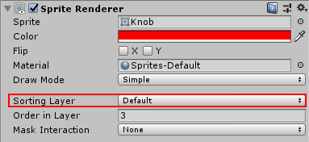

## 關於深度緩衝 (Depth buffering, or z-buffering)

勢必得先回歸電腦繪圖學 (Computer graphics) 的知識，理解 [Rasterization](https://en.wikipedia.org/wiki/Rasterisation) 怎麼透過 [z-buffering](https://en.wikipedia.org/wiki/Z-buffering) ，來解決物體 rendering 可視問題 (visibility problem)，哪些可見那些不可見，這也關係到物件在 rendering result 成像後前後順序。

當物件 rendering 時，每個所生成的 pixel 產生的深度資訊 (z coordinate) 會儲存在 z-buffer (或稱為 depth buffer)，buffer 為二維陣列，其尺寸大小與最後成像尺寸相同。在 Unity shader 中可利用 `ZWrite On | Off` 來切換是否將深度資訊要寫入到 z-buffer。

如果場景中其他物件 rendering 時，也在同一個 pixel 位置渲染結果時，會檢查 z-buffer 所儲存的深度資訊，是否將渲染結果覆蓋原本的 pixel，並且將新的深度資訊寫入到 z-buffer。通常條件會設定為深度資訊比原本更接近攝影機時，就能夠覆蓋原本結果。在 Unity shader 中可利用 `ZTest Less | Greater | LEqual | GEqual | Equal | NotEqual | Always` 來調整判斷方式。

**有 z-buffering 機制，可不管物件算繪順序 (rendering order)，使得離攝影機越近的物件，永遠都描繪在其他離攝影機越遠的物件之前** (`ZTest LEqual`)。

[](https://3.bp.blogspot.com/-xEsBEXX2jiQ/Wv_KFd2e3hI/AAAAAAAAwHY/aMJAzz3UIPkMUZOUqd9sgz_dsKZYN0PmQCHMYCw/s1600/bed-room.png)

房間示意圖

[](https://3.bp.blogspot.com/-x6KnmDnIk6o/Wv_KF_uymYI/AAAAAAAAwHc/XyV7-wddP-0QgqxstR_8MGzLGOxMlbUuACHMYCw/s1600/depth-info-bed-room.png)

房間的深度資訊，越深色表示離攝影機越近

[場景來源](https://assetstore.unity.com/packages/3d/props/furniture/pack-gesta-furniture-1-28237)

## Renderer’s rendering order

假設 shader 中關閉深度機制的判斷 (`ZTest Always`)，或者在 render 場景物件的過程中都不寫入深度 (`ZWrite Off`)，即**沒有 z-buffering 機制，rendering order 會決定成像的結果，越晚畫的物件永遠都在其他較早畫的物件之上**。

而在 SpriteRenderer 直接修改 sorting layer 以及 order in layer 來改變 rendering order，就能調整該物件在算繪結果的物件前後，便是基於此緣故，更多細節可查看 `Sprites/Default` shader 程式碼。

故整理在 Unity 中，rendering order 是根據以下參數進行排序：**Camera depth > Material type > Sorting layer > Order in layer > Material render queue > Camera order algorithm**。

-   Camera depth

    -   數字越大越晚畫

    -   通常無法搭配 Clear Flags: Don’t Clear，因為不會清除 depth buffer (z-buffer)

    -   程式設定 `camera.depth`

    -   選擇場景中的 camera 編輯

        [](https://3.bp.blogspot.com/-VdjJ2P8mRSw/Wv_KGL2e9kI/AAAAAAAAwHg/bf871Tz0ZCgcM_pTnENDlLA2EVCVEOXgQCHMYCw/s1600/edit-camera-depth-unity.png)

        編輯 depth 參數

-   Material type

    -   先畫不透明物件 (opaque)，再畫透明物件 (transparent)

    -   根據 material render queue 來決定，數值小於等於 2500 為不透明物件，數值大於 2500 為透明物件

-   Sorting layer

    -   數字越大越晚畫

    -   大多數的 renderer 都有支援此參數，但僅有 SpriteRenderder 以及 ParticleSystemRenderer 能在預設的 Inspector 編輯（不過自定義編輯器來達成）

    -   程式設定 `renderer.sortingLayerID`

    -   在 Tag Manager 編輯 Sorting layer

        [](https://3.bp.blogspot.com/-HQnwI_JP7dQ/Wv_KG_RuisI/AAAAAAAAwHo/8ecZFCMsknsP2XOd227LgYyr_JsP-k5fwCHMYCw/s1600/edit-sorting-layers-unity.png)

    -   選擇場景的 SpriteRenderder 或是 ParticleSystemRenderer 編輯 Sorting layer

        [](https://3.bp.blogspot.com/-74IY8tFv9b4/WwAf4mJ-bqI/AAAAAAAAwJQ/xHzyeHjHwP89PPKkCo3Ahp_OrsCdEJNKwCLcBGAs/s1600/edit-sorting-layer-unity.png)

-   Order in layer

    -   數字越大越晚畫

    -   大多數的 renderer 都有支援此參數，但僅有 SpriteRenderder 以及 ParticleSystemRenderer 能在預設的 Inspector 編輯

    -   程式設定 `renderer.sortingOrder`

    -   選擇場景的 SpriteRenderder 或是 ParticleSystemRenderer 編輯 Order in layer

        [](https://3.bp.blogspot.com/-8VZ0pu3-ZdI/WwAfrRVqL9I/AAAAAAAAwJM/89ZAUPkUfUsy9eXQn1bZUW9y_Q8HxBCxwCLcBGAs/s1600/edit-order-in-layer-unity.png)

-   Material render queue

    -   數字越大越晚畫

    -   預設值會從 Shader 取得，但可自行定義

    -   不透明物件 (Opaque)、半透明物件 (AlphaTest)、透明物件 (Transparent) 預設值分別 2000、2450、以及 3000

        -   通常只有透明物件會關閉 ZWrite

    -   程式設定 `material.renderQueue`

    -   選擇專案中的 material 編輯

        [](https://3.bp.blogspot.com/--4-IFurF7lk/Wv_KGSiPZ2I/AAAAAAAAwHk/95Bv8w902lke-HN_CCP1wigeekWuMQknQCHMYCw/s1600/edit-render-queue-unity.png)

-   Camera render algorithm

    -   無法在預設編輯器修改，使用程式調整

    -   非透明物件排序演算法

        ```
        camera.opaqueSortMode
        ```

        -   Default：在 Unity 2018.1 預設值 FrontToBack

        -   FrontToBack：粗略低由近到遠排序繪製，能使得 GPU rendering 時有更好的效能

        -   NoDistanceSort：關閉排序繪製，能降低 CPU 的使用量

    -   透明物件排序演算法

        ```
        camera.transparencySortMode
        ```

        -   Default：根據 camera projection mode 調整

        -   Perspective：根據 camera 位置到物件中心 (object center) 的距離排序

        -   Orthographic：根據 view plane 到物件中心 (object center) 的距離排序

        -   CustomAxis：制定 axis 排序，專門用於 2D 遊戲製作，可參考[這篇文章](https://qiita.com/RyotaMurohoshi/items/3f0de2689af72f9b46f9)

#### 补充RenderQueue

nderQueue ，RenderQueue 其实就是shader中tags中的Queue

```bash
Tags { "Queue"="Geometry" }
```

默认情况下，Unity会基于对象距离摄像机的远近来排序你的对象。因此，当一个对象离摄像机越近，它就会优先绘制在其他更远的对象上面。对于大多数情况这是有效并合适的，但是在一些特殊情况下，你可能想要自己控制对象的绘制顺序。而使用Tags{}块我们就可以得到这样的控制。

Unity提供给我们一些默认的渲染队列，每一个对应一个唯一的值，来指导Unity绘制对象到屏幕上。这些内置的渲染队列被称为Background, Geometry, AlphaTest, GeometryLast,Transparent, Overlay。这些队列不是随便创建的，它们是为了让我们更容易地编写Shader并处理实时渲染的。

同时需在SubShader中显示声明ZWrite Off，通知Unity我们会重写物体的渲染深度排序。


好了，最后给出一个最终的总结：
依次按条件先后顺序进行排序渲染处理。先按大项条件排序，后按小项条件排序

1.Camera Depth: 越小越优先
2.RenderQueue 2500以下

```
1. Sorting Layer/Order in Layer
    1. 按照Sorting Layer/Order in Layer 设置的值，越小越优先
    2. 无此属性，等同于 Sorting Layer=default ,Order in Layer=0 参与排序
    2.RenderQueue 越小越优先
    3.RenderQueue 相等，`由近到远排序优先`
```

3.RenderQueue 2500以上
1\. Sorting Layer/Order in Layer
1\. 按照Sorting Layer/Order in Layer 设置的值，越小越优先
2\. 无此属性，等同于 Sorting Layer=default ,Order in Layer=0 参与排序
2.RenderQueue 越小越优先
3.RenderQueue 相等，`由远到近排序优先`

说明一下：2500是关键值，它是透明跟不透明的分界点，因此我们考虑层级的时候要注意着点：renderqueue > 2500的物体绝对会在renderqueue <= 2500的物体前面，即渲染时renderqueue大的会挡住renderqueue小的，不论它的sortingLayer和sortingOrder怎么设置都是不起作用的。知道了这点，其他的就很好理解了。当两个的RenderQueue都在同一侧时，在SortingLayer高的绝对会在sortingLayer前面，无视renderqueue跟soringOrder，只有在sortingLayer相同的前提下，soringOrder高的会在sortingOrder低的前面，无视renderqueue。当sortingLayer跟sortingOrder相同时，才看renderqueue的高低，高的在前面。特别要注意一下半透明物体的渲染顺序是`越远越先渲染`，这与不透明物体是相反的。

UGUI中的ui默认使用的是UI/Default 材质，对应的shader中的渲染队列是Transparent

```
Shader "UI/Default"
{
    Properties
    {
       ...
    }

    SubShader
    {
        Tags
        {
            "Queue"="Transparent"
            "IgnoreProjector"="True"
            "RenderType"="Transparent"
            "PreviewType"="Plane"
            "CanUseSpriteAtlas"="True"
        }
        ...
    }
}
```

## UGUI’s rendering order

在 Unity 5.x 推出的 UGUI 系統中，其 rendering order 卻是另外規則，這分成兩個部分探討 Canvas & CanvasRenderer，其概念可想像是 CanvasRenderer 可視為畫在畫布 Canvas 的元件，之後該畫布再畫在最終的畫面上（e.g. render target）。

關於 Canvas 的 rendering order：

-   Screen Space - Overlay

    -   想像該 canvas 由隱藏的 camera 處理，其 depth = 101 (最後才處理)

    -   多個相同的 canvas 使用 Sort Order 來決定描繪順序，數字越大越晚畫

        [](https://3.bp.blogspot.com/-Jwq-GkVy5Pg/Wv_MaxvDuEI/AAAAAAAAwII/8xeKRt-08sw9AtYHAxXbPztqk3rlwMH6QCLcBGAs/s1600/edit-canvas-unity.png)

-   Screen Space - Camera & World Space

    -   想像為存在在世界場景的平面

    -   多個相同 canvas 使用 Sorting layer 以及 Order in layer 來決定 rendering order

        [](https://4.bp.blogspot.com/-u-mDDKcRfAY/Wv_NHS9SsZI/AAAAAAAAwIU/Mt_mBRPL8DYo7Xj9Cbh-hOPTFbg6X3UMgCLcBGAs/s1600/edit-canvas-unity.png)

關於同一個 canvas 下，其 CanvasRenderer 之間的 rendering order：

-   Material render queue > Transform order

    -   Material render queue 同前面說明，看材質球 (material) 的 render queue 參數

    -   Transform order：依照 Transform 階層關係，採 Pre-order 方式排序

        [](https://4.bp.blogspot.com/-fCMusmLKj4k/Wv_NnqL6SXI/AAAAAAAAwIo/suCM_XaddIAEwirQkIibP2wB8Mas3EjagCLcBGAs/s1600/canvas-renderer-rendering-order-unity.png)

    -   注意：當所屬的 Canvas 之 render mode 為 Screen Space - Overlay，則無視 Material render queue

## 使用實踐情境

-   3D

    -   不透明物件 & 半透明物件 (e.g. 草、鐵絲網等等) 依照場景擺放

        -   不需要特別設定 rendering order

        -   一切交給 z-buffering 機制

    -   透明物件或是粒子特效 (particle system) 可透過 sort layer & order in layer 機制調整 rendering order

        -   透明物件 shader 通常不會寫 z-buffer (e.g. `ZWrite Off`)

        -   可 hack inspector 來設定 `renderer.sortingLayerID` 以及 `renderer.sortingOrder`

-   2D

    -   Sprite renderer 使用 sort layer & order in layer 機制來調整 rendering order，以控制 depth

-   UGUI

    -   利用 transform hierarchy 來建立 rendering order，因應效能優化可能還得拆成多個 canvas

    -   若採用 Canvas render mode: World space，想讓 UI 與 3D 場景物件的結合，可將 canvas 視為 3D 物件去設計場景架構 (這自己就沒有經驗…)
