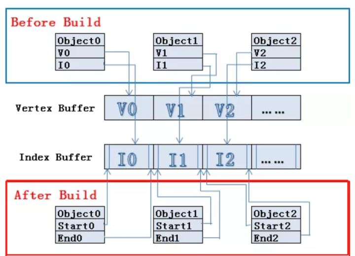
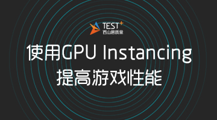
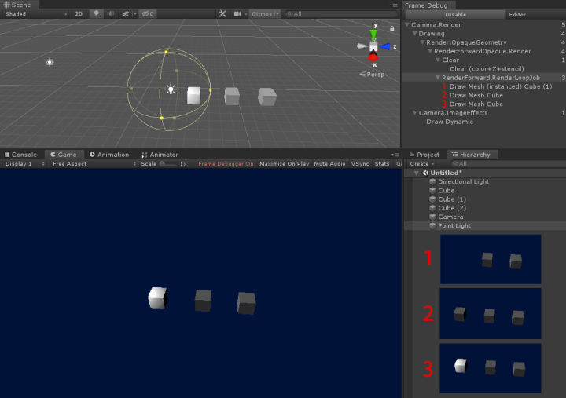
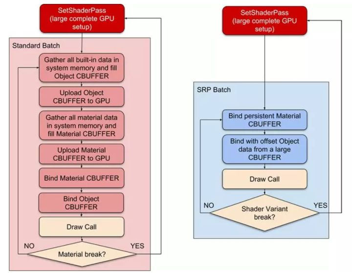
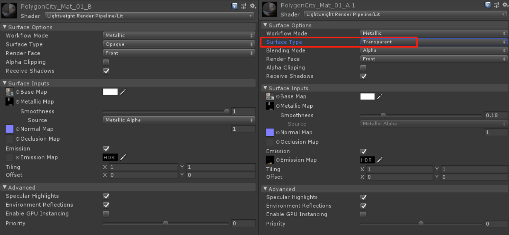

## 静态批处理\[[1\]](https://zhuanlan.zhihu.com/p/98642798#ref_1)

-   **定义**

标明为 Static 的静态物件，如果在使用**相同材质球**的条件下，在\*\*Build（项目打包）\*\*的时候Unity会自动地提取这些共享材质的静态模型的Vertex buffer和Index buffer。根据其摆放在场景中的位置等最终状态信息，将这些模型的顶点数据变换到世界空间下，存储在新构建的大Vertex buffer和Index buffer中。并且记录每一个子模型的Index buffer数据在构建的大Index buffer中的起始及结束位置。

在后续的绘制过程中，一次性提交整个合并模型的顶点数据，根据引擎的场景管理系统判断各个子模型的可见性。然后设置一次渲染状态，调用多次Draw call分别绘制每一个子模型。

Static batching并\*\*不减少Draw call的数量（\*\*但是在编辑器时由于计算方法区别Draw call数量是会显示减少了的\[[2\]](https://zhuanlan.zhihu.com/p/98642798#ref_2)），但是由于我们预先把所有的子模型的顶点变换到了世界空间下，所以在运行时cpu不需要再次执行顶点变换操作，节约了少量的计算资源，并且这些子模型共享材质，所以在多次Draw call调用之间并没有渲染状态的切换，渲染API（Command Buffer）会缓存绘制命令，起到了渲染优化的目的 。

但Static batching也会带来一些性能的负面影响。Static batching会导致应用打包之后体积增大，应用运行时所占用的内存体积也会增大。

另外，在很多不同的GameObject引用同一模型的情况下，如果不开启Static batching，GameObject共享的模型会在应用程序包内或者内存中只存在一份，绘制的时候提交模型顶点信息，然后设置每一个GameObjec的材质信息，分别调用渲染API绘制。开启Static batching，在Unity执行Build的时候，场景中所有引用相同模型的GameObject都必须将模型顶点信息复制，并经过计算变化到最终在世界空间中，存储在最终生成的Vertex buffer中。这就导致了打包的体积及运行时内存的占用增大。例如，在茂密的森林级别将树标记为静态会严重影响内存\[[3\]](https://zhuanlan.zhihu.com/p/98642798#ref_3)。

-   **无法参与批处理情况**

1.  改变Renderer.material将会造成一份材质的拷贝，因此会打断批处理，你应该使用Renderer.sharedMaterial来保证材质的共享状态。

-   **相同材质批处理断开情况**

1.  位置不相邻且中间夹杂着不同材质的其他物体，不会进行同批处理，这种情况比较特殊，涉及到批处理的顺序，我的另一篇文章有详解。

2.  拥有lightmap的物体含有额外（隐藏）的材质属性，比如：lightmap的偏移和缩放系数等。所以，拥有lightmap的物体将不会进行同批处理（除非他们指向lightmap的同一部分）。

-   **流程原理**

***

## 动态批处理\[[4\]](https://zhuanlan.zhihu.com/p/98642798#ref_4)

-   **定义**

在使用**相同材质球**的情况下，Unity会在运行时对于**正在视野中**的符合条件的动态对象在一个Draw call内绘制，所以**会降低Draw Calls**的数量。

Dynamic batching的原理也很简单，在进行场景绘制之前将所有的共享同一材质的模型的顶点信息变换到世界空间中，然后通过一次Draw call绘制多个模型，达到合批的目的。模型顶点变换的操作是由CPU完成的，所以这会带来一些CPU的性能消耗。并且计算的模型顶点数量不宜太多，否则CPU串行计算耗费的时间太长会造成场景渲染卡顿，所以Dynamic batching只能处理一些小模型。

Dynamic batching在降低Draw call的同时会导致额外的CPU性能消耗，所以仅仅在合批操作的性能消耗小于不合批，Dynamic batching才会有意义。而新一代图形API（ Metal、Vulkan）在批次间的消耗降低了很多，所以在这种情况下使用Dynamic batching很可能不能获得性能提升。Dynamic batching相对于Static batching不需要预先复制模型顶点，所以在内存占用和发布的程序体积方面要优于Static batching。但是Dynamic batching会带来一些运行时CPU性能消耗，Static batching在这一点要比Dynamic batching更加高效。

-   **无法参与批处理情况**

1.  物件Mesh大于等于900个面。

2.  代码动态改变材质变量后不算同一个材质，会不参与合批。

3.  如果你的着色器使用顶点位置，法线和UV值三种属性，那么你只能批处理300顶点以下的物体；如果你的着色器需要使用顶点位置，法线，UV0，UV1和切向量，那你只能批处理180顶点以下的物体，否则都无法参与合批。

4.  改变Renderer.material将会造成一份材质的拷贝，因此会打断批处理，你应该使用Renderer.sharedMaterial来保证材质的共享状态。

-   **批处理中断情况**

1.  位置不相邻且中间夹杂着不同材质的其他物体，不会进行同批处理，这种情况比较特殊，涉及到批处理的顺序，我的另一篇文章有详解。

2.  物体如果都符合条件会优先参与静态批处理，再是GPU Instancing，然后才到动态批处理，假如物体符合前两者，此次批处理都会被打断。

3.  GameObject之间如果有镜像变换不能进行合批，例如，"GameObject A with +1 scale and GameObject B with –1 scale cannot be batched together"。

4.  拥有lightmap的物体含有额外（隐藏）的材质属性，比如：lightmap的偏移和缩放系数等。所以，拥有lightmap的物体将不会进行批处理（除非他们指向lightmap的同一部分）。

5.  使用Multi-pass Shader的物体会禁用Dynamic batching，因为Multi-pass Shader通常会导致一个物体要连续绘制多次，并切换渲染状态。这会打破其跟其他物体进行Dynamic batching的机会。

6.  我们知道能够进行合批的前提是多个GameObject共享同一材质，但是对于Shadow casters的渲染是个例外。仅管Shadow casters使用不同的材质，但是只要它们的材质中给Shadow Caster Pass使用的参数是相同的，他们也能够进行Dynamic batching。

7.  Unity的Forward Rendering Path中如果一个GameObject接受多个光照会为每一个per-pixel light产生多余的模型提交和绘制，从而附加了多个Pass导致无法合批，如下图:

可以接收多个光源的shader，在受到多个光源是无法合批

-   **流程原理**

***

## GPU Instancing

-   **定义**

在使用**相同材质球、相同Mesh(预设体的实例会自动地使用相同的网格模型和材质)的情况下，Unity会在运行时对于**正在视野中的符合要求的所有对象使用**Constant Buffer**\[[5\]](https://zhuanlan.zhihu.com/p/98642798#ref_5)将其位置、缩放、uv偏移、*lightmapindex*等相关信息保存在显存中的\*\*“统一/常量缓冲器”**\[**[**6\]**](https://zhuanlan.zhihu.com/p/98642798#ref_6)**中，然后从中抽取一个对象作为实例送入渲染流程，当在执行DrawCall操作后，从显存中取出实例的部分共享信息与从GPU常量缓冲器中取出对应对象的相关信息一并传递到下一渲染阶段，与此同时，不同的着色器阶段可以从缓存区中直接获取到需要的常量，不用设置两次常量。比起以上两种批处理，GPU Instancing可以**规避合并Mesh导致的内存与性能上升\*\*的问题，但是由于场景中所有符合该合批条件的渲染物体的信息每帧都要被重新创建，放入“统一/常量缓冲区”中，而碍于缓存区的大小限制，每一个Constant Buffer的大小要严格限制（不得大于64k）。详细请阅读：

[Testplus：U3D优化批处理-GPU Instancing了解一下zhuanlan.zhihu.com](https://zhuanlan.zhihu.com/p/34499251)

-   **无法参与加速情况**

1.  缩放为负值的情况下，会不参与加速。

2.  代码动态改变材质变量后不算同一个材质，会不参与加速，但可以通过将颜色变化等变量加入常量缓冲器中实现\[[7\]](https://zhuanlan.zhihu.com/p/98642798#ref_7)。

3.  受限于常量缓冲区在不同设备上的大小的上限，移动端支持的个数可能较低。

4.  只支持一盏实时光，要在多个光源的情况下使用实例化，我们别无选择，只能切换到延迟渲染路径。为了能够让这套机制运作起来，请将所需的编译器指令添加到我们着色器的延迟渲染通道中。

当在多个光源开启GPU Instancing

-   **批处理中断情况**

1.  位置不相邻且中间夹杂着不同材质的其他物体，不会进行同批处理，这种情况比较特殊，涉及到批处理的顺序，我的另一篇文章有详解。

2.  一个批次超过125个物体（受限于常量缓冲区在不同设备上的大小的上限，移动端数量有浮动）的时候会新建另一个加速流程。

3.  物体如果都符合条件会优先参与静态批处理，然后才到GPU Instancing，假如物体符合前者，此次加速都会被打断。

-   **流程原理**

***

## SRP Batcher\[[8\]](https://zhuanlan.zhihu.com/p/98642798#ref_8)

-   **定义**

在使用LWRP或者HWRP时，开启SRP Batcher的情况下，只要物体的**Shader中变体**一致，就可以启用SRP Batcher加速。它与上文GPU Instancing实现的原理相近，Unity会在运行时对于正在视野中的符合要求的所有对象使用\*\*“Per Object” GPU BUFFER（一个独立的Buffer）\*\* 将其位置、缩放、uv偏移、*lightmapindex*等相关信息保存在GPU内存中，同时也会将正在视野中的符合要求的所有对象使用**Constant Buffer**\[[5\]](https://zhuanlan.zhihu.com/p/98642798#ref_5)将材质信息保存在保存在显存中的\*\*“统一/常量缓冲器”**\[**[**6\]**](https://zhuanlan.zhihu.com/p/98642798#ref_6)**中。与GPU Instancing相比，因为数据不再每帧被重新创建，而且需要保存进“统一/常量缓冲区”的数据排除了各自的位置、缩放、uv偏移、*****lightmapindex*****等相关信息，所以缓冲区内有更多的空间可以**动态地\*\*存储场景中所有渲染物体的材质信息。由于数据不再每帧被重新创建，而是动态更新，所以SRP Batcher的本质并不会降低Draw Calls的数量，它只会降低Draw Calls之间的GPU设置成本。

因为不用重新创建Constant Buffer，所以本质上SRP Batcher不会降低Draw Calls的数量，它只会降低Draw Calls之间的GPU设置成本

-   **无法参与加速情况**

1.  对象不可以是粒子或蒙皮网格。

2.  Shader中**变体**不一致，如下图两个**相同Shader**的材质，但是因为Surface Options不一致，导致**变体不一样**而无法合并。

变体不同的不同材质

-   **批处理中断情况**

1.  位置不相邻且中间夹杂着**不同Shader**，或者**不同变体**的其他物体，不会进行同批处理，这种情况比较特殊，涉及到批处理的顺序，我的另一篇文章有详解。

-   **流程原理**

***

## ***2020年2月13日-更新： 更改对”统一/常量缓冲器“的描述，对SRP Batcher与GPU Instancing的实现原理进行了比较大的修改。***

> *^ ^ 以上只是我工作中的一些小总结*
> *有什么不正确的地方可以在评论告诉我*
> *我的微信号是：sam2b2b*
> *有想一起进步的小伙伴可以加微信逛逛圈*

## 参考

1.  [^](https://zhuanlan.zhihu.com/p/98642798#ref_1_0)<https://gameinstitute.qq.com/community/detail/114323>

2.  [^](https://zhuanlan.zhihu.com/p/98642798#ref_2_0)<https://forum.unity.com/threads/regression-feature-not-bug-static-dynamic-batching-combining-v-buffers-but-not-draw-calls.360143/>

3.  [^](https://zhuanlan.zhihu.com/p/98642798#ref_3_0)<https://docs.unity3d.com/Manual/DrawCallBatching.html>

4.  [^](https://zhuanlan.zhihu.com/p/98642798#ref_4_0)<https://gameinstitute.qq.com/community/detail/114323>

5.  ^[a](https://zhuanlan.zhihu.com/p/98642798#ref_5_0)[b](https://zhuanlan.zhihu.com/p/98642798#ref_5_1)Constant Buffer <https://zhuanlan.zhihu.com/p/35830868>

6.  ^[a](https://zhuanlan.zhihu.com/p/98642798#ref_6_0)[b](https://zhuanlan.zhihu.com/p/98642798#ref_6_1)unity将常量存储在4M的缓冲池里，并每帧循环池（这个池子被绑定到GPU上，可以在截帧工具比如XCode或者Snapdragon上看到）

7.  [^](https://zhuanlan.zhihu.com/p/98642798#ref_7_0)<https://blog.csdn.net/lzhq1982/article/details/88119283>

8.  [^](https://zhuanlan.zhihu.com/p/98642798#ref_8_0)SRP Batcher 官方文档： <https://mp.weixin.qq.com/s/-4Bhxtm_L5paFFAv8co4Xw>
