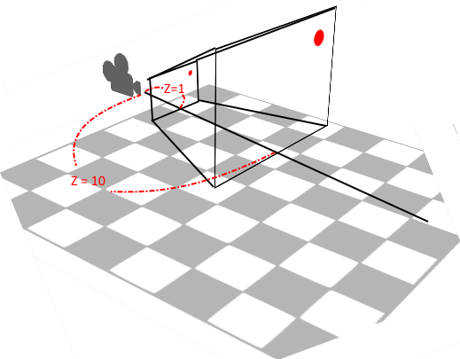

在使用Camera.main.ScreenToWorldPoint(Input.mousePosition))的時候，有時候會發現取得的是Camera的座標而不是滑鼠的座標。

因為事實上是需要提供Z參數的
Camera.main.ScreenToWorldPoint(new Vector3(Input.mousePosition.x, Input.mousePosition.y, Z));
　　Z代表的是Depth，因此如果Z=0的話就會是Camera的transform position了，因為此時nearClip趨近於Camera，不論你畫面中哪個點都會趨近於Camera的position

自己做的參考圖。

以Perspective攝影機來看，當我用ScreenToWorldPoint(Input.mousePosition)想要來取得目前滑鼠座標在世界座標的位置的時候，可以看到當設定的Ｚ值不同，不只是取得的Ｚ座標不同連ＸＹ的座標都會不同（上圖的紅點位置，在遊戲視窗中是相同的左上角）。

所以假設Ｚ值趨近於0的時候會怎樣，也就是該點座標會趨近於Camera的座標，因此當你沒有設定Ｚ值，而Ｚ值為0的時候，不管你滑鼠在哪都只會取得攝影機的座標。

解決辦法：在Perspective攝影機的狀態下Ｚ值不要為0，或是使用Camera.main.nearClipPlane來設定最短的Clip位置。

而Orthographic的攝影機呢，反而沒有這個問題，當Ｚ值設定為0的時候還是可以有相對正確的ＸＹ座標。