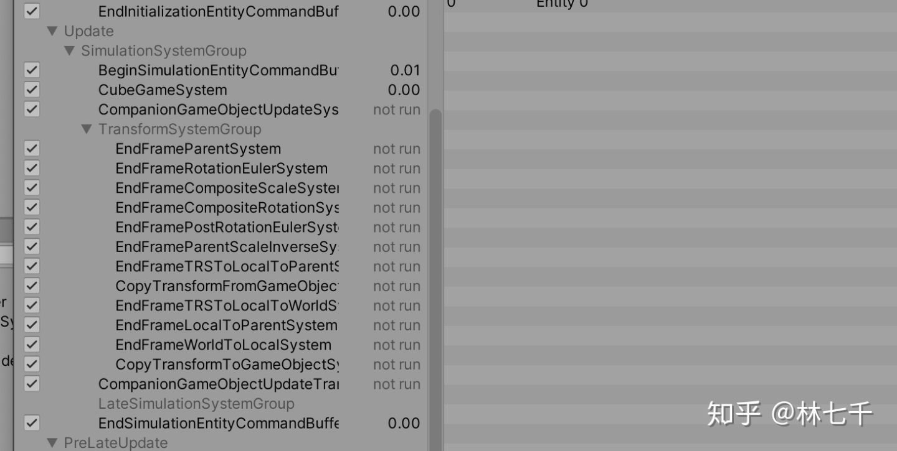
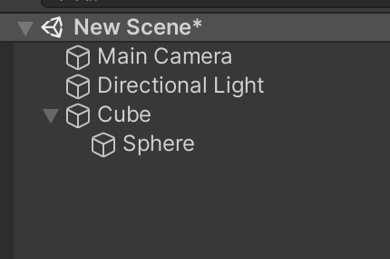
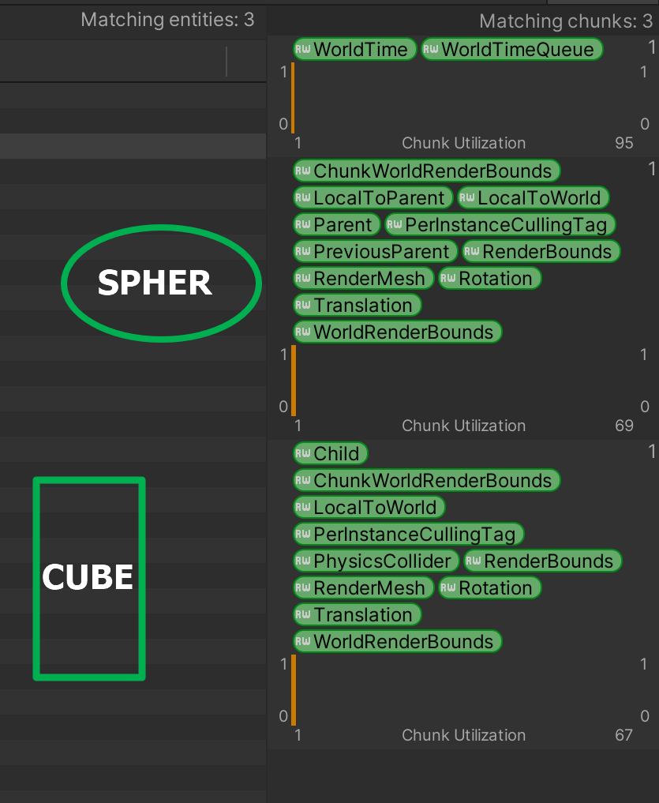
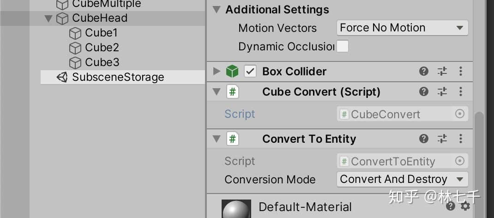
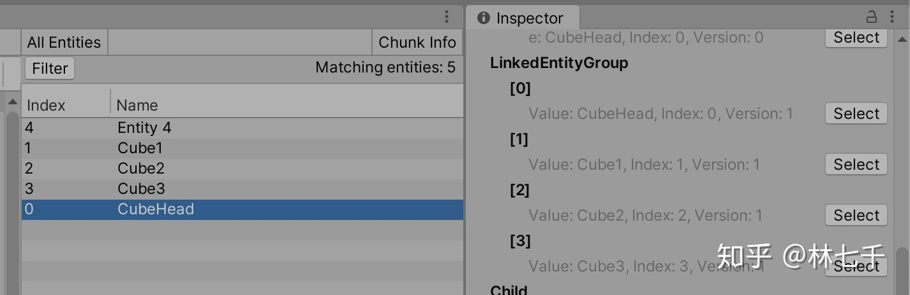
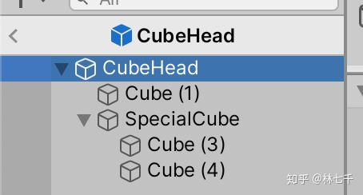
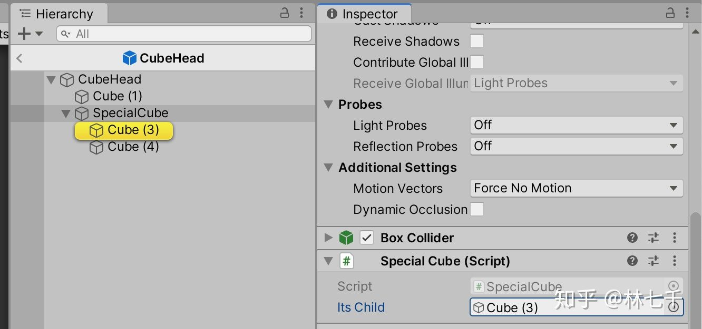
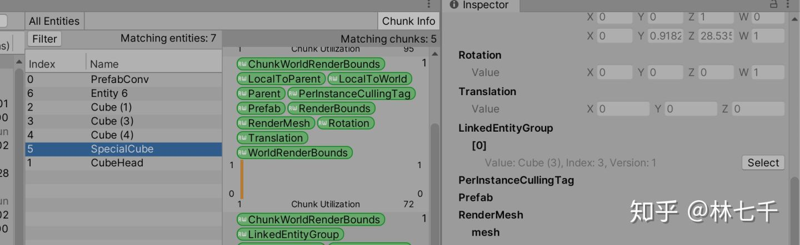

# 关于转换系统

ConvertToEntitySystem运行在默认世界中..每次update的时候会处理ConvertToEntity添加到system中的gameobject

最终调用的时候是使用.

```
GameObjectConversionUtility.Convert(gameObjectWorld);
```

然后具体的转换过程会新疆一个转换world主要执行GameObjectConversionMappingSystem,然后转换完成后销毁这个world

- GameObjectConversionUtility.ConvertGameObjectHierarchy(unitView.gameObject, settings)会转换所有child.

- GameObjectConversionMappingSystem.conversion.MappingSystem.AddGameObjectOrPrefab(root);会递归所有child

# parent

localtoworld是一个矩阵

```
      EntityManager.SetComponentData(myCube, new LocalToWorld
        {
            Value = new float4x4(rotation: quaternion.identity, translation:new float3(1,2,3))
        });
```

如果人肉单纯修改 LocalToWorld 这个 4x4 Transform 矩阵将会无比痛苦, 所以 Unity 帮我们实现了一堆有用的系统来修改它:



使用`Translation`,`Rotation`,`Scale`/`NonUniformScale`组件将会极大简化我们的操作, 上图这些系统 会将这些组件的改动反应到 LocalToWorld 中.你甚至可以使用 Parent 来实现层级结构. 比如一个 Entity 的 Transform 为 0, 但同时有一个 `Parent` 组件指向了父 Entity, 那么最终该 Entity 的 `LocalToWorld` 值将会和父 Entity的 LocalToWorld 一样.

我们新建一个场景



查看分析器.就能看到如下关系图



- CUBE   `child`,`physicsCollider`

- SPHER `parent` ,`localtoparent` ,`previousparent`

由于物理的转化规则,子物体没有physicscollider.

## LinkedEntityGroup

`LinkedEntityGroup`是一个 dynamic buffer , 通常它会影响:

- 调用`Instantiate`方法时, 会同时实例化所有 buffer 中的 entity, 同时也会创建相同的`LinkedEntityGroup`. 注意实例化并不一定和ECS中的`Prefab` component 直接关联.

- 调用`DestroyEntity`时也会同时销毁 `LinkedEntityGroup`中的所有 entity. 类似在编辑器中删除`GameObject`

- 调用 `entityManager.SetEnabled` 加上的 `Disabled`component 会告知 ECS 的查询系统忽略它们, 而 `LinkedEntityGroup` 中的 entity 也会受到同样的影响. 有点类似禁用`GameObject` 时同时会禁用整个层级树.

注意如果buffer 中的 entity 也有`LinkedEntityGroup`, 系统**不会递归地**执行instantiation/destroy/disabled 过程.

这些过程在具体执行当中也有一些细微不同.`Instantiate`和`SetEnabled`只要检测到 buffer 便在所有成员上一次性执行, 不会做其他更多事. 这意味着关联该 buffer 的 entity **必须要把自己包括在内**才能正常工作\*\*.\*\* 然而`DestroyEntity`则无所谓, 因为它会先销毁传入的entity, 然后再迭代 buffer 中的 entity 进行销毁.

要注意`LinkedEntityGroup` 和 `Parent`并不一样 (虽然它们经常同时出现). 后者是递归地工作, 循环依赖也是不允许的.

## 从非 prefab conversion 中获取LinkedEntityGroup

目前, 我们使用`ConvertToEntity`并不能得到 `LinkedEntityGroup`. 所以当销毁转换后的 entity时, 并不能连锁地销毁相关联的entity(比如Child/Parent), 不管你是否认同, 目前这是默认的行为. (`ConvertToEntity`却可以正常得到基于`Parent` 的层级结构).

如果你需要该 buffer 正常添加, 在 mapping sysytem 中有一个方法可以使用:

```csharp
 public void DeclareLinkedEntityGroup(GameObject gameObject)
```

调用后 primary entity 会得到该 buffer, 并包含所有子对象(递归地查询, 线性排列的结果).

```csharp
public class CubeConvert : MonoBehaviour, IConvertGameObjectToEntity
{
    public void Convert(Entity entity, EntityManager dstManager, GameObjectConversionSystem conversionSystem)
    {
        conversionSystem.DeclareLinkedEntityGroup(this.gameObject);
    }
}
```



从 debbuger 现在可以看到已经正常添加了`LinkedEntityGroup`, 目前它已经支持`Instantiate`和`SetEnable` 的正常工作了:



LinkedEntityGroup 总是会包含它自己, 包括 disable 这种情况. 因此如果你在叶子对象上禁用了 GameObject , 你也会得到包含它自己的LinkedEntityGroup.

## 关于手动添加`LinkedEntityGroup`

如果我添加了一个 conversion script 到 SpecialCube, 它的Convert 方法会在 CubeHead 被转换时调用, 该代码意图在于记住 Cube(3) 的 Entity:



```csharp
public class SpecialCube : MonoBehaviour, IConvertGameObjectToEntity
{
    public GameObject itsChild;
    public void Convert(Entity entity, EntityManager dstManager, GameObjectConversionSystem conversionSystem)
    {
        dstManager.AddComponent<LinkedEntityGroup>(entity);
        var leg = dstManager.GetBuffer<LinkedEntityGroup>(entity);
        leg.Add(conversionSystem.GetPrimaryEntity(itsChild));
    }
}
```



这时我们检查一下conversion 的Prefab entity 的结果(烘焙对于单个 Entity 或者 Entity buffer 都有效), 我们期望我们人工添加的 LinkedEntityGroup 包含对于 Prefab 同级的引用.



# 关于parent和`LinkedEntityGroup`

- parent 涉及到localtoworld, 以及一些物理和其他的转换规则

- linkedEntityGroup 和 `Instantiate` `SetEnabled`  `DestroyEntity` 有关

被disable的组件不会被foreach到,除非主动申请选取disable

# 最佳的方式去关联entity和prefab

\[[Hybrid ECS\] Best way to handle Convert and Inject Game Object Prefab? - Unity Forum](https://forum.unity.com/threads/hybrid-ecs-best-way-to-handle-convert-and-inject-game-object-prefab.736646/)

```
using UnityEngine;
 
public class Prefabs : MonoBehaviour
{
    private static Prefabs m_Instance;
 
    public static GameObject PlayerModel => m_Instance.playerModel;
 
    public GameObject playerModel;
 
    private void Awake()
    {
        if (m_Instance == null)
        {
            m_Instance = this;
        }
        else
        {
            Debug.LogError("Prefab Singleton loaded twice");
        }
    }
}
```

```
using Unity.Entities;
using Unity.NetCode;
using Unity.Transforms;
using UnityEngine;
 
[UpdateInGroup(typeof(ClientSimulationSystemGroup))]
 
public class PlayerModelSystem : ComponentSystem
{
    protected override void OnUpdate()
    {
        Entities.WithNone<Transform>().ForEach((Entity playerEntity, ref PlayerComponent playerComponent) => {
            if (Prefabs.PlayerModel != null)
            {
                var playerModel = Object.Instantiate(Prefabs.PlayerModel);
                EntityManager.AddComponentObject(playerEntity, playerModel.GetComponent<Transform>());
                EntityManager.AddComponentData(playerEntity, new CopyTransformToGameObject());
            }
        });
    }
}
```

[Unity Tech - Where is the SIMPLE Bridge Between MonoBehaviours and ECS?? - Unity Forum](https://forum.unity.com/threads/unity-tech-where-is-the-simple-bridge-between-monobehaviours-and-ecs.823485/)

```
using Unity.Entities;
using Unity.Jobs;
using Unity.Mathematics;
using Unity.Transforms;
using UnityEngine;
 
// Attach to your Game Object to be converted, the GameObjectPrefab is a pure Game Object with no conversion that may contain MonoBehaviour components such as the particle system.
public class GameObjectPrefabAuthoring : MonoBehaviour, IConvertGameObjectToEntity
{
    public GameObject GameObjectPrefab;
 
    public void Convert(Entity entity, EntityManager dstManager, GameObjectConversionSystem conversionSystem)
    {
        dstManager.AddComponentObject(entity, new GameObjectPrefab
        {
            Value = GameObjectPrefab
        });
    }
}
 
public class GameObjectPrefab : IComponentData
{
    public GameObject Value;
}
 
// Instantiate and destroy the referenced prefab when the entity is created or destroyed. You can even pool the Game Object.
public class GameObjectPrefabSystem : JobComponentSystem
{
    public class GameObjectPrefabInstance : ISystemStateComponentData
    {
        public GameObject Value;
    }
 
    protected override JobHandle OnUpdate(JobHandle inputDeps)
    {
        Entities
            .WithNone<GameObjectPrefabInstance>()
            .ForEach((Entity entity, GameObjectPrefab gameObjectPrefab) =>
            {
                var gameObjectPrefabInstance = Object.Instantiate(gameObjectPrefab.Value);
 
                EntityManager.AddComponentData(entity, new GameObjectPrefabInstance
                {
                    Value = gameObjectPrefabInstance
                });
 
                // Just an example to make the GameObject Prefab instance follow the entity.
                EntityManager.AddComponentObject(entity, gameObjectPrefabInstance.transform);
                EntityManager.AddComponent<CopyTransformToGameObject>(entity);
            })
            .WithStructuralChanges()
            .Run();
 
        Entities
            .WithNone<GameObjectPrefab>()
            .ForEach((Entity entity, GameObjectPrefabInstance gameObjectPrefabInstance) =>
            {
                Object.Destroy(gameObjectPrefabInstance.Value);
 
                EntityManager.RemoveComponent<GameObjectPrefabInstance>(entity);
            })
            .WithStructuralChanges()
            .Run();
 
        return default;
    }
}
 
// A dummy system for testing purposes.
public class DummyEntityWithGameObjectControllerSystem : JobComponentSystem
{
    EntityQuery m_Query;
 
    protected override JobHandle OnUpdate(JobHandle inputDeps)
    {
        var deltaTime = Time.DeltaTime;
        var speed = 3;
        var direction = new float2(Input.GetAxisRaw("Horizontal"), Input.GetAxisRaw("Vertical"));
        var destroy = Input.GetKeyDown(KeyCode.Delete);
 
        if (destroy)
        {
            EntityManager.DestroyEntity(m_Query);
        }
 
        return Entities
            .WithStoreEntityQueryInField(ref m_Query)
            .WithAll<GameObjectPrefab>()
            .ForEach((ref Translation translation) =>
            {
                translation.Value += math.normalizesafe(new float3(direction, 0).xzy) * speed * deltaTime;
            })
            .Schedule(inputDeps);
    }
}
```