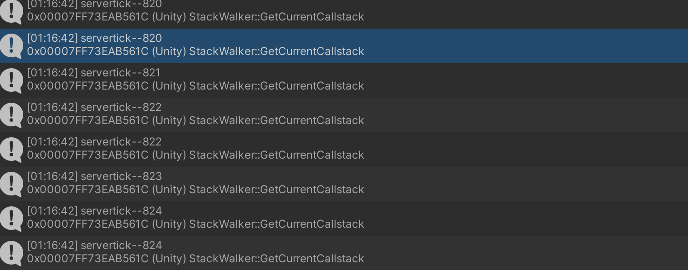

# NetworkStreamReceiveSystem

1. 客户端连接服务端  ,服务端创建NetworkIdComponent

2. 客户端添加NetworkStreamInGame组件,并通过rpc 发送GoInGameRequest请求

3. 服务端接收到请求后,实例化player

   - 为player添加GhostOwnerComponent

   - 初始化player添加一些其他不需要同步的组件

   - 为connection添加NetworkStreamInGame组件

   - 为connection设置CommandTargetComponent

4. 客户端根据player独有的组件特性,查找已经被ghost同步过来的实体

   - 比对NetworkIdComponent和GhostOwnerComponent的id,判断是否是localPlayer

   - 对localplayer进行初始化

   - 为connection设置CommandTargetComponent为localplayer

5. 客户端使用CommandTargetComponent的targetEntity进行command发送

6. 客户端和服务端对传送的command同时使用PredictedGhostComponent进行预测????

   - 预测不是发生在客户端的吗???貌似netcode服务端也做了预测

     在服务器上，预测循环始终仅运行一次，并且不会更新TimeData结构，因为它已经正确。它仍然设置GhostPredictionSystemGroup.PredictingTick以确保可以在客户端和服务器上运行完全相同的代码。

插值 是针对其他玩家的本地显示...预测是针对自己操作的角色,最后从服务器校正

延迟补偿是服务器在做的一件事情..

GhostReceiveSystem  接收快照

GhostUpdateSystem  应用快照     设置了predictionStartTick和AppliedTick

GhostPredictionSystemGroup   设置了 PredictingTick ,服务端永远为ServerSimulationSystemGroup.servertick

=======================================================================

客户端的servertick在不同的两帧之间可能是相同的



servertick    235

PredictingTick    230

PredictingTick    231

PredictingTick    232

PredictingTick    233

PredictingTick    234

PredictingTick    235

servertick    240  因为跑预测所以这里可能过了好几帧servertick这里不是236

PredictingTick    240  //自己先跑一下

servertick    240 //又可能tick增长时间还没有过

PredictingTick    238

PredictingTick    239

PredictingTick    240

实际上没多大复杂的事情..客户端发送命令给服务端,服务端处理后将tick和数据同步给客户端...

客户端拿到数据..该预测的预测..该插值的插值...

然后还需要处理这帧的自己的命令...

客户端:

Ghost数据(服务端传送的同步)--预测---输入命令--发送命令给服务端---处理命令----覆盖同步数据(一般是覆盖自己的)--应用数据(位移,动画等)

服务端:

服务端接收到命令---处理命令----写入Ghost数据(同步)--应用数据(位移,动画等)

## 预测

输入的时候, 添加发送给服务器时的servertick ,

注意这个servertick和ServerSimulationSystemGroup.servertick没有多大关系.

m_ClientSimulationSystemGroup.ServerTick标记发送给服务器的命令所在的tick,以及用来接收服务器快照后(快照会包含该tick),丢弃执行过的命令,以及预测未执行的命令使用

```
        var input = default(CubeInput);
        input.Tick = m_ClientSimulationSystemGroup.ServerTick;
        if (Input.GetKey("a"))
            input.horizontal -= 1;
        if (Input.GetKey("d"))
            input.horizontal += 1;
        if (Input.GetKey("s"))
            input.vertical -= 1;
        if (Input.GetKey("w"))
            input.vertical += 1;
        var inputBuffer = EntityManager.GetBuffer<CubeInput>(localInput);
        inputBuffer.AddCommandData(input);
```

客户端使用服务端的快照时,将更新PredictedGhostComponent,可以看到他有两个tick,一个是应用tick,一个是预测开始的tick

```
    public struct PredictedGhostComponent : IComponentData
    {
        public uint AppliedTick;
        public uint PredictionStartTick;
    }
```

服务端PredictedGhostComponent其中AppliedTick和PredictionStartTick永远为0

```
[UpdateInGroup(typeof(GhostPredictionSystemGroup))]
public class MoveCubeSystem : ComponentSystem
{
    protected override void OnUpdate()
    {
        var group = World.GetExistingSystem<GhostPredictionSystemGroup>();
        var tick = group.PredictingTick;
        var deltaTime = Time.DeltaTime;
        Entities.ForEach((DynamicBuffer<CubeInput> inputBuffer, ref Translation trans, ref PredictedGhostComponent prediction) =>
        {
            if (!GhostPredictionSystemGroup.ShouldPredict(tick, prediction))
                return;
            CubeInput input;
            inputBuffer.GetDataAtTick(tick, out input);
            if (input.horizontal > 0)
                trans.Value.x += deltaTime;
            if (input.horizontal < 0)
                trans.Value.x -= deltaTime;
            if (input.vertical > 0)
                trans.Value.z += deltaTime;
            if (input.vertical < 0)
                trans.Value.z -= deltaTime;
        });
    }
}
```

让我们看下GhostPredictionSystemGroup的源代码:

```
   protected override void OnUpdate()
        {
            // If client, go from oldest applied predicted tick to target tick, apply. Allow filtering on latest received tick somehow
            if (isServer)
            {
                // If server, apply once
                var simulationSystemGroup = World.GetExistingSystem<ServerSimulationSystemGroup>();
                PredictingTick = simulationSystemGroup.ServerTick;
                IsFinalPredictionTick = true;
                base.OnUpdate();
            }
            else
            {
                if (predictedTickWriters.Length > 1)
                {
                    predictedTickWriters[0] = JobHandle.CombineDependencies(predictedTickWriters);
                    predictedTickWriters.ResizeUninitialized(1);
                }

                if (predictedTickWriters.Length > 0)
                    predictedTickWriters[0].Complete();
                predictedTickWriters.Clear();
                uint oldestAppliedTick = 0;
                for (int i = 0; i < OldestPredictedTick.Length; ++i)
                {
                    if (OldestPredictedTick[i] != 0)
                    {
                        if (oldestAppliedTick == 0 ||
                            SequenceHelpers.IsNewer(oldestAppliedTick, OldestPredictedTick[i]))
                            oldestAppliedTick = OldestPredictedTick[i];
                        OldestPredictedTick[i] = 0;
                    }
                }

                var simulationSystemGroup = World.GetExistingSystem<ClientSimulationSystemGroup>();
                var serverTick = simulationSystemGroup.ServerTick;
                var targetTick = serverTick;

                if (oldestAppliedTick == 0 ||
                    !SequenceHelpers.IsNewer(targetTick, oldestAppliedTick))
                    //oldestAppliedTick = targetTick - 1;
                    return; // Nothing rolled back - nothing to predict
                // Do not try to predict more frames than we can have input for
                if (targetTick - oldestAppliedTick > CommandDataUtility.k_CommandDataMaxSize)
                    oldestAppliedTick = targetTick - CommandDataUtility.k_CommandDataMaxSize;

                var previousTime = Time;
                var elapsedTime = previousTime.ElapsedTime;
                if (simulationSystemGroup.ServerTickFraction < 1)
                {
                    --targetTick;
                    elapsedTime -= simulationSystemGroup.ServerTickDeltaTime * simulationSystemGroup.ServerTickFraction;
                }

                for (uint i = oldestAppliedTick + 1; i != targetTick+1; ++i)
                {
                    uint tickAge = targetTick - i;
                    World.SetTime(new TimeData(elapsedTime - simulationSystemGroup.ServerTickDeltaTime*tickAge, simulationSystemGroup.ServerTickDeltaTime));
                    PredictingTick = i;
                    IsFinalPredictionTick = (i == serverTick);
                    base.OnUpdate();
                }

                if (simulationSystemGroup.ServerTickFraction < 1)
                {
                    PredictingTick = targetTick + 1;
                    IsFinalPredictionTick = true;
                    World.SetTime(new TimeData(previousTime.ElapsedTime, simulationSystemGroup.ServerTickDeltaTime *
                                                                        simulationSystemGroup.ServerTickFraction));
                    base.OnUpdate();
                }
                World.SetTime(previousTime);
            }
        }
```

可以看到从开始值不断的改变PredictingTick进行预测,然后执行了base.OnUpdate()

# 插值

插值就是将网络玩家显示在过去的某个时刻

假设你在t=1000收到位置信息，你已经在t=900收到了一次位置信息，所以你知道玩家在t=900和t=1000的位置，所以在t=1000到t=1100之间，你只要显示玩家t=900到t=1000的位置。这种方法，你所显示的都是玩家的真实数据，只是有100ms的延迟。

### Translation和Rotation的转换

Unity.NetCode.Editor.GhostAuthoringComponentEditor

中添加了Translation和Rotation的转换,只有被转换的才会被传输..如果不想转换可以在code gen window中勾掉Unity.Transforms..auto compile也勾掉

```
    public static void InitDefaultOverrides()
        {
            GhostDefaultOverrides = new Dictionary<string, GhostComponent>();
            AssembliesDefaultOverrides = new HashSet<string>(new []{
                "Unity.NetCode",
                "Unity.Transforms",
            });

            var comp = new GhostComponent
            {
                name = "Unity.Transforms.Translation",
                attribute = new GhostComponentAttribute{PrefabType = GhostPrefabType.All, OwnerPredictedSendType = GhostSendType.All, SendDataForChildEntity = false},
                fields = new GhostComponentField[]
                {
                    new GhostComponentField
                    {
                        name = "Value",
                        attribute = new GhostFieldAttribute{Quantization = 100, Interpolate = true}
                    }
                },
                entityIndex = 0
            };
            GhostDefaultOverrides.Add(comp.name, comp);
            comp = new GhostComponent
            {
                name = "Unity.Transforms.Rotation",
                attribute = new GhostComponentAttribute{PrefabType = GhostPrefabType.All, OwnerPredictedSendType = GhostSendType.All, SendDataForChildEntity = false},
                fields = new GhostComponentField[]
                {
                    new GhostComponentField
                    {
                        name = "Value",
                        attribute = new GhostFieldAttribute{Quantization = 1000, Interpolate = true}
                    }
                },
                entityIndex = 0
            };
            GhostDefaultOverrides.Add(comp.name, comp);
        }
```

我们可以看到这里使用了GhostFiled并且将其设置为Interpolate..我们在看下他生成的code

```
        [BurstCompile]
        [MonoPInvokeCallback(typeof(GhostComponentSerializer.CopyToFromSnapshotDelegate))]
        private static void CopyFromSnapshot(IntPtr stateData, IntPtr snapshotData, int snapshotOffset, int snapshotStride, IntPtr componentData, int componentStride, int count)
        {
            for (int i = 0; i < count; ++i)
            {
                ref var snapshotInterpolationData = ref GhostComponentSerializer.TypeCast<SnapshotData.DataAtTick>(snapshotData, snapshotStride*i);
                ref var snapshotBefore = ref GhostComponentSerializer.TypeCast<Snapshot>(snapshotInterpolationData.SnapshotBefore, snapshotOffset);
                ref var snapshotAfter = ref GhostComponentSerializer.TypeCast<Snapshot>(snapshotInterpolationData.SnapshotAfter, snapshotOffset);
                float snapshotInterpolationFactor = snapshotInterpolationData.InterpolationFactor;
                ref var component = ref GhostComponentSerializer.TypeCast<Unity.Transforms.Translation>(componentData, componentStride*i);
                var deserializerState = GhostComponentSerializer.TypeCast<GhostDeserializerState>(stateData, 0);
                deserializerState.SnapshotTick = snapshotInterpolationData.Tick;
                component.Value = math.lerp(
                    new float3(snapshotBefore.Value_x * 0.01f, snapshotBefore.Value_y * 0.01f, snapshotBefore.Value_z * 0.01f),
                    new float3(snapshotAfter.Value_x * 0.01f, snapshotAfter.Value_y * 0.01f, snapshotAfter.Value_z * 0.01f),
                    snapshotInterpolationFactor);
            }
        }
```

我们看到在读取快照的时候使用了snapshotInterpolationFactor进行插值,SnapshotData类中

```

  public unsafe bool GetDataAtTick(uint targetTick, float targetTickFraction, in DynamicBuffer<SnapshotDataBuffer> buffer, out DataAtTick data)
        {
            data = default;
            if (buffer.Length == 0)
                return false;
            var numBuffers = buffer.Length / SnapshotSize;
            int beforeIdx = 0;
            uint beforeTick = 0;
            int afterIdx = 0;
            uint afterTick = 0;
            // If last tick is fractional before should not include the tick we are targeting, it should instead be included in after
            if (targetTickFraction < 1)
                --targetTick;
            byte* snapshotData;
            // Loop from latest available to oldest available snapshot
            for (int slot = 0; slot < numBuffers; ++slot)
            {
                var curIndex = (LatestIndex + GhostSystemConstants.SnapshotHistorySize - slot) % GhostSystemConstants.SnapshotHistorySize;
                snapshotData = (byte*)buffer.GetUnsafePtr() + curIndex * SnapshotSize;
                uint tick = *(uint*)snapshotData;
                if (tick == 0)
                    continue;
                if (SequenceHelpers.IsNewer(tick, targetTick))
                {
                    afterTick = tick;
                    afterIdx = curIndex;
                }
                else
                {
                    beforeTick = tick;
                    beforeIdx = curIndex;
                    break;
                }
            }

            if (beforeTick == 0)
            {
                return false;
            }

            data.SnapshotBefore = (System.IntPtr)((byte*)buffer.GetUnsafePtr() + beforeIdx * SnapshotSize);
            data.Tick = beforeTick;
            if (afterTick == 0)
            {
                data.SnapshotAfter = data.SnapshotBefore;
                data.InterpolationFactor = 0;
            }
            else
            {
                data.SnapshotAfter = (System.IntPtr)((byte*)buffer.GetUnsafePtr() + afterIdx * SnapshotSize);
                data.InterpolationFactor = (float) (targetTick - beforeTick) / (float) (afterTick - beforeTick);
                if (targetTickFraction < 1)
                    data.InterpolationFactor += targetTickFraction / (float) (afterTick - beforeTick);
            }

            return true;
        }
```

在其中计算了InterpolationFactor.

无论是插值和预测都是先读取快照.我们看下GhostUpdateSystem

```
 public void Execute(ArchetypeChunk chunk, int chunkIndex, int firstEntityIndex, DynamicComponentTypeHandle* ghostChunkComponentTypesPtr, int ghostChunkComponentTypesLength)
            {
                bool predicted = chunk.Has(predictedGhostComponentType);
                uint targetTick = predicted ? predictedTargetTick : interpolatedTargetTick;
                float targetTickFraction = predicted ? 1.0f : interpolatedTargetTickFraction;
```

预测使用的是predictedTargetTick,插值使用的是interpolatedTargetTick

```
 interpolatedTargetTick = m_ClientSimulationSystemGroup.InterpolationTick,
                interpolatedTargetTickFraction = m_ClientSimulationSystemGroup.InterpolationTickFraction,

                predictedTargetTick = m_ClientSimulationSystemGroup.ServerTick,
```

而他们又都来自m_ClientSimulationSystemGroup,m_ClientSimulationSystemGroup的tick又来自NetworkTimeSystem

### ClientServerTickRate

RpcSetNetworkId

```
 [BurstCompile]
        [AOT.MonoPInvokeCallback(typeof(RpcExecutor.ExecuteDelegate))]
        private static void InvokeExecute(ref RpcExecutor.Parameters parameters)
        {
            var rpcData = default(RpcSetNetworkId);
            var rpcSerializer = default(RpcSetNetworkId);
            rpcSerializer.Deserialize(ref parameters.Reader, parameters.DeserializerState, ref rpcData);

            parameters.CommandBuffer.AddComponent(parameters.JobIndex, parameters.Connection, new NetworkIdComponent {Value = rpcData.nid});
            var ent = parameters.CommandBuffer.CreateEntity(parameters.JobIndex);
            parameters.CommandBuffer.AddComponent(parameters.JobIndex, ent, new ClientServerTickRateRefreshRequest
            {
                MaxSimulationStepsPerFrame = rpcData.simMaxSteps,
                NetworkTickRate = rpcData.netTickRate,
                SimulationTickRate = rpcData.simTickRate
            });
        }
```

服务端在同步networkid的时候会一起同步ClientServerTickRate

客户端会比服务端多一个NetworkTimeSystem根据往返时间和最近从服务器收到的快照来计算服务器时间的初始估计

来看下插值tick的计算..他首先是算出predictTargetTick然后减去一个插值

```

 var idiff = (uint)currentInterpolationFrames;
            interpolateTargetTick = predictTargetTick - idiff;
            var subidiff = currentInterpolationFrames - idiff;
            subidiff -= subInterpolateTargetTick+subPredictTargetTick;
            if (subidiff < 0)
            {
                ++interpolateTargetTick;
                subidiff = -subidiff;
            }
            else if (subidiff > 0)
            {
                idiff = (uint)subidiff;
                subidiff -= idiff;
                interpolateTargetTick -= idiff;
                subidiff = 1f-subidiff;
            }
            subInterpolateTargetTick = subidiff;
```

它是根据网络延迟算出一个tick,然后从快照中取出...

# 补偿

# GhostSendSystem

以下皆为脑补:

发送的时候根据ghost的设置,来判断发送给该用户的数据(ghosts),其中谁是插值,谁是预测..因为插值和预测的包应该是有区别的..

接收的时候再根据是否预测,还是插值.进行PredictedGhostComponent的设置

## GHOST

GhostAuthoringComponent验证的时候会生成prefabId

```
    if (gameObject.transform.parent == null)
            {
                // The common case is a root object in a prefab, in this case we always validate the guid to detect cloned files
                var prefabStage = UnityEditor.Experimental.SceneManagement.PrefabStageUtility.GetPrefabStage(gameObject);
                if (prefabStage != null)
                {
#if UNITY_2020_1_OR_NEWER
                    var assetPath = prefabStage.assetPath;
#else
                    var assetPath = prefabStage.prefabAssetPath;
#endif
                    guid = UnityEditor.AssetDatabase.AssetPathToGUID(assetPath);
                }
                else if (UnityEditor.PrefabUtility.GetPrefabAssetType(gameObject) != UnityEditor.PrefabAssetType.NotAPrefab)
                {
                    var path = UnityEditor.AssetDatabase.GetAssetPath(gameObject);
                    if (String.IsNullOrEmpty(path))
                        return;
                    guid = UnityEditor.AssetDatabase.AssetPathToGUID(path);
                }
            }
            if (guid != prefabId)
            {
                UnityEditor.Undo.RecordObject(this, "");
                prefabId = guid;
            }
```

GhostAuthoringConversion,会为prefab根据client和server添加各种组件ghost, Snapshot

```
    var ghostType = new GhostTypeComponent();
    ghostType.guid0 = Convert.ToUInt32(ghostAuthoring.prefabId.Substring(0, 8), 16);
    ghostType.guid1 = Convert.ToUInt32(ghostAuthoring.prefabId.Substring(8, 8), 16);
    ghostType.guid2 = Convert.ToUInt32(ghostAuthoring.prefabId.Substring(16, 8), 16);
    ghostType.guid3 = Convert.ToUInt32(ghostAuthoring.prefabId.Substring(24, 8), 16);
    DstEntityManager.AddComponentData(entity, ghostType);
                    
                    
                    
                    
  DstEntityManager.AddComponentData(entity, new GhostComponent());
```

默认一定会添加的组件:

客户端会添加 snapshotData和snapshotDataBuffer

服务端会添加PredictedGhostComponent,GhostSystemStateComponent,sharedGhostTypeComponent

\[GhostComponent(PrefabType=GhostPrefabType.Client)\] 可以控制服务端和客户端是否添加该组件

他会同步ghost prefab..根据ghostid..然后客户端.根据ghostid实例化ghost

```
    public struct SpawnedGhost : IEquatable<SpawnedGhost>
    {
        public int ghostId;
        public uint spawnTick;
        public override int GetHashCode()
        {
            return ghostId;
        }
        public bool Equals(SpawnedGhost ghost)
        {
            return ghost.ghostId == ghostId && ghost.spawnTick == spawnTick;
        }
    }
```