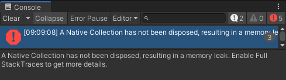
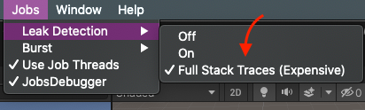

```
A Native Collection has not been disposed, resulting in a memory leak. Enable Full StackTraces to get more details.
```

### [启用](http://d.hatena.ne.jp/keyword/%A5%B9%A5%BF%A5%C3%A5%AF%A5%C8%A5%EC%A1%BC%A5%B9)堆栈跟踪

单击 Unity 菜单中的 Jobs > Leak Detection > Full Stack Traces 以选中它。还有记得重启unity



然后，控制台中的错误内容将显示内存[泄漏](http://d.hatena.ne.jp/keyword/%A5%E1%A5%E2%A5%EA%A5%EA%A1%BC%A5%AF)发生在数据保留位置。

```
A Native Collection has not been disposed, resulting in a memory leak. Allocated from:
Unity.Entities.BlobAssetStore:.ctor() (at Library/PackageCache/com.unity.entities@0.16.0-preview.21/Unity.Entities.Hybrid/GameObjectConversion/BlobAssetStore.cs:26)
CreateEntitySystem:Setup(Transform) (at Assets/0_MainAssets/Scripts/ECS/System/CreateEntitySystem.cs:116)
```

#### 关于分配器

NativeContainer（如 NativeArray）在 Dispose 中未释放内存时，会根据某些条件[检测](http://d.hatena.ne.jp/keyword/%A5%E1%A5%E2%A5%EA%A5%EA%A1%BC%A5%AF)为内存泄漏。 条件**因分配器**的类型而异，分配器是 Allocator.TempJob，在确保本机 Array 时指定。

```cs
NativeArray<float> leakArray = new NativeArray<float>(4, Allocator.TempJob);
```

这是一个详细的解释。

[NativeContainer - Unity 手册](https://docs.unity3d.com/ja/current/Manual/JobSystemNativeContainer.html)

**如果 Allocator.Temp**在函数中没有 Dispose， 否则内存[泄漏](http://d.hatena.ne.jp/keyword/%A5%E1%A5%E2%A5%EA%A5%EA%A1%BC%A5%AF)，

**确定 Allocator.TempJob**必须在
4 帧内释放， 否则内存[泄漏确定](http://d.hatena.ne.jp/keyword/%A5%E1%A5%E2%A5%EA%A5%EA%A1%BC%A5%AF)\_\_Allocator.Persistent 将永久保留，[并且不会](http://d.hatena.ne.jp/keyword/%A5%E1%A5%E2%A5%EA%A5%EA%A1%BC%A5%AF)检测到内存泄漏。

### 用 using 括起来，确保内存安全

知道泄漏的位置后，我们只是将变量放在 Dispose 中，但\*\*建议在 using[语句](http://d.hatena.ne.jp/keyword/%A5%B9%A5%C6%A1%BC%A5%C8%A5%E1%A5%F3%A5%C8)\*\*中括起来。

```cs
using (NativeArray<float> leakArray = new NativeArray<float>(4, Allocator.TempJob)) {

  // 処理

}
```

这样，当您离开块时，将自动释放变量。
当有多个变量时，请并排排列它们。

```cs
using (NativeArray<ArchetypeChunk> chunks = AnimationBatcherQuery.CreateArchetypeChunkArray(Allocator.TempJob))
using (NativeArray<float> leakArray = new NativeArray<float>(4, Allocator.TempJob)) {

  // 処理

}
```

[从 C#](http://d.hatena.ne.jp/keyword/C%23)8 开始，您可以在 Coco 中并排编写句点，但 Unity 现在[像 C#](http://d.hatena.ne.jp/keyword/C%23)7.3 一样，将来会起作用吗？