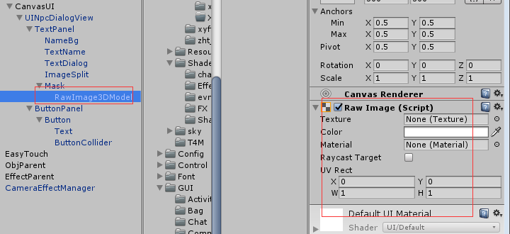
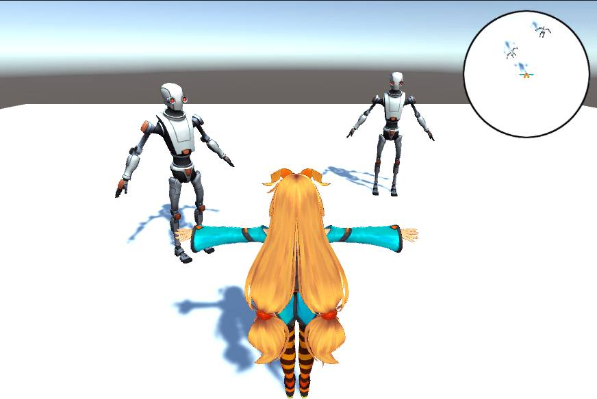
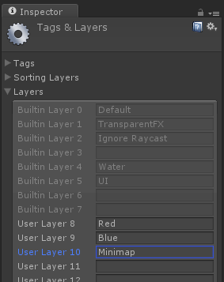
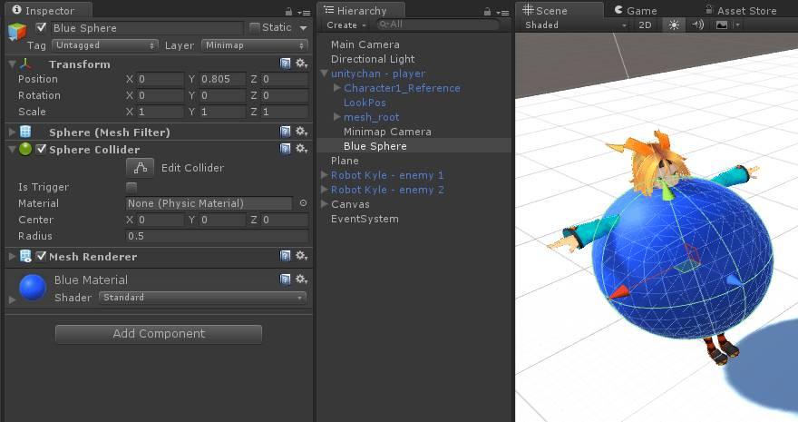
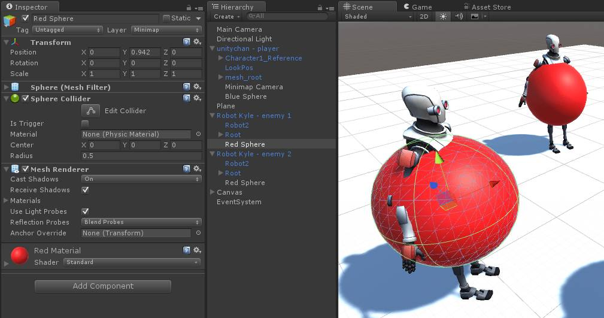
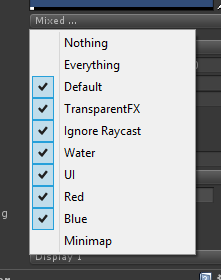
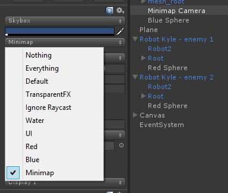
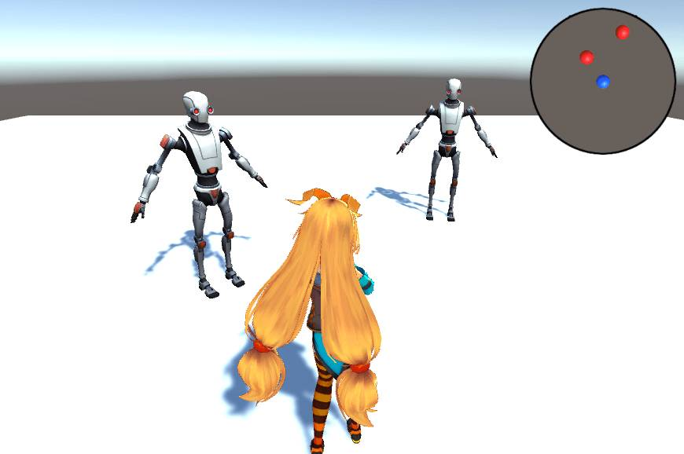

#### 1. UGUI上显示模型



UGUI上显示模型.png

1. 创建拍摄用的摄像机

2. 创建RenderTexture并绑定到摄像机camera.targetTexture上

3. RenderTexture绑定到rawImage.texture上（rawImage见上图）

4. 创建显示的模型，相机可见

5. 注意Destroy销毁 创建出来的RenderTexture 和相机

6. 注意模型上的粒子特效由于Alpha透明通道，显示会有一点问题，可以通过Shader Blend混合处理，挂载在rawImage上。

```csharp
public void CreateCamera(Vector3 pos, Vector3 rot, int width, int height, string layerName, float size)
{
    // 创建拍摄用的摄像机
    GameObject go = new GameObject("ModelCamera");
    _camera = go.AddComponent<Camera>();
    _camera.clearFlags = CameraClearFlags.SolidColor;
    _camera.transform.position = pos;
    _camera.transform.rotation = Quaternion.Euler(rot);
    _camera.cullingMask = LayerMask.GetMask(layerName);
    _camera.orthographic = true;
    _camera.orthographicSize = size;
    _camera.backgroundColor = new Color(0,0,0,0);

    // 创建RenderTexture并绑定到摄像机上
    _renderTexture = new RenderTexture(width, height, 8);
    _camera.targetTexture = _renderTexture;

    if (_rawImage != null)
    {
        _rawImage.texture = _renderTexture;
    }
}
```

#### 2. Camera相机拍照分享，保存为jpg

```csharp
private IEnumerator CameraPhoto(Camera cam, Rect rect, string name) {
    if (rt == null) {
        rt = RenderTexture.GetTemporary(renderTextureDesc);
    }
    cam.targetTexture = rt;
    cam.Render();

    RenderTexture currentActiveRT = RenderTexture.active;
    RenderTexture.active = rt;
    Texture2D screenShot = new Texture2D((int)rect.width, (int)rect.height, TextureFormat.RGB24, false);
    screenShot.ReadPixels(rect, 0, 0);
    screenShot.Apply();
    yield return new WaitForEndOfFrame();

    cam.targetTexture = null;
    RenderTexture.active = currentActiveRT;

    byte[] bytes = screenShot.EncodeToJPG();
    string file = Application.dataPath + "/Texture/" + name;
    System.IO.File.WriteAllBytes(file, bytes);
}
```

1. Rendertexture的分配和销毁上有一个地方需要注意：
   如果频繁的要new一个rt出来，那么不要直接new，而是使用RenderTexture提供的GetTemporary和ReleaseTemporary，它将在内部维护一个池，反复重用一些大小格式一样的rt资源，因为让GPU为你分配一个新的texture其实是要耗时间的。

2. EncodeToJPG 生成的图片体积更小

3. 有的时候我们想人为的控制每一次渲染，你可以将这个摄像机disable掉，然后手动的调用一次render。

4. 

#### 3. 制作小地图



这里需要新建一个Layer。依次点击菜单项Edit -> Project Settings -> Tags and Layers新建Layer命名为Minimap。



然后新建三个球体。一个设为蓝色代表Unity Chan。将该球体设为Unity Chan的子对象，并将其Layer设为Minimap。



对两个机器人进行同样的操作，将球体改为红色。



现在最关键的一步来了！选中Main Camera并确保其Culling Mask中不包括Minimap这一层。



然后选中Minimap Camera让其Culling Mask只包括Minimap这一层。



现在这个小地图看起来就比较完善了！

