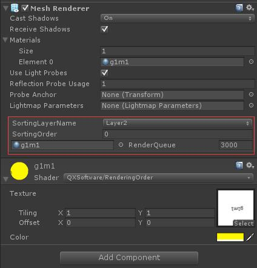
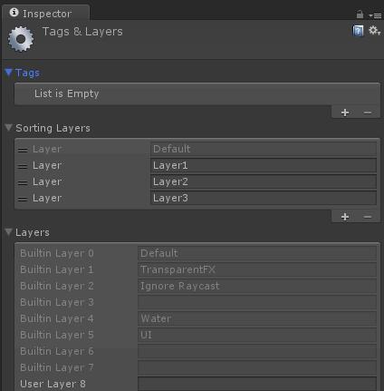
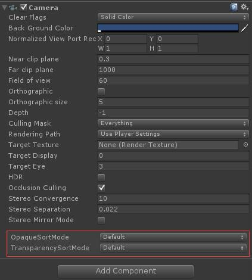
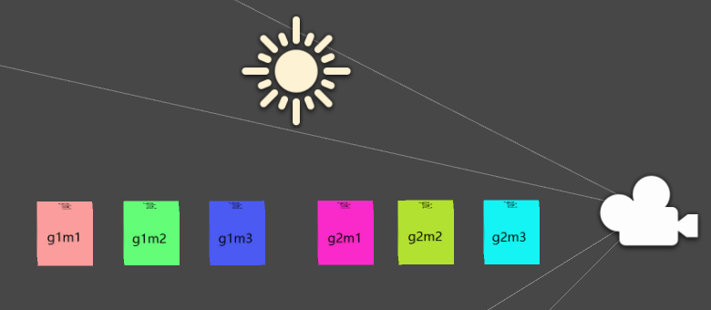
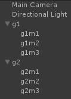

工欲善其事，必先利其器。为了搞清楚 Unity 的渲染顺序，首先我们要准备一个能方便修改 SortingLayer 以及 RenderQueue 的工具，下面这个编辑器脚本可以满足这个需求：

[MeshRendererInspector.cs](https://gist.github.com/qxsoftware/499135b6482ca57727c69e11b91a12bf)

效果如下：

如何添加新的 SortingLayer？请通过 **Edit/Project Settings/Tags and Layers** 菜单选项打开：

然后添加三个 Sorting Layer，如上图所示。注意，Sorting Layer 添加后是可以拖动调整顺序的。

便捷修改 Camera 的 opaqueSortMode 和 transparencySortMode：

[CameraInspector.cs](https://gist.github.com/qxsoftware/1821915377e333e45f7a632ae07e64aa)

效果如下：

#### 实际测试

测试之前首先明确两点：

- 什么因素影响绘制顺序

- 深度缓冲区对绘制结果的影响

为了弄清楚第一点，什么因素影响绘制顺序，我们需要把 ZWrite 关闭。同时结合 Unity Frame Debugger来观察绘制顺序。

##### Render Queue

RenderQueue 是材质（Material）的关键属性，当我们在 Unity 中创建一个材质后，Unity 会给这个材质设置一个默认 Shader，然后这个材质的 RenderQueue 被改为其 Shader 中设定的 RenderQueue。如果给这个材质球换了 Shader，Unity 会更新它的 RenderQueue（但是请注意，假如当前材质的 Shader 的 RenderQueue 是 3000，然后你修改 Shader 让其 RenderQueue 变成 3100，对应材质球的 RenderQueue 并不会更新！）。

**Unity 最终以 Material 的 RenderQueue 为准。**

Unity 内置了几个 RenderQueue 的字面值：

|RenderQueue|值|说明|
|-|-|-|
|Background|1000|这个渲染队列最先渲染，一般用于渲染背景|
|Geometry(默认值)|2000|这个渲染队列是大多数物体的默认队列，用于渲染不透明物体|
|AlphaTest|2450|使用了 AlphaTest 的物体在这个队列渲染，当所有的不透明物体都渲染完了再渲染这个，有助于提升性能|
|Transparent|3000|在 Geometry 和 AlphaTest 之后、从后往前渲染，所有的半透明物体都应该在这里渲染|
|Overlay|4000|在之前的所有渲染队列都渲染完了之后渲染，比如镜头光晕|

可以看到，RenderQueue 越大，渲染越靠后。

##### Camera.opaqueSortMode

默认情况下，不透明物体被放在粗略分隔的从前往后排布的桶中，GPU 按照这种方式渲染能节省性能。但是也有部分 GPU 不这么干，比如 PowerVR。Camera.opaqueSortMode 这个值的默认值是 Dafault，根据不同硬件平台，这个值有可能是：OpaqueSortMode.FrontToBack 或者 OpaqueSortMode.NoDistanceSort。我们也可以主动设置这个值为某一种。比如为了减少 CPU 消耗，把这个值设置为 NoDistanceSort。

所以，不透明物体大部分情况下是按照从前往后渲染，也就是离相机越近，越先渲染。

如果是手动选择了 FrontToBack，就是从前往后渲染；如果是 NoDistanceSort，就是从后往前渲染。

> 根据实际测试，渲染的顺序并不是完全按照物体几何中心离相机的距离进行排序，而是一个近似的排序。

##### Camera.transparencySortMode

按照我测试用的 Unity5.3.4f1，修改这个值也会影响不透明物体的渲染顺序。所以这个东西很可能不重要，而且有 bug。

##### SortingLayer

SortingLayer 拥有最高优先级，如果 SortingLayer 不同，则首先按照 SortingLayer 排序；如果 SortingLayer 相同，再按照 RenderQueue 排序。

如下图所示，有 6 个立方体，分别按顺序在摄像机前排开：

其中，g1 组的立方体 SortingLayer 都是 Layer3，RenderQueue 都是 3000；g2 组的立方体 SortingLayer 都是 Layer2，RenderQueue 都是3500，最终渲染顺序是：**g2m1 g2m2 g2m3 g1m1 g1m2 g1m3**。

直观地说，就是 SortingLayer 越大，则物体**层级**越高。SortingLayer 默认只有一个：Default，越往后添加的 SortingLayer 越大。

现在把 g1 组的立方体 SortingLayer 改成 Layer2，RenderQueue 改成 3600，最终渲染顺序还是：**g2m1 g2m2 g2m3 g1m1 g1m2 g1m3**。

直观地说，SortingLayer 相同的前提下，RenderQueue 越大，则物体**层级**越高。

##### SortingOrder

如果 SortingLayer 和 RenderQueue 都一样，则 SortingOrder 越大，则物体**层级**越高。

如果只是 SortingLayer 一样，RenderQueue 和 SortingOrder 都不一样，则物体的**层级**由 RenderQueue 和 SortingOrder 之和决定，相加之和越大，**层级**越高。

> 以上结论是通过 Frame Debugger 单步执行得出的。

##### Camera.depth

还有一个很常用的调整渲染顺序的选项：摄像机深度。摄像机深度是优先级最高的选项，深度值越大，物体**层级**越高。常用的比如 NGUI 就是用一个单独的相机（深度值比渲染场景的相机大）来渲染 UI，这样就保证 UI 在所有东西上方。

参考资料：

[Transparency and sorting in Unity](https://jakobknudsen.wordpress.com/2013/07/20/transparency-and-sorting/)