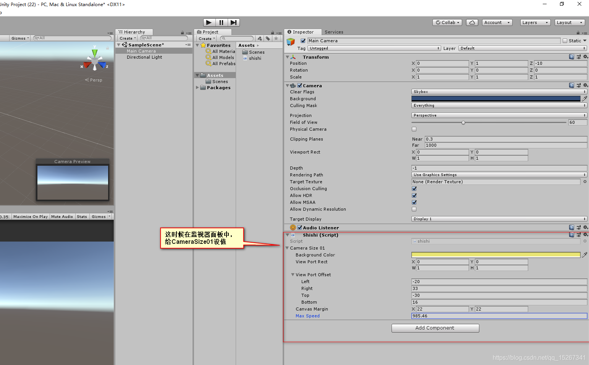

```
public class shishi : MonoBehaviour
{
    public CameraSizeHandler CameraSize01;
 
    [System.Serializable]
    public class CameraSizeHandler
    {
        public Color BackgroundColor = Color.gray;
        public Rect ViewPortRect = new Rect(0.0f, 0.0f, 1.0f, 1.0f); 
        public RectOffset ViewPortOffset; 
        public Vector2 CanvasMargin = new Vector2(22.0f, 22.0f);
        public float MaxSpeed = 1000.0f;
        bool enabled = false;
    }
}
```

现在有一个需求，想改一改CameraSize01这个字段的名字，比如想修改为CameraSize02，并且需要将之前在监视器面板中为CameraSize01设置的各项值保留下来，如果直接修改，则会丢失属性中的值

```

public class shishi : MonoBehaviour
{
    [FormerlySerializedAs("CameraSize01")]
    public CameraSizeHandler CameraSize02;
 
    [System.Serializable]
    public class CameraSizeHandler
    {
        public Color BackgroundColor = Color.gray;
        public Rect ViewPortRect = new Rect(0.0f, 0.0f, 1.0f, 1.0f); 
        public RectOffset ViewPortOffset; 
        public Vector2 CanvasMargin = new Vector2(22.0f, 22.0f);
        public float MaxSpeed = 1000.0f;
        bool enabled = false;
    }
```