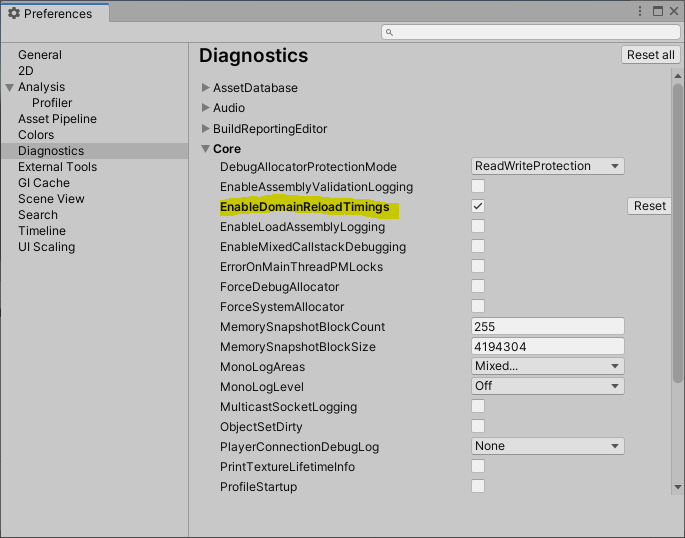

Hi,
We found out that this particular issue is very hard to work on as domain reload depends on a lot of things:
\- Number and types of UI widgets alive in the editor
\- Quantity of code in the project (including from packages)
\- Callbacks run as part of the domain reload (InitializeOnLoad, EditorApplication events...) that can be handled by both editor, first party packages, 3rd party packages or user code
\- Topology of the project...

So when we get numbers from users, about Domain Reload times, there are a lot of times where we can't find where the root issue come from.

The good news is that this is going to change !

In next version, Unity will ship with a diagnostic switch enabling detailed domain reload timings, allowing any user to see what actually happen on domain reload. This will help us figure what are the most common problematic components and on which ones we should prioritize optimization effort. This will also help users find workarounds for improving performance (e.g. close a particularly consuming UI widget, remove a package that is not really needed in the project,...).
Shortly after, we will backport this diagnostic switch to LTS versions of Unity (current plan is to backport down to 2019.4), to allow for more precise performance comparison.

We are also working internally to leverage that diagnostic tools to detect problems earlier in packages that we ship, as part of our internal package validation suites. This is an ongoing effort though, so don't put your expectations too high on this, and please report your detailed domain reload logs as soon as you get the update !

Domain reload detailed timings can now be enabled in 2021.2.0a20 an 2021.1.11f1 (and we are busy backporting this to 2019.4 and 2020.3).
\- In 2021.2.x it can be enabled using the diagnostics switches in Editor Preferences

\- In 2021.1 (which does not have the diagnostic switches UI), you can enable it with the environment variable UNITY\_DIAG\_ENABLE\_DOMAIN\_RELOAD\_TIMINGS.
(e.g. in a Powershell console, you can run

```
 $env:UNITY_DIAG_ENABLE_DOMAIN_RELOAD_TIMINGS="1"; & 'C:\Program Files\Unity\Hub\Editor\2021.1.11f1\Editor\Unity.exe'
```

).

After that, in your editor logs (

```
%LOCALAPPDATA%\Unity\Editor\Editor.log
```

), you'll see detailed timings on domain reload.

[Any update regarding "Increased script assembly reload time"? - Unity Forum](https://forum.unity.com/threads/any-update-regarding-increased-script-assembly-reload-time.1117138/?_ga=2.41177696.399908227.1633157438-1122779591.1605612681)