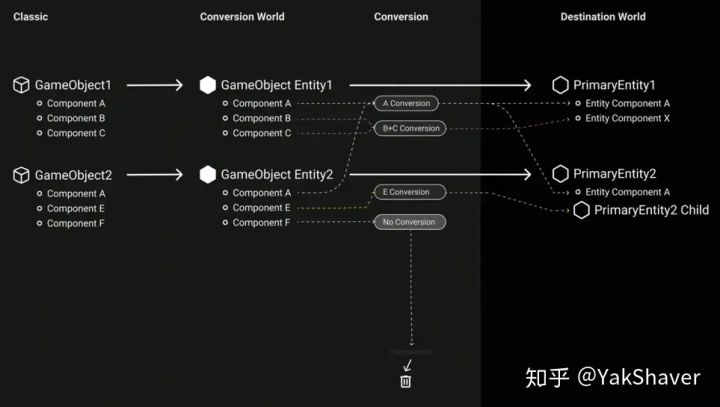
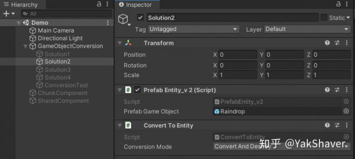

## 关于parent和LinkedEntityGroup

* parent 涉及到localtoworld, 以及一些物理和其他的转换规则

  * parent和位置有关系..所以父实体需要添加Translation和LocalToWorld.否则会删除该parent和LocalToParent组件

  * 添加了parent组件且添加了Translation,LocalToWorld,LocalToParent组件,会自动给父实体添加child组件,四个组件缺一不可

  * 如果使用了LocalToParent,这个时候Translation代表的是相对于父对象的坐标..相当于传统的localTranslation
    这个时候如果获取世界坐标..可以使用LocalToWorld.pos

* linkedEntityGroup 和 `Instantiate` `SetEnabled` `DestroyEntity` 有关

## 关于转换

在Conversion World中，仅仅是复制生成了来自Classic World的、保留原有Hierarchy关系的GameObject Entity，这些Entity拥有的组件仍然是我们熟知的传统Unity组件，例如Transform、MeshFilter。接下来，将调用DOTS预置的或我们自定义的Convert接口，完成向IComponentData组件的转换。自然而然的，可能没有实现对某Component Object的转换接口，那么在转换过程中将被丢弃，所以该转换不一定是“一对一”，所以Unity称呼其为"Primary Entity"。下图呈现了转换全过程。



转换过程都是在Conversion World中完成的,DOTS在内部为转换过程创建了一个World。作为独立World，它拥有自己的EntityManager和ComponentSystem，进而拥有并管理自己的Entity和ComponentData。

1. 使用ConvertToEntity组件,添加IConvertGameObjectToEntity接口,或者在组件上添加`[GenerateAuthoringComponent]`

   

2. 同一,但是使用代码控制转换的时机,继承ConvertToSingleEntity,并覆盖awake,然后在手动调用.

   ```
   public class ConvertToSingleEntity : ConvertToEntity
   {
       void Awake()
       {
       }
   }
   
   //实际上就是ConvertToEntity中的代码
   public static void ConvertGameObejct(World dstWorld, GameObject gameObject)
   {
       var system = World.DefaultGameObjectInjectionWorld.GetOrCreateSystem<ConvertToEntitySystem>();
   
       var convert = gameObject.GetComponent<ConvertToEntity>();
   
       if (convert == null)
       {
           return ;
       }
       system.AddToBeConverted(dstWorld, convert);
   }
   ```

3. 使用IDeclareReferencedPrefabs.声明实体的prefab,然后进行存储,以便进行之后的实例化

   对于转换世界中的每个游戏对象，在任何转换系统运行之前，都会在目标世界中自动创建一个主要实体。随后可以通过 GameObjectConversionSystem.GetPrimaryEntity 访问与 GameObject 关联的实体。

   ```
     /*
        *    
        *    
            if (m_Prefab == Entity.Null)
                  {
                      var prefabEntity = GetSingletonEntity<GamePrefabCollectionComponent>();
                      var prefabs = GetBuffer<GamePrefabBuffer>(prefabEntity);
                      for (int i = 0; i < prefabs.Length; ++i)
                      {
                          if (HasComponent<Player.State>(prefabs[i].Value))
                              m_Prefab = prefabs[i].Value;
                      }
                  }
        * 
        * 
        * 添加进来的prefab不需要添加convert to entity
        * 可以用单例获取GamePrefabCollectionComponent,然后获取想要的entity
        * 
        */
       public class GameDeclareReferencedPrefabs : MonoBehaviour, IConvertGameObjectToEntity, IDeclareReferencedPrefabs
       {
      
           public List<GameObject> Prefabs = new List<GameObject>();
   
           public void Convert(Entity entity, EntityManager dstManager, GameObjectConversionSystem conversionSystem)
           {
               dstManager.AddComponentData(entity, default(GamePrefabCollectionComponent));
               var prefabs = dstManager.AddBuffer<GamePrefabBuffer>(entity);
   
               foreach (var prefab in Prefabs)
               { 
                   var prefabEnt = conversionSystem.GetPrimaryEntity(prefab);
                   if (dstManager.Exists(prefabEnt))
                       prefabs.Add(new GamePrefabBuffer { Value = prefabEnt });
                   else
                       Debug.LogError($"The prefab {prefab.name} in the ghost collection was no converted to an entity, skipping it");
               }
           }
   
           public void DeclareReferencedPrefabs(List<GameObject> referencedPrefabs)
           {
               foreach (var prefab in Prefabs)
               {
                   if(prefab == null)
                   {
                       continue;
                   }
                   referencedPrefabs.Add(prefab);
               }
           }
       }
   ```

   4\.从转换系统中根据component获取实体,和上面类似..因为转换子物体的时候,转换系统中会生成实体,这个时候可以使用组件从conversionSystem中获取,

   ```
        public static void AddAbilityComponents(Entity entity, EntityManager dstManager, GameObjectConversionSystem conversionSystem, AbilityAuthoring[] abilities)
           {
               dstManager.AddComponentData(entity, new AbilityCollection.State());
   
               // Create ability entities
               var abilityEntities = new List<Entity>(abilities.Length);
               for (int i = 0; i < abilities.Length; i++)
               {
                   var e = conversionSystem.GetEntities(abilities[i]);
                   e.MoveNext();
                   var abilityEntity = e.Current;
   
                   if (abilityEntities.Contains(abilityEntity))
                   {
                       GameDebug.LogError("Ability " + abilities[i] + " registered multiple times in abilities list");
                   }
   
                   abilityEntities.Add(abilityEntity);
               }
   
               // Add abilities to ability buffer
               dstManager.AddBuffer<AbilityCollection.AbilityEntry>(entity);
               var abilityBuffer = dstManager.GetBuffer<AbilityCollection.AbilityEntry>(entity);
               for (int i = 0; i < abilities.Length; i++)
               {
                   abilityBuffer.Add(new AbilityCollection.AbilityEntry
                   {
                       entity = abilityEntities[i],
                       abilityType = abilities[i].abilityTypeFlags,
                       canRunWith = abilities[i].canRunWithFlags,
                       canInterrupt = abilities[i].canInterruptFlags,
                   });
               }
           }
   ```

   5\.手动转换gameobject,他的代码和`ConvertToEntitySystem`的代码差不多.会创建一个ConversionWorld,然后进行转换,都是使用了`GameObjectConversionUtility.Convert`工作

   ```
           public static Entity ConvertGameObjectPrefab(GameObject go,World dstWorld,out BlobAssetStore blob)
           {
               Entity returnEntity = Entity.Null;
           
               blob = new BlobAssetStore();
   
               returnEntity =
                   GameObjectConversionUtility.ConvertGameObjectHierarchy(go,GameObjectConversionSettings.FromWorld(dstWorld, blob));
   
               return returnEntity;
           }
   ```